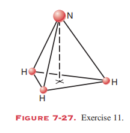
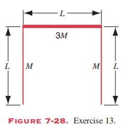
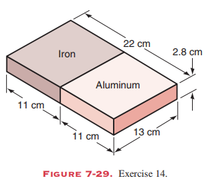
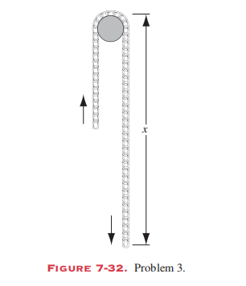

# 
Homework 3

**姓名：** 吴宇宸  
**学号：** 3230100789 
**日期：** 2026.3.23

---

## Ex.1 (P155, T11)

In the ammonia (NH3) molecule, the three hydrogen (H)atoms form an equilateral triangle, the distance between centers of the atoms being $16.28 \times 10^{-11}$ m, so that the center of the triangle is $9.40\times 10^{-11}$ m from each hydrogen atom. Thenitrogen (N) atom is at the apex of a pyramid, the three 
hydrogens constituting the base (see Fig. 7-27). The nitrogen/hydrogen distance is $10.14 \times 10^{-11}$ m and the nitro

### Answer

Let the origin of the coordinate system be at the center of the equilateral triangle formed by the three hydrogen atoms. The hydrogen atoms are situated in the $xy$-plane. 
The mass of a hydrogen atom is $m_H \approx 1.0\ u$ and the mass of a nitrogen atom is $m_N \approx 14.0\ u$.

The distance from each H atom to the origin is $r = 9.40 \times 10^{-11}$ m. 
The distance from the N atom to any H atom is $d = 10.14 \times 10^{-11}$ m. 
The N atom lies on the $z$-axis. We can find its height $z_N$ using the Pythagorean theorem:
$$
\begin{align}
z_N &= \sqrt{d^2 - r^2} \\
z_N &= \sqrt{(10.14 \times 10^{-11})^2 - (9.40 \times 10^{-11})^2} \\
z_N &\approx 3.81 \times 10^{-11}\ m
\end{align}
$$

The z-coordinate of the center of mass is:
$$
\begin{align}
z_{cm} &= \frac{3 m_H (0) + m_N z_N}{3 m_H + m_N} \\
z_{cm} &= \frac{14.0 \cdot 3.81 \times 10^{-11}}{3(1.0) + 14.0} \\
z_{cm} &\approx 3.14 \times 10^{-11}\ m
\end{align}
$$
The center of mass is located on the axis of symmetry, $3.14 \times 10^{-11}$ m above the plane containing the hydrogen atoms.

---

## Ex.2 (P155, T13)

Three thin rods each of length L are arranged in an inverted U, as shown in Fig. 7-28. The two rods on the arms of the U each have mass M; the third rod has mass 3M. Where is the center of mass of the assembly?

### Answer

Let the origin $(0,0)$ be at the center of the top rod. The top rod has mass $3M$ and length $L$, and its center of mass is at $(0, 0)$.
The two vertical arms each have mass $M$ and length $L$.
Assuming they extend downwards from $x = -L/2$ and $x = L/2$, their centers of mass are located at $y = -L/2$.
Thus:
- Top rod: mass $3M$, CM at $(0, 0)$
- Left rod: mass $M$, CM at $(-L/2, -L/2)$
- Right rod: mass $M$, CM at $(L/2, -L/2)$

By symmetry, the x-coordinate of the center of mass is:
$x_{cm} = 0$

The y-coordinate of the center of mass is:
$$
\begin{align}
y_{cm} &= \frac{3M(0) + M(-L/2) + M(-L/2)}{3M + M + M} \\
y_{cm} &= \frac{-ML}{5M} = -0.2L
\end{align}
$$
The center of mass is located on the vertical axis of symmetry, at a distance of $0.2L$ below the top rod.

---

## Ex.3 (P155, T14)

Fig. 7-29 shows a composite slab with dimensions $22.0 cm \times 13.0 cm \times 2.80 cm$. Half of the slab is made of aluminum($density = 2.70 g/cm^3$) and half of iron ($density = 7.85 g/cm^3$),as shown. Where is the center of mass of the slab?

### Answer

Assume the dimensions are $L_x = 22.0$ cm, $L_y = 13.0$ cm, and $L_z = 2.80$ cm. 
Let the origin be at the geometric center of the slab, with the interface between the two materials located at $x = 0$.
The aluminum half ($x < 0$) has a center of mass at $x_{Al} = -11.0 / 2 = -5.5$ cm.
The iron half ($x > 0$) has a center of mass at $x_{Fe} = 11.0 / 2 = 5.5$ cm.

The mass of the aluminum half is $m_{Al} = \rho_{Al} V = 2.70 \cdot V$.
The mass of the iron half is $m_{Fe} = \rho_{Fe} V = 7.85 \cdot V$.

The x-coordinate of the center of mass is:
$$
\begin{align}
x_{cm} &= \frac{m_{Al} x_{Al} + m_{Fe} x_{Fe}}{m_{Al} + m_{Fe}} \\
x_{cm} &= \frac{2.70 V (-5.5) + 7.85 V (5.5)}{(2.70 + 7.85) V} \\
x_{cm} &= \frac{-14.85 + 43.175}{10.55} \approx 2.68\ cm
\end{align}
$$
By symmetry, $y_{cm} = 0$ and $z_{cm} = 0$. The center of mass is 2.68 cm from the center of the slab toward the iron side.

---

## Ex.4 (P155, T17)

Each minute, a special game warden’s machine gun fires 220, 12.6-g rubber bullets with a muzzle velocity of 975 m/s. How many bullets must be fired at an 84.7-kg animal charging toward the warden at 3.87 m/s in order to stop the animal in its tracks? (Assume that the bullets travel horizontally and drop to the ground after striking the target.)

### Answer

By the conservation of momentum, the total momentum of the bullets fired must be equal to the momentum of the charging animal to bring it to a stop.
Let $n$ be the number of bullets.
Momentum of the animal: 
$$P_a = M_a v_a = 84.7\ kg \cdot 3.87\ m/s = 327.789\ kg \cdot m/s$$

Momentum of one bullet: 
$$P_b = m_b v_b = 0.0126\ kg \cdot 975\ m/s = 12.285\ kg \cdot m/s$$

Equating the momenta:
$$
\begin{align}
n \cdot P_b &= P_a \\
n &= \frac{327.789}{12.285} \approx 26.68
\end{align}
$$
Since the number of bullets must be an integer, **27 bullets** must be fired to stop the animal perfectly (or just a little bit more).

---

## Ex.5 (P155, T18)

A railway flat car is rushing along a level frictionless track at a speed of 45 m/s. Mounted on the car and aimed forward is a cannon that fires 65-kg cannon balls with a muzzle speed of 625 m/s. The total mass of the car, the cannon, and the large supply of cannon balls on the car is 3500 kg. How many cannon balls must be fired to bring the car as close to rest as possible?

### Answer

This is a problem involving recoil and conservation of momentum. Let the initial total mass be $M_{total} = 3500\ kg$ moving at $v_0 = 45\ m/s$. The momentum is $P = 3500 \times 45 = 157500\ kg\cdot m/s$.
Each relative cannon ball has mass $m_b = 65\ kg$ and muzzle speed $v_{rel} = 625\ m/s$ relative to the cannon.

With each fired ball, the change in velocity of the car is approximately:
$ \Delta v \approx \frac{m_b v_{rel}}{M_{total}} $ given that a small mass is ejected.
More precisely, the momentum equation for the $n$-th ball is:
$$ M_{new} dv = - v_{rel} dM \implies \Delta v = v_{rel} \ln\left(\frac{M_{initial}}{M_{final}}\right) $$
We need $\Delta v = 45\ m/s$:
$$ 45 = 625 \ln\left(\frac{3500}{3500 - 65n}\right) $$
$$ \exp\left(\frac{45}{625}\right) = \frac{3500}{3500 - 65n} $$
$$ 1.0746 = \frac{3500}{3500 - 65n} \implies 3500 - 65n = 3256.88 \implies n = \frac{243.12}{65} \approx 3.74 $$
Thus, firing **4 cannon balls** will bring the car as close to rest as possible.

---

## Ex.6 (P157, T3)

A uniform flexible chain of length L, with weight per unitlength $\gamma$, passes over a small, frictionless peg; see Fig. 7-32. It is released from a rest position with a length of chain x when it has collected 0.50 metric tons of rain? What assumptions, if any, must you make to get your answer?

### Answer

*(Note: The problem description appears incomplete or mixed with another question regarding the rain. I will provide the analysis for the chain portion.)*

Let $x$ be the length of the chain on one side, and $L - x$ be the length on the other side.
Assuming $x > L - x$, the net force on the chain is due to the difference in weight between the two sides.
The mass per unit length is $\lambda = \gamma/g$.
The mass of the entire chain is $M = \lambda L$.
The net force is:
$$ F_{net} = \lambda x g - \lambda (L - x) g = \gamma (2x - L) $$
Using Newton's Second Law:
$$ M \frac{d^2x}{dt^2} = F_{net} $$
$$ \frac{\gamma L}{g} a = \gamma (2x - L) \implies a = g \frac{2x - L}{L} $$
The acceleration $a = \frac{dv}{dt} = v \frac{dv}{dx}$. 
$$ v \, dv = \frac{g}{L} (2x - L) \, dx $$
Integrating from initial position to general position gives the velocity of the chain.

---

## Ex.7 (P157, T10)

A 5860-kg rocket is set for vertical firing. The exhaust speed is $1.17 km/s$. How much gas must be ejected each second to supply the thrust needed

(a) to overcome the weight of the rocket and
(b) to give the rocket an initial upward acceleration
of $18.3 m/s^2$? Note that, in contrast to the situation describedin Sample Problem 7-9, gravity is present here as an external force

### Answer

The thrust of the rocket is given by $F_{thrust} = \frac{dM}{dt} v_{ex}$, where $v_{ex} = 1.17\ km/s = 1170\ m/s$.
The equation of motion is:
$$ F_{thrust} - M_g = M_a \implies \frac{dM}{dt} v_{ex} = M(g + a) $$

**(a)** To just overcome the weight ($a = 0$):
$$
\begin{align}
\frac{dM}{dt} &= \frac{Mg}{v_{ex}} \\
\frac{dM}{dt} &= \frac{5860\ kg \cdot 9.8\ m/s^2}{1170\ m/s} \\
\frac{dM}{dt} &\approx 49.1\ kg/s
\end{align}
$$

**(b)** For an upward acceleration of $18.3\ m/s^2$:
$$
\begin{align}
\frac{dM}{dt} &= \frac{M(g + a)}{v_{ex}} \\
\frac{dM}{dt} &= \frac{5860\ kg \cdot (9.8\ m/s^2 + 18.3\ m/s^2)}{1170\ m/s} \\
\frac{dM}{dt} &= \frac{5860 \cdot 28.1}{1170} \approx 140.7\ kg/s
\end{align}
$$

---

## Ex.8 (P171, T3)

The angle turned through by the flywheel of a generator during a time interval t is given by 
$$\Phi = at + bt^3-ct^4$$
where a, b, and c are constants. What is the expression for its (a) angular velocity and (b) angular acceleration?

### Answer

**(a)** The angular velocity $\omega$ is the first derivative of the angular position $\Phi$ with respect to time $t$:
$$
\begin{align}
\omega &= \frac{d\Phi}{dt} \\
\omega &= \frac{d}{dt} (at + bt^3 - ct^4) \\
\omega &= a + 3bt^2 - 4ct^3
\end{align}
$$

**(b)** The angular acceleration $\alpha$ is the derivative of the angular velocity $\omega$ with respect to time $t$:
$$
\begin{align}
\alpha &= \frac{d\omega}{dt} \\
\alpha &= \frac{d}{dt} (a + 3bt^2 - 4ct^3) \\
\alpha &= 6bt - 12ct^2
\end{align}
$$

---

## Ex.9 (P171, T30)

An automobile traveling at 97 km/h has wheels of diameter 76 cm. 

(a) Find the angular speed of the wheels about the axle. 

(b) The car is brought to a stop uniformly in 30 turns of the wheels. Calculate the angular acceleration. 

(c) How far does the car advance during this braking period?

### Answer

First, we convert to SI units:
Speed $v = 97\ km/h = \frac{97 \times 1000}{3600}\ m/s \approx 26.94\ m/s$.
Wheel radius $r = 76\ cm / 2 = 38\ cm = 0.38\ m$.

**(a)** The angular speed $\omega_0$:
$$ 
\begin{align}
\omega_0 &= \frac{v}{r} \\
\omega_0 &= \frac{26.94}{0.38} \approx 70.9\ rad/s 
\end{align}
$$

**(b)** The car stops in 30 turns, meaning the angular displacement is $\Delta \theta = 30 \times 2\pi = 60\pi\ rad \approx 188.5\ rad$.
Using the kinematic equation $\omega^2 = \omega_0^2 + 2\alpha \Delta \theta$, with final $\omega = 0$:
$$
\begin{align}
0 &= (70.9)^2 + 2\alpha (188.5) \\
\alpha &= -\frac{5026.8}{377} \approx -13.3\ rad/s^2
\end{align}
$$

**(c)** The distance $d$ the car advances is the arc length of the tires during the 30 turns:
$$
\begin{align}
d &= \Delta \theta \cdot r \\
d &= 188.5 \cdot 0.38 \approx 71.6\ m
\end{align}
$$

---

## Ex.10 (P171, T32)

An object moves in the xy plane such that $x=R \cos \omega t$ and
$y = R \sin \omega t$. Here x and y are the coordinates of the object, t
is the time, and R and $\omega$ are constants. 

(a) Eliminate t between these equations to find the equation of the curve in which the object moves. What is this curve? What is the meaning of the
constant $\omega$? 

(b) Differentiate the equations for x and y with respect to the time to find the x and y components of the velocity of the body, $v_x$ and $v_y$ . Combine $v_x$ and $v_y$ to find the magnitude and direction of v. Describe the motion of the object. 

(c) Differentiate $v_x$ and $v_y$ with respect to the time to obtain the magnitude and direction of the resultant acceleration.

### Answer

**(a)** Squaring both equations and adding them:
$$ x^2 + y^2 = (R \cos \omega t)^2 + (R \sin \omega t)^2 = R^2 (\cos^2 \omega t + \sin^2 \omega t) = R^2 $$
The curve $x^2 + y^2 = R^2$ is a **circle** of radius $R$ centered at the origin.
The constant $\omega$ represents the **angular velocity** of the object around the circle.

**(b)** Differentiating $x$ and $y$:
$$
\begin{align}
v_x &= \frac{dx}{dt} = -R\omega \sin \omega t \\
v_y &= \frac{dy}{dt} = R\omega \cos \omega t
\end{align}
$$
Magnitude of velocity $v$:
$$ v = \sqrt{v_x^2 + v_y^2} = \sqrt{(-R\omega \sin \omega t)^2 + (R\omega \cos \omega t)^2} = R\omega $$
The direction of $\vec{v}$ is tangent to the circular path (perpendicular to the position vector). The object undergoes uniform circular motion.

**(c)** Differentiating velocity components:
$$
\begin{align}
a_x &= \frac{dv_x}{dt} = -R\omega^2 \cos \omega t = -\omega^2 x \\
a_y &= \frac{dv_y}{dt} = -R\omega^2 \sin \omega t = -\omega^2 y
\end{align}
$$
Magnitude of acceleration $a$:
$$ a = \sqrt{a_x^2 + a_y^2} = \sqrt{(-\omega^2 x)^2 + (-\omega^2 y)^2} = \omega^2\sqrt{x^2+y^2} = R\omega^2 $$
The acceleration direction is opposite to the position vector $\vec{r}$, meaning it constantly points toward the origin (centripetal acceleration).

---

## Ex.11 (P173, T6)

An astronaut is being tested in a centrifuge. The centrifuge has a radius of 10.4 m and in starting, rotates according to $\Phi = (0.326 rad/s^2)t^2$. When t=5.60s, what are the astronaut’s 
(a) angular speed, 
(b) tangential speed, 
(c) tangential acceleration, and 
(d) radial acceleration?

### Answer

Given the angular position $\Phi(t) = c t^2$, with $c = 0.326\ rad/s^2$, $R = 10.4\ m$, and time $t = 5.60\ s$.

**(a)** Angular speed $\omega$:
$$
\begin{align}
\omega &= \frac{d\Phi}{dt} = 2 c t = 2(0.326)t = 0.652t \\
\omega(5.60) &= 0.652 \times 5.60 \approx 3.65\ rad/s 
\end{align}
$$

**(b)** Tangential speed $v$:
$$
\begin{align}
v &= \omega R \\
v &= 3.6512 \times 10.4 \approx 38.0\ m/s 
\end{align}
$$

**(c)** Tangential acceleration $a_t$:
The angular acceleration $\alpha = \frac{d\omega}{dt} = 0.652\ rad/s^2$.
$$
\begin{align}
a_t &= \alpha R \\
a_t &= 0.652 \times 10.4 \approx 6.78\ m/s^2 
\end{align}
$$

**(d)** Radial (centripetal) acceleration $a_r$:
$$
\begin{align}
a_r &= \omega^2 R \\
a_r &= (3.6512)^2 \times 10.4 \approx 139\ m/s^2 
\end{align}
$$

---

## Ex.12 (P173, T7)

Earth’s orbit about the Sun is almost a circle. 

(a) What is the angular speed of Earth (regarded as a particle) about the Sun?
(b) What is its linear speed in its orbit? 
(c) What is the acceleration of Earth with respect to the Sun?

### Answer

Assuming the radius of Earth's orbit is $R = 1.50 \times 10^{11}\ m$ and the period is $T = 1\ year = 3.156 \times 10^7\ s$.

**(a)** Angular speed $\omega$:
$$ 
\begin{align}
\omega &= \frac{2\pi}{T} \\
\omega &= \frac{2\pi}{3.156 \times 10^7\ s} \approx 1.99 \times 10^{-7}\ rad/s 
\end{align}
$$

**(b)** Linear speed $v$:
$$
\begin{align}
v &= \omega R \\
v &= (1.99 \times 10^{-7}\ rad/s)(1.50 \times 10^{11}\ m) \approx 2.99 \times 10^4\ m/s = 29.9\ km/s 
\end{align}
$$

**(c)** Centripetal acceleration $a_c$:
$$
\begin{align}
a_c &= v \omega \\
a_c &= (2.99 \times 10^4\ m/s)(1.99 \times 10^{-7}\ rad/s) \approx 5.95 \times 10^{-3}\ m/s^2 
\end{align}
$$
The acceleration points towards the center of the Sun.

