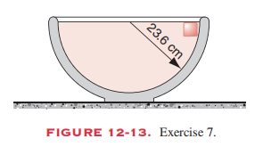
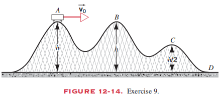
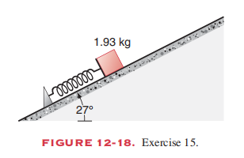

# 
Homework 4

**姓名：** 吴宇宸  
**学号：** 3230100789 
**日期：** 2026.3.30

---

## Ex.1 (P272, T7)

A very small ice cube is released from the edge of a hemispherical frictionless bowl whose radius is 23.6 cm; see Fig.12-13. How fast is the cube moving at the bottom of the bowl?

## Answer:

由机械能守恒定律可知，冰块在最高点时的重力势能转化为最低点时的动能：
$$ mgh = \frac{1}{2}mv^2 $$

其中 $h = r = 23.6 \text{ cm} = 0.236 \text{ m}$，取 $g = 9.8 \text{ m/s}^2$。
$$ v = \sqrt{2gh} = \sqrt{2 \times 9.8 \times 0.236} \approx 2.15 \text{ m/s} $$

所以，冰块在碗底的速度为 $2.15 \text{ m/s}$。

---
## Ex.2 (P155, T9)

A frictionless roller-coaster car starts at point A in Fig. 12-14 with speed v0 . What will be the speed of the car (a) at point B, (b) at point C, and (c) at point D? Assume that the car can be considered a particle and that it always remains on the track.

## Answer:

根据机械能守恒定律，以点 D 所在的水平面为重力势能零点，则小车在点 A 处的总机械能为：
$$ E_A = \frac{1}{2}mv_0^2 + mgh $$

(a) 点 B 的高度为 $h$，与点 A 相同，由机械能守恒可得：
$$ E_B = \frac{1}{2}mv_B^2 + mgh = E_A = \frac{1}{2}mv_0^2 + mgh $$
$$ v_B = v_0 $$

(b) 点 C 的高度为 $h/2$，由机械能守恒可得：
$$ E_C = \frac{1}{2}mv_C^2 + mg\left(\frac{h}{2}\right) = E_A = \frac{1}{2}mv_0^2 + mgh $$
$$ \frac{1}{2}mv_C^2 = \frac{1}{2}mv_0^2 + \frac{1}{2}mgh $$
$$ v_C = \sqrt{v_0^2 + gh} $$

(c) 点 D 的高度为 0，由机械能守恒可得：
$$ E_D = \frac{1}{2}mv_D^2 = E_A = \frac{1}{2}mv_0^2 + mgh $$
$$ v_D = \sqrt{v_0^2 + 2gh} $$

---
## Ex.2 (P155, T15)

A 1.93-kg block is placed against a compressed spring on a frictionless 27.0° incline (see Fig. 12-18). The spring, whose force constant is 20.8 N/cm, is compressed 18.7 cm, after which the block is released. How far up the incline will the block go before coming to rest? Measure the final position of the block with respect to its position just before being released.

## Answer:

由题意可知题中涉及的物理量如下：
- 物块质量 $m = 1.93\text{ kg}$
- 弹簧劲度系数 $k = 20.8\text{ N/cm} = 2080\text{ N/m}$
- 弹簧初始压缩量 $x = 18.7\text{ cm} = 0.187\text{ m}$
- 斜面倾角 $\theta = 27^\circ$

在运动过程中没有摩擦力做功，系统机械能守恒。以木块释放前的位置为重力势能零点，则初始状态系统只有弹性势能：
$$ E_{\text{初}} = \frac{1}{2}kx^2 = \frac{1}{2} \times 2080 \times 0.187^2 \approx 36.368\text{ J} $$

木块到达最高点时，速度为零，此时的势能为：
$$ E_{\text{末}} = mgh = mgd \sin \theta $$
其中 $d$ 为木块沿斜面运动距离。根据机械能守恒有 $E_{\text{初}} = E_{\text{末}}$，得：
$$ d = \frac{\frac{1}{2}kx^2}{mg \sin \theta} = \frac{36.368}{1.93 \times 9.8 \times \sin 27^\circ} \approx \frac{36.368}{1.93 \times 9.8 \times 0.454} \approx 4.23\text{ m} $$

所以木块在停止前会沿斜面向上滑动 $4.23\text{ m}$。