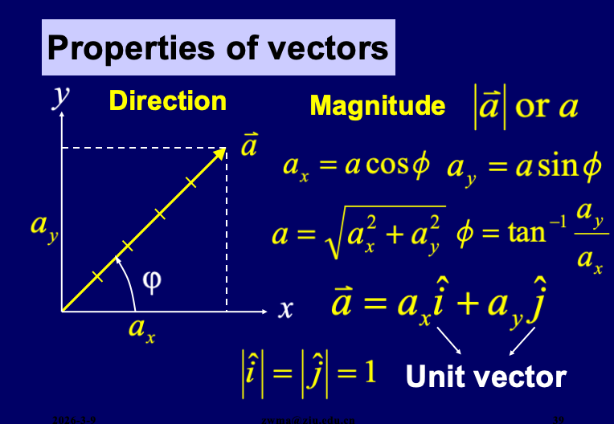
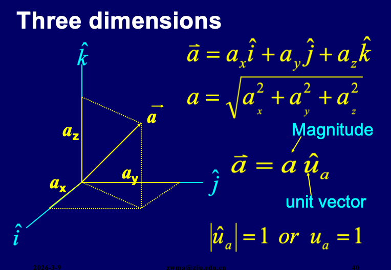
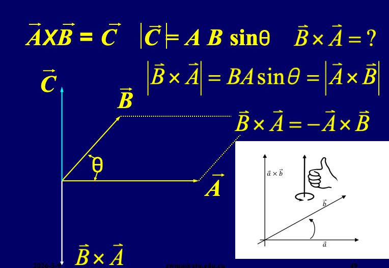

# Chapter 1 Measurement

## The International System of Units -- SI
<!-- Standard Academic Table ("Three-Line Table") Style in HTML -->
<table style="width: 100%; border-collapse: collapse; border-top: 2px solid #e0e0e0; border-bottom: 2px solid #e0e0e0; text-align: left; background-color: transparent;">
    <thead>
        <tr style="border-bottom: 1px solid #e0e0e0;">
            <th style="padding: 10px; font-weight: bold;">Quantity</th>
            <th style="padding: 10px; font-weight: bold;">Name</th>
            <th style="padding: 10px; font-weight: bold;">SI Unit</th>
        </tr>
    </thead>
    <tbody>
        <tr>
            <td style="padding: 8px;">Time</td>
            <td style="padding: 8px;">second</td>
            <td style="padding: 8px;"><code>s</code></td>
        </tr>
        <tr>
            <td style="padding: 8px;">Length</td>
            <td style="padding: 8px;">meter</td>
            <td style="padding: 8px;"><code>m</code></td>
        </tr>
        <tr>
            <td style="padding: 8px;">Mass</td>
            <td style="padding: 8px;">kilogram</td>
            <td style="padding: 8px;"><code>kg</code></td>
        </tr>
        <tr>
            <td style="padding: 8px;">Amount of substance</td>
            <td style="padding: 8px;">mole</td>
            <td style="padding: 8px;"><code>mole</code></td>
        </tr>
        <tr>
            <td style="padding: 8px;">Thermodynamic</td>
            <td style="padding: 8px;">kelvin</td>
            <td style="padding: 8px;"><code>K</code></td>
        </tr>
        <tr>
            <td style="padding: 8px;">Electric current</td>
            <td style="padding: 8px;">ampere</td>
            <td style="padding: 8px;"><code>A</code></td>
        </tr>
        <tr>
            <td style="padding: 8px;">Luminious intensity</td>
            <td style="padding: 8px;">candela</td>
            <td style="padding: 8px;"><code>cd</code></td>
        </tr>
    </tbody>
</table>

## Dimension and dimensional analysis

对于一个等式，或者是计算的结果，可以先通过对其单位的判断进行简单的检查，比如：
- $[x] = L$
- $[v] = LT^{-1}$
- $[a] = LT^{-2}$
- $[f] = MLT^{-2}$

# Chapter 2 Motion in 1-D (Kinematics)

## Properties of Vector

**向量 (vector)**：一种包含大小 (magnitude) 和 方向 (direction) 的表示方式

**向量的分解**：可以根据直角坐标系分解为单位向量

**向量的加法**：三角形/四边形法则

**向量的乘法**：
- $a\vec B = \vec C$
- $\vec A \cdot \vec B = AB cos \theta=c$
- $\vec A \times \vec B = \vec C$

## Vectors in Cartesian coordinate

# Chapter 3 Force and Newton's Law

## Force and Motion

**牛顿第一定律**：不受合外力的物体，将保持静止或匀速直线运动状态
- *惯性系*：牛顿第一定律成立的参考系（如地面、匀速运动的车厢）；
- *非惯性系*：有加速度的参考系（如加速的电梯、旋转的圆盘），此参考系中第一定律不成立。

**牛顿第二定律**：物体的加速度与作用在它上的合外力成正比，与它的质量成反比
$$\sum \vec F = m \vec a$$
分量形式：
$$\sum F_x = m a_x$$
$$\sum F_y = m a_y$$
$$\sum F_z = m a_z$$

**牛顿第三定律**：作用力与反作用力大小相等，方向相反
$$\vec F_{12} = -\vec F_{21}$$

**外力与内力**

外力（$F_{ext}$​）：系统外的物体对系统内物体的作用力；

内力（$F_{int}$​）：系统内物体之间的相互作用力；(内力满足牛顿第三定律，系统内所有内力的合外力为零，只有外力能改变整个系统的运动状态)

**Unit of Force**

*国际单位*：牛顿（N），定义：$1N=1kg \cdot m/s^2$

量纲：$[F]=ML/T2$（M = 质量，L = 长度，T = 时间），用于验证力学公式的量纲一致性。

## 弹性力 (Elastic Force)

弹性力是物体发生弹性形变时产生的恢复力，属于被动力

**弹力 (Spring Force)**：弹簧发生弹性形变所产生的力
$$\vec F = -k \vec x $$
（其中 $k$ 是弹簧常数，$\vec x$ 是弹簧的形变量）

**张力 (Tension Force)**：对于一个理想的轻绳或轻杆，张力是沿绳子或杆方向的拉力，大小相等，作用在绳子或杆两端的物体上

对于悬挂的物体，如果物体处于静止或匀速运动状态，张力与物体的重力等大反向：
$$\vec T = -\vec W (W = mg)$$

**支持力 (Normal Force)**：接触面对物体的弹力，始终垂直于接触面（核心特点）

$$ \vec N = mg \cos \theta $$
（其中 $\theta$ 是斜面与水平面的夹角）

## 万有引力 (Gravitaional Force)

- *大小*：$F = G \frac{m_1 m_2}{r^2}$（其中 $G$ 是万有引力常数，$m_1$ 和 $m_2$ 是两个物体的质量，$r$ 是它们之间的距离）
- *矢量形式*：$\vec F = -G \frac{m_1 m_2}{r^2} \hat r$（其中 $\hat r$ 是从一个物体指向另一个物体的单位矢量）
- *重力与万有引力的关系*：在地球表面，重力近似等于万有引力，即 $mg = G \frac{M m}{R^2}$