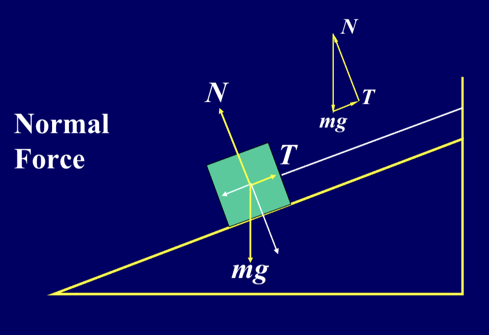

# Chapter 3 Force and Newton's Law

## Force and Motion

**牛顿第一定律**：不受合外力的物体，将保持静止或匀速直线运动状态
- *惯性系*：牛顿第一定律成立的参考系（如地面、匀速运动的车厢）；
- *非惯性系*：有加速度的参考系（如加速的电梯、旋转的圆盘），此参考系中第一定律不成立。

**牛顿第二定律**：物体的加速度与作用在它上的合外力成正比，与它的质量成反比
$$\sum \vec F = m \vec a$$
分量形式：
$$\sum F_x = m a_x$$
$$\sum F_y = m a_y$$
$$\sum F_z = m a_z$$

**牛顿第三定律**：作用力与反作用力大小相等，方向相反
$$\vec F_{12} = -\vec F_{21}$$

**外力与内力**

外力（$F_{ext}$​）：系统外的物体对系统内物体的作用力；

内力（$F_{int}$​）：系统内物体之间的相互作用力；(内力满足牛顿第三定律，系统内所有内力的合外力为零，只有外力能改变整个系统的运动状态)

**Unit of Force**

*国际单位*：牛顿（N），定义：$1N=1kg \cdot m/s^2$

量纲：$[F]=ML/T2$（M = 质量，L = 长度，T = 时间），用于验证力学公式的量纲一致性。

---
## 弹性力 (Elastic Force)

弹性力是物体发生弹性形变时产生的恢复力，属于被动力

**弹力 (Spring Force)**：弹簧发生弹性形变所产生的力
$$\vec F = -k \vec x $$
（其中 $k$ 是弹簧常数，$\vec x$ 是弹簧的形变量）

**张力 (Tension Force)**：对于一个理想的轻绳或轻杆，张力是沿绳子或杆方向的拉力，大小相等，作用在绳子或杆两端的物体上

对于悬挂的物体，如果物体处于静止或匀速运动状态，张力与物体的重力等大反向：
$$\vec T = -\vec W (W = mg)$$

**支持力 (Normal Force)**：接触面对物体的弹力，始终垂直于接触面（核心特点）

$$ \vec N = mg \cos \theta $$
（其中 $\theta$ 是斜面与水平面的夹角）

---
## 万有引力 (Gravitaional Force)

- *大小*：$F = G \frac{m_1 m_2}{r^2}$（其中 $G$ 是万有引力常数，$m_1$ 和 $m_2$ 是两个物体的质量，$r$ 是它们之间的距离）
- *矢量形式*：$\vec F = -G \frac{m_1 m_2}{r^2} \hat r$（其中 $\hat r$ 是从一个物体指向另一个物体的单位矢量）
- *重力与万有引力的关系*：在地球表面，重力近似等于万有引力，即 $mg = G \frac{M m}{R^2}$

---
## 摩擦力 (Frictional Force)

- 静摩擦力 (Static Friction)：$$F_s=-\sum F_{ext}\leq \mu_s N$$（当物体处于静止状态时，静摩擦力的大小等于外力的合力，但方向相反，且不超过最大静摩擦力 $F_{s,max} = μ_s N$）
- 动摩擦力 (Kinetic Friction)：$$F_k= μ_k N$$ （当物体处于运动状态时，动摩擦力的大小等于动摩擦系数 $μ_k$ 与支持力 $N$ 的乘积，且方向与运动方向相反）

---
## Examples

**T1.** 
An object, located at 2R away from the center of the earth, is falling from rest vertically. R is the radius of the earth. Find the speed when it arrives at the earth’s surface. The drag force on the object by the air and the spin of the earth are ignorable.

**Answer**

---
**T2** 
A car moves with the velocity $v_0$ alone the x axis. If $a(t)= - ct$, how much time it passes and how far it travels when it stops?

---
**T3**
A uniform rod with the mass m and the length L is perpendicularly fixed on the rotating axis. When it rotates with a angular speed $\omega$, find the tension force of the rod at every point if the gravitation force is ignorable.

