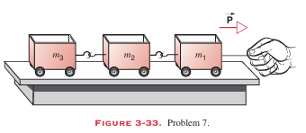
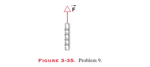
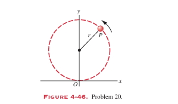

# Homework of Chapter 3 & 4

## T.1 (P63,T7)
A child's toy consists of three cars that are pulled in tandem (串联工作组) on small frictionless rollers (Fig. 3-33). The cars have masses $m_1 = 3.1 kg$, $m_2 = 2.4 kg$, and $m_3 = 1.2 kg$. If they are pulled to the right with a horizontal force  $P = 6.5 N$, find
(a) the acceleration of the system
(b) the force exerted by thesecond car on the third car
(c) the force exerted by thefirst car on the second car.

---
## T.2 (P63,T9)

A chain consisting of five links, each with mass $100 g$, is lifted vertically with a constant acceleration of $2.50 m/s^2$, as shown in Fig. 3-35. Find 
(a) the forces acting between adjacent links
(b) the force F exerted on the top link by the agent lifting the chain
(c) the net force (合力) on each link

---
## Ex.3 (P86,T15)

A body of mass $m$ falls from rest through the air. A drag force $D = bv^2$ opposes the motion of the body. 
(a) What is the initial downward acceleration of the body? 
(b) After some time the speed of the body approaches a constant value. What is this terminal speed $v_T$?
(c) What is the downward acceleration of the body when $v = v_T/2$?

---
## Ex.4 (P86,T18)

(a) Assuming that the drag force $D$ is given by $D = bv$, show that the distance $y_{95}$ through which an object must fall from rest to reach 95% of its terminal speed is given by
$$y_{95} = \frac{v_T^2}{g} (ln(20)-\frac{19}{20})$$
where $v_T$ is the terminal speed. (Hint: Use the result for $y(t)$ ob-tained in Problem 17.) 
(b) Using the terminal speed of $42 m/s$ for the baseball given in Table 4-1, calculate the 95% distance.Why does the result not agree with the value listed in Table 4-1?

---

## Ex.5 (P86,T20)

A particle $P$ travels with constant speed on a circle of radius $3.0 m$ and completes one revolution in 20 s (Fig. 4-46). Theparticle passes through $O$ at $t = 0$. With respect to the origin $O$, find 
(a) the magnitude and direction of the vectors describing its position 5.0, 7.5, and 10 s later
(b) the magnitude anddirection of the displacement in the 5.0-s interval from thefifth to the tenth second, 
(c) the average velocity vector in this interval
(d) the instantaneous velocity vector at the beginning and at the end of this interval
(e) the instantaneous accel-eration vector at the beginning and at the end of this interval.Measure angles counterc lockwise from the $x$ axis.

---
## Ex.6 (P87,T23)

A particle moves in a plane according to
$x=R\sin \omega t +\omega Rt$
$y=R\cos \omega t +R$,
where $\omega$ and $R$ are constants. This curve, called a cycloid, is the path traced out by a point on the rim of a wheel that rolls without slipping along the x axis. 
(a) Sketch the path. 
(b) Calculate the instantaneous velocity and acceleration when the particle is at its maximum and minimum value of y.
