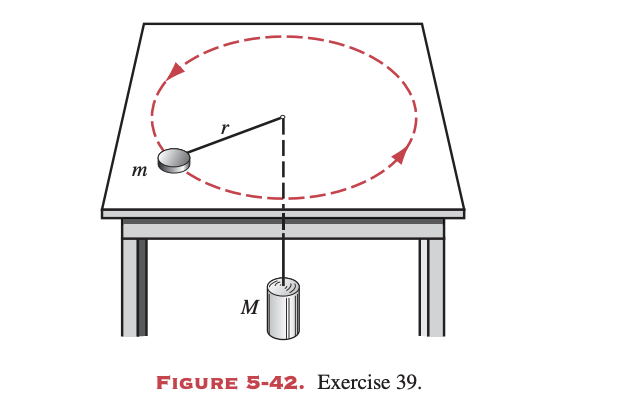
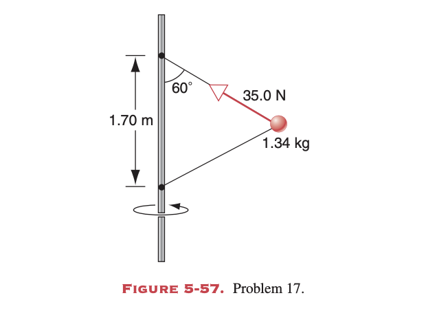
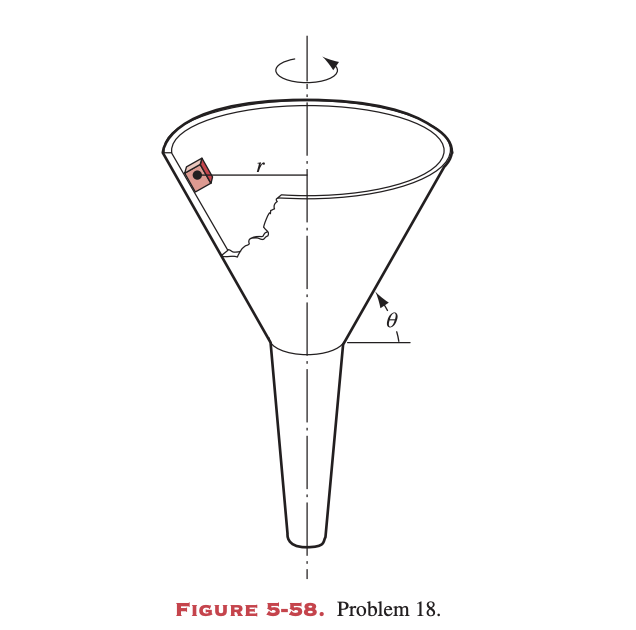

# Homework of Chapter 5

## T1 (P110 Ex.11)
What is the greatest acceleration that can be generated by a runner if the coefficient of static friction between shoes and road is 0.95?

---
## T2 (P111 Ex.18)
A student wants to determine the coefficients of static friction and kinetic friction between a box and a plank. She places the box on the plank and gradually raises one end of the plank. When the angle of inclination with the horizontal reaches 28.0°, the box starts to slip and slides 2.53 m down the plank in 3.92 s. Find the coefficients of friction.

---
## T3 (P113 Ex.39)
A disk of mass m on a frictionless table is attached to a hanging cylinder of mass M by a cord through a hole in the table (see Fig. 5-42). Find the speed with which the disk must move in a circle of radius r for the cylinder to stay at rest.

---
## T4 (P116 Ex.17)
A 1.34-kg ball is attached to a rigid vertical rod by means of two massless strings each 1.70 m long. The strings are attached to the rod at points 1.70 m apart. The system is rotating about the axis of the rod, both strings being taut and forming an equilateral triangle with the rod, as shown in Fig. 5-57. The tension in the upper string is 35.0 N. (a) Find the tension in the lower string. (b) Calculate the net force on the ball at the instant shown in the figure. (c) What is the speed of the ball?

## T5 (P116 Ex.18)
A very small cube of mass m is placed on the inside of a funnel (see Fig. 5-58) rotating about a vertical axis at a constant rate of $\omega$ revolutions per second. The wall of the funnel makes an angle $\theta$ with the horizontal. The coefficient of static friction between cube and funnel is $\mu_s$ and the center of the cube is at a distance r from the axis of rotation. Find the (a) largest and (b) smallest values of $\omega$ for which the cube will not move with respect to the funnel.

