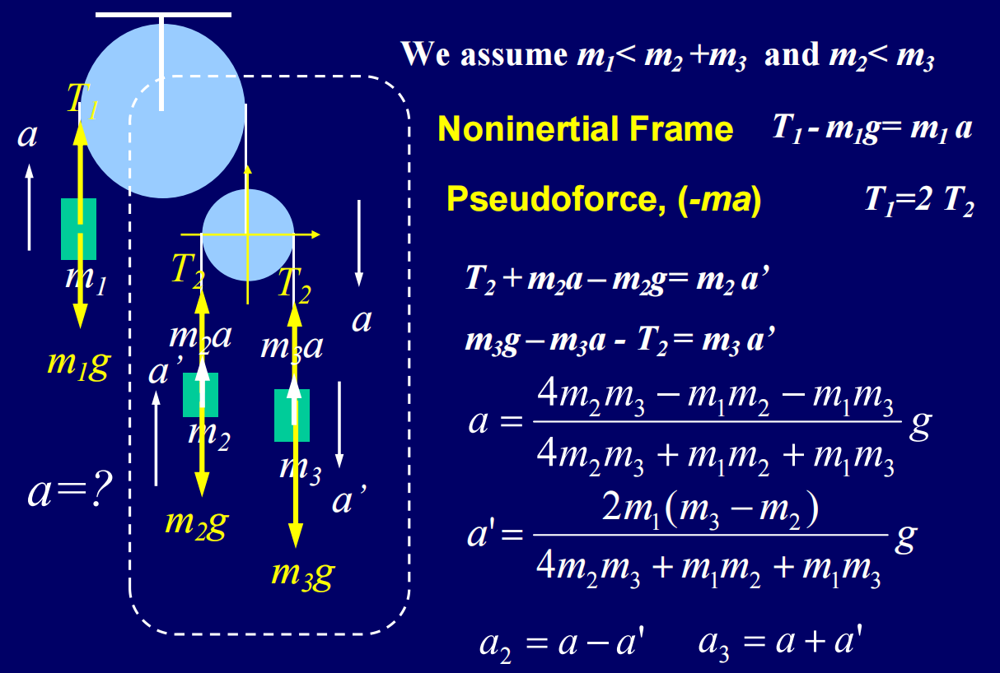
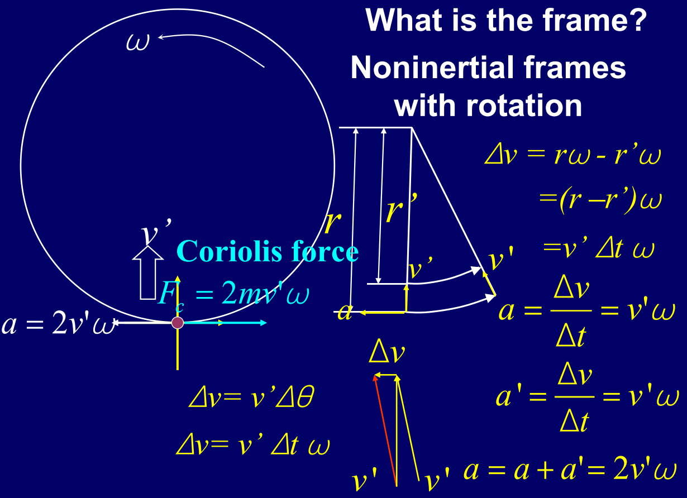

# Chapter 5 Applications of Newton’s Laws

## 牛顿定律的适用限制

只有满足如下三个条件，牛顿定律才能适用：
- *速度远小于光速*：$v \ll c$
- *质量在宏观尺度上*：不适用于微观粒子
- *惯性参考系*：
    - 惯性系：相对做匀速直线运动的参考系
    - 非惯性系：有加速度的参考系，牛顿定律不直接成立（在加速参考系里，物体合力≠0 却可能静止 / 匀速，必须引入 **惯性力** 才能用牛顿第二定律。）

---
## 非惯性系下的牛顿第二定律

**惯性力定义**

非惯性系以加速度 $a$ 相对惯性系运动时，物体质量为m，会受到：$$F_p​=−ma$$负号表示惯性力的方向与参考系加速度方向相反
⚠️：不是真实相互作用力，只是为了数学上能用F=ma

**非惯性系下的牛顿第二定律**
$$\sum F=\sum F_0+\sum F_p=ma'$$
其中：
- $F$：在惯性系中物体所受的合力
- $F_0$：作用在物体上的所有真实力的合力
- $F_p$：惯性力

---
## 实际案例

如图所示，在这样一个系统中，右侧的动滑轮包含两个中午的系统整体以 $a$ 的加速度向下移动，现在需要我们来整体分析和求解 $a$.

右边这个子系统是一个非惯性系，而整个系统是一个惯性系统。我们先拆分右边的子系统进行讨论
对于物体 $m_2$ (加速度方向向上):
$$\sum F_0 + \sum F_p = m_2 a'$$
$$m_2 a+T_2-m_2 g = m_2 a' $$
$$T_2= m_2 a' +m_2g - m_2a$$

对于物体 $m_3$(加速度方向向下):
$$\sum F_0 + \sum F_p = m_3 a'$$
$$m_3g-m_3a-T_2 = m_3 a'$$
$$T_2 = m_3g - m_3a - m_3 a'$$

汇总当前我们的等式
$$T_2 = m_3g - m_3a - m_3 a'$$
$$T_2= m_2 a' +m_2g - m_2a$$
$$T_1= T_2$$
$$T_1-m_1g = m_1 a$$
可以解得
$$a = \frac{4m_2m_3-m_1m_2-m_1m_3}{4m_2m_3+m_1m_2+m_1m_3}\cdot g$$
$$a' = \frac{2m_1(m_3-m_2)}{4m_2m_3+m_1m_2+m_1m_3}\cdot g$$

---
## 旋转非惯性系

在以角速度ω旋转的非惯性系中，物体受两种伪力：
- **离心力**：背离圆心，$F=m\omega^2r$
- **科里奥利力（Coriolis）**：物体相对旋转系有径向速度时出现$$F_c​=2mv'×\omega$$方向：垂直于相对速度v′与角速度ω
