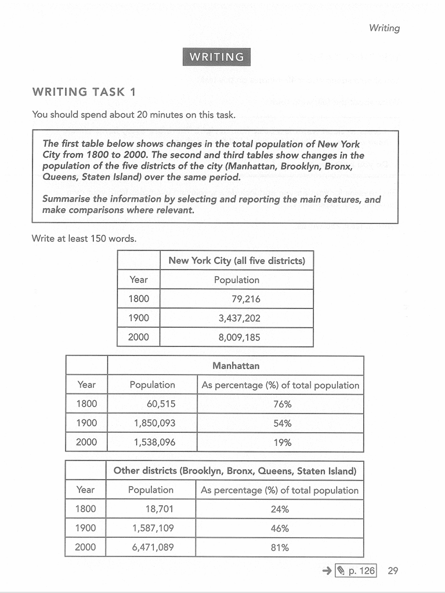
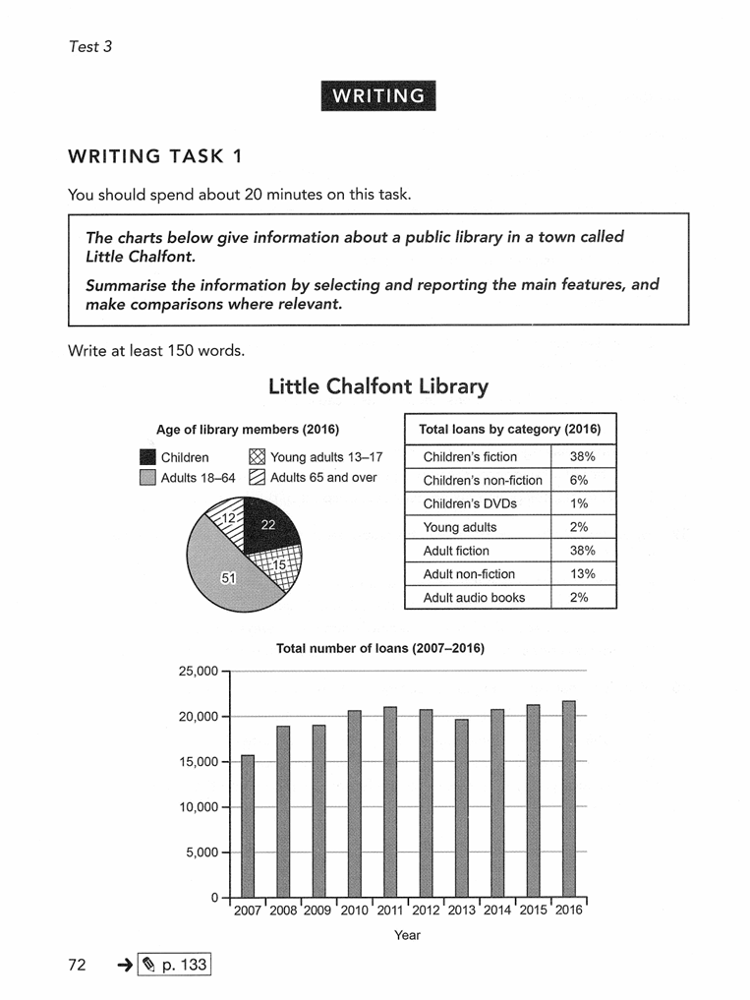
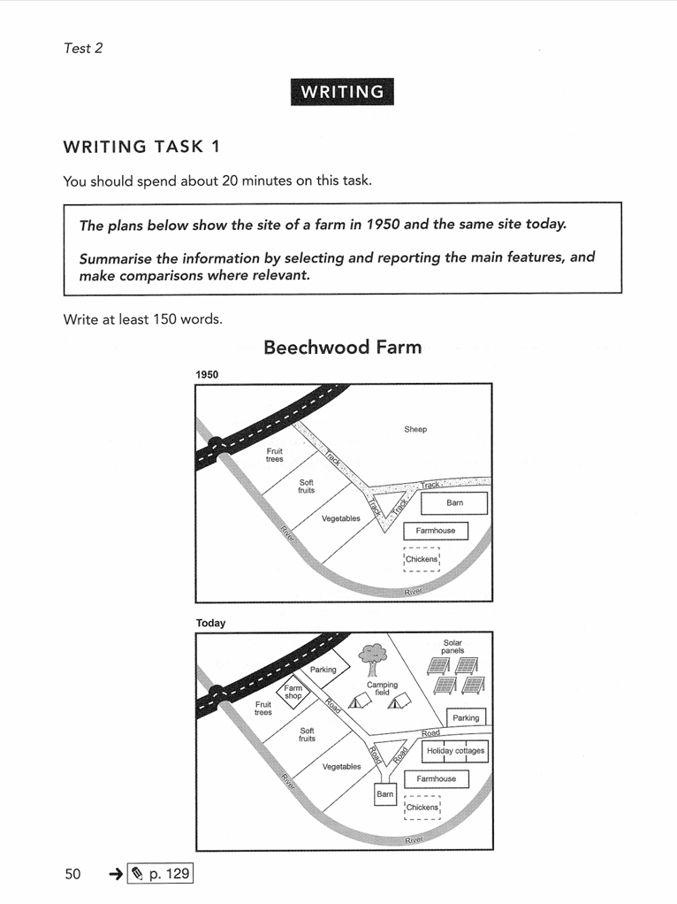

# 小作文

## 表格题

 

## My version

Among three tables, the first table illustrates the **changes in（固定搭配，不要使用其他介词）** the total population of New York City between 1800 and 2000 while the other two show the trends of population of the five districts including Manhattan, Brooklyn, Bronx, Queens and Staten Island in the same **time span(时间段)**.

**Looking from an overall perspective, it is readily apparent that（固定句式）** the total population of New York City increased significantly from 1800 to 2000. More detailedly, the total of population grew from 79,216 in 1800 to 3,437,202 in 1900 and ended in 8,009,185 in 2000.

Comparing the other two charts, Manhattan's population as percentage of total population declined dramatically from 76% to 19% while the other districts' population as percentage of total population grew. The population of Manhattan started at 60,515 in 1800, increased to the peak of 1,850,093 and dropped to 1,538,096 in 2000. Meanwhile, the number of people of the other districts increased from 18,701 to 6,471,089 which was **far greater（远大于）** than the total population of Manhattan in 2000.

## Examples from howtodoielts.com

The first table below shows changes in the total population of New York City from 1800 to 2000. The second and third tables show changes in the population of the five districts of the city (Manhattan, Brooklyn, Bronx, Queens, Staten Island) over the same period.

**开头简洁明了，表明题目所提供的图标描述了什么即可**

The tables detail overall population figures in New York City and statistics concerning the surrounding **boroughs（同义词替换districts）** compared to Manhattan from the year 1800 to 2000. **Looking from an overall perspective, it is readily apparent that the dramatic overall growth is strongly correlated with increases in population growth outside of Manhattan. The proportional dominance of the outer boroughs over Manhattan has widened notably in the last century in particular.**

In the year 1800, **the vast majority of（绝大多数）** New York City’s total population (79,216) was situated in Manhattan (60,515 or 76%), **far above the corresponding figure for other outlying districts** (18,710 or 24%). **Over the subsequent century, there occurred a pronounced shift（在接下来的一个世纪里，出现了一个显著的转变）** with a narrow majority of 54% of the population (1,850,093) living in Manhattan and 46% outside the city center (1,587,109). The total population figure also surged to 3,437,202.

## 多种图标结合题

 

## My version

The given tables illustrate the statistics about a public library which is called Little Chalfont. Specifically, the pie chart shows the age of library members,  the histogram shows changes of the total number of loans from 2007 to 2016 and the other table shows the total loans by category.

Focusing on the pie chart, it is obviously that in 2016 over a half(51%) of the library members were adults between 18 to 64 while 22% and 15% of the members came from children and young adults between 13 to 17 respectively. There were only 12% of library members aged over 65 in 2016. 

Looking at the bar graph, it is readily apparent that the total number of loans grew steadily from about 15500 to 20500 between 2007 and 2011. Over the subsequent 5 years, the number of loans marginal declined in 2012 and 2013 and quickly bounced back to the peak at about 21000 in 2016. 

Among the total loans in 2016, there are both 38% of loans about children's fiction and Adult fiction and both 2% of loans about young adult and adult audio books. The other 19% loans were about children's non-fiction(6%) and adult non-fiction(13%)

## Examples from howtodoielts.com

The various charts provide details about total loans, **age demographics（年龄结构）**, and genres at the public library of Little Chalfont. Looking from an overall perspective, it is readily apparent that adults aged 18-64 represented by far the majority of library-goers, **with roughly equal proportions for** other age groups. The total number of loans **rose considerably overall**, with children’s and adult’s fiction representing clearly the most common genres for borrowers by 2016.

In terms of the age demographics for the public library in 2016, **a sizable majority of** 51% were between the ages of 18 and 64. **Other age brackets**, adults 65 and over, children, and young adults 13-17, stood at 12%, 22%, and 15% respectively.

Regarding genres, fiction for children and adults were borrowed at the same rate of 38% in 2016. The next closest genre was adult non-fiction at 13%. All other kinds of  books (children’s non-fiction, children’s DVDs, young adults, and adult audio books) were loaned at marginal rates ranging from 6 to 1%. Lastly, the total number of loans began in 2007 at just over 15,000, **rose steadily to a plateau** over 20,000 from 2010 to 2012, before **a slight dip** in 2013 (to under 20,000), and more than full recovery to near 22,000 by the end of the period.

 

