# 笔记

## Dynamic charts

**Step 1 - Summary**

What is the general trend?

**Step 2 - Grouping**

What are the major commonalities and differences between trends?

**Structure**

- Summary : What is the framework and What is the general trend?

- Group 1 : Why grouping(commonality)? ; Comparison and key features

- Grooup 2: Why grouping(commonality)? ; Comparison and key features

---
### Example 1

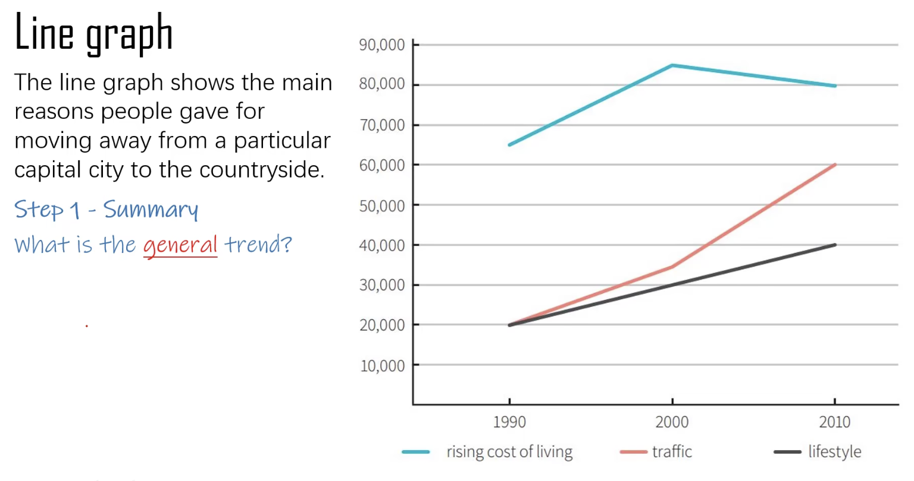

**Summary**

The line graph demonstrates the main motivations people expressed for relocating to the countyside from the urban area of a capital city in 1990, 2000 and 2010 (**关于题目给出的信息的同意替换**) The years witnessed a large number of people moving away. (**总体趋势的描述**)

**Group1**

According to the graph, the major reason for relocation was the rising cost of living.(**讲清楚为什么分类**) In 1990, 65,000 people left the city because of this, the the number peaked at 85,000 in 2000, before going down a bit by 5,000 in the decade between 2000 and 2010.(**起点，终点， 关键转折点， 交汇点，最高最低点**)

**Group2**

It was a different story for traffic and lifestyle: both had the same number of city leavers at 20,000 at the start of the period, much lower than that of rising cost of living. (**讲清楚为什么分类的同时，带过总体趋势和起点数据**)

Subsequently, both categories saw increases, with traffic first going up by a large number to 35,000 by the year 2000, and then even more steeply to 60,000 by 2010; Lifestyle leavers rose cosistently over the whole period, going eventually up to 40,000.

---

### Example 2

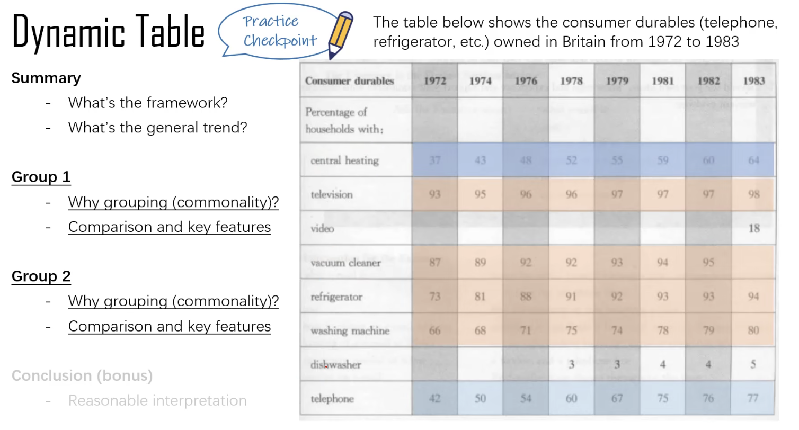

**Practice**

The table details the statistics concerning some household appliances such as televisions, vacuum cleaners. from 1972 to 1983. Looking from an overall perspective, it is readily apparent that more and more people owned different types of consumer durables during the time span.

According to the table, the percentages of households owning televisions, vacuum cleaners, refrigerators, and washing machines started at a high point in 1972 and experienced a growth in the coming years. 93% of households owned televisions in 1972, followed by vacuum cleaners (87%), refrigerators (73%), and washing machines (66%). In the subsequent 11 years, the percentages of households owning refrigerators and washing machines increased rapidly, while the former reached 94% and the latter reached 80% in 1983. However, the figure for televisions increased by only 5% by 1983, and vacuum cleaners by 8% by 1982.

For the other four durables, videos and dishwashers were owned by 0% of households in 1972, while only 37% and 42% of households had central heating and telephones respectively at the same time. Although central heating and telephones began at a low point, the two figures almost doubled from 1972 to 1983. Dishwashers first appeared in the data in 1978 and were owned by 5% of households in 1983, and 18% of households owned videos in 1983.

---

## Dynamic charts expressions

**有关趋势的词汇**
<!-- Standard Academic Table ("Three-Line Table") Style in HTML -->
<table style="width: 100%; border-collapse: collapse; border-top: 2px solid #e0e0e0; border-bottom: 2px solid #e0e0e0; text-align: left; background-color: transparent;">
    <thead>
        <tr style="border-bottom: 1px solid #e0e0e0;">
            <th style="padding: 10px; font-weight: bold;"> </th>
            <th style="padding: 10px; font-weight: bold;">Moderate</th>
            <th style="padding: 10px; font-weight: bold;">Dramatic</th>
            <th style="padding: 10px; font-weight: bold;">Extreme</th>
        </tr>
    </thead>
    <tbody>
        <tr>
            <td style="padding: 8px;">UP</td>
            <td style="padding: 8px;"><code>rise</code>, <code>increase</code>, <code>grow</code>, <code>climb</code></td>
            <td style="padding: 8px;"><code>jump</code>, <code>surge</code>, <code>soar</code>, <code>skyrocket</code></td>
            <td style="padding: 8px;"><code>peak at</code>, <code>reach the peak/top/highest point at</code></td>
        </tr>
        <tr>
            <td style="padding: 8px;">DOWN</td>
            <td style="padding: 8px;"><code>dip</code>, <code>fall</code>, <code>decline</code>, <code>drop</code>, <code>decrease</code></td>
            <td style="padding: 8px;"><code>slide</code>, <code>plunge</code>, <code>slump</code></td>
            <td style="padding: 8px;"><code>to the bottom of</code> </td>
        </tr>
        <tr>
            <td style="padding: 8px;">Maintain</td>
            <td style="padding: 8px;"><code>stay constant</code>, <code>stabilize</code>, <code>level off</code>, <code>fluctuate</code></td>
            <td style="padding: 8px;"> </td>
            <td style="padding: 8px;"><code>reach a plateau at</code>, <code>plateau at</code> </td>
        </tr>
    </tbody>
</table>

**有关变化的词汇**
<!-- Standard Academic Table ("Three-Line Table") Style in HTML -->
<table style="width: 100%; border-collapse: collapse; border-top: 2px solid #e0e0e0; border-bottom: 2px solid #e0e0e0; text-align: left; background-color: transparent;">
    <thead>
        <tr style="border-bottom: 1px solid #e0e0e0;">
            <th style="padding: 10px; font-weight: bold;"> </th>
            <th style="padding: 10px; font-weight: bold;">Big</th>
            <th style="padding: 10px; font-weight: bold;">Small</th>
            <th style="padding: 10px; font-weight: bold;">Fast</th>
        </tr>
    </thead>
    <tbody>
        <tr>
            <td style="padding: 8px;">Change</td>
            <td style="padding: 8px;"><code>Significantly</code>, <code>considerably</code>, <code>substantially</code>, <code>dramatically</code></td>
            <td style="padding: 8px;"><code>slightly</code>, <code>moderately</code></td>
            <td style="padding: 8px;"><code>quickly</code>, <code>sharply</code>, <code>rapidly</code>, <code>suddenly</code></td>
            <td style="padding: 8px;"><code>gradually</code>, <code>consistently</code>, <code>slowly</code></td>
        </tr>
    </tbody>
</table>

**表述数据大约**: approximately, about, around, just below/above

**句式**
- 比例/数量增长 in 时间段，还有变化可以再加上(before doing， followed by)
- 年份 witnessed/saw 某种变化
- 比例/数量展现出明显的变化 (demonstrated an apparent upward/downward trend), increasing/decreasing ...
- 某种变化(A slight dip,...)can be seen in ...  from 年份 to 年份
- There was 某种变化...

---

## Static charts

**Step 1 - Summary**
- What info is presented (静态图表的分类很重要)

**Step 2 - Grouping**
- What are the **major** commonalities and differences between quantities?

### Example 1

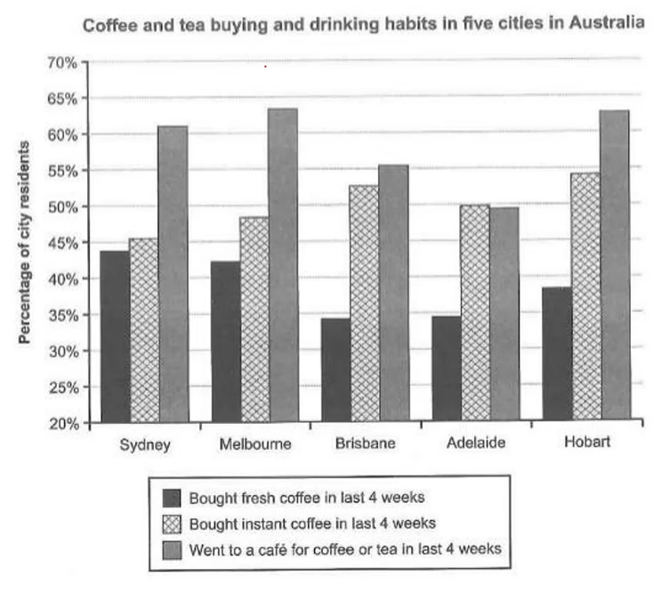

**Summary**
The bar chart demonstrates the coffee and tea buying and drinking prefences of residents in five australian cities. It shows the proportion of residents who bought fresh or instant coffee, and those that went to a cafe for cofffee or tea in the last four weeks.

**Group1**
According to the chart, most residents in the cities went out for coffee or tea - over 60% in Sydney, Melbourne and Hobart and around 55% in Brisbane; these numbers are generally much higher than those of buying fresh or instant coffee. Adelaide is an exception with slightly less tha half of its people going out, also one or two percent lower than buying instant coffee.

**Group2**
Among those who bought coffee, around half(45%-55%) of the people in the cities bought instant coffee; on the other hand, fewer people bought fresh coffee though the difference varied; from a few percent in Sydney and Melbourne to about half the number of those who bought instant coffee in Brisbane, Adelaide and Hobart.

**Conclusion**
In conclusion, most residents in the five Australian cities drink coffee or tea, and they seem to prefer convenient ways of drinking (coffee or tea from a shop or instant coffee) to making their own drink (fresh coffee).

### Example 2

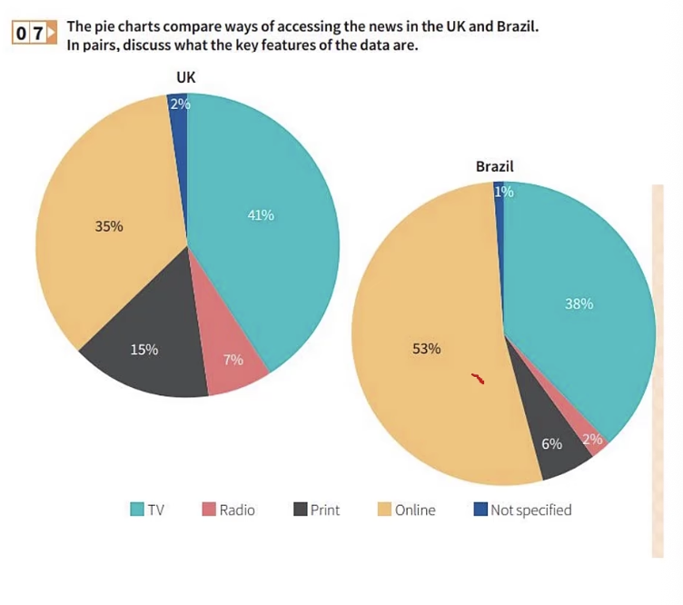

**Summary**
The pie charts show the principle ways of finding out the news in two different countries, the UK and Brazil. The two nations show broadly similar patterns, though there are some differences, both significant and minor.

**Group1**
One of the most prominent features shared by the two pies is that apparently viewing TV news is popular in both countries - with about two fifths of the UK population favouring this mode of delivery and only 3% fewer in Brazil; in the meantime, in the UK over a third of people access the news online, while in brazil the figure si more than half at 53%.

**Group2**
Differences between the UK and Brazil include: 1. over twice as many people read the news in print in the former, compared with the latter, at 15% and 6% respectively; 2. Similarly, listening to the news on the radio is preferred by three times more people in the UK than in Brazil, though both counting for a minor share of the whole population.

**Conclusion**
Overall, both countries are dominated by internet and TV in the way how news is conveyed, while the UK has a bit more diversity in how people access news.

### Expressions

**比较类词汇**
<!-- Standard Academic Table ("Three-Line Table") Style in HTML -->
<table style="width: 100%; border-collapse: collapse; border-top: 2px solid #e0e0e0; border-bottom: 2px solid #e0e0e0; text-align: left; background-color: transparent;">
    <thead>
        <tr style="border-bottom: 1px solid #e0e0e0;">
            <th style="padding: 10px; font-weight: bold;">Type</th>
            <th style="padding: 10px; font-weight: bold;">Vocabulary / Expressions</th>
        </tr>
    </thead>
    <tbody>
        <tr>
            <td style="padding: 8px;">More / Higher</td>
            <td style="padding: 8px;"><code>more than</code>, <code>overtake</code>, <code>outnumber</code>, <code>exceed</code>, <code>surpass</code>, <code>a wider gap between</code>, <code>more likely to</code></td>
        </tr>
        <tr>
            <td style="padding: 8px;">Less / Lower</td>
            <td style="padding: 8px;"><code>less / fewer than</code>, <code>decrease</code>, <code>drop</code>, <code>a narrower gap between</code>, <code>less likely to</code></td>
        </tr>
        <tr>
            <td style="padding: 8px;">Equal</td>
            <td style="padding: 8px;"><code>the same as</code>, <code>equal to</code>, <code>on par with</code>, <code>a similar proportion of</code></td>
        </tr>
        <tr>
            <td style="padding: 8px;">Close / Approximate</td>
            <td style="padding: 8px;"><code>approximately</code>, <code>roughly</code>, <code>about</code>, <code>around</code>, <code>just below/above</code>, <code>similar to</code>, <code>close to</code>, <code>nearly</code></td>
        </tr>
    </tbody>
</table>

**倍数与分数表达法（表示一个数据是另一个的几倍/几分之几）**

在雅思小作文（尤其是静态图和对比题型）中，倍数和分数表达是非常高分的句型：

1. **A + be动词 + 倍数 + as + adj. (large/high/much/many) + as + B**
   - *Example:* The number of men was **three times as large as** that of women.
   - *Example:* The figure for Brazil is **twice as high as** that for the UK.

2. **A + be动词 + 倍数 + the + n. (number/proportion/amount/size) + of + B**
   - *Example:* The population of City A is **triple the number of** City B. 
   - *Example:* The budget for education was **double the amount of** healthcare.

3. **直接使用倍数/分数相关的动词 (常用于动态图的变化)**
   - *Double (翻倍/两倍):* The percentage of internet users **doubled** from 2000 to 2010.
   - *Triple (三倍):* The sales figures **tripled** over the 5-year period.
   - *Quadruple (四倍):* The urban population **quadrupled** by the end of the century.
   - *Halve (减半):* The number of accidents **halved** in 2020. 

4. **使用分数表达比例 (Fraction)**
   - *常见分数:* `Half` (一半), `A third` (三分之一), `A quarter` (四分之一), `A fifth` (五分之一)
   - *Example:* The proportion of online shoppers was exactly **half that of** in-store shoppers.
   - *Example:* **Roughly a third of** the population preferred listening to the radio.

---

## Multiple charts

### Example 1 (static + static)

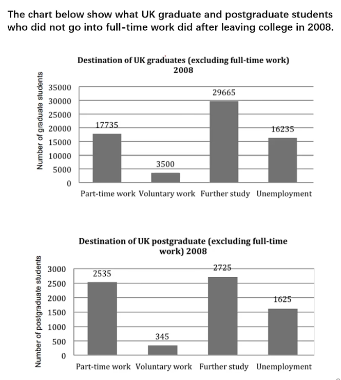

**Summary**

The two bar charts demonstrate the career choices (excluding full-time work) of graduate students and postgraduate students in the UK in 2008. The choices incude part-time work, voluntary work, further study and unemployment.

**Group 1**

Among approximately 67,000 graduates, a few percent less than half chose to pursue further study, acounting for the largest proportion. In the meantime, part-time work and unemployment both took aroound a quater of the total. In contrast, voluntary work was the least popular option, occupying a mere 5%.

**Grooup 2**

Postgraduates followed a pattern with some similarity to graduates in 2008, though in a much smaller scale. Among approximately 7,000 of them, further study was again the most popular option, which accounted for around 30% of the total; unlike graduates, significantly more postgraduates chose part-time work than unemployment, standing at 2,535 and 1,625 respectively. Voluntary work was also again the least favorable choice at about 5%.

Inconclusion, the non-fulltime job preferences of graduates and postgraduates in the UK were in totally different scales, but shared some similar features.

### Example 2 (static + dynamic)

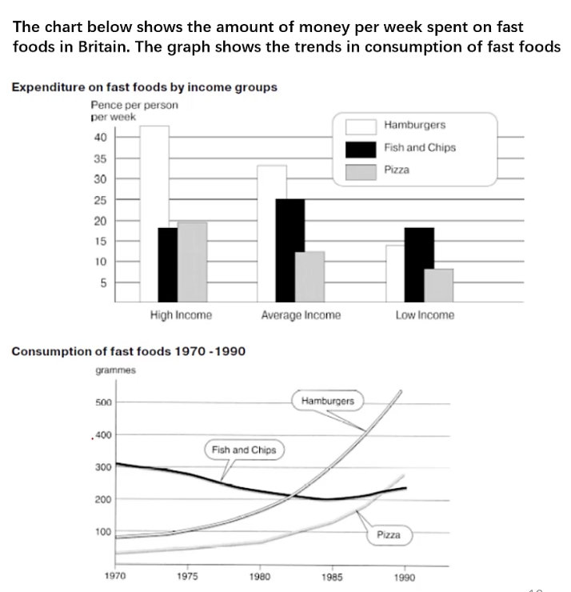

**Summary**
- What's the framework

**Chart 1**
- Burgers & Pizza +income level
- Fish and Chips ? income level

**Chart 2**
- Burgers and pizza +++
- Fish and chips -

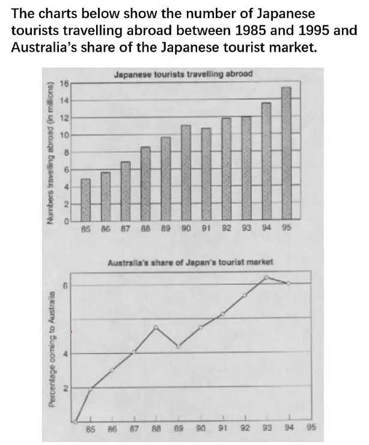

---

## Maps

**Step 1**: point of reference

**Step 2**: locate major changes

**Step 3**: locate other changes

### Example 1
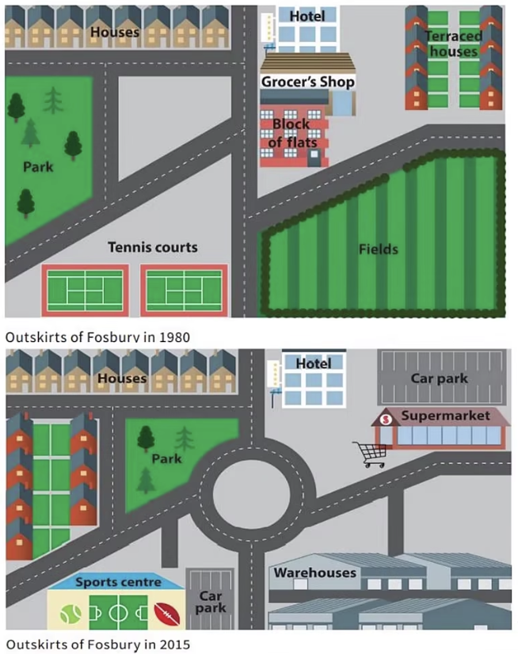

**Step 1**: the roundabout (环形路)

**Step 2**: the roundabout, fields and supermarket are major changes

**Steo 3**: Tennis courts, Park are other changes

**Summary**

The maps depict the outskirts of the town Fosbury in 1980 and 2015, and the urban developments that took place. Overall, new industrial and commercial features were added, while recreational and residential facilities were renovated.

**Major changes**

The most prominent change is a new roundabout in the center of the town, replacing the intersection that connected roads to all directions, In addition, new industrial and commercial features were also added; the empty fields in the southeastern corener were converted into ware houses, a new industrial facility in the town; in the northeastern corner, flats, houses and the grocer's shop were demolished, and a new supermarket with a car park was built up.

**Other changes**

There were also extensive renovation to the recreational and residential facilities to the town: 1. the tennis courts in the southwestern corner were upgraded to a sports center with car park; 2. the large park in the western side of the town surrounded by roads was converted into a new residential zone with terraced hoouses, facing a smaller new park across the road to its east.

### Example 2

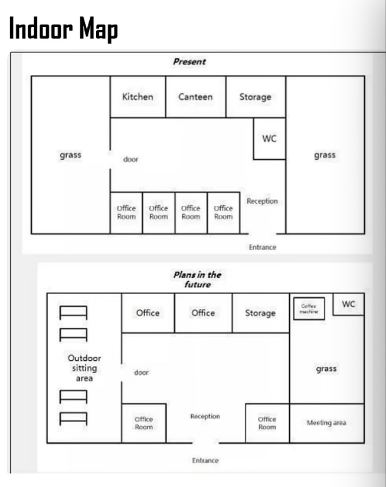

**Step 1**: stand in the center and illustrate four directions.

**Step 2**: the entry door, grass, offices are major changes

**Steo 3**:  kitchen, canteen are other changes

### Expressions

**地图题常用动词**
<!-- Standard Academic Table ("Three-Line Table") Style in HTML -->
<table style="width: 100%; border-collapse: collapse; border-top: 2px solid #e0e0e0; border-bottom: 2px solid #e0e0e0; text-align: left; background-color: transparent;">
    <thead>
        <tr style="border-bottom: 1px solid #e0e0e0;">
            <th style="padding: 10px; font-weight: bold;">Build</th>
            <th style="padding: 10px; font-weight: bold;">Change</th>
            <th style="padding: 10px; font-weight: bold;">Improve</th>
            <th style="padding: 10px; font-weight: bold;">Remove</th>
            <th style="padding: 10px; font-weight: bold;">Remain</th>
        </tr>
    </thead>
    <tbody>
        <tr>
            <td style="padding: 8px;"><code>Erect</code>, <code>construct</code>, <code>put up</code>, <code>develop</code></td>
            <td style="padding: 8px;"><code>Extend</code>, <code>expand</code>, <code>enlarge</code>, <code>relocate</code>, <code>construct</code>, <code>convert</code>, <code>replace</code></td>
            <td style="padding: 8px;"><code>Renovate</code>, <code>upgrade</code>, <code>modernize</code></td>
            <td style="padding: 8px;"><code>Knock down</code>, <code>replace</code>, <code>tear down</code>, <code>disappear</code></td>
            <td style="padding: 8px;"><code>Remain</code> / <code>stay</code> / <code>stand unchanged</code></td>
        </tr>
    </tbody>
</table>

**方位与相对位置表达**
<!-- Standard Academic Table ("Three-Line Table") Style in HTML -->
<table style="width: 100%; border-collapse: collapse; border-top: 2px solid #e0e0e0; border-bottom: 2px solid #e0e0e0; text-align: left; background-color: transparent;">
    <thead>
        <tr style="border-bottom: 1px solid #e0e0e0;">
            <th style="padding: 10px; font-weight: bold;">Location</th>
            <th style="padding: 10px; font-weight: bold;">Expression</th>
        </tr>
    </thead>
    <tbody>
        <tr>
            <td style="padding: 8px;">A在B的东西南北方(内部/接壤/不接触)</td>
            <td style="padding: 8px;">A is <code>in</code> / <code>on</code> / <code>to</code> the east/west/south/north of B</td>
        </tr>
        <tr>
            <td style="padding: 8px;">A在B的东西南北方(内部)</td>
            <td style="padding: 8px;">A is in the <code>eastern/southern/western/northern part</code> of B</td>
        </tr>
        <tr>
            <td style="padding: 8px;">A在B的东西南北角落</td>
            <td style="padding: 8px;">A is <code>at/in the eastern/southern/western/northern corner</code> of B</td>
        </tr>
        <tr>
            <td style="padding: 8px;">A和B很近</td>
            <td style="padding: 8px;">A is <code>near</code> / <code>next to</code> / <code>close to</code> / <code>adjacent to</code> B</td>
        </tr>
        <tr>
            <td style="padding: 8px;">A在B的对面</td>
            <td style="padding: 8px;">A is <code>opposite to</code> / <code>on the opposite side of</code> B</td>
        </tr>
    </tbody>
</table>

## Flow charts

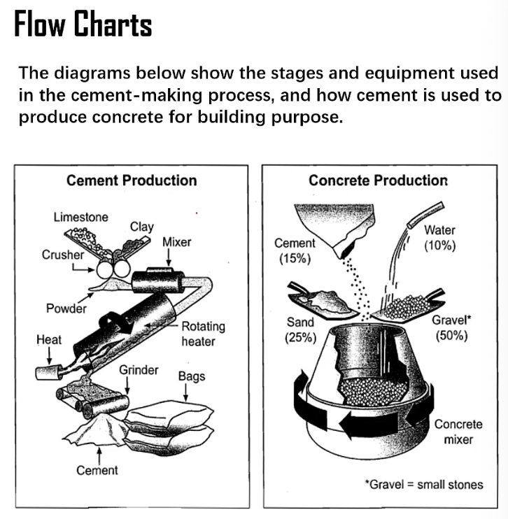

**Summary**

The two flow charts demonstrate the stages and equipment used for cement production, and how cement is further processed into concrete.

**Phase 1 (Details!!!)**

First, a crusher with two tilted surfaces receives limestone and clay, combining and crushing the raw materials into powder for further processing. The poder then enters a mixer to achieve a higher level of homogeneity. After that, the mixture goes via a pipe into a large cylindrical rotating heater and is melted. The melted mixture then drops down from the heater onto a conveyor belt before being sent for grinding into cement. Finally, loose cement is packed into bags.

- purpose of the steps?
- actions in the steps?
- shapes, sizes, and other features of the items?
- relationship between steps and phases?

**Phase 2**

In the second phase, cement is then used for theproduction of concrete, and the first step is to createa mixture: 15% of cement is poured out from thebags, 10% of water from a pipe, 25% sand and 50%of gravel (small tones) are shoveled. Theingredients are then all sent into a giganticcylindrical rotating mixer. Once the mixture isadequately stirred, it forms concrete which can beused for construction purposes.

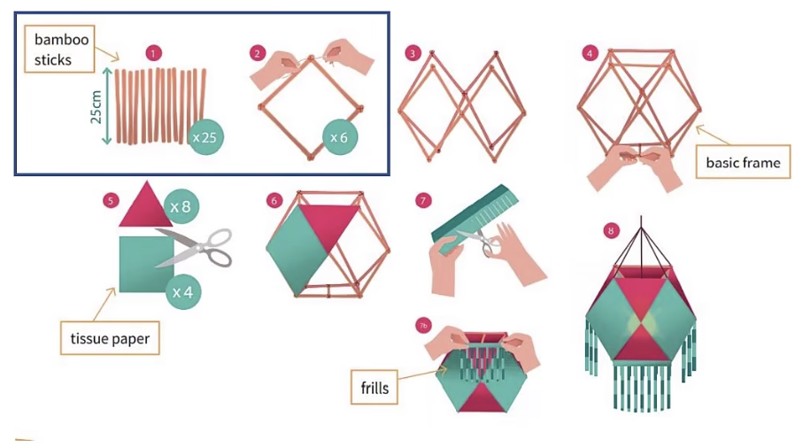

### Expressions

**流程图阶段连接词与表达**
<!-- Standard Academic Table ("Three-Line Table") Style in HTML -->
<table style="width: 100%; border-collapse: collapse; border-top: 2px solid #e0e0e0; border-bottom: 2px solid #e0e0e0; text-align: left; background-color: transparent;">
    <thead>
        <tr style="border-bottom: 1px solid #e0e0e0;">
            <th style="padding: 10px; font-weight: bold;">Phase (阶段)</th>
            <th style="padding: 10px; font-weight: bold;">Expressions (常用表达)</th>
        </tr>
    </thead>
    <tbody>
        <tr>
            <td style="padding: 8px; font-weight: bold;">Beginning (开始)</td>
            <td style="padding: 8px;">
                <code>The process starts from...</code> 
                <code>Initially,...</code> 
                <code>At the beginning of the cycle,...</code> 
                <code>During the initial phase,...</code> 
                <code>The beginning of the whole cycle is marked by...</code>
            </td>
        </tr>
        <tr>
            <td style="padding: 8px; font-weight: bold;">Intermediate (过程/衔接)</td>
            <td style="padding: 8px;">
                <code>The second stage is...</code> 
                <code>The next step in the process is...</code> 
                <code>Next comes the third stage:...</code> 
                <code>When the third step is completed,...</code> 
                <code>The following stage is...</code> 
                <code>Once / When... is done / finished,...</code>
            </td>
        </tr>
        <tr>
            <td style="padding: 8px; font-weight: bold;">In process (同时进行)</td>
            <td style="padding: 8px;">
                <code>At the same time,</code> 
                <code>Simultaneously,</code> 
                <code>Meanwhile,</code> 
                <code>during...</code> 
                <code>in the process of...</code> 
                <code>over the course of...</code>
            </td>
        </tr>
        <tr>
            <td style="padding: 8px; font-weight: bold;">End (结束)</td>
            <td style="padding: 8px;">
                <code>The final step is to...</code> 
                <code>...is the last step in the procedure.</code> 
                <code>Entering the final phase,...</code>
            </td>
        </tr>
        <tr>
            <td style="padding: 8px; font-weight: bold;">Terms for Stages (表示“步骤”的名词)</td>
            <td style="padding: 8px;">
                <code>Process</code>, <code>Procedures</code>, <code>Stages</code>, <code>Steps</code>, <code>Phases</code>
            </td>
        </tr>
    </tbody>
</table>