# Chapter 2 Software Engineering

## 2.1 Defining the Discipline

**The IEEE Definition**

The application of a systematic, disciplined, quantifiable approach to the development, operation, and maintenance of software; that is, the application of engineering to software.  总的来说就是对软件的开发、运行和维护采用用一种*系统化、规范化、可量化*的方法

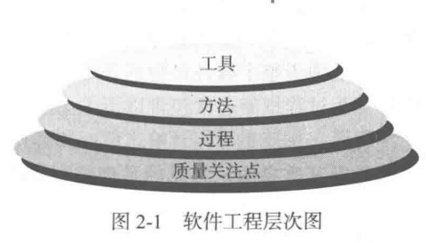

- 支持软件工程的根基在于*质量关注点 (quanlity focus)*
- 软件工程的基础是*过程层 (process)*
- *软件工程方法 (method)*为构建软件提供技术上的解决方法
- *软件过程工具 (tool)* 为过程和方法提供自动化或半自动化的支持，建立了软件开发的支撑系统，称为*计算机辅助软件工程 (computer aided software engineering)*

---

## 2.2 The Soft ware Process

**Generic Process Framework 过程框架**

1. *Communication 沟通*：在技术工作开始之前和客户以及其他利益先关者的沟通与协作
2. *Planning 策划*：定义和描述软件工程工作，包括需要执行的技术任务，可能的风险，资源需求，工作产品和工作进度计划
3. *Modeling 建模*：利用模型来更好的理解软件需求，并完成符合这些需求的软件设计
4. *Construction 构建*：必须要对所做的设计进行构造，包括编码和测试，后者用于发现编码中的错误
5. *Deployment 部署*：软件交付给用户，用户对其进行评测并给出反馈意见

**Process Adaptation 普适性活动**

- 软件项目跟踪和控制
- 风险管理
- 软件质量保证
- 技术评审
- 测量
- 软件配置管理
- 可复用管理
- 工作产品的准备和生产

---

## 2.3 Software Engineering practice

**The Essence of Practice 时间的精髓**

1. 理解问题：沟通和分析
2. 策划解决方案：策划解决方案
3. 实施计划：代码生成
4. 检查及过的正确性：测试和质量保证

**General Principles 通用原则**
1. *存在价值*：一个软件系统因为能为用户提供价值而又存在价值，所有决策都应该给予这个思想
2. *保持简洁*：所有的设计都应该尽可能简洁，但不是过于简化
3. *保持愿景*：清晰的愿景是软件项目成功的基础
4. *关注使用者*：在需求说明、设计和实现过程中，牢记要让别人理解你所做的事情
5. *面向未来*：生命周期持久的系统具有更高的价值
6. *提前计划复用*：为达到面向对象程序技术所能够提供的服用，需要有前瞻性的设计和计划
7. *认真思考*：在行动之前清晰定位、完整思考通常能产生更好的结果

---

# Chapter 3 Software process Structure

## 3.1 A Generic Process Model

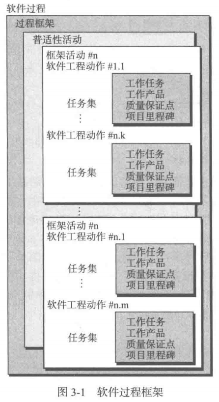
软件工程示意图如左所示，可以看出没个框架活动由一些列软件工程动作构成；每个软件工程动作由任务集来定义，这个任务集明确了将要完成的工作任务，将要产生的工作产品，所需要的质量保证点，以及用于表明过程状态的里程碑

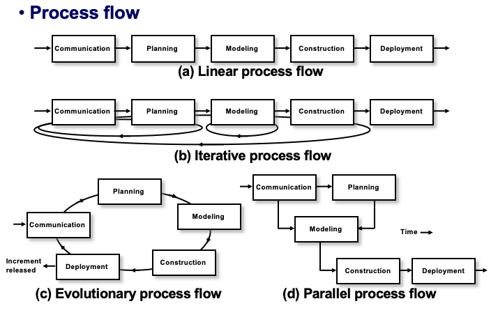
- *线性过程流 (linear process flow)* ：从沟通到部署顺序执行五个框架活动
- *迭代过程流 (iterative process flow)* ：在执行下一个活动前重复执行之前的一个或多个活动
- *演化过程流 (evoluntionary process flow)* ：采用循环的方式执行各个活动，每次循环都能产生更为完善的软件版本
- *并行过程流 (parallel process flow)* ：讲一个或多个活动与其他活动并行执行

---

## 3.2 Process Patterns

**Ambler[Amb98]** 提出了下面的过程模式的描述模版
*模式名称 (pattern name)*：表述改模式在软件过程中的含义
*驱动力 (intent)*：模式的使用环境以及主要问题
*类型 (type)*：定义模式类型
- 步骤模式 (task pattern)：定义了与过程的框架活动相关的问题。由于框架活动包括很多动作和工作任务，因此步骤模式包括与步骤有关的许多任务模式
- 任务模式 (stage pattern)：定义了与软件工程动作或是工作任务相关、关系软件工程实践成败的问题
- 阶段模式 (phase pattern)：定义在过程中发生的框架活动序列，即使这些活动流本质上是迭代的

*启动条件 (initial contex)*：模式应用的前提条件

*问题 (problem)*：模式将要解决的问题

*解决方案 (solution)*：如何成功实现模式

*结果 (resulting context)*：描述模式成功执行之后的结果

*相关模式 (related patterns)*：以层次化或其他图的方式列举与该模式相关的其他过程模式

*已知应用和实例 (known uses/examples)*：说明改模式可应用的具体实例

---

## 3.3 Process Asesment

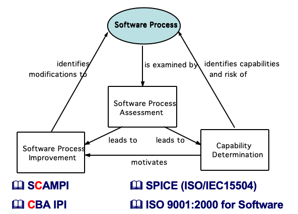

---

## 3.4 The Capabbility Maturity Model Integration

Defined by Software Engineering Institute of Carneigie Mellon University

- *Level 0*: Incomplete (process is not performed or does not achieve all goals defined for this level)
- *Level 1*: Performed (work tasks required to produce required work products are being conducted) 
- *Level 2*: Managed (people doing work have access to adequate resources to get job done, stakeholders are actively involved, work tasks and products are monitored, reviewed, and evaluated for conformance to process description) 
- *Level 3*: Defined (management and engineering processes documented, standardized, and integrated into organization-wide software process) 
- *Level 4*: Quantitatively Managed (software process and products are quantitatively understood and controlled using detailed measures) 
- *Level 5*: Optimizing (continuous process improvement is enabled by quantitative feedback from the process and testing innovative ideas) 

---

# Chapter 4 Process Models

## 4.1 Prescriptive Models

**瀑布模型 (waterfall model)**

又称为经典生命周期，他提出了一个系统的、顺序的软件开发方法。

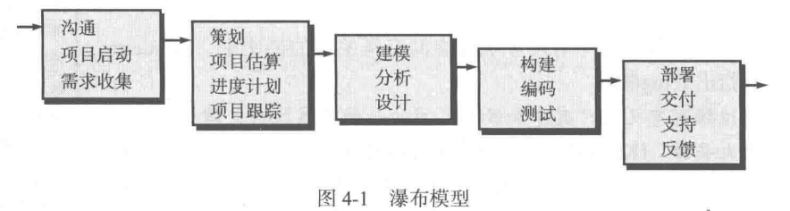 

---

**V模型 (V model)**

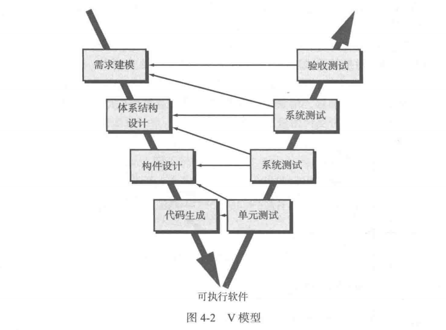

V模型是瀑布模型的一个变体。V模型描述了质量保证动作同沟通、建模相关动作以及早期构建相关的动作之间的关系。随着软件团队工作沿着V模型左侧步骤向下推进，基本问题需求逐步细化，形成了对问题及解决方案的详尽技术性的描述。一旦编码结束，团队沿着V模型右侧的步骤向上推进，其实本质上是就行了一系列测试，实际上验证了左侧过程中的每个模型。

---

**增量过程模型**

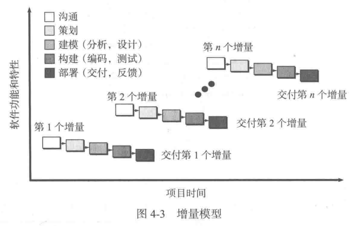

增量模型综合了上一章讨论的线性过程流和并行过程流的特征。随着时间推移，增量模型在每个阶段都运用线性序列。每个线性序列生产出软件可交付增量。在这个模型中，第一个增量往往是*核心产品 (core product)*，也就是满足了基本需求，但是许多附加的特性需要在后续的增量中不断添加。

---

**原型开发范型 (prototyping paradigm)**

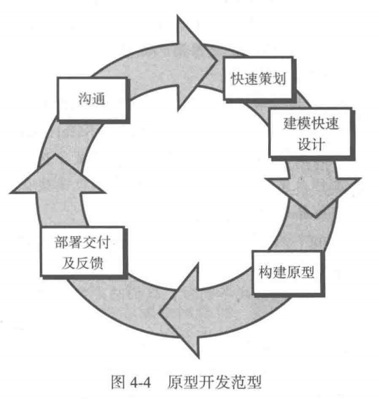

原型开发范型开始与沟通，明确已知需求之后迅速策划一个原型开发迭代并进行建模。快速设计要集中在那些最终用户能够看到的方面，由快速设计产生一个原型（一般会被丢弃）。对原型进行部署，最后由利益相关这进行评估，更具利益相关者的反馈信息，进一步提炼需求，采用迭代技术一步步完成最终软件。

---

**螺旋模型 (Spiral Model)**

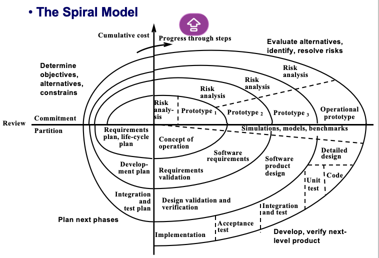

螺旋模型是一种风险驱动型的过程模型生成器，对于软件集中的系统，他可以指导多个利益相关者的协同工作。它的特点是：
1. 采用循环的方式逐步加深系统定义和实现的深度
2. 确定一系列里程碑作为支撑点，确保利益相关者认可是可行的切令各方满意的系统的解决方案

螺旋模型中每个框架活动代表螺旋上的一个片段，从圆心开始顺时针方向，软件团队执行螺旋上的一圈所表示的活动，在每次演进的过程中都要考虑风险。*螺旋模型是开发大型系统和软件的很实际的方法。*

---

**并发开发模型 (concurrent develpoment model)**

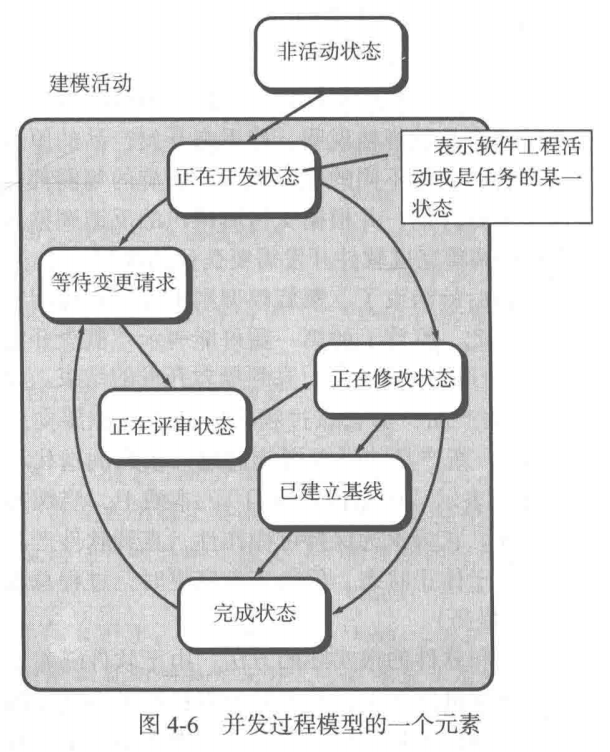

并发开发模型允许软件团队表述本章所描述的任何过程模型中的迭代元素和并发元素。在某一特定时间，建模活动可能处于图中所示的任何一种状态中，其他活动、动作或任务也可以用类似的方法表示。*并发模型建模可用于所有类型的软件开发*。

---

## 4.2 Specialized Process Models

**基于构件的开发模型 (component-based development model)**

其本质上是演化模型很类似于螺旋模型，需要以迭代的方式构建软件。但是不同的是，基于构件的开发模型采用预先打包的软件构件来开发应用系统。基于构件的开发模型能够使软件复用

**形式化方法模型 (formal method model)**

其主要活动是生成计算机软件形式化的数学规格说明。这使得软件开发人员可以应用严格的数学符号来说明、开发和验证基于计算机的系统。这对于一些高度关注安全的软件比较有效。

**面向方面的软件开发 (Aspect-Oriented Software Development, AOSD)**

面向方面的软件开发是一种比较新的软件工程模型，为定义、说明、设计和构建方面提供过程和方法。
## 4.3 The Unified Process

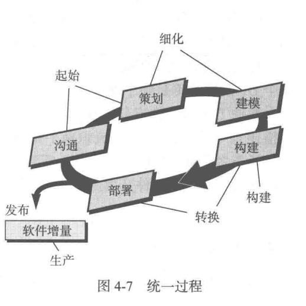

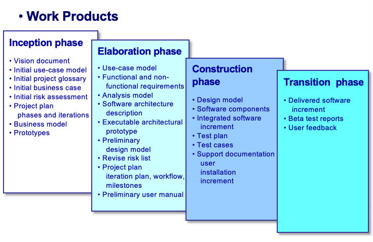

## 4.4 Personal and Team Process Models

**Personal Software Process (PSP)**

1. Planning
2. High-level design
3. High-level design review
4. Development
5. Postmortem

强调每个软件工程师都需要尽早发现错误，并且同样重要的是要了解错误的类型。

**Team Software Process (TSP)**

- 每个项目都是通过一个“脚本 (script)”来“启动 (launch)”的，该脚本明确了需要完成的任务。
- 团队是自主管理的 (Self-deirected)。
- 鼓励进行测量 (Measurement)。
- 会对所采取的措施进行分析，目的是改进团队流程。