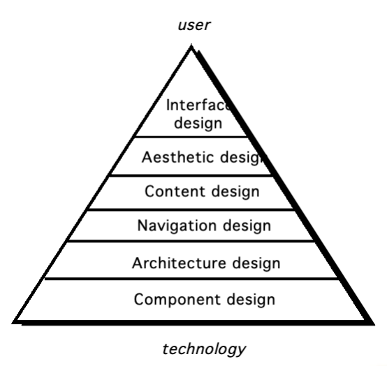
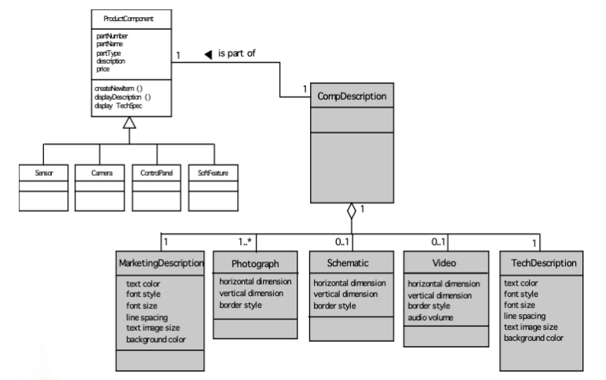
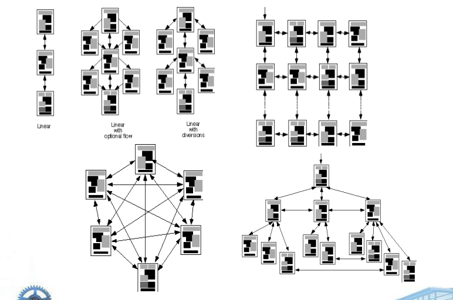
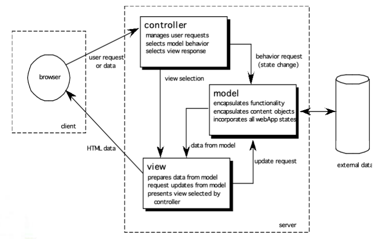
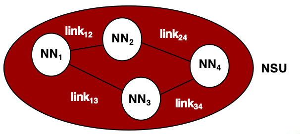
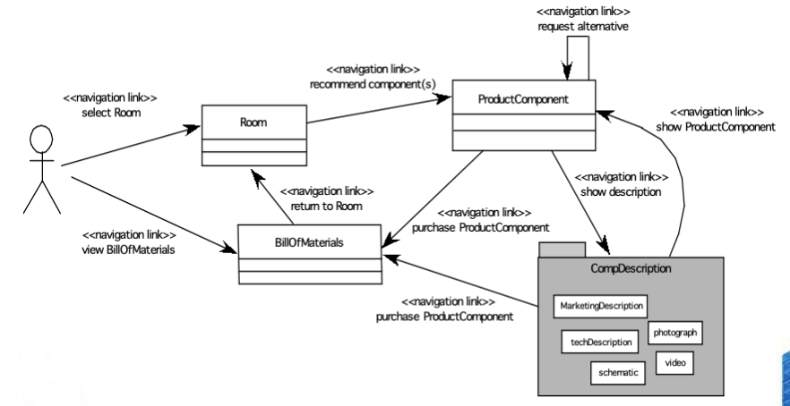

# Chapter 17 WebApp Design

There are essentially two basic approaches to design: the artistic ideal of expressing yourself and the engineering ideal of solving a problem for a customer.  
设计有两种基本思路：艺术式的自我表达，和工程式的解决客户问题。

**Jakob Nielsen**

## When should we emphasize WebApp design?

- when content and function are complex  
  当内容和功能很复杂时
- when the size of the WebApp encompasses hundreds of content objects, functions, and analysis classes  
  当 WebApp 包含大量内容对象、功能和分析类时
- when the success of the WebApp will have a direct impact on the success of the business  
  当 WebApp 的成败会直接影响业务成败时

## Design & WebApps

WebApp 设计要关注：

- business purpose：业务目标
- usability：可用性
- content structure：内容结构
- navigation：导航
- performance：性能
- security：安全

## Design & WebApp Quality

### Security

- Rebuff external attacks  
  抵御外部攻击
- Exclude unauthorized access  
  阻止未授权访问
- Ensure the privacy of users/customers  
  保护用户 / 客户隐私

### Availability

the measure of the percentage of time that a WebApp is available for use  
WebApp 可用于使用的时间占比。

### Scalability

Can the WebApp and the systems with which it is interfaced handle significant variation in user or transaction volume  
WebApp 及其交互系统能否承受用户量或事务量的大幅变化。

### Time to Market

Time to Market  
上线速度。

## Quality Dimensions for End-Users

### Time

- How much has a Web site changed since the last upgrade?  
  网站自上次升级后变化了多少？
- How do you highlight the parts that have changed?  
  如何突出变化部分？

### Structural

- How well do all of the parts of the Web site hold together.  
  网站各部分是否组织良好？
- Are all links inside and outside the Web site working?  
  网站内外链接是否都正常？
- Do all of the images work?  
  图片是否正常？
- Are there parts of the Web site that are not connected?  
  是否存在未连接的部分？

### Content

- Does the content of critical pages match what is supposed to be there?  
  关键页面内容是否符合预期？
- Do key phrases exist continually in highly-changeable pages?  
  高变化页面是否持续保留关键短语？
- Do critical pages maintain quality content from version to version?  
  关键页面是否在不同版本中保持内容质量？
- What about dynamically generated HTML pages?  
  动态生成的 HTML 页面如何保证内容质量？

### Accuracy and Consistency

- Are today’s copies of the pages downloaded the same as yesterday’s? Close enough?  
  今天下载的页面和昨天是否一致？
- Is the data presented accurate enough? How do you know?  
  页面数据是否足够准确？如何判断？

### Response Time and Latency

- Does the Web site server respond to a browser request within certain parameters?  
  服务器是否在可接受范围内响应请求？
- In an E-commerce context, how is the end to end response time after a SUBMIT?  
  在电商场景中，提交后的端到端响应时间如何？
- Are there parts of a site that are so slow the user declines to continue working on it?  
  是否有慢到让用户放弃继续使用的部分？

### Performance

- Is the Browser-Web-Web site-Web-Browser connection quick enough?  
  浏览器与 Web 站点之间的连接是否足够快？
- How does the performance vary by time of day, by load and usage?  
  性能会不会随时间、负载和使用量变化？
- Is performance adequate for E-commerce applications?  
  性能是否适合电商应用？

### Consistency

- Content should be constructed consistently  
  内容组织应保持一致
- Graphic design (aesthetics) should present a consistent look across all parts of the WebApp  
  视觉设计应在整个 WebApp 中保持一致
- Architectural design should establish templates that lead to a consistent hypermedia structure  
  架构设计应建立一致的超媒体结构模板
- Interface design should define consistent modes of interaction, navigation and content display  
  界面设计应定义一致的交互、导航和内容展示方式
- Navigation mechanisms should be used consistently across all WebApp elements  
  导航机制应在所有元素中一致使用

## WebApp Design Goals

- Identity：Establish an identity that is appropriate for the business purpose  
  建立符合业务目的的身份特征
- Robustness：The user expects robust content and functions that are relevant to the user’s needs  
  提供与用户需求相关的稳定内容和功能
- Navigability：designed in a manner that is intuitive and predictable  
  导航应直观且可预测
- Visual appeal：the look and feel of content, interface layout, color coordination, the balance of text, graphics and other media, navigation mechanisms must appeal to end-users  
  视觉效果要吸引用户
- Compatibility：With all appropriate environments and configurations  
  兼容合适的环境和配置

## WebApp Design Pyramid

## WebApp Interface Design

### Where am I?

The interface should provide an indication of the WebApp that has been accessed and inform the user of her location in the content hierarchy.  
界面应说明当前访问的是哪个 WebApp，并告诉用户自己处于内容层次中的什么位置。

### What can I do now?

The interface should always help the user understand his current options.  
界面应帮助用户理解当前可以做什么。

- what functions are available?  
  有哪些功能可用？
- what links are live?  
  哪些链接可点？
- what content is relevant?  
  哪些内容相关？

### Where have I been, where am I going?

The interface must facilitate navigation.  
界面必须方便导航。

- Provide a “map” of where the user has been and what paths may be taken to move elsewhere within the WebApp.  
  提供一张“地图”，说明用户去过哪里、还能走哪些路径。

## Interface Design Principles - I

- Anticipation：A WebApp should be designed so that it anticipates the user’s next move.  
  预判用户下一步操作。
- Communication：The interface should communicate the status of any activity initiated by the user  
  界面应传达用户发起的活动状态。
- Consistency：The use of navigation controls, menus, icons, and aesthetics (e.g., color, shape, layout)  
  导航控件、菜单、图标和美学风格要保持一致。
- Controlled autonomy：The interface should facilitate user movement throughout the WebApp, but it should do so in a manner that enforces navigation conventions that have been established for the application.  
  允许用户自由移动，但要遵守既定导航规范。
- Efficiency：The design of the WebApp and its interface should optimize the user’s work efficiency, not the efficiency of the Web engineer who designs and builds it or the client-server environment that executes it.  
  优化用户效率，而不是开发者或运行环境的效率。

## Interface Design Principles - II
- Focus：The WebApp interface (and the content it presents) should stay focused on the user task(s) at hand.  
  界面和内容应始终聚焦当前任务。
- Fitt’s Law：“The time to acquire a target is a function of the distance to and size of the target.”  
  Fitt 定律：获取目标的时间与目标距离和大小有关。
- Human interface objects：A vast library of reusable human interface objects has been developed for WebApps.  
  WebApp 有大量可复用的人机界面对象。
- Latency reduction：The WebApp should use multi-tasking in a way that lets the user proceed with work as if the operation has been completed.  
  通过多任务和异步方式减少延迟感。
- Learnability：A WebApp interface should be designed to minimize learning time, and once learned, to minimize relearning required when the WebApp is revisited.  
  尽量减少学习和再次学习成本。

## Interface Design Principles - III

- Maintain work product integrity：A work product (e.g., a form completed by the user, a user specified list) must be automatically saved so that it will not be lost if an error occurs.  
  自动保存，保证工作成果不丢失。
- Readability：All information presented through the interface should be readable by young and old.  
  界面信息应当易读。
- Track state：When appropriate, the state of the user interaction should be tracked and stored so that a user can logoff and return later to pick up where she left off.  
  适当记录状态，方便用户下次继续。
- Visible navigation：A well-designed WebApp interface provides “the illusion that users are in the same place, with the work brought to them.”  
  提供可见导航，让用户感觉始终在同一位置。

## Aethetic Design

- Don’t be afraid of white space.  
  不要害怕留白。
- Emphasize content.  
  突出内容。
- Organize layout elements from top-left to bottom right.  
  布局从左上到右下组织。
- Group navigation, content, and function geographically within the page.  
  在页面内按区域分组导航、内容和功能。
- Don’t extend your real estate with the scrolling bar.  
  不要依赖滚动条来扩展页面空间。
- Consider resolution and browser window size when designing layout.  
  设计布局时考虑分辨率和窗口大小。

## Content Design

Develops a design representation for content objects  
为内容对象建立设计表示。

For WebApps, a content object is more closely aligned with a data object for conventional software  
对 WebApp 来说，内容对象更接近传统软件中的数据对象。

Represents the mechanisms required to instantiate their relationships to one another.  
表示实例化对象之间关系所需的机制。

analogous to the relationship between analysis classes and design components described in Chapter 11  
类似第 11 章中分析类和设计组件之间的关系。

A content object has attributes that include content-specific information and implementation-specific attributes that are specified as part of design  
内容对象具有内容相关属性和设计阶段指定的实现相关属性。

## Design of Content Objects

 

## Content Architecture

## Architecture Design

**Content architecture** focuses on the manner in which content objects (or composite objects such as Web pages) are structured for presentation and navigation.  
内容架构关注内容对象（或网页等复合对象）如何组织，以便展示和导航。

The term information architecture is also used to connote structures that lead to better organization, labeling, navigation, and searching of content objects.  
信息架构也常用来表示能改善组织、标注、导航和搜索的结构。

**WebApp architecture** addresses the manner in which the application is structured to manage user interaction, handle internal processing tasks, effect navigation, and present content.  
WebApp 架构关注应用如何组织，以处理用户交互、内部处理、导航和内容呈现。

Architecture design is conducted in parallel with interface design, aesthetic design and content design.  
架构设计与界面设计、美学设计、内容设计并行进行。

## MVC Architecture

- The **model** contains all application specific content and processing logic, including all content objects, access to external data/information sources, all processing functionality that is application specific  
  Model 包含所有应用相关内容和处理逻辑。
- The **view** contains all interface specific functions and enables the presentation of content and processing logic, all processing functionality required by the end-user.  
  View 包含所有界面相关功能，并负责展示。
- The **controller** manages access to the model and the view and coordinates the flow of data between them.  
  Controller 管理对 Model 和 View 的访问，并协调数据流。

## Navigation Design

Begins with a consideration of the user hierarchy and related use-cases  
从用户层次和相关用例开始。

Each actor may use the WebApp somewhat differently and therefore have different navigation requirements  
不同角色对导航的需求可能不同。

As each user interacts with the WebApp, she encounters a series of navigation semantic units (NSUs)  
用户与 WebApp 交互时，会遇到一系列导航语义单元（NSU）。

a set of information and related navigation structures that collaborate in the fulfillment of a subset of related user requirements  
NSU 是一组信息及相关导航结构，用于完成一部分相关用户需求。

## Navigation Semantic Units

- Ways of navigation (WoN) represents the best navigation way or path for users with certain profiles to achieve their desired goal or sub-goal.  
  导航方式（WoN）表示特定用户实现目标的最佳路径。
- Composed of Navigation nodes (NN) connected by Navigation links  
  由导航节点（NN）和导航链接组成。

## Creating an NSU

## Navigation Syntax

常见导航语法包括：

- **Individual navigation** link—text-based links, icons, buttons and switches, and graphical metaphors..
单个导航链接：文本链接、图标、按钮和开关，以及图形隐喻。
- **Horizontal navigation** bar—lists major content or functional categories in a bar containing appropriate links. In general, between 4 and 7 categories are listed. 
水平导航栏：在一个包含适当链接的栏中列出主要内容或功能类别。一般列出 4 到 7 个类别。
- **Vertical navigation** column
    - lists major content or functional categories
    - lists virtually all major content objects within the WebApp.
垂直导航列：
    - 列出主要内容或功能类别
    - 列出 WebApp 中几乎所有主要内容对象。
- **Tabs**—a metaphor that is nothing more than a variation of the navigation bar or column, representing content or functional categories as tab sheets that are selected when a link is required.
标签：一种导航栏或列的变体，将内容或功能类别表示为选项卡，当需要链接时选择。
- **Site maps**—provide an all-inclusive tab of contents for navigation to all content objects and functionality contained within the WebApp.
站点地图：提供一个包含 WebApp 中所有内容对象和功能的目录标签。

## Component-Level Design

WebApp components implement the following functionality
- perform localized processing to generate content and navigation capability in a dynamic fashion
执行本地化处理，以动态方式生成内容和导航功能
- provide computation or data processing capability that are appropriate for the WebApp’s business domain
提供适用于 WebApp 所在业务领域的计算或数据处理能力
- provide sophisticated database query and access
提供复杂的数据库查询和访问功能
- establish data interfaces with external corporate systems.
建立与外部企业系统的数据接口。
