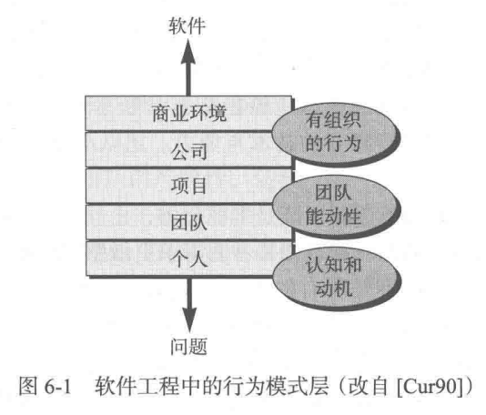
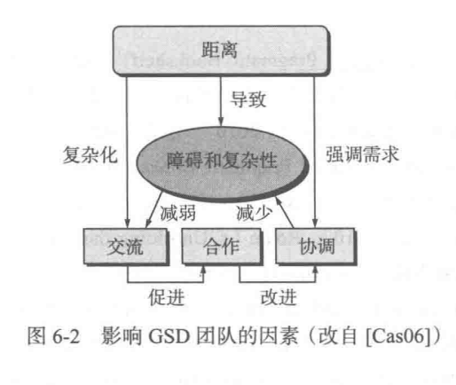

# Chapter 6 Human Aspects of Software Engineering

## 6.1 Characteristics of a Software Engineer

- Sense of individual responsibility（责任心）
- Acutely aware of the needs of team members and stakeholders （敏锐意识）
- Brutally honest about design flaws and offers constructive criticism（勇于承认错误，建设性意见）
- Resilient under pressure （抗压）
- Heightened sense of fairness（公正）
- Attention to detail （细度）
- Pragmatic（实在）

---

## 6.2 The Psychology of Software Engineering

在**个人层面**，软件工程心理学注重待解决的问题、解决问题所需的技能以及在模型外层建立的限制内解决问题的动机。

在**团队和项目层面**，团队能动性成为主要因素，成功是由团队结构和社会因素决定的，团队交流、合作和协调同担个团队成员的技能同等重要

在**外部层面**，“跨界角色”能让软件团队成员在不同团队之间有效推进工作

- *外联员 (Ambassador)*：代表团队就时间和资源问题与外部的客户谈判，取得利益相关者的反馈
- *侦察员 (Scout)*：突破团队界限收集组织信息，包括审视外部市场，寻求新技术，确定团队外界的相关活动，弄清潜在对手的活动
- *守护员 (Guard)*：保护团队工作产品和其他信息产品
- *安检员 (Sentry)*：把控利益相关者和他人向团队传送的信息
- *协调员 (Coordinator)*：注重横跨团队及组织内部的交流

---

## 6.3 The Software Team

**Effective Software Team Attributes**
- Sense of purpose
- Sense of involvement
- Sense of trust
- Sense of improvement
- Divesity of team member skill sets

**Avoid Team Toxicity**

- A frenzied work atmosphere in which team members waste energy and lose focus on the objectives of the work to be performed.*目标混乱，氛围凝固*
- High frustration caused by personal, business, or technological factors that cause friction among team members.*矛盾重重，高度沮丧*
- “Fragmented or poorly coordinated procedures” or a poorly defined or improperly chosen process model affecting accomplishment.*管理不善，协同困难*
- Unclear definition of roles resulting in a lack of accountability and resultant finger-pointing.分工不明，相互指责
- “Continuous and repeated exposure to failure” that leads to a loss of confidence and a lowering of morale. *连续失败，信心缺失*

---

## 6.4 Team Structures

**决定团队结构时需要考虑的项目因素**
- 需解决问题的难度
- 基于代码行或功能点的结果程序的规模
- 团队成员合作的时间
- 问题可模块化的程度
- 所建系统的质量和可靠性
- 交付日期要求的严格程度
- 项目所需的社会化程度

**Constantine针对软件工程提出的四种组织模式**
- 封闭模式 (Closed paradigm)：遵循传统的权利层级模式。
- 随机模式 (Random paradigm)：松散的组织，依靠团队成员的个人自发性。
- 开放模式 (Open paradigm)：既具有封闭模式团队的可控性，还具有随机模式团队的创新性。但效率没有其他团队高
- 同步模式 (Synchronous paradigm)：团队的划分依赖于问题的自然区分，不用很多交流就可以讲成员组织起来解决问题

---

## 6.5 Agile Teams

**通用敏捷团队 (Generic Agile Team)**

- 将个人能力与团队协作相结合，成为关键的成功因素
- 人比流程更重要，政治也可能胜过人
- 敏捷团队具有自我组织性，并拥有多种结构
    - 一种适应性的团队结构
    - 采用了康斯坦丁的随机、开放和同步结构的元(Constantine’s random open, and synchronous )
    - 具有很大的自主权 (Significant autonomy)
- 计划被控制在最低限度，仅受业务需求和组织标准的约束

**极限编程团队 (eXtreame Programming Team, XP Team)**

- **Communication** – close informal verbal communication among team members and stakeholders and establishing meaning for metaphors as part of continuous feedback
- **Simplicity** – design for immediate needs nor future needs
Feedback – derives from the implemented software, the customer, and other team members
- **Courage** – the discipline to resist pressure to design for unspecified future requirements (超前设计的勇气)
- **Respect** – among team members and stakeholders

---

## 6.6 Impact of Social Media

- **博客 (Blogs)** – can be used share information with team members and customers
- **微博 (Microblogs)** – allow posting of real-time messages to individuals following the poster (e.g. Twitter) 
- **Targeted on-line forums** – allow participants to post questions or opinions and collect answers
- **社交网站 (Social networking sites)** – allows connections among software developers for the purpose of sharing information (e.g. Facebook, LinkedIn) 
- **网址收藏夹网站 (Social book marking)** – allow developers to keep track of and share web-based resources (e.g. Delicious, Stumble, CiteULike) 

---

## 6.7 Software Engineering using the Cloud

**优点**
- 提供对所有软件工程工作成果的访问权限
- 消除设备依赖性，可在任何地方使用
- 为软件的分发和测试提供途径
- 使由一名成员开发的软件工程信息能够为所有团队成员所使用

**缺点**
- 将云服务分散到软件团队无法控制的环境中可能会带来可靠性和安全性方面的风险
- 当大量云服务被分散部署时，出现互操作性问题的可能性会大大增加
- 云服务会强调易用性和性能，而这往往与安全性、隐私性和可靠性相冲突

---

## 6.8 Collaboration Tools

**Sevice of Collaborative Development Environments (CDEs)**

- **命名空间 (Namespace)**：使项目团队可以用加强安全性和保密性的方式存储工作产品和其他信息，仅允许有权限的人访问
- **进度表 (Calendar)**：协调会议和其他项目事件
- **模版 (Templates)**：使团队成员在创造工作产品时保持一致的外形和结构
- **度量支持 (Metrics support)**：可以量化每个成员的贡献
- **交流分析 (Communication analysis)**：跟踪整个团队的交流并分离出模式，应用于需要解决的问题或状况
- **工作收集 (Artifact clustering)**：展示工作成果之间的依赖关系

---

## 6.9 Global Teams

对于所有软件团队来说，决策问题因一下即四个元素变得复杂：
- 问题的复杂性
- 与决相关的不确定性和风险
- 结果不确定法则
- 对问题的不同看法才是导致不同结论的关键

对于 全球化软件开发团队 (GSD)， 协调、合作和沟通方面的挑战对决策具有深远的影响

---

# Chapter 22 Project Management Concepts

