# Chapter 8 Understanding Requirements

## Requirements Engineering

**需求工程**是指致力于不断理解需求的大量任务和技术。需求工程在设计和构建之间建立起联系的桥梁。

**起始阶段 (Inception)**: 通过一系列问题建立四个基础认知
- 对待解决问题的基本理解。(basic understanding of the problem)
- 需求提出方（需要解决方案的人）的信息。 (the people who want a solution)
- 期望的解决方案的本质特征。(the nature of the solution that is desired)
- 客户与开发者之间初步沟通和协作的有效性。

**获取 (Elicitation)**: 从所有利益相关者处收集需求。 (elicit requirements from all stakeholders)

**细化 (Elaboration)**: 创建一个分析模型，识别数据、功能和行为需求。(create an analysis model that identifies data, function and behavioral requirements)

**协商 (Negotiation)**: 就可交付系统达成一致，该系统对开发者和客户来说都是现实的。(agree on a deliverable system that is realistic for developers and customers)

**规格说明 (Specification)**: 规格说明可以是一份写好的文档，一套图形化的模型，一个形式化的数学模型，一组使用场景，一个原型或上述各项的任意组合。

**确认 (Validation)**: 在确认这一步将对需求工程的工作产品进行质量评估。需求确认要检查规格说明以保证：
- 已无歧义地说明了所有的系统需求
- 已检测出不一致性、疏忽和错误并予以纠正
- 工作产品符合为过程、项目和产品建立的标准

正式的技术评审是最主要的需求确认机制。确认需求的评审小组包括软件工程师、客户、用户和其他利益相关者

**需求管理 (Requirements Management)**: 对于基于计算机的系统，其需求会变更，而且变更的要求贯穿于系统的整个生命周期。

---
## 建立根基 (Inception)

**确认利益相关者**：利益相关者是“直接或间接地从正在开发的系统中获益的人”，比如业务运行管理人员，产品工程师，最终用户，软件工程师。

**识别多重的观点**：存在很多不同的利益相关者，所以系统需求调研也将从很多不同的视角开展。

**协同合作 (Collaboration)**：需求工程是的工作是表示公共区域和矛盾区域。

**首次提问 (The first set of context-free questions)**: 
- 在项目最开始的提问应该是“与环境无关的”。比如：谁是这项工作的最初请求者？谁将使用该解决方案？
- 下一组问题有助于软件开发组更好地理解问题，并允许客户表达其对解决方案的看法。比如：该解决方案强调解决了什么问题？存在将影响解决方案的特殊的性能问题或约束吗。
- 最后子组问题关注沟通活动本身的效率，比如：我的提问和你想解决的问题相关吗？我的问题是否太多了？

---
## 获取需求 (Elicitation)

**协作收集需求 ()

---
## 质量功能部署 Quality Function Deployment (QFD)

**质量功能部署 Quality Function Deployment (QFD)**是一种将客户要求转化成软件技术需求的技术。

**四大核心部署维度**：
- *功能部署 (Function Deployment)*：确定系统每项功能的客户感知价值
- *信息部署 (Information Deployment)*：识别数据对象和事件
- *任务部署 (Task Deployment)*：分析系统行为
- *价值分析 (Value Analysis)*：确定需求的相对优先级

**按 QFD 划分的三类需求**：
- *常规需求（Normal）*  ：客户明确提出的基础需求
- *期望需求（Expected）* ：客户默认应该具备、未明确提出的需求
- *令人惊喜的需求（Exciting）* ：超出客户预期、能提升产品价值的需求

---
## 非功能需求 Non-Functional Requirements (NFR)

**非功能需求 Non-Functional Requirements (NFR)** 定义：质量属性、性能属性、安全属性或通用系统约束 quality attribute, performance attribute, security attribute, or general system constraint（区别于 “做什么” 的功能需求，聚焦 “做得怎么样”）

非功能需求兼容性判定的两阶段流程：
- *第一阶段*：构建矩阵，以各非功能需求为列标题，系统工程（SE）准则为行标签
- *第二阶段*：团队通过决策规则对非功能需求优先级排序，将每对 NFR 与准则划分为互补、重叠、冲突、独立 (complementary, overlapping, conflicting, or independent)四类，确定可实现的 NFR

---
## 获取工作产品 Elicitation Work Products

- 要求和可行性陈述
- 系统或产品范围的界限说明
- 参与需求获取的客户、用户和其他相关利益者的名单
- 系统技术环境的说明
- 需求列表以及每个需求适用的领域限制
- 一系列使用场景，有助于深入了解系统或产品在不同运行环境下的使用
- 任何能够更好的定义需求的原型

---
## 用例 Use Cases

**用例**定义：描述系统使用流程的用户场景集合，是需求建模的核心工具。 A collection of user scenarios that describe the thread of usage of a system.

**用例的视角**：从参与者（Actor） 出发（参与者为与软件产生交互的人 / 设备）

**每个用例需回答的核心问题：**
- 主要参与者、次要参与者是谁？
- 参与者的目标是什么？
- 场景开始前的前置条件是什么？
- 参与者执行的主要任务 / 功能有哪些？
- 场景描述中可考虑哪些扩展情况？
- 参与者与系统的交互有哪些可能的变化？
- 参与者将从系统获取、生成或修改哪些信息？
- 参与者是否需要向系统告知外部环境的变化？
- 参与者希望从系统获取什么信息？
- 参与者是否希望被通知意外的变化？

---
## Example -- SafeHome

给出需求工程的实操案例，明确 SafeHome 系统的市场背景与核心需求：
- *市场背景*：家庭安防系统市场年增长率 40%，拟切入该市场
- *产品定位*：基于微处理器的家庭安防系统
- *核心功能*：检测非法入侵、火灾、洪水等异常情况；支持房主编程；异常时自动向监控机构拨打电话
- *技术基础*：通过各类传感器检测异常情况

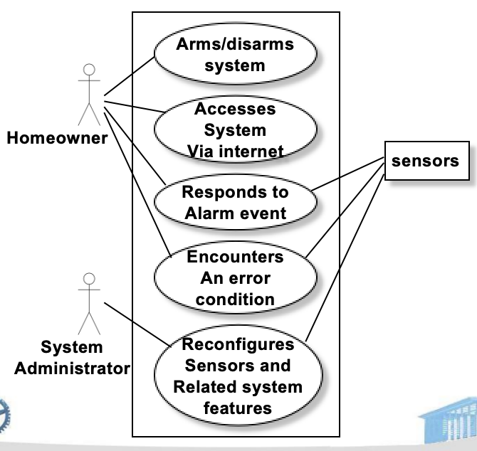

**用例图的核心作用**：可视化展示参与者与系统的交互关系，明确系统的核心功能边界。

---
## 构建分析模型 Building the Analysis Model

**分析模型定义**：需求精化阶段的核心产物，是对需求的结构化、可视化建模，包含四大核心要素：
- *基于场景的要素 (Scenario-based elements)*：用例、用例图，及特定场景内的活动序列
- *基于类的要素 (Class-based elements)*：类图（描述系统中的对象、属性及对象间关系）
- *行为要素 (Behavioral elements)*：状态图（描述系统 / 对象的状态变化及触发条件）
- *面向流的要素 (Flow-based elements)*：数据流图（描述系统中数据的流动、处理与存储）

---
## Class Diagram

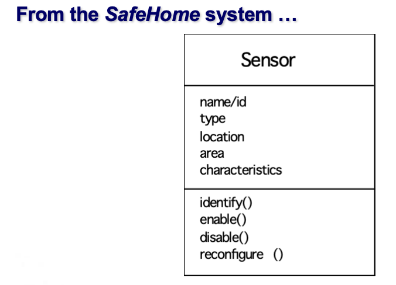

类图的核心作用：从面向对象的角度，拆解系统的核心实体（类）、属性和关联关系，是需求精化的重要可视化工具。

---
## State Diagram

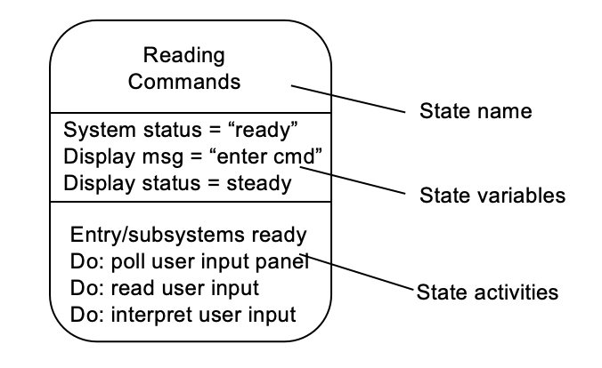

**状态图**定义：描述系统 / 对象在不同状态间的转换，及触发转换的事件、执行的活动
以 “读取命令” 场景为例，展示状态图的核心组成部分：
- *状态名称*（如 “ready”）
- *状态变量*（如 Display msg = “enter cmd”、Display status = steady）
- *状态活动*（如 poll user input panel、read user input、interpret user input）
- *前置条件*（Entry/subsystems ready）

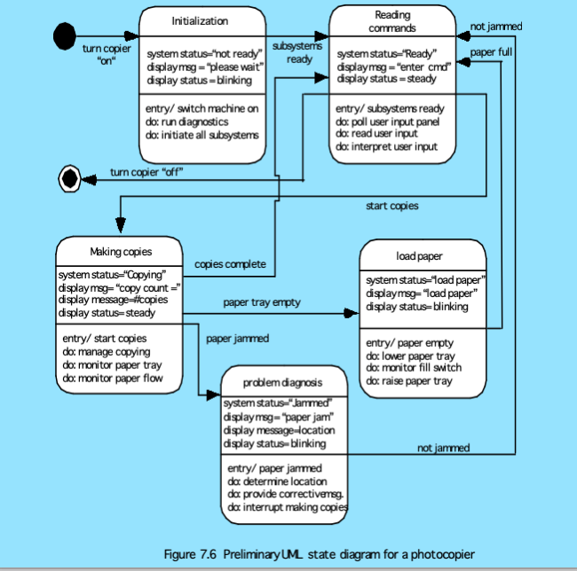

---
## 分析模式 Analysis Patterns

**分析模式**定义：对常见需求问题的通用解决方案，可复用在同类系统的需求建模中，提升建模效率

分析模式的组成：
- *模式名称 (Pattern name)*：提炼模式核心内涵的描述符
- *意图 (Intent)*：说明模式的实现目标 / 代表意义
- *动机 (Motivation)*：通过场景说明模式如何解决问题
- *约束与上下文 (Forces and Context)*：描述影响模式使用的外部因素，及模式能解决的外部问题
- *解决方案 (Solution)*：说明模式的应用方式，重点强调结构和行为问题
- *结果 (Results)*：说明应用模式后的效果，及应用过程中的权衡点
- *设计 (Design)*：探讨如何通过已知的设计模式实现该分析模式
- *实际应用 (Known Uses)*：该模式在实际系统中的应用案例
- *相关模式 (Related Patterns)*：与本模式关联的其他分析模式（联用、结构相似、变体）

---
## 需求协商 (Negotiating Requirements)

**需求协商的目标**：解决利益相关者的需求冲突，达成双赢的需求方案（避免因需求分歧导致项目失败）

**需求协商的步骤**：
- 识别关键利益相关者（协商参与方）。Identify the key stakeholders
- 确定各利益相关者的 “胜利条件”（核心诉求，往往不明显）。Determine each of the stakeholders “win conditions”
- 开展协商：制定满足多方核心诉求的需求集。Negotiate
- 重要提示：若不同客户 / 用户无法就需求达成一致，项目失败的风险会极高。

---
## 需求验证 (Validating Requirements)

**需求验证的核心**：通过一系列问题评审需求的合理性、完整性、一致性，排除无效 / 不切实际的需求

*第一组验证问题*：
- 每项需求是否与系统 / 产品的整体目标一致？
- 所有需求的抽象层次是否恰当？（是否存在过早加入技术细节的需求）
- 该项需求是否真的必要？（是否为非核心的附加功能）

*第二组验证问题（聚焦需求的明确性、可实现性、可测试性）*：
- 每项需求是否边界清晰、无歧义？
- 每项需求是否有归属？（是否标注具体的需求提出方）
- 是否存在需求间的冲突？
- 每项需求在系统的技术环境中是否可实现？
- 每项需求实现后是否可测试？

*第三组验证问题（聚焦需求模型的完整性与合理性）*：
- 需求模型是否准确反映了待构建系统的信息、功能和行为？
- 需求模型是否进行了分层拆解？（是否逐步暴露系统的详细信息）
- 是否使用需求模式简化需求模型？所有模式是否经过验证？是否与客户需求一致?

---
## 需求监控 (Requirements Monitoring)

需求监控的适用场景：*增量开发模式 (incremental development)* 中尤为重要（增量开发中需求易迭代，需持续监控）
需求监控的五大核心维度及目标：
- 分布式调试 (Distributed Debugging)：发现错误并确定错误原因
- 运行时验证 (Runtime Verification)：验证软件是否符合需求规格说明
- 运行时确认 (Runtime Validation)：评估迭代中的软件是否满足用户目标
- 业务活动监控 (Business Activity Monitoring)：评估系统是否满足业务目标
- 演化与协同设计 (Evolving and Collaborative Design)：在系统演化过程中向利益相关者提供实时信息

---
# Chapter 9 Requirements Modeling: Scenario-Based Methods

## 需求分析 (Requirements Analysis)

**需求分析的目标 (objective)**：
- 描述客户的需求（Describe what the customer requires）；
- 为软件设计的创建奠定基础（Establish a basis for the creation of a software design）；
- 定义一套可验证的需求集（Define a set of requirements that can be validated）。

需求分析对软件工程师的价值：
- *细化 (elaborate)* 在早期需求工程任务中确立的基础需求；
- 构建模型，描绘用户场景、功能活动、问题类及其关系、系统和类的行为、数据转换的流程、软件必须满足的约束条件。

---
## A Bridge

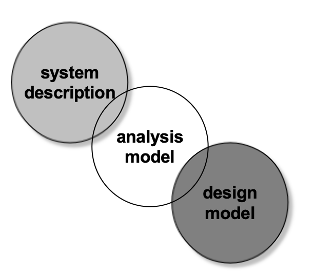

*需求分析模型（analysis model）* 是系统描述和软件设计模型之间的 “桥梁”。即通过对实际系统的业务、需求进行描述和分析，构建需求分析模型，再基于该模型开展软件设计，实现从 “业务域” 到 “设计域” 的过渡，是需求到设计的核心衔接载体。

---
## Rules of Thumb

明确需求分析模型的构建准则，核心围绕聚焦业务、价值导向、简洁低耦展开：
- 模型应聚焦问题域 / 业务域内可见的需求，抽象级别应相对较高（不纠结技术细节，先抓业务核心）；
- 分析模型的每个元素都应助力对软件需求的整体理解，并揭示系统的信息域、功能和行为；
- 将基础设施和其他非功能模型的考量推迟到设计阶段（需求分析先定 “做什么”，设计再定 “怎么做”）；
- 在整个系统中最小化耦合（降低模块 / 元素之间的依赖，提升系统灵活性）；
- 确保分析模型为所有利益相关者提供价值（满足客户、开发团队、运维等各方的需求和理解）；
- 让模型尽可能简单（避免过度建模，降低沟通和维护成本）。

---
## 邻域分析 (Domain Analysis)

*领域分析的目标 (Goal)*：软件领域分析是从特定应用领域中识别、分析和规范通用需求，通常用于该领域内多个项目的需求复用。

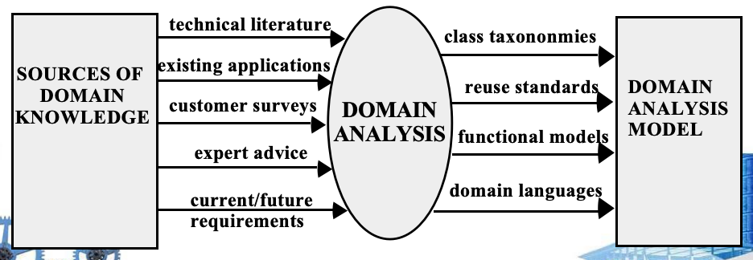

获取领域知识 / 需求的 5 大来源：
- technical literature（技术文献）；
- existing applications（现有应用系统）；
- customer surveys（客户调研）；
- expert advice（专家建议）；
- current/future requirements（当前 / 未来的需求）。

列出领域分析模型的核心输出物，即领域分析后形成的 4 类模型 / 规范：
- class taxononmies（类分类法，指领域内的类层级 / 分类体系）；
- reuse standards（复用标准，定义领域内需求、组件的复用规范）；
- functional models（功能模型，描绘领域内的通用功能）；
- domain languages（领域语言，构建领域内统一的沟通 / 描述语言，降低歧义）.

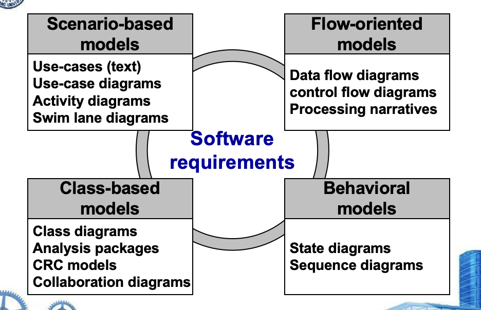

将软件需求的建模方法分为 4 大类，明确基于场景的模型是其中之一，并列出各类方法的核心工具：
1. **Scenario-based models（基于场景的模型）**
核心工具：Use-cases (text)（文本用例）、Use-case diagrams（用例图）、Activity diagrams（活动图）、Swim lane diagrams（泳道图）
2. **Class-based models（基于类的模型）**
核心工具：Class diagrams（类图）、Analysis packages（分析包）、CRC models（CRC 模型）、Collaboration diagrams（协作图）
3. **Flow-oriented models（面向流的模型）**
核心工具：Data flow diagrams（数据流图）、control flow diagrams（控制流图）、Processing narratives（处理说明）
4. **Behavioral models（行为模型）**
核心工具：State diagrams（状态图）、Sequence diagrams（时序图）

---
## 基于场景的建模 Scenario-Based Modeling

**基于场景建模的核心作用**：用例（Use-cases）是辅助定义系统外部存在的事物（参与者 actors） 和系统应执行的操作的工具。

**构建基于场景模型的 4 个核心问题**
- What should we write about?（我们应该描述什么内容？）
- How much should we write about it?（描述的篇幅 / 范围应该有多大？）
- How detailed should we make our description?（描述的详细程度应该如何？）
- How should we organize the description?（应该如何组织描述的结构？）

---
## Use Cases
**用例**是描述系统 **使用线程（thread of usage）** 的场景，即用户使用系统完成某一任务的完整过程。

**参与者（actors）**代表人员 / 设备在系统运行时所扮演的角色。

**特点：**对于一个给定的场景，用户可以扮演多个不同的角色。

用例是基于场景建模的核心工具，核心是 “角色 + 行为”，区别于 “用户” 和 “参与者”：用户是实际的人 / 设备，参与者是其在特定场景下的角色，一个用户可对应多个参与者，反之亦然。

---
## 开发用例的核心问题 (Developing a Use-Case)

通过 5 个核心问题，引导分析师挖掘用例的核心内容，确保用例能完整描述用户与系统的交互：
- 参与者执行的主要任务 / 功能是什么？
- 参与者将从系统获取、生成或修改哪些系统信息？
- 参与者是否需要向系统告知外部环境的变化？
- 参与者希望从系统中获取什么信息？
- 参与者是否希望被系统告知意外的变化？

---
## 评审用例 (Reviewing Use-Cases)

**用例的编写形式**:首先以叙述形式（narrative form） 编写，若需要规范性，再映射到统一的用例模板中。

**用例评审与优化的核心方向**对每个主场景（primary scenario） 进行评审和细化，挖掘备选交互场景，核心思考 3 个问题：
- 参与者在此节点是否可以采取其他操作？
- 参与者是否可能在此节点遇到错误条件？如果是，具体是什么？
- 参与者是否可能在此节点遇到其他行为？如果是，具体是什么？

---
## 活动和泳道图 (Activity and Swim Lane Diagrams)

**活动图（Activity diagram）的作用：** 对用例进行补充，为流程化操作提供图形化的表示，即把用例中的文字描述的交互过程，转化为步骤化的图形流程。

**泳道图（Swim lane diagram）的作用：** 在展示用例描述的活动流程的同时，明确每个活动的责任主体—— 即哪个参与者 / 分析类对该活动矩形描述的操作负责（适用于多参与者参与的用例）。

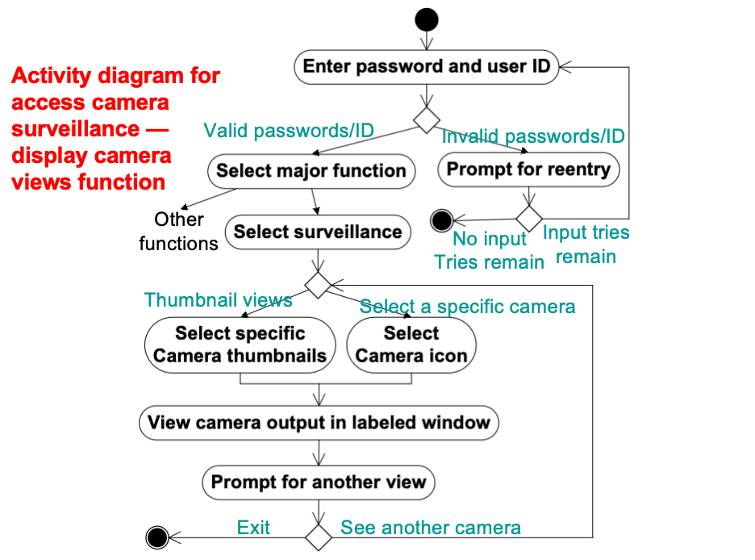 

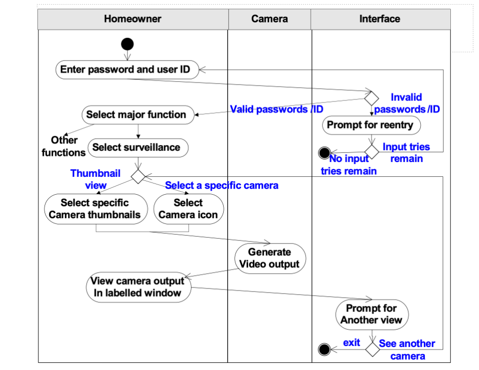

# Chapter 10 Requirements Modeling: Class-Based Methods

## Requiremets Modeling Strategies

**结构化分析（structured analysis）**：将数据和处理数据的过程视为独立实体
- 对数据对象 (Data objects) 建模：定义其属性和关系；
- 对处理过程 (Processes) 建模：展示数据对象在系统中流转时，过程如何对其进行转换。

**面向对象分析（object-oriented analysis）**：本章节核心方法，核心聚焦两点
- 定义系统中的类 (Classes)；
- 描述类之间如何协作 (Collaborate) 以实现客户的需求。

*两种策略的区别*：结构化分析“数据与过程分离”，面向对象分析“数据与操作封装为类，以类的协作为核心”。

---
## Object-Oriented Concepts

**关键概念**：是面向对象分析的基础，包含类与对象、属性与操作、封装与实例化、继承，这四个概念构成了基于类建模的核心理论支撑。

**核心任务**：基于类的需求建模需完成的核心工作，且所有任务需要迭代执行（面向对象开发的迭代特性）
- 识别类（及类的属性、方法）；
- 定义类的层次结构；
- 表示对象之间的关系；
- 对对象的行为进行建模。

---
## 类 (Classes)

**类的定义**：面向对象思维从定义类开始，类可被描述为模板（template）、通用描述（generalized description），是对一组相似事物的抽象描述。

**元类 / 超类（metaclass/superclass）**：用于建立类的层次结构，是父类的核心表述，为后续讲解类的继承、层级关系做基础。

**实例化**：当一个类被定义后，可创建该类的具体实例（instance）—— 即对象，类是抽象的，对象是类的具体表现。

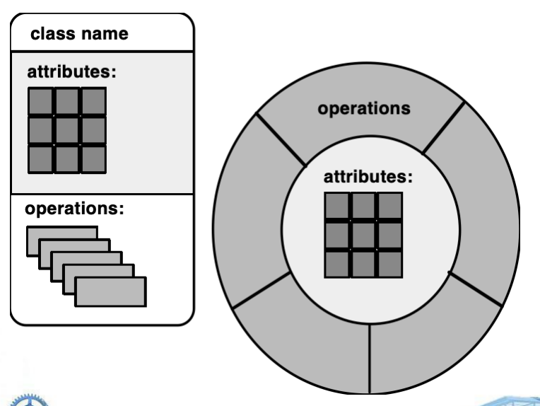

---
## 方法 (Methods)

**方法的别称**：也可称为*操作（operations）*或*服务（services）*。

**定义**：封装在类中的可执行过程，设计目的是对类中定义的一个或多个数据属性进行操作。

**调用方式**：通过 **消息传递（message passing）** 的方式被调用 —— 即对象之间通过发送消息，触发目标类 / 对象的对应方法执行。

---
## 封装和隐藏 (Encapsulation/Hiding)

**封装的本质**：对象将数据（属性）和操作数据的逻辑过程（方法）进行统一封装，使数据和方法成为一个不可分割的整体。

**核心价值**：实现信息隐藏（information hiding）—— 将类的内部数据和方法的实现细节隐藏，仅通过对外的接口与其他对象交互，降低类之间的耦合度。

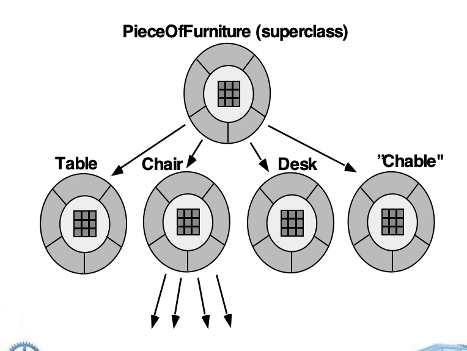

---
## 基于类的建模 (Class-Based Modeling)

基于类的建模是面向对象分析的核心手段，需完整描述系统的四大核心要素：
- 系统需要操作的对象（类的实例）；
- 用于操作对象的操作 / 方法 / 服务；
- 对象之间的关系（部分为层级关系，如继承）；
- 已定义类之间发生的协作（类如何配合完成系统功能）。

从问题陈述出发，逐步完成类的建模，核心步骤为：
1. 审查问题陈述，识别分析类（确定系统中需要的核心类）；
2. 使用 **语法解析（grammatical parse）** 的方式分离潜在的类（从需求文字中提取名词 / 名词短语，作为类的候选）；
3. 确定每个类的属性（类的静态特征）；
4. 确定操作类属性的操作 / 方法（类的动态行为）。

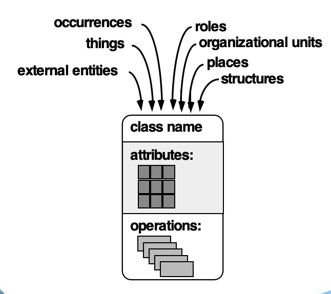

外部实体、物品、事件、角色、组织单元、地点、结构

---
## 潜在类的筛选标准 (Potential Classes)

- **保留信息 (retained information)**：是否包含系统需要保留的信息；
- **需要的服务 (needed services)**：是否提供系统需要的服务；
- **多个属性 (multiple attributes)**：是否具有多个属性；
- **共同属性 (common attributes)**：是否与其他类具有共同属性；
- **共同操作 (common operations)**：是否与其他类具有共同操作；
- **共同实例 (common instances)**：是否与其他类具有共同实例。

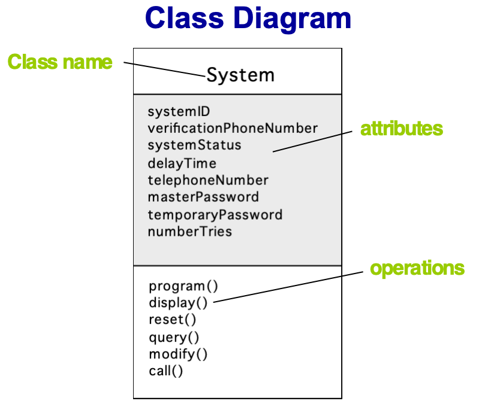

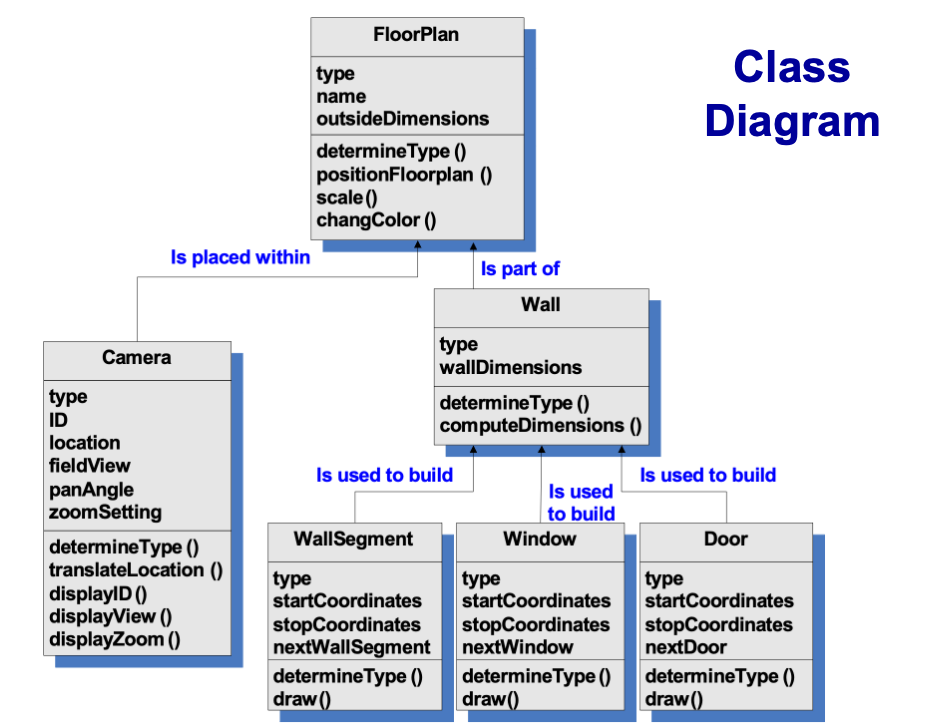

---
## Class-Responsibility-Collaborator (CRC) Models

**CRC 建模**：是基于类的需求建模的核心方法，以CRC 索引卡为工具，描述类的三大核心：类名、职责、协作方。

**职责（Responsibilities**）：类封装的属性和操作，即类“知道什么”（属性）和“能做什么”（操作）。

**协作方（Collaborators）**：为该类完成职责提供所需信息的其他类，协作的本质是信息请求或动作请求（类向协作方请求数据，或请求协作方执行某个操作）。

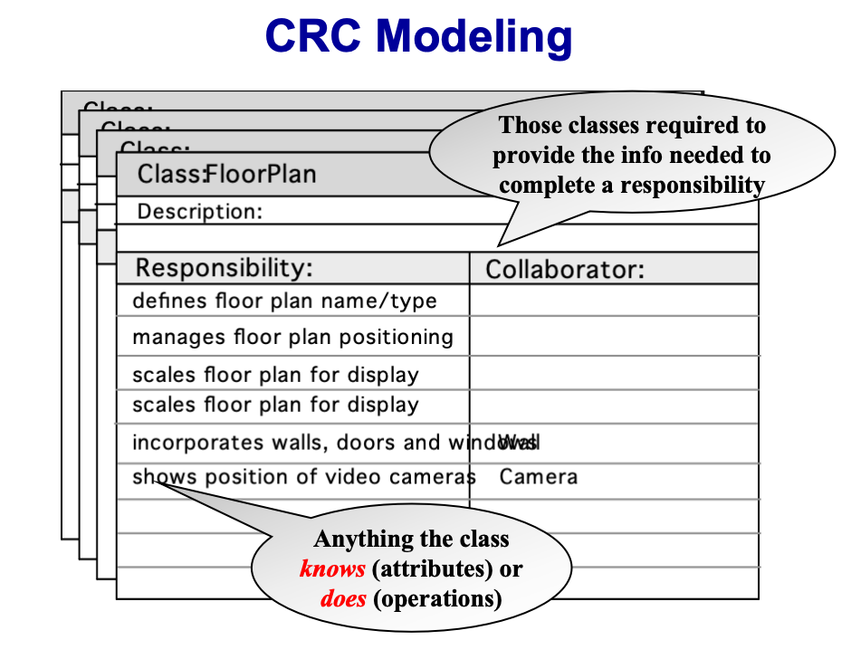

**职责**：类的核心能力，即类所知道的一切（属性）或类所做的一切（操作），是 CRC 卡的核心内容。
**协作方**：为该类完成某一职责，提供必要信息的所有类，强调“信息支撑”的核心作用。

---
## 类的分类 (Class Types)

- **实体类（Entity classes）**：也叫模型类 / 业务类，直接从问题陈述中提取，对应现实世界的业务实体（如客户、订单），是系统中存储业务数据的核心类。
- **边界类（Boundary classes）**：用于构建用户与系统的交互界面（如交互页面、打印报表），是系统与外部（用户 / 其他系统）的交互桥梁。
- **控制类（Controller classes）**：管理系统的一个工作单元，从开始到结束全程把控，核心作用包括：创建 / 更新实体对象、实例化边界对象、管理对象间复杂通信、验证对象 / 用户与应用之间的传输数据。

---
## 职责分配的指导原则 (Guidelines for Responsibility Assignment)

- 系统的智能应分散到各个类中，以更好地满足业务问题的需求；
- 每个职责的描述应尽可能通用（提升类的复用性）；
- 信息与其相关行为应归属于同一个类（高内聚原则，数据和操作数据的方法封装在一起）；
- 关于某一事物的信息应集中在单个类中，不分散到多个类（避免数据冗余和不一致）；
- 在合适的情况下，职责应在相关类之间共享（灵活适配业务需求）。

---
## 协作 (Collaborations)

类完成职责的两种方式：
- **自身完成**：使用类的自有操作操作自有属性，实现职责；
- **协作完成**：与其他类进行协作，借助外部类的信息 / 操作完成职责。

**协作的核心作用**：识别类之间的关系，是类建模的核心环节。

**三类通用协作关系**：
- **is-part-of**（是…… 的一部分）：整体 - 部分关系；
- **has-knowledge-of**（知晓……）：信息依赖关系；
- **depends-upon**（依赖……）：强依赖关系。

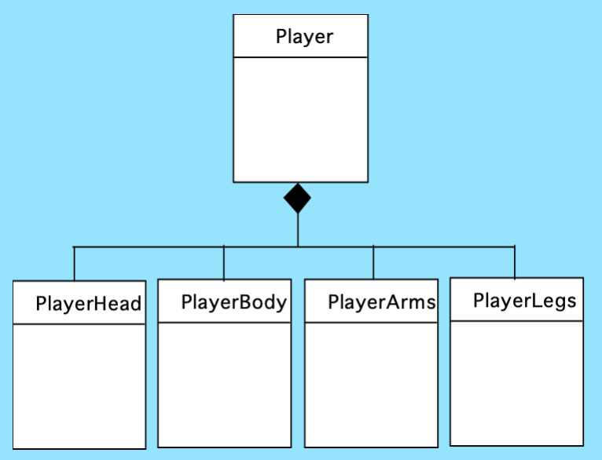

**组合聚合**：对应前文的 `is-part-of` 关系，是类之间的核心聚合关系，体现“整体 - 部分”的关联（如“汽车”是整体，“轮胎”是部分）。

---
## CRC 模型的评审 (Reviewing CRC Models)

CRC 模型建立后需通过评审验证合理性，评审基于用例场景，核心前期准备和步骤：
1. 给评审参与者分配部分 CRC 索引卡，协作的类卡需分发给不同人（避免单人主导，确保评审全面性）；
2. 将所有用例场景（及用例图）分类整理，作为评审的依据；
3. 评审负责人逐字朗读用例，当读到命名对象时，将“令牌”传递给持有对应类卡的参与者（触发类的职责讲解）。

**评审后续步骤**：当令牌传递后，类卡持有者需描述卡上的职责，评审小组共同判断该职责（或多个职责）是否能满足用例的需求。

**模型优化**：若 CRC 卡的职责和协作无法适配用例需求，需对模型进行修改，修改方式包括：
- 定义新的类（并制作对应的 CRC 卡）；
- 对现有卡的职责 / 协作进行新增或修订。

*CRC 模型评审是迭代过程，评审的核心目标是让模型完全匹配用例需求。*

---
## 关联与依赖 (Associations and Dependencies)

- **关联（Associations）**：UML 中类之间的基础关系，描述类之间的常规联系；可通过 **多重度（multiplicity）** 细化（数据建模中称为基数，描述类的实例之间的数量对应关系，如一对一、一对多）。
- **依赖（Dependencies）**：类之间的客户 - 服务端关系，即客户类在某方面依赖于服务端类，此时需建立依赖关系，是比关联更强的类关系。

---
## 多重度 (Multiplicity)

**多重度**：是对类关联关系的量化描述，用于表示一个类的多少个实例可以与另一个类的多少个实例建立关联。

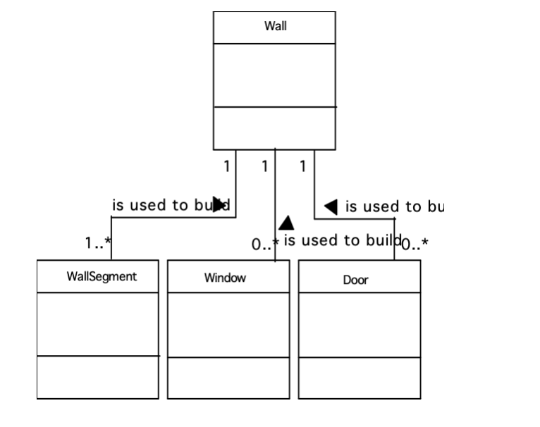

---
## 依赖 (Dependencies)

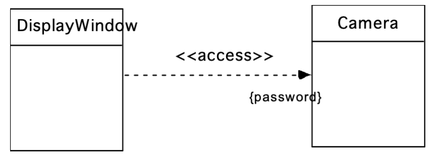

---
## 分析包 (Analysis Packages)

**分析包**：将分析模型的各类元素（如用例、分析类）按类别分组封装的单元，核心作用是模块化管理复杂的分析模型，降低模型的复杂度。

**可见性符号**：用于标识分析包内元素对外部的访问权限，是模块化设计的核心符号：
- **+（加号）**：公共可见性，元素可被其他包访问；
- **-（减号）**：私有可见性，元素对所有其他包隐藏；
- **#（井号）**：受保护可见性，元素仅能被所在包内的类访问。

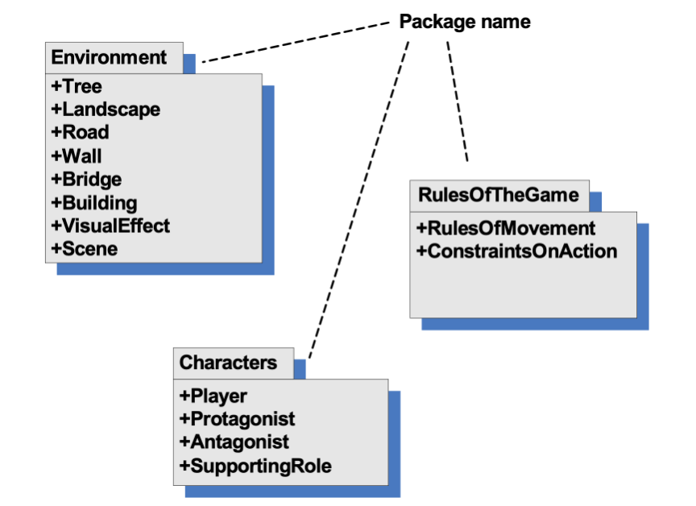