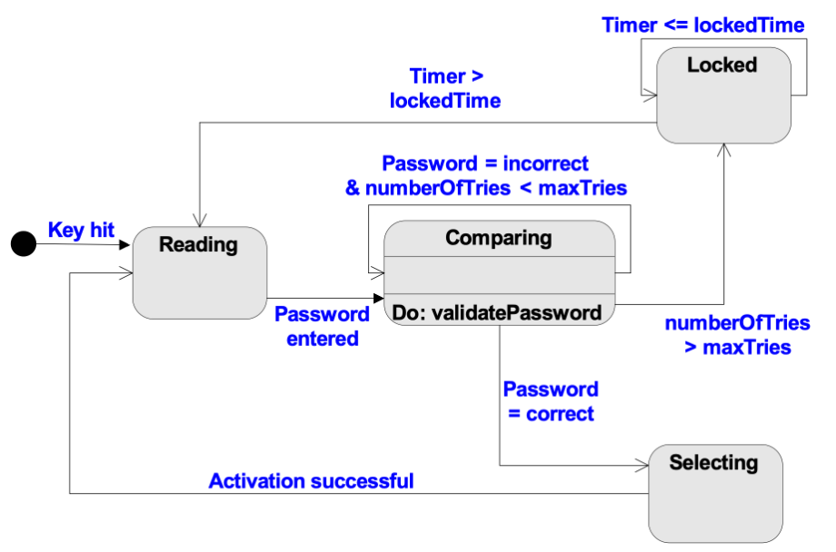
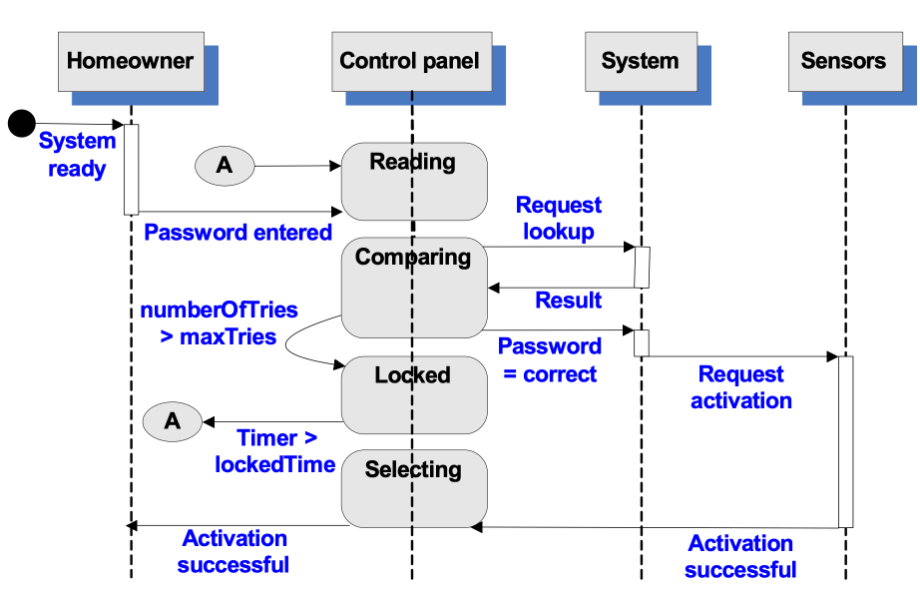
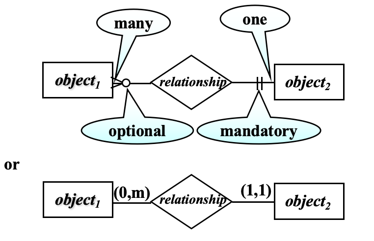
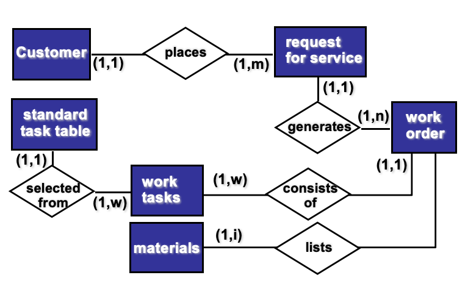
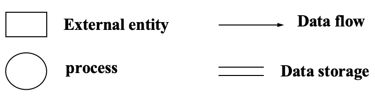
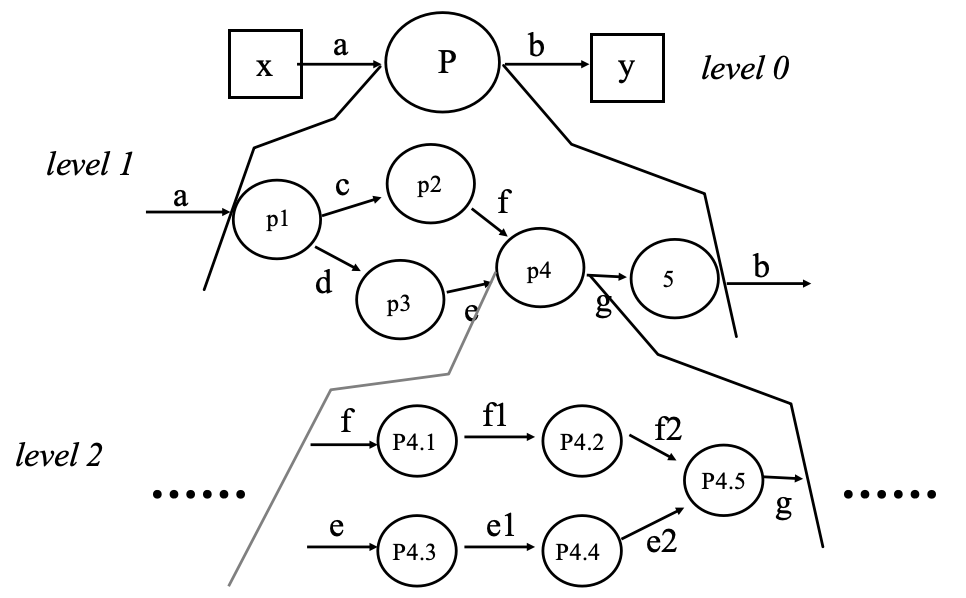
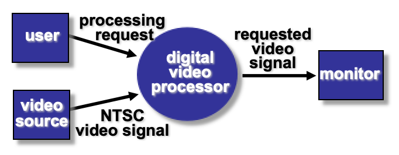
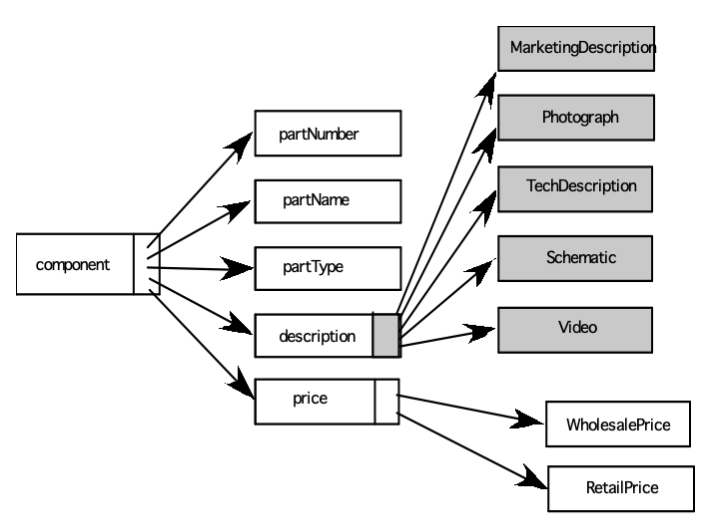

# Chapter 11 Requirements Modeling: Behavior, Patterns, and Web/Mobile Apps

## Behavioral Modeling

行为模型用于说明软件如何对外部事件/刺激 (events or stimuli) 做出响应，是描述软件动态行为的核心模型。构建行为模型的 5 个关键步骤：

- 分析所有用例，充分理解系统内的交互序列 (sequence of interaction)；
- 识别驱动交互序列的事件，明确事件与特定对象的关联；
- 为每个用例创建交互序列；
- 为系统构建状态图 (state diagram)；
- 评审行为模型，验证其准确性和一致性。

---
## The States of a System

- **状态 (state)**：a set of observable circumstances that characterizes the behavior of a system at a given time.
- **状态转换 (state transition)**：the movement from one state to another.
- **事件 (event)**：an occurrence that causes the system to exhibit some predictable form of behavior.
- **动作 (action)**：process that occurs as a consequence of making a transition.

> - 状态指的是某一时刻系统行为的一组可观察环境
> - 事件是触发系统表现出可预测行为的发生事项
>-  动作是状态转换后产生的后续处理过程

---
## State Representations

行为建模重要关注两类状态：
- **The state of each class**：系统执行功能时每个类的状态
- **The state of the system**：系统执行功能时，从外部关哈到的系统的整体状态

---
## State Diagram for the control panel Class

状态图示例，核心是通过 `ControlPanel` 类的状态转换来描述系统行为。直观地展示了单个类的状态转换、触发事件、对应动作。



---
## Sequence Diagram

序列图用于描述用例的交互序列，展示对象之间按照时间顺序的消息传递过程。



---
## Data Modeling

Features:
- examines data objects independently of processing
- focuses attention on the data domain
- creates a model at the customer’s level of abstraction
- indicates how data objects relate to one another

> 目标和特点：
> - 独立于处理过程分析数据对象；
> - 关注数据领域；
> - 站在客户的抽象层级创建模型，符合客户对数据的认知；
> - 明确数据对象之间的关联关系；

---
## What is a Data Objext?

定义：由一组属性描述，且会在软件系统中被操作的事物，其特点如下
- 每个对象实例可被唯一标识（如书籍的ISBN）
- 对象在系统中承担必要角色，无此对象系统无法正常运行
- 对象由属性描述 (described by attributes)，而属性本身也是数据项

---
## Typical Objects

下面展示软件系统中常见的是数据对象类型：
- **外部实体 (external entities)**: 打印机、用户、传感器；
- **具体事物 (things)**: 报告、显示屏、信号；
- **发生的事件 / 情况 (occurrences or events)**: 中断、警报；
- **角色 (roles)**: 经理、工程师、销售人员；
- **组织单元 (organizational units)**: 部门、团队；
- **地点 (places)**: 生产车间；
- **结构 (structures)**: 员工档案。

---
## Data Objects and Attributes

**属性是描述数据对象的维度**，一个数据对象包含一组属性，属性是对象的特征、质量、方面或描述符。

```
Object: Automobile
Attributes:
    Make
    Model
    Year
    Price
```

---
## What is a Relationship?

表示数据对象之间的**关联性 (connectedness)**，是系统需要 “记忆” 的事实，且不能通过机械计算推导，关系的核心特征：
- 一个关系可以存在多个实例；
- 对象之间可以存在多种不同类型的关系。

---
## ERD Notation

- 基数 (cardinality)：表示关系中对象实例的数量关系，如 1:1、1:N、M:N；
- 模态 (modality)：表示关系的必要性，如必需 (mandatory) 或可选 (optional)。




**Example**



---
## Flow-Oriented Modeling

面向流的建模描述数据对象在系统中的传递与转换过程，核心工具是数据流图 (data flow diagram, DFD)

> 被部分人视为 “传统方法”，但能提供系统的独特视角（数据流转视角）；
> 需作为补充工具，与行为建模、数据建模结合使用，完善分析模型。

**Data Flow Diagrams (DFD)**
- 所有基于计算机的系统都是信息转换系统 (information transform system)，DFD 是其图形化表示；
- 描述信息流和数据从输入到输出的转换过程；
- 可在任意抽象层级表示系统 / 软件（从整体到细节）；



**外部实体 (External Entities)**: A producer or consumer of data
> 比如：用户、外部系统、传感器等，同时数据必有来源，必有去向

**处理 (Process)**: A data transformer (changes input to output)
> 比如：计算、转换、决策等，数据必须经过处理，才能实现系统功能，处理是 DFD 的核心动作元素

**数据流 (Data Flow)**: Data flows through a system, beginning as input and be transformed into output.
> 比如：订单信息、传感器数据、计算结果等，数据流是 DFD 的核心连接元素，描述数据在系统中的流转路径

**数据存储 (Data Store)**: Data is often stored for later use.
> 比如：数据库、文件系统等，数据存储是 DFD 的核心静态元素，描述系统中数据的持久化位置

**The Data Flow Hierarchy**



- *0 层 DFD（上下文级 DFD）*：系统的整体视图，展示系统与外部实体的交互，是最顶层的抽象；
- *1 层 DFD*：对 0 层 DFD 的核心处理（P）进行拆分，细化为多个子处理（P1-P5），展示子处理之间的数据流；
- *2 层及更低层 DFD*：对上层的单个处理进一步拆分（如 P4 拆分为 P4.1-P4.5），直到每个处理仅完成单一功能；
> 特点：层级越低，处理越具体，数据流越详细。

**DFD Guidelines**
- 为所有数据流箭头、图形元素标注有意义的名称；
- 从0 层（上下文级）DFD开始绘制，且 0 层必须展示外部实体；
- 不表示过程逻辑（如分支、循环），仅关注数据流转和转换；
- DFD 通过多级别细化完善，且需保持信息流的连续性 (Information Flow Continuity)。

---
## Process Specification (PSPEC)

**PSPEC（Process Specification）**是对 DFD 中每个处理的详细描述，用于明确处理的执行逻辑，核心描述方式（可单独 / 组合使用）：
- 叙述性文字（narrative）；
- 伪代码（PDL）；
- 数学公式（equations）；
- 表格（tables）；
- 图表 / 曲线图（diagrams and/or charts）；

---
## Constructing a DFD

构建步骤：
- 回顾数据模型，分离数据对象，通过语法解析确定系统的核心 “操作（处理）”；
- 识别系统的外部实体（external entities：数据的生产者 / 消费者）；
- 绘制0 层 DFD，展示系统整体与外部实体的交互。



- 编写叙述性文字，描述核心处理的转换逻辑；
- 解析文字，确定下一级子处理；
- 平衡数据流，确保上下层 DFD 的输入 / 输出数据一致（信息流连续性）；
- 绘制1 层 DFD；
- 遵循约 1:5 的扩展比（一个上层处理拆分为 5 个左右子处理，避免拆分过细 / 过粗）。

**Flow Modeling Notes**
- 每个处理（气泡）需细化到仅完成单一功能；
- 层级越多，扩展比越小（下层处理拆分的数量少于上层）；
- 大多数系统的 DFD 需要3-7 个层级，才能完成足够详细的流建模；
- 单个数据流项（箭头）可在下层 DFD 中展开细化，详细信息由数据字典提供。

**DFDs: A Look Ahead**
分析模型中的 DFD会映射到设计模型中，是需求分析到软件设计的重要桥梁，DFD 的数据流、处理、数据存储会对应设计模型中的模块、数据结构、接口等设计元素，实现需求到设计的落地。

---
## Patterns for Requirements Modeling

软件模式是捕获领域知识的机制，可在遇到新问题时复用，模式的核心价值和特点：
- 领域知识可在同一应用领域的新问题中直接复用；
- 领域知识可通过类比，在完全不同的应用领域中复用；
- 分析模式不是被 “创造” 的，而是在需求工程工作中被发现的；
- 模式被发现后，需进行规范化文档化，以便后续复用。

---
## Discovering Analysis Patterns

- 需求模型描述的最基本元素是用例；
- 一组连贯的用例是发现一个 / 多个分析模式的基础；
- 引入语义分析模式（Semantic Analysis Pattern, SAP）：描述一组连贯的用例，这些用例共同构成一个基础的通用应用，是分析模式的核心类型。

---
## Requirements Modeling for WebApps

Web 应用的需求建模是专属场景建模，需结合 Web 应用的特点（内容为主、交互性强、跨环境）
- *内容分析 (Content Analysis)*：识别 Web 应用提供的所有内容（文本、图片、视频、音频），通过数据建模描述内容数据对象；
- *交互分析 (Interaction Analysis)*：详细描述用户与 Web 应用的交互方式，通过用例实现；
- *功能分析 (Function Analysis)*：基于交互用例，定义对内容的操作和其他处理功能，并详细描述；
- *配置分析 (Configuration Analysis)*：详细描述 Web 应用的运行环境和基础设施；
- *导航分析 (Navigation Analysis)*：设计 Web 页面的链接组织方式，即用户的导航路径。

---
## When Do We Perform Analysis

Web / 移动应用的开发中，分析和设计有时会合并，但在以下场景中，必须执行显式的需求分析（单独的分析阶段），确保需求的准确性：
- 待开发的 Web / 移动应用规模大、复杂度高；
- 项目的利益相关者数量多；
- 开发团队的人数多；
- 开发团队成员此前无合作经验；
- 应用的成败对业务发展有重大影响。

---
## The Content Model

内容模型是 Web 应用需求建模的核心，聚焦内容对象，构建步骤：
- 从用例中提取内容对象（分析用例场景中直接 / 间接提及的内容）；
- 识别每个内容对象的属性 (Attributes)；
- 描述内容对象之间的关系和 Web 应用维护的内容层级：
  - 关系 (Relationships)：用 ERD（实体关系图）或 UML 表示；
  - 层级 (Hierarchy)：用数据树或 UML 表示。

---
## Data Tree

数据树是描述 Web 应用内容层级的核心工具，直观展示内容对象之间的层级包含关系，是内容模型的重要组成部分。



---
## The Interaction Model

交互模型聚焦用户与 Web 应用的交互，由四大核心元素组成，均为 UML 标准表示法，共同描述交互的全流程：
- *用例 (use-cases)*：描述交互的业务场景；
- *序列图 (sequence diagrams)*：描述交互的时间序列；
- *状态图 (state diagrams)*：描述交互过程中的状态转换；
- *用户界面原型 (user interface prototype)*：可视化的交互界面，直观展示交互方式。

---
## The Function Model

功能模型聚焦 Web 应用的处理功能，覆盖两类核心处理元素，是 Web 应用实现业务逻辑的核心：
- *用户可见的功能*  ：Web 应用向终端用户提供的可操作功能；
- *分析类中的操作*：实现类行为的内部操作；

活动图，用于表示处理流程，描述功能的执行步骤。

---
## The Configuration Model

配置模型聚焦 Web 应用的*运行环境和基础设施*，分为*服务端*和*客户端*两部分，需分别详细定义，确保应用的跨环境兼容性和稳定性：

**服务端**
- 明确服务器硬件和操作系统环境；
- 考虑服务端的互操作性要求；
- 定义合适的接口、通信协议和协作信息。
**客户端**
- 识别浏览器的配置要求（如浏览器版本、插件）；
- 定义客户端的测试要求。


---
## The Navigation Model

导航建模聚焦 Web 应用的页面导航设计，此页提出导航设计的核心问题，是导航建模的前提，需在设计前明确答案：
- 部分元素是否应更易访问（更少导航步骤）？展示优先级如何？
- 是否应突出部分元素，引导用户向其导航？
- 如何处理导航错误？
- 是否应优先导航到相关元素组，而非单个元素？
- 导航方式：链接、搜索、其他？
- 是否应根据用户之前的导航行为，动态展示元素？
- 是否应为用户维护导航日志？

导航建模聚焦 Web 应用的页面导航设计，此页提出导航设计的核心问题，是导航建模的前提，需在设计前明确答案：
- 部分元素是否应更易访问（更少导航步骤）？展示优先级如何？
- 是否应突出部分元素，引导用户向其导航？
- 如何处理导航错误？
- 是否应优先导航到相关元素组，而非单个元素？
- 导航方式：链接、搜索、其他？
- 是否应根据用户之前的导航行为，动态展示元素？
- 是否应为用户维护导航日志？

