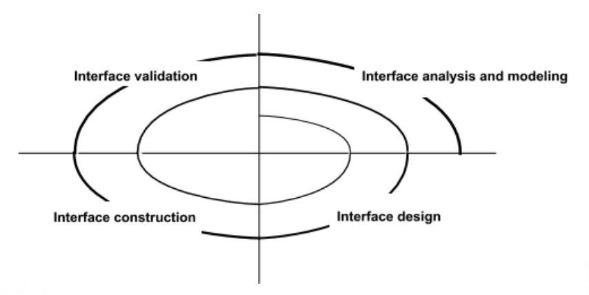
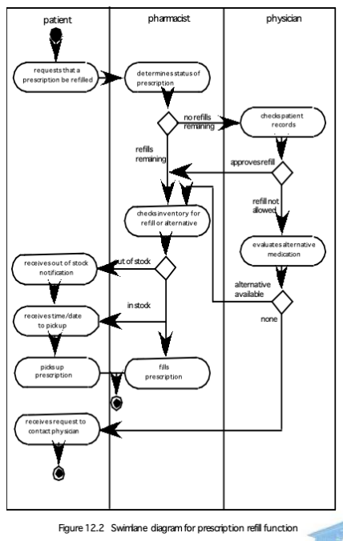
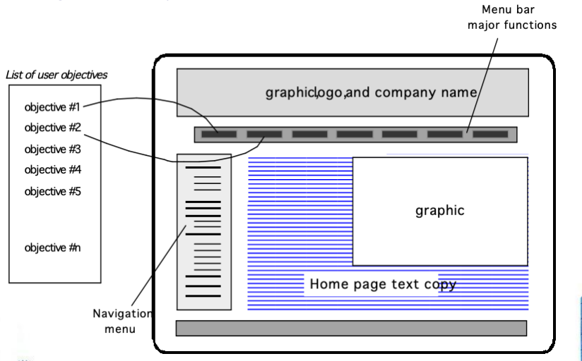
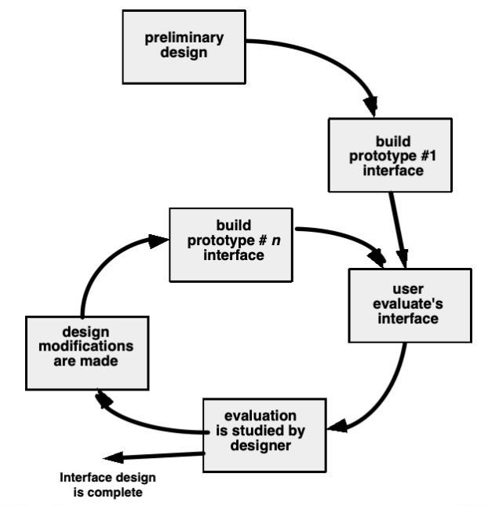

# Chapter 15 User Interface Design

## Interface 三个关键问题

- Easy to learn?（易学吗？）
- Easy to use?（易用吗？）
- Easy to understand?（易懂吗？）

## Typical Design Errors
- lack of consistency（缺乏一致性）
- too much memorization（记忆负担过重）
- no guidance /help（无引导 / 无帮助）
- no context sensitivity（无上下文感知）
- poor response（响应差）
- Arcane/unfriendly（晦涩 / 不友好）

## Golden Rules

- **Place the user in control（让用户掌控）**
    - 不强迫用户做不必要操作
    - 提供灵活交互
    - 支持中断与撤销
    - 随熟练度简化、支持自定义
    - 对普通用户隐藏技术细节
    - 支持屏幕对象直接交互
- **Reduce the user’s memory load（减轻用户记忆负担）**
    - 减少短期记忆要求
    - 设置有意义的默认值
    - 直观快捷键
    - 基于现实隐喻的视觉布局
    - 信息渐进式展示
- **Make the interface consistent（保持界面一致）**
    - 让当前任务有意义上下文
    - 跨应用系列保持一致
    - 不随意打破用户已形成的操作习惯

## User Interface Design Models

- **User model（用户模型）**：a profile of all end users of the system (所有终端用户画像)
- **Design model（设计模型）**：a design realization of the user model (对用户模型的设计实现)
- **Mental model（心理模型）**：the user’s mental image of what the interface is (用户心中对界面的印象)
- **Implementation model（实现模型）**：the interface “look and feel” coupled with supporting information that describe interface syntax and semantics (界面观感 + 语法语义说明)

## User Interface Design Process

分析建模 → 设计 → 构建 → 验证

## Interface Analysis
Interface analysis means understanding 
- the people (end-users) who will interact with the system through the interface; (用户)
- the tasks that end-users must perform to do their work, (任务)
- the content that is presented as part of the interface (内容)
- the environment in which these tasks will be conducted. (环境)

## User Analysis

职业、教育、学习方式、打字能力、年龄、性别、工作时间、使用频率、语言、容错后果、专业度、是否关心底层技术

## Task Analysis

回答：做什么、任务层级、操作对象、工作流、任务结构

- **Use-cases** define basic interaction （用例）
- **Task elaboration** refines interactive tasks (任务细化)
- **Object elaboration** identifies interface objects (classes) (对象细化)
- **Workflow analysis** defines how a work process is completed when several people (and roles) are involved (工作流分析)

## Swimlane diagrams

用于多角色、多步骤的工作流可视化，清晰看到谁在什么环节做什么。

## Display Content

内容：位置一致性、自定义、标识、分块、摘要跳转、图形适配、色彩、错误提示

## Interface Design Steps

- Using information developed during interface analysis, define **interface objects and actions (operations)**. (定义界面对象与操作)
- Define **events (user actions)** that will cause the state of the user interface to change. Model this behavior. (定义用户操作事件)
- Depict each **interface state** as it will actually look to the end-user. (描绘界面状态)
- Indicate how the user interprets the **state of the system** from information provided through the interface. (指示用户如何从界面信息中理解系统状态)

## Design Issues
响应时间、帮助设施、错误处理、菜单 / 命令命名、可访问性、国际化

## Web and Mobile App Interface Design

**Web**：Hyperlink、浏览器、多媒体、公网、美工；
**Mobile App**：小屏幕、公网、美工；

**Where am I?  The interface should**
- provide an indication of the WebApp that has been accessed 
- inform the user of her location in the content hierarchy.
**What can I do now?** The interface should always help the user understand his current options
- what functions are available?
- what links are live?
- what content is relevant?
**Where have I been, where am I going?**  The interface must facilitate navigation. 
- **Provide a “map”** (implemented in a way that is easy to understand) of where the user has been and what paths may be taken to move elsewhere within the WebApp.

> 我在哪？（定位）
> 现在能做什么？（操作）
> 去过哪 / 去哪？（导航）

## Effective Web and Mobile App Interfaces

- Effective interfaces are visually apparent and forgiving (视觉清晰、容错、有掌控感)
- Effective interfaces do not concern the user with the inner workings of the system. Work is carefully and continuously saved, with full option for the user to undo any activity at any time.(隐藏系统内部运作,自动保存、支持撤销)
- Effective applications and services perform a maximum of work, while requiring a minimum of information from users.(系统多做事，用户少输入)

## Interface Design Principles - I
- **Anticipation**—A WebApp should be designed so that it anticipates the use’s next move. 
- **Communication**—The interface should communicate the status of any activity initiated by the user
- **Consistency**—The use of navigation controls, menus, icons, and aesthetics (e.g., color, shape, layout)
- **Controlled autonomy**—The interface should facilitate user movement throughout the WebApp, but it should do so in a manner that enforces navigation conventions that have been established for the application.
- **Efficiency**—The design of the WebApp and its interface should optimize the user’s work efficiency, not the efficiency of the Web engineer who designs and builds it or the client-server environment that executes it.

> 预见性、沟通、保持一致、受控自主、效率

## Interface Design Principles - II
- **Focus**—The WebApp interface (and the content it presents) should stay focused on the user task(s) at hand. 
- **Fitt’s Law**—“The time to acquire a target is a function of the distance to and size of the target.”
- **Human interface objects**—A vast library of reusable human interface objects has been developed for WebApps.
- **Latency reduction**—The WebApp should use multi-tasking in a way that lets the user proceed with work as if the operation has been completed. 
- **Learnability**— A WebApp interface should be designed to minimize learning time, and once learned, to minimize relearning required when the WebApp is revisited. 

> 焦点、Fitt定律、人机界面对象、延迟减少、易学性
> Fitt定律：获取目标的时间与目标的距离和大小成函数关系。

## Interface Design Principles - III
- **Maintain work product integrity**—A work product (e.g., a form completed by the user, a user specified list) must be automatically saved so that it will not be lost if an error occurs.
- **Readability**—All information presented through the interface should be readable by young and old.
- **Track state**—When appropriate, the state of the user interaction should be tracked and stored so that a user can logoff and return later to pick up where she left off.
- **Visible navigation**—A well-designed WebApp interface provides “the illusion that users are in the same place, with the work brought to them.”

> 工作产品完整性、可读性、状态跟踪、可见导航

## Interface Design Workflow - I
- **Review** information contained in the analysis model and refine as required.
- Develop a rough sketch of the Web or Mobile App interface **layout**.
- Map user objectives into specific interface **actions**. 
- Define a set of user **tasks** that are associated with each action.
- **Storyboard** screen images for each interface action.
- **Refine** interface layout and storyboards using input from aesthetic design.

> 评审分析模型、界面布局草图、用户目标映射到界面操作、定义用户任务、界面操作的故事板、根据美学设计调整界面布局和故事板

## Interface Design Workflow - II

- Identify user interface **objects** that are required to implement the interface. 
- Develop a **procedural** representation of the user’s interaction with the interface. 
- Develop a **behavioral** representation of the interface.
- Describe the interface **layout** for each state. 
- Refine and review the interface design model.

> 界面对象、界面交互的过程表示、界面行为表示、界面状态布局、调整和评审界面设计模型

## Mapping User Objectives

## Aesthetic Design
- Don’t be afraid of white space. （留白）
- Emphasize content. （突出内容）
- Organize layout elements from top-left to bottom right. （左上到右下布局）
- Group navigation, content, and function geographically within the page. （分组）
- Don’t extend your real estate with the scrolling bar. （不滥用滚动）
- Consider resolution and browser window size when designing layout. （考虑分辨率 / 窗口）

## Design Evaluation Cycle

