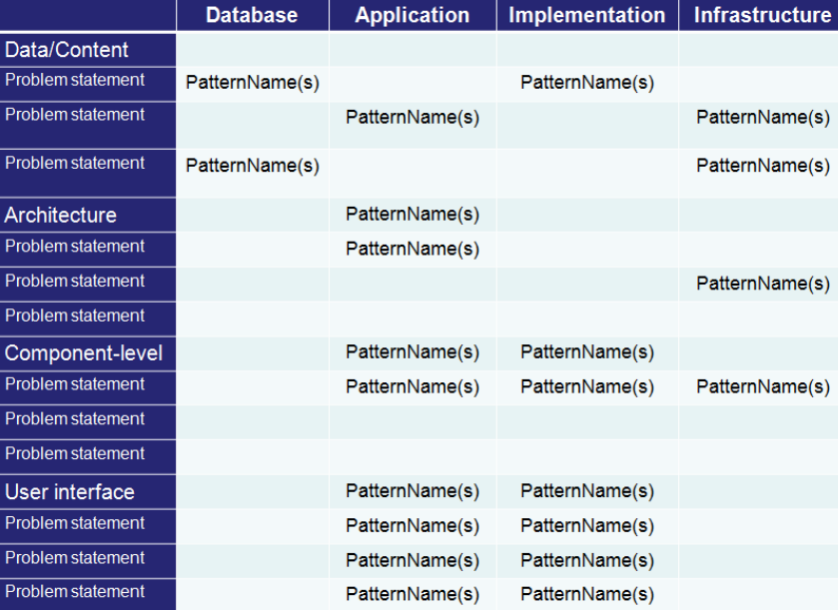

# Chapter 16 Pattern-Based Design

## Design Patterns

Design patterns are a codified method for describing problems and their solutions.  
它的核心就是：**把设计经验总结成可复用的模式**，以后遇到相似问题就能直接借鉴。

### Basic Concepts

> a three-part rule which expresses a relation between a certain context, a problem, and a solution

模式通常包含三部分：

- **Context（上下文）**：问题发生的场景
- **Problem（问题）**：在这个场景里到底卡在哪里
- **Solution（解决方案）**：在这种情况下怎么处理最合适

这里的 **forces** 可以理解为一组影响因素，比如需求、限制、约束，它们决定了解法不能随便选。

### Effective Patterns (Coplien, 2005)

- **It solves a problem**：真的能解决问题
- **It is a proven concept**：已经被实践验证过
- **The solution isn't obvious**：答案往往不是一眼能看出来的
- **It describes a relationship**：强调对象/模块之间的关系
- **The pattern has a significant human component**：还要考虑人的使用习惯和体验

### 模式分类

设计模式不是只有 GoF 那一类，可以按层次分：

- **Architectural patterns**：架构级模式，管整体结构
- **Data patterns**：数据建模和数据组织
- **Component patterns**：组件 / 子系统之间的协作
- **Interface design patterns**：界面设计问题
- **WebApp patterns**：Web 应用专用模式

## GoF Patterns

GoF 把设计模式分成三类：

### Creational patterns

关注对象怎么创建，怎么组合。

- **Abstract Factory**：创建一族相关对象
- **Factory Method**：把创建过程交给子类

### Structural patterns

关注类和对象怎么组织成更大的结构。

- **Adapter**：把一个接口适配成另一个接口
- **Composite**：把对象组合成树结构，统一处理

### Behavioral patterns

关注对象之间怎么分工、怎么通信。

- **Chain of Responsibility**：请求沿链传递
- **Command**：把请求封装成对象

## Frameworks

Framework是一种针对具体实现的用于设计工作的框架结构。可以理解成一种 **mini-architecture**，也就是带插槽的骨架结构。  
它比 pattern 更具体，能直接落地，但仍然保留一部分可扩展性。

## Describing a Pattern

一个完整的模式描述通常包括：

- Pattern name
- Problem
- Motivation
- Context
- Forces
- Solution
- Intent
- Collaborations
- Consequences
- Implementation
- Known uses
- Related patterns

也就是说，模式不是只给一个名字，而是要把**为什么要用、在哪用、怎么用、会带来什么代价**都说清楚。

## Pattern-Based Software Design

### Thinking in Patterns and Design Tasks

模式化设计可以理解成一个自顶向下的过程：

1. 先看大背景，理解系统所处的 context
2. 从背景里找已有的模式
3. 先用大模式搭骨架
4. 再从外到内逐层找更小的模式
5. 不断细化，直到设计完整
6. 再根据具体软件需求做适配

核心思想就是：

> 先搭框架，再补细节；先看整体，再看局部。

### Design Tasks and Common Design Mistakes

常见设计流程：

- 分析 requirements model，梳理问题层次
- 判断这个领域有没有成熟的 pattern language
- 从大的问题开始找 architectural patterns
- 再根据架构关系继续找子系统 / 组件模式
- 如果有界面问题，再去 UI pattern repository 里找
- 最后根据设计质量标准做调整

常见错误：

- 没理解问题就直接套模式
- 选错模式还硬套
- 忽略模式不覆盖的关键约束
- 只照着名字用，没有做实际适配

## Pattern Organizing Table

## Architectural Patterns

Architectural patterns 处理的是系统级问题，比如并发、持久化、分布式、整体组织结构。

### Kitchen Pattern

Kitchen pattern 这个例子说明：  
即使具体布局不同，只要满足同一类整体结构和工作流，就可以看作同一种架构模式的不同实现。

## Component-Level Patterns

组件级模式解决的是局部功能怎么设计。

### SafeHomeAssured.com

比如系统里有一个问题：

> 如何获取某个设备的产品规格和相关信息？

这时就可以考虑：

- SearchBox
- SearchResults
- SearchArea
- AdvancedSearch
- HelpWizard
- SearchTips

这类模式关注的是**某个功能模块内部怎么组织得更合理**。

## User Interface (UI) Patterns

UI pattern 主要关注界面问题，比如：

- Whole UI
- Page layout
- Forms and input
- Tables
- Direct data manipulation
- Navigation
- Searching
- Page elements
- E-commerce

它们的目标都差不多：**让用户更容易理解、定位、操作和完成任务**。

## WebApp Patterns

WebApp patterns 面向 Web 应用，通常分成五类：

- **Information Architecture Patterns**：信息空间怎么组织
- **Navigation Patterns**：怎么导航
- **Interaction Patterns**：用户怎么交互
- **Presentation Patterns**：内容怎么展示
- **Functional Patterns**：系统怎么处理业务逻辑

### Mobile App Patterns

移动端常见模式包括：

- Check-in screens
- Maps
- Popovers
- Sign-up flows
- Custom Tab Navigation
- Invitations

移动端更强调：

- 小屏幕上的信息组织
- 触控交互
- 简化流程
- 上下文感知
