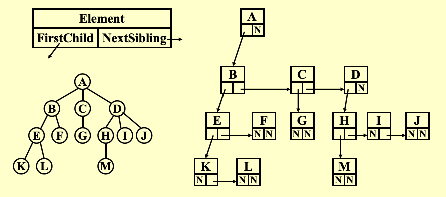
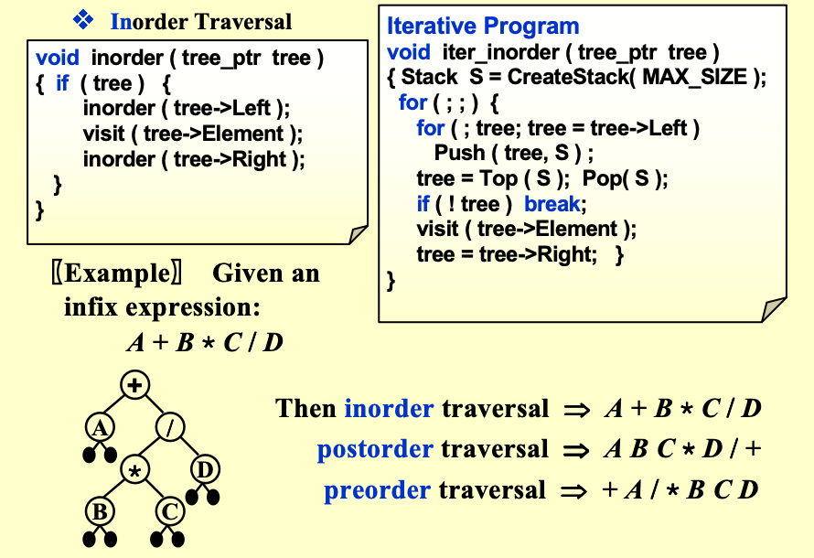

# Chapter4 Tree

## Preliminaries

**Definition**

A *tree* is a collection of nodes. The collection can be empty; otherwise, a tree consists of
- a distinguished node r, called the root
- zero or more nonempty subtrees T1, T2, ..., Tk, each of whose roots are connected by a directed edge from r.

> 空树含就是一个空集合
> 非空树包含一个根节点和零个或多个子树
> 有N个节点的树有N-1条边

**术语**
- *Degree of a node*: 节点拥有的子树数量
- *Degree of a tree*: 树中所有节点的度的最大值
- *parent*: 拥有子树的节点
- *children*: 父节点的子树根节点
- *siblings*:  同一父节点的子节点
- *leaf*: 度为 0 的节点（无子女）
- *path from n1 to nk*: 从n1​到nk​的唯一节点序列，ni​是ni+1​的父节点
- *length of a path*: 路径上边的数量
- *Depth of a node*: 从根节点到该节点的路径长度
- *Height of a node*: 从该节点到叶节点的最长路径长度
- *Height of a tree*: 根节点的高度
- *ancestors of a node*: 从根节点到该节点路径上的所有节点
- *descendants of a node*: 以该节点为根的子树中的所有

## Implementation

**Linked Representation**

用潜逃列表表示树的层级关系，跟节点为外层列表首元素，子数以此作为后续元素嵌套


> 每个节点的存储空间由子节点数量决定，大小不固定，不利于统一管理。

**First Child/Next Sibling Representation**

为每个节点设计三个域：`Element`, `FirstChild`, `NextSibling`，分别存储节点元素、指向第一个子节点的指针、指向下一个兄弟节点的指针。



## Binary Tree

二叉树是每个节点的子节点数量不超过 2的树（即度≤2），每个节点最多有*左孩子（Left）*和*右孩子（Right）*。

**Expression Tree**

表达式树是语法树的一种，用于表达算术表达式，叶节点为操作数，非叶节点为操作符，完美契合二叉树的结构。

*表达式树的创建*
1. 有限从后缀表达式（逆波兰表达式）创建，遇到操作数则创建节点并压栈
2. 遇到操作符则弹出栈顶的两个节点（先弹出的为右子树，后弹出的为左子树），创建新节点并将其作为父节点连接两个子树，再将新节点压栈
3. 最后栈顶的节点即为表达式树的根节点

> 对表达式树做不同的遍历，可得到表达式的不同形式
> - 前序遍历 (Preorder)：操作符在前，得到前缀表达式（波兰表达式）
> - 中序遍历 (Inorder)：操作符在中，得到中缀表达式（常规表达式）
> - 后序遍历 (Postorder)：操作符在后，得到后缀表达式（逆波兰表达式）

**Binary Tree Traversal**

对于任意树，我们都可以用前序/后序/层序的方式来遍历
- 前序遍历：访问根节点，递归访问左子树，递归访问右子树
- 后序遍历：递归访问左子树，递归访问右子树
- 层序遍历：按节点的深度从 0 开始，逐层访问（用队列实现，入队根节点，出队时访问并入队子节点）。

对于二叉树，我们还可以使用中序遍历，即先中序遍历左子树 → 访问根节点 → 再中序遍历右子树



**Threaded Binary Tree**

线索二叉树的诞生是为了解决二叉树空指针浪费和遍历效率低的问题而设计的优化结构

> 对于一个二叉树来说，总指针一共有2N个，因为总共有N个节点，每个节点有两个指针域。其中只有N-1个指针域被用来连接节点，剩余的N+1个指针域是空指针。线索二叉树将这些空指针利用起来，改为指向节点在某种遍历方式下的前驱或后继节点，从而实现更高效的遍历。

*线索二叉树的定义*：将二叉树的空指针改为指向节点在某种遍历方式下的前驱或后继节点，并增加一个标志位来区分指针类型（0表示指向子树，1表示指向前驱/后继）。
*以中序为例*
- 若节点的左指针为空，则将其替换为中序前驱的指针
- 若节点的右指针为空，则将其替换为中序后继的指针
- 不允许存在“游离线索”，必须为线索二叉树添加头节点，头节点的左孩子指向二叉树的第一个中序节点

```C
typedef  struct  ThreadedTreeNode  *PtrToThreadedNode;
typedef  PtrToThreadedNode  ThreadedTree;
struct  ThreadedTreeNode {
       int            LeftThread;   // 为TRUE时，Left是线索（非孩子）
       ThreadedTree   Left;         // 左指针/左线索
       ElementType    Element;      // 数据域
       int            RightThread;  // 为TRUE时，Right是线索（非孩子）
       ThreadedTree   Right;        // 右指针/右线索
};
```

- `LeftThread=TRUE`：Left 指向中序前驱；`FALSE`：Left 指向左孩子；
- `RightThread=TRUE`：Right 指向中序后继；`FALSE`：Right 指向右孩子。

*如果是后序遍历*

- 若节点的左指针为空，则将其替换为后序前驱的指针
- 若节点的右指针为空，则将其替换为后序后继的指针
- 不允许存在“游离线索”，必须为线索二叉树添加头节点，头节点的右孩子指向二叉树的第一个后序节点


## 节点计算题

- 总结点数：$N = n_0 + n_1 + n_2$ 
- 叶子节点数为度为2的节点数+1：$n_0 = n_2 + 1$
- 边数=总结点数-1=所有节点的度数之和：$N-1 = 0*n_0 + 1*n_1 + 2*n_2$

> 上面的第一个和第三个式子可以推出第二个


