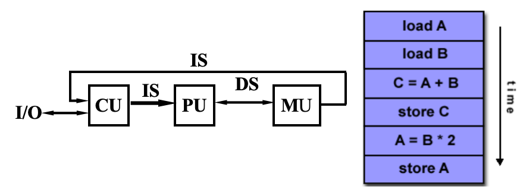
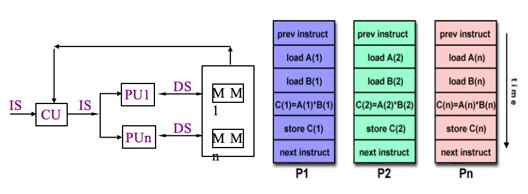
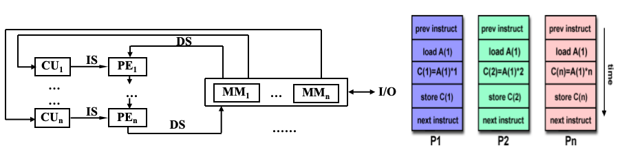
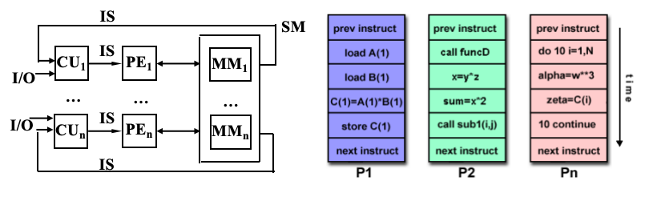
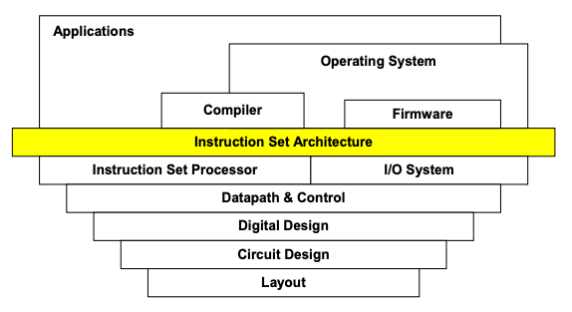
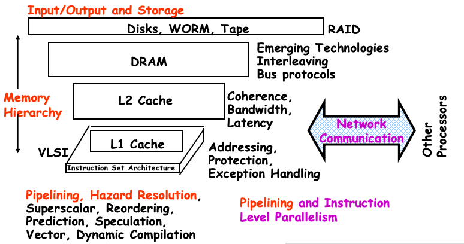

# Chapter 1 

## Classes of Computers

**Flynn's Taxonomy:** A classification of computer architectures based on the number of streams of instructions and data （指令集和数据流的形式决定了计算机饿的分类）

- SISD (Single Instruction Single Data):
 
- MISD (Multiple Instruction Single Data):
 
- SIMD (Single Instructon Multiple Data):
 
- MIMD (Multile Instruction Multiople Data): 

---

## Instruction Set Architecture (ISA)

**ISA**: The interface between hardware and softare
- Purpose 1 (now irrelevant): Re-use of fixed hardware resources
- Purpose 2:
    - Interface between developer and hardware
    - Contract from one chip generation and the next

**Seven dimensions of ISA**
- Class
- Memory addressing
- Addressing modes
- Types and sizes of operands
- Operations
- Control flow instructions
- Encoding

**Computer Architecture Topics**

---
## Trends in Technologu

## Trends in power in Intergrated circuits

## Trends in Cost

## Dependability

## Measuring , Reporting and summarizing Perf.

## Quantitive PRiciples of Computer Design 

## Putting it altogether