# Chapter 2 A Quantitive Approach

## What is pipelining?

- 一种实现技术，通过同时重叠执行不同的指令来实现。
- 一种用于制造快速 CPU 的实现技术。

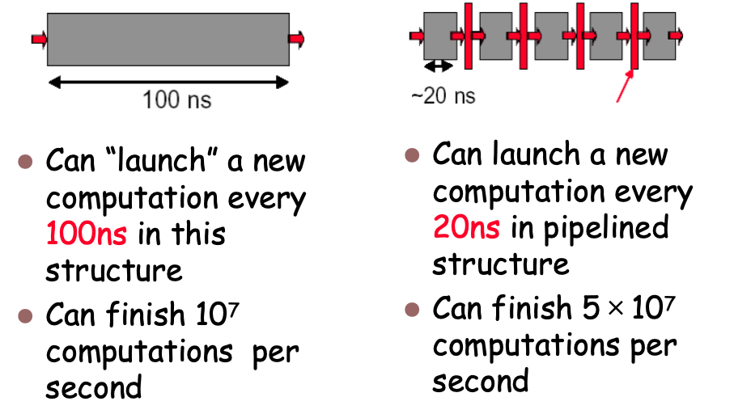

**Conclusion**
- 实现快速 CPU 的关键实施技术在于：减少 CPU 时间。decrease CPUtime.
- 提高吞吐量（而非单个执行时间） Improving of Throughput ( rather than individual execution time)
- 提高资源（功能单元）的效率 Improving of efficiency for resources  (functional unit)

**Ideal Performance for Pipelining**

If the stages are perfectly balanced, The time per instruction on the pipelined processor equal to:
$$\frac{Time\ per\ instruction\ on\ unpipelined\ machine} {Number\ of\ pipe\ stages}$$

So, the ideal speed up equals to *number of pipe stages.*

**为什么不设计50级流水线？**

- *硬件开销*：寄存器占用芯片面积，阶段数越多，寄存器数量越多，面积开销越大；
- *延迟开销*：寄存器本身存在传输延迟，且存在时钟偏移（clock skew），机器周期需满足：机器周期 > 寄存器延迟 + 时钟偏移。
- *实际情况*：现代深度流水线（10-20 级）中，寄存器延迟已成为显著因素，单阶段逻辑通常仅 10-20 个逻辑门，寄存器延迟占比高，50 级流水线的延迟开销会完全抵消速度优势。 

**Pipeline Stages 过多会导致：**
- 阶段过多，存在诸多复杂情况
- 应当处理飞行过程 (in-flight instructions)中各项指令之间的可能关联
- 控制逻辑十分庞大

## Implementation

**Single-Cycle Implementation**

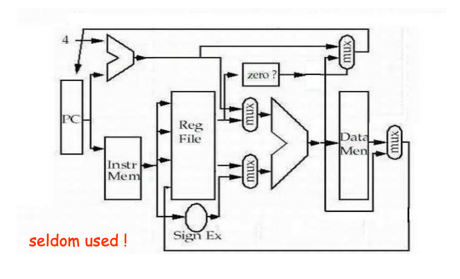 

**Multi-Cycle Implementation**

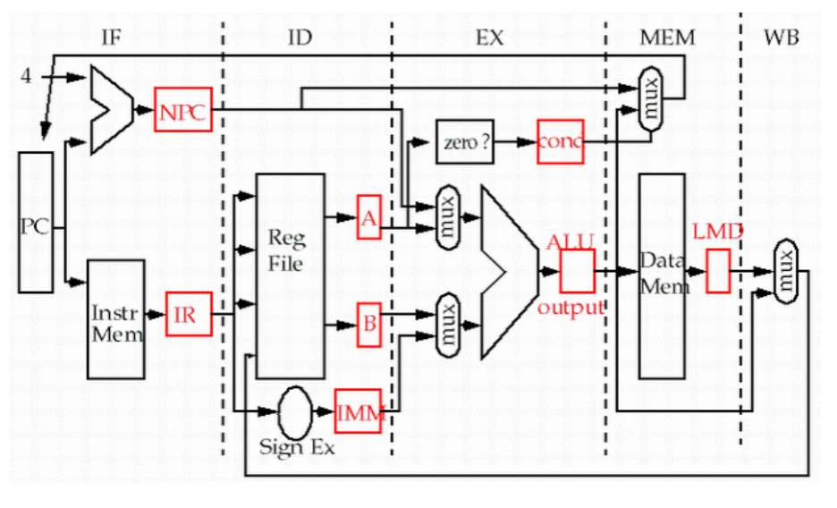

**Calculation of CPI**

- 经典的IF（取指）、ID（译码）、EX（执行）、MEM（访存）、WB（写回） 5 级流水线，是 CPU 流水线的基础架构。

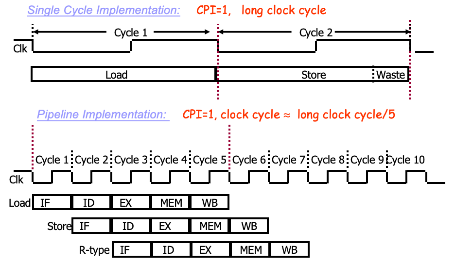

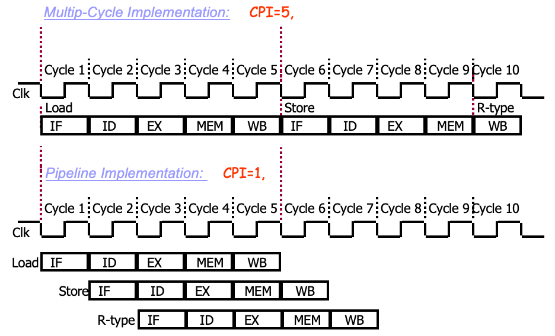

---
## Pipeline Hazards

**冒险（Hazard）**：阻止流水线中的指令执行下一个预定阶段的条件，本质是指令的重叠执行打破了原有的串行依赖关系。
- *结构冒险（Structural hazards）*：硬件资源的冲突，多个指令在同一时钟周期争夺同一硬件资源；
- *数据冒险（Data hazards）*：指令依赖前一条指令的计算结果，但结果尚未准备好（未计算完成或未写回）；
- *控制冒险（Control hazards）*：分支指令的条件和目标地址无法及时确定，导致下一条指令的取指错误。

**所有的冒险都可以通过 Stall 来解决**， 但是流水线暂停会让性能偏离理想状态，加速比大幅下降；

**Performance of pipleining with stalls**

*First, recall the formula of speedup*
$$
\begin{aligned}
\text{Speedup from pipelining} &= \frac{\text{Average instruction time unpipelined}}{\text{Average instruction time pipelined}} \\
&= \frac{\text{CPI unpipelined} \times \text{Clock cycle unpipelined}}{\text{CPI pipelined} \times \text{Clock cycle pipelined}} \\
&= \frac{\text{CPI unpipelined}}{\text{CPI pipelined}} \times \frac{\text{Clock cycle unpipelined}}{\text{Clock cycle pipelined}}
\end{aligned}
$$

The ideal CPI on a pipelined processor is almost always 1. (may less than  or greater that )

$$ \text{CPI}_{\text{Pipelined}} = \text{Ideal CPI} + \text{Pipeline Stall Cycles per Instruction} $$

Thus the speedup from pipelining with stalls is:
$$\text{Speedup} = \frac{\text{CPI unpipelined}}{\text{Ideal CPI} + \text{Pipeline Stall Cycles per Instruction}} \\
\text{}\\
(\text{CPI unpipelined}=\text{Pipeline depth})$$

---
## Structural Hazards

同一时钟周期内，多个指令争夺同一硬件资源，导致资源冲突；
- *后果*：流水线产生泡（暂停），性能下降；
- *解决方法*：复制硬件资源，让多个指令可同时访问；

*常见冲突场景*：
- 寄存器堆的多端口访问（同时读 / 写）；
- 存储器的多访问（取指和访存同时进行）；
- 功能单元未完全流水线化（如浮点乘法器）。

**Example**

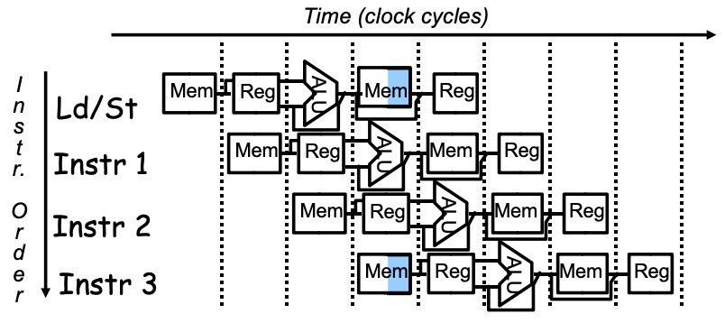

- 第一条指令 `Ld/St` (Load或Store) 此时执行到了第 4 个阶段——**数据访存（Data Memory Access）**，它需要访问内存以读写数据。
- 而紧跟其后的第 4 条指令 `Instr 3` 刚好在同一个时钟周期进入流水线的第 1 个阶段——**取指（Instruction Fetch）**，它同样需要访问内存来获取指令码。

**暂停流水线（Stall / Bubble）**：让 `Instr 3` 的取指操作暂停一个周期，等待 `Ld/St` 访存结束。这会导致性能下降。

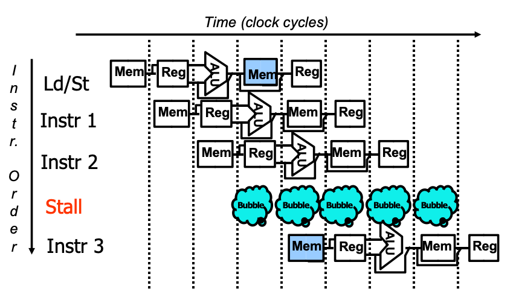

**Separate instruction and data memories**：在现代 CPU 中，常用的解决方法是**分离存储器**（或者分离 L1 Cache）。即配备独立的**指令存储器（Instruction Memory）**和**数据存储器（Data Memory）**（哈佛架构），使它们可以被并发访问，从而从根本上消除这种结构冒险。

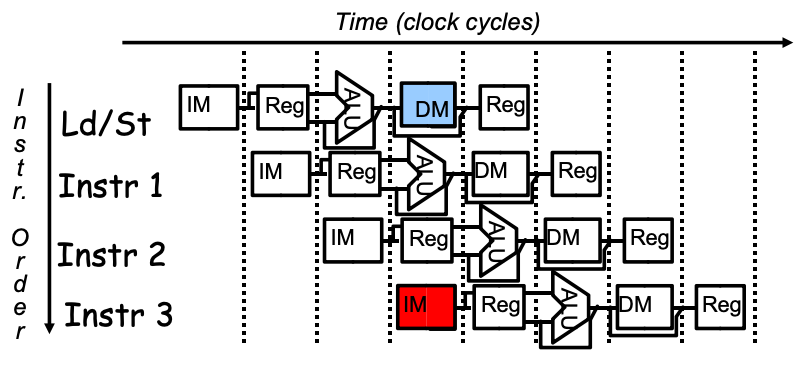

The memory system must deliver 5 times the bandwidth over the unpipelined version.

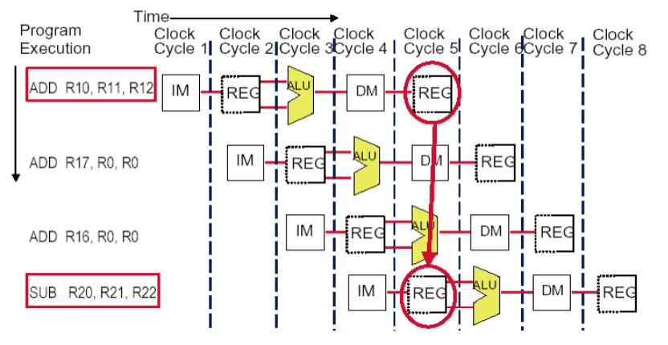

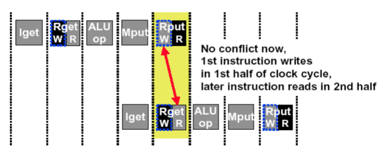

如上图这种情况所示，需要进行时钟周期的拆分，在前半周期先写，后半周期再读 (Write then Read) 使得指令取指和数据访存可以在同一周期内完成，从而满足流水线的带宽需求。

> 有些表述在中文的理解上总是会有点奇怪，有结构冒险指的是不进行存储器分离，通过Stall的方式来解决的结构；无结构冒险指的是进行存储器分离，消除结构冒险的结构。

**Machine without structural hazards will always have a lower CPI**

Example：

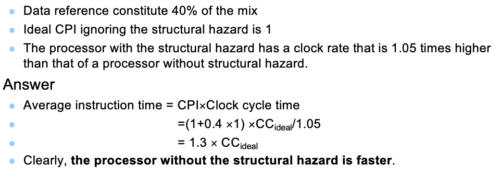

但是在实际的CPU设计中我们依旧会保留一部分结构冒险，这是在性能和成本之间的权衡。完全消除结构冒险需要复制更多的硬件资源，增加芯片面积和功耗，而适当的结构冒险通过Stall来解决，可以在性能损失可接受的范围内降低设计复杂度和成本。**保留出现概率较低的结构冒险，解决出线概率较高的结构冒险**

---
## Data Hazards

**Data hazards** occur when the pipeline changes the order of read/write accesses to operands comparing with that in  sequential executing .
连续的计算过程，后一个要用到前一个的数据结果的时候，会产生数据冒险。

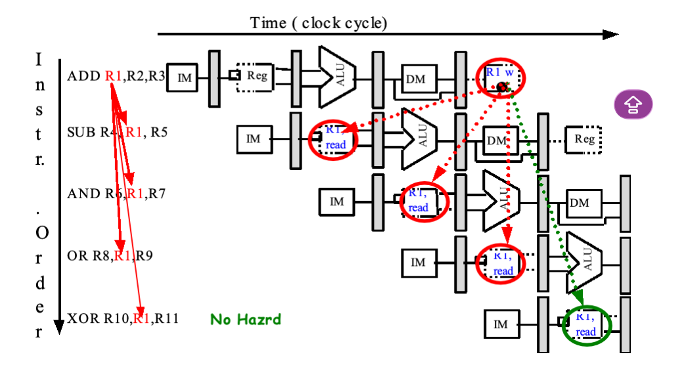

如上图所示，我们将几种情况分开考虑：

- `XOR R10, R1, R11` 这条指令需要读取寄存器 `R1`的值，本条指令进行到读取寄存器的时候， `ADD R1, R2, R3` 中 `R1`的值已经计算完成并写入，所以没有数据冒险
- `OR R8, R1, R9` 这条指令读取 `R1` 的值和`ADD R1, R2, R3` 中 `R1`写入在同一时刻，只需要设计 *Double Bump*，即前半个时钟周期写入，后半个时钟周期读取，即可避免这个问题。

**Stall 解决数据冒险**

类似于结构冒险，让存在数据依赖的指令暂停在流水线中，不允许其写入 CPU 的实际状态（如寄存器堆、存储器），直到前一条指令完成数据计算和存储，冒险解除。

**Forwarding 解决数据冒险**

若数据**已经计算完成**，但尚未写回到寄存器堆 / 存储器（如存在于流水线寄存器中），无需停顿，直接将数据从流水线寄存器 “传递” 给需要的指令。

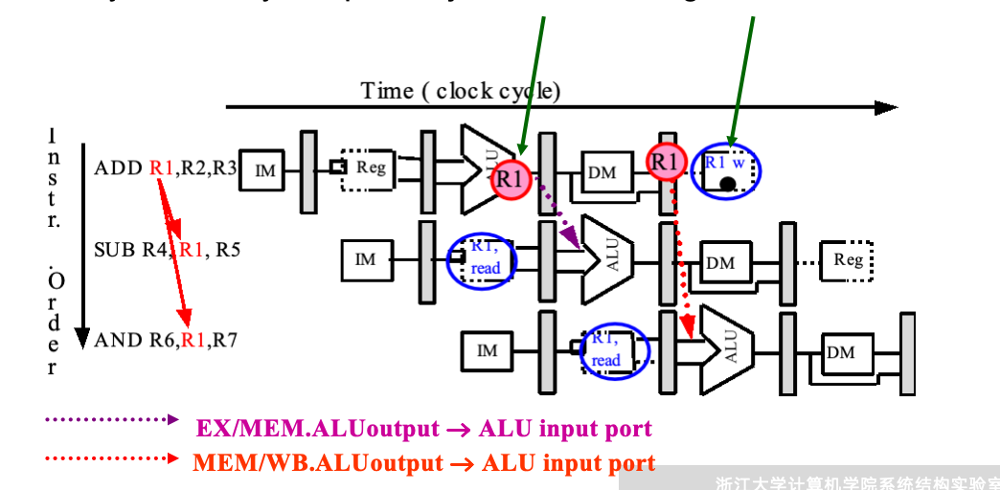

为了完成 Forwading， 在流水线寄存器的数据通路上需要进行修改

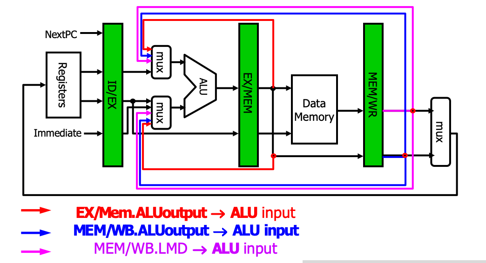

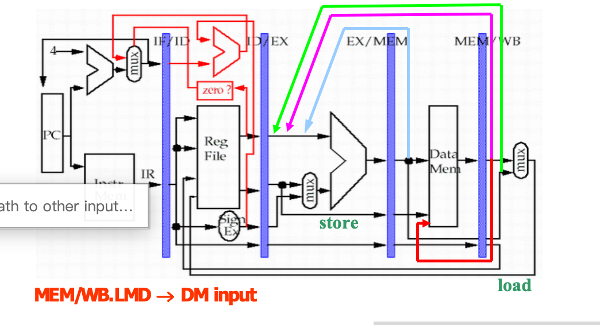

⚠️：对于有LW后面跟着ADD指令的结构，必须要stall一个回合在进行计算

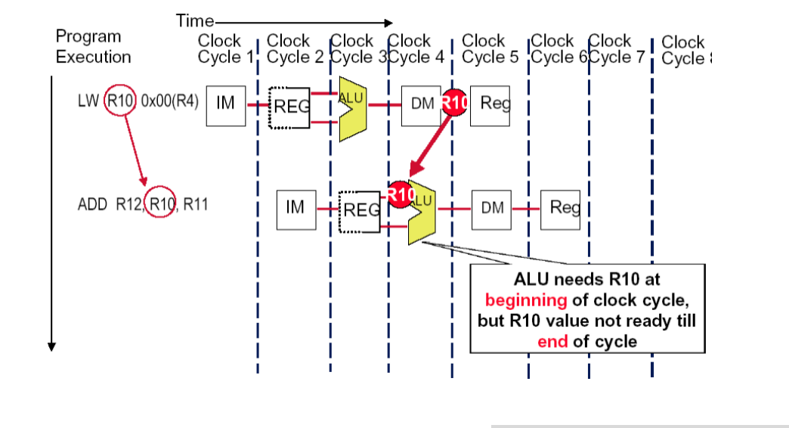

因为对于LW后面跟着的ADD来说，他要的是 `R10` 里面的数值，而不是在ALU阶段所计算出的 `R10` 的值所对应的地址 `R4+0X00`，所以要知道DM阶段我们才能得到 `R10` 的值，所以必须要stall一个回合在进行计算。

**Forwarding 数据冒险解决方法总结**

<table style="width: 100%; border-collapse: collapse; border-top: 2px solid #e0e0e0; border-bottom: 2px solid #e0e0e0; text-align: left; background-color: transparent;">
    <thead>
        <tr style="border-bottom: 1px solid #e0e0e0;">
            <th style="padding: 10px; font-weight: bold;">冒险情景</th>
            <th style="padding: 10px; font-weight: bold;">数据就绪阶段</th>
            <th style="padding: 10px; font-weight: bold;">解决手段</th>
            <th style="padding: 10px; font-weight: bold;">是否产生停顿 (Stall)</th>
            <th style="padding: 10px; font-weight: bold;">原理解析</th>
        </tr>
    </thead>
    <tbody>
        <tr>
            <td style="padding: 8px;">一般算术/逻辑依赖 (如 <code>ADD</code> 后跟指令)</td>
            <td style="padding: 8px;">执行阶段 (EX) 结束</td>
            <td style="padding: 8px;">直接 Forwarding</td>
            <td style="padding: 8px;">否 (0周期)</td>
            <td style="padding: 8px;">数据在 ALU 计算后已可用，直接从流水线寄存器提取并传递给相应的执行单元，无需等待写回 (WB)。</td>
        </tr>
        <tr>
            <td style="padding: 8px;">Load-Use 冒险 (如 <code>LW</code> 后紧跟依赖指令)</td>
            <td style="padding: 8px;">访存阶段 (MEM) 结束</td>
            <td style="padding: 8px;">Stall 暂停 + Forwarding</td>
            <td style="padding: 8px;">是 (停顿 1 周期)</td>
            <td style="padding: 8px;"><code>LW</code> 只在 EX 计算了读取地址，必须等 MEM 获取内存数据后才就绪。所以后续指令必须强制停顿一周期，等取得数据后再执行 Forwarding。</td>
        </tr>
    </tbody>
</table>

