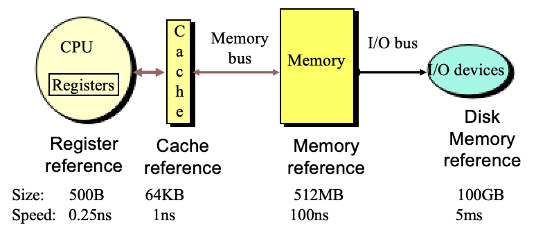
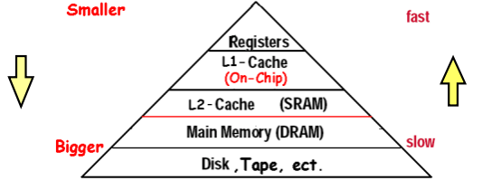
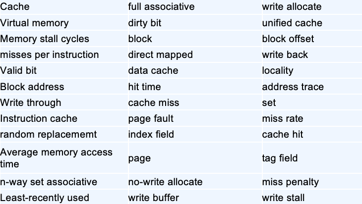
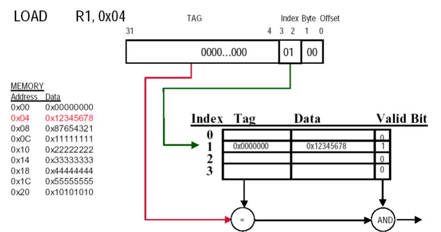
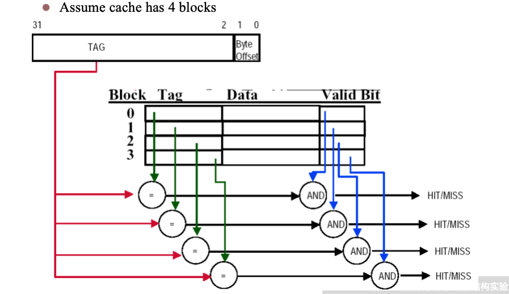
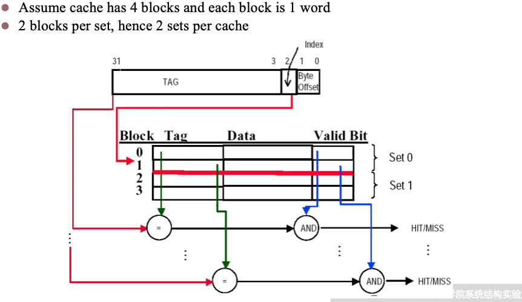
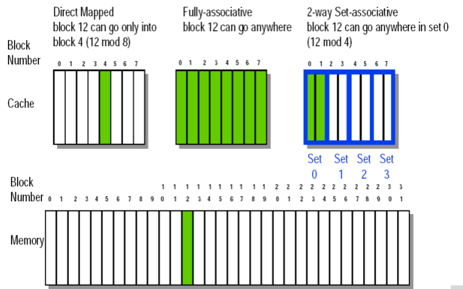
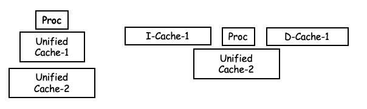
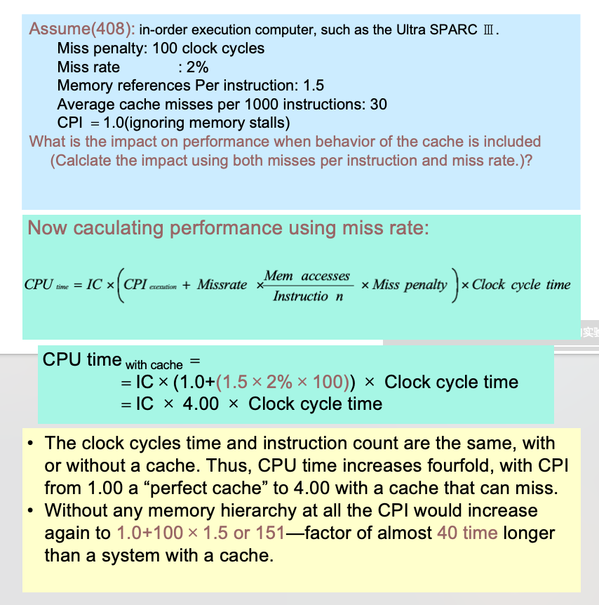
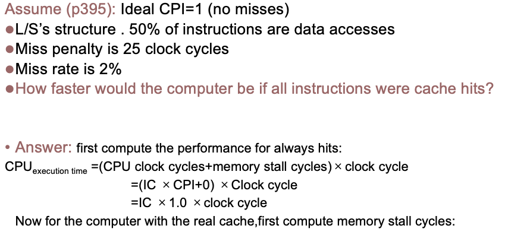

# Chapter 5 Memory Hierarchy

## Introduction

如上图所示，不同类型的存储器类型，他们的访问速度和内存容量各不相同。不同类型的计算机对于存储系统的关注点也不同
- 桌面计算机：关注平均延迟
- 服务器：关注存储带宽
- 嵌入式：关注功耗、实时性、最小存储

**The method enhance speed of memory**
- **Temporal Locality (Locality in Time):** 被访问的数据，近期会再次访问。所以把最近访问数据放在靠近 CPU 处
- **Spatial Locality (Locality in Space):** 被访问数据，附近数据也会被访问。所以把连续数据块放入 Cache

**What is Cache?**
- Cache 是一种小容量、高速的存储器，位于 CPU 和主存之间，用于存储最近访问的数据和指令，以减少访问主存的平均时间。

**36个术语**

**Block Placement**

- **主存块（Block）**：主存被分成一个个固定大小的块，Cache 也分成同样大小的块。数据只能以块为单位在主存和 Cache 之间搬运。
- **Cache 块数**：Cache 总共有多少个块。
- **组数**：在组相联里，把 Cache 块分成若干组。组数 = Cache 总块数 / 每组块数（路数）

**直接映射**：每个主存块只能映射到 Cache 中的一个特定块。比如说主存中一共有100个块，cache只有8个块，那么主存块0、8、16...都映射到cache块0，主存块1、9、17...都映射到cache块1，以此类推。

**全相联**：每个主存块可以映射到 Cache 中的任何一个块。比如说主存中一共有100个块，cache只有8个块，那么主存块0、1、2...99都可以映射到cache中的任意一个块。

**组相联**：每个主存块可以映射到 Cache 中的一个特定组，但在该组内可以映射到任意一个块。比如说主存中一共有100个块，cache有8个块（两路组相联），那么cache被分为4组，每组有2个块。主存块0、4、8...都映射到cache的第0组，主存块1、5、9...都映射到cache的第1组，以此类推。在每组内，主存块可以映射到该组的任意一个块。

- *标记（Tag）*：匹配用
- *索引（Index）*：选组 / 选块
- *块内偏移（Offset）*：选块内字节

**位数计算：**
- *索引位数* = log2 (组数 / 块数)
- *偏移位数* = log2 (块大小)
- *标记位数* = 总地址位 - 索引 - 偏移

**Block Replacement Policy (块替换策略)**
- **直接映射** ：无选择，固定替换
- **组相联 / 全相联**：
  - **随机（Random）**：随机选择一块替换，简单但性能不稳定
  - **LRU（最少使用）**：替换近期被最少使用的块，性能好但实现复杂
  - **FIFO（先进先出）**：替换最早进入 Cache 的块，简单但可能替换掉仍被频繁访问的块

**Write Strategy (写策略)**
- **Write-through**：每次写操作同时更新 Cache 和主存，保持数据一致性，但写操作较慢。
- **Write-back**：写操作只更新 Cache，只有当块被替换时才更新主存，提高写操作性能，但需要额外的机制来跟踪哪些块被修改过。

**Write Stalls (写停顿)**
- *Write stall*：当 CPU 需要写入数据但 Cache 满了，必须等待 Cache 中的块被替换后才能继续写入，导致性能下降。
- *Write buffer*：一种缓冲机制，在写操作时暂存数据，允许 CPU 继续执行其他指令，减少写停顿的影响。

**Write Misses (写未命中)**: 当 CPU 需要写入数据但该数据不在 Cache 中时发生的情况。处理写未命中的策略包括：
- *Write allocate*：在写未命中时，将数据块从主存加载到 Cache 中，然后执行写操作，适用于频繁访问的数据。通常与 Write-back 策略搭配使用。
- *No-write allocate*：在写未命中时直接写入主存，不将数据块加载到 Cache 中，适用于不频繁访问的数据。通常与 Write-trough 策略搭配使用。

**Split and Unified Cache (分离和统一 Cache)**

- **统一 Cache**：指令和数据共用一个cache；硬件少，性能低
- **分离 Cache（I-Cache/D-Cache）**：指令、数据分开，并行访问，性能高

---
## Cache Performance

**Cache Execution Time (Cache 执行时间)**
$$\text{CPU Execution time} = (\text{CPU clock cycles} + \text{Memory stall cycles}) \times \text{Clock cycle time}$$

$$\text{Memory stall cycles} = \text{IC} \times (\text{Mem refs Instruction} \times \text{Miss rate} \times \text{Miss Penalty} $$

$$\text{CPU}_{\text{time}}=IC \times \left( \text{CPI}_{\text{Execution}} + {\text{Mem misses} \over \text{Inst}} \times \text{Miss Penalty} \right)\times \text{Clock cycle time}$$

**Average Memory Access Time (平均内存访问时间)**
$$\text{AMAT} = \text{Hit time} + \text{Miss rate} \times \text{Miss penalty}$$

$$\text{AMAT} = (\text{Hit time}_\text{inst} + \text{Miss rate}_\text{inst}\times \text{Miss Penalty}) + (\text{Hit time}_\text{data} + \text{Miss rate}_\text{data}\times \text{Miss Penalty})$$

 

---
## Reduce the miss penalty 

---
## Reduce the miss rate

---
## Reduce the miss penalty and miss rate via parallelism

---
## Reduce the time to hit in the cache. 