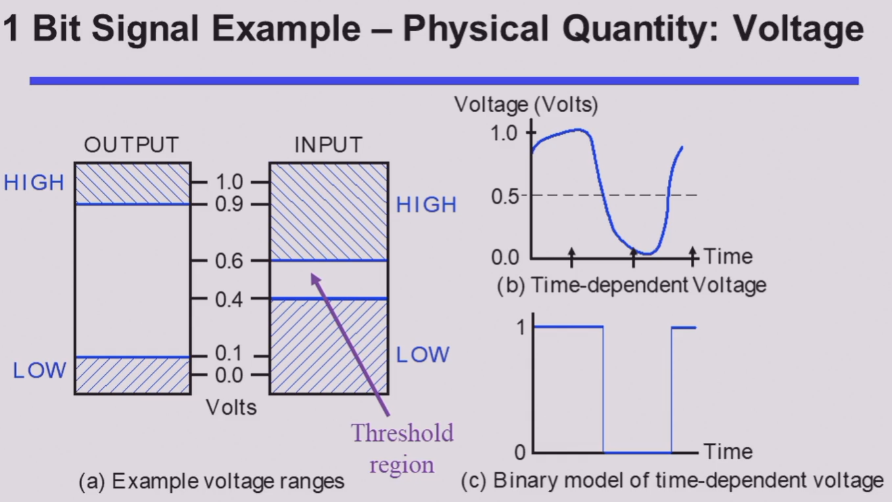
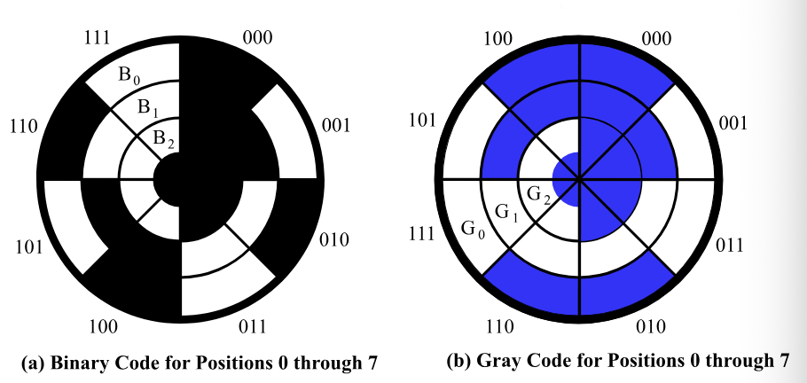
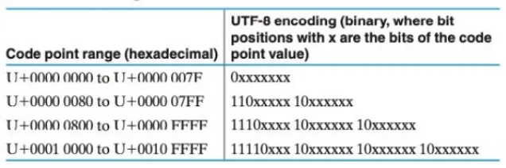

# Chapter 1 Digital Systems and Information

## 1.1 Signal

**Analog and Digital Signal**
现实世界中的信息大多数是 **连续 (continuous)** 的，但是在计算机的环境下很多信息是依靠**离散 (discrete)** 的方式传递的

**Time Sequence Signal**

- **模拟信号(Analog)**: continuous value and time
- **异步离散信号(Digital asynchronous)**: discrete value and continuous time
- **同步离散信号(Digital synchronous)**: continuous value and time

**High and Low Voltage**

- 对于输入和输出，高低电位的判定范围是不相同的，**宽进严出**的设计方案可以提高电路在噪音影响下的稳定性
- 在高电位和低电位的判定范围之间还存在一个**未定义 (undefined)** 的，如果输出的电平处在浮动区间，则其认定值将是随机的

---

## 1.2 Digital System

**定义**
- Takes a set of discrete information inputs
- Discrete internal information (system state)
- Generate a set of discrete information outputs

**分类**

- **组合逻辑系统 (Combinational Logical System)**：
    - No state present
    - Output function: $f_{Output}=Function(Input)$
    - 系统输出完全依赖输入决定
- **时序逻辑系统(Sequential System)**：
    - State present
    - State updated at discrete times: **同步时序系统(Synchronous Sequential System)**
    - State updated at any time: **异步时序系统(Asynchronous Sequential System)**
    - State function: $f_{State}=Fuction(State, Input)$
    - Output function: $f_{Output}=Function(State)\ or\ Function(State, Input)$
    - 输入改变系统状态，系统的输出可能由系统状态和输入的共同决定

---

## 1.3 Digital Computer System

A common system used on the discrete elements in the information processing

**特点**
- Commonality, Flexibility, Versatility
- Used the binaty numerical system: **0 and 1**
- A binary signal is represents one bit
- Multi-digit used to represent data & Instructions can be executed in the computer
- Analog done automatically converted in to a digital-value used on analog digital conversion apparatus **(ADC)**

---

## 1.4 Organization of Computer

**Memory**

Can store program and data from input and output and intermediate results
- Main memory
- Cache
- External memory

**Datapath(BUS)**: 
- Processor bus
- I/O BUS: Different data transfer rates of the two buses

**Control Unit**

Monitoring the exchange of information between the different parts

**CPU(Central processor Unit)**

Including CPU, FPU (Float point unit), MMU (Memory Management Unit) and Internal cache

**Input/Output device(I/O)**

Device for information processing systems interact with each other

**Embedded System**: Specific computer systems, like microcontollers, digital signal processors. 更具体一点，比图说打印机，洗衣机等等

---

## 1.5 Number Systems and Codes

计算机领域常见的进制主要是 **二进制(binary)**，**八进制(octal)**，**十进制(decimal)**和**十六进制(hexadecimal)**

需要了解10进制和2进制转换过程中对于小数部分的处理，具体的小数部分处理方法如下：

十进制： 10.25

二进制小数部分转换过程（整数部分比较容易：1010）：
- 0.25*2=0.5（0）
- 0.5*2=1（1）

可得二进制最终结果为1010.01

⚠️ 十进制小数转换为二进制的过程中不一定能够完全准确转换，但是二进制小数转换为十进制的时候是可以准确转换的

**BCD adder**

先把十进制直接当成十六进制转换为二进制进行加法运算,加法运算之后，如果有位数超过10，则说明有该进位的地方没有进位，此时给这位数及低位全部加上6，即可得正确的结果

$$
\begin{align}448 + 489 &= (0100\ 0100\ 1000)_{BCD} + (0100\ 1000\ 1001)_{BCD}\\
&= (1000\ 1101\ 0001)_{BCD} + (0000\ 0110\ 0110)\\
&= (1001\ 0011\ 0111)\\
\end{align}
$$

**Decimal Codes - Binary Codes for Decimal Digits**

用二进制表达信息的不同方法

**Parity-Bit Error-Detection Codes**

- 奇交验 (odd parity)：在数据后面加上一位校验位，校验位保证整租数据中所有的1是奇数个
- 偶交验 (even parity)：在数据后面加上一位校验位，校验位保证整租数据中所有的1是偶数个

**Character Code**

- *American Standard Code for Information Interchange (ASCII)*: 94 Graphic printing and 34 Non-printing characters (7 bit)

- *Properties of ASCII*:
    - Digits 0 to 9 span Hexadecimal values $30_{16}$ to $39_{16}$
    - Upper case A-Z span $41_{16}$ to $5A_{16}$
    - Lower case a-z span $61_{16}$ to $7A_{16}$
    - Lower to upper case translation and vice versa (occurs by flipping bit 5)

- *Unicode*
    - UTF-8: 1-4 B (Single byte compatible with ASCII)
    - UTF-16: 2 or 4 B
    - UTF-32: 4B

UTF-8 在不同 B 编码下的区分方法

