# Chapter 2 Combinational Logic Circuits

## 2.1 Binary Logic and Gates

**Binary Logic**
- *Binary variables*: take on one of two values (0 and 1)
- *Logical operators*: operate on binary values and binary variables (AND, OR, NOT).
- *Logical Gaye*: implement logic functions
- *Boolean Algebra*

**Logical Operations**

- *AND*: $\cdot$, $\times$, $\land$ or none
- *OR*: $+$， $\lor$
- *NOT*: $\neg $, $'$

**Truth table**

<!-- Standard Academic Table ("Three-Line Table") Style in HTML -->
<table style="width: 100%; border-collapse: collapse; border-top: 2px solid #e0e0e0; border-bottom: 2px solid #e0e0e0; text-align: left; background-color: transparent;">
    <thead>
        <tr style="border-bottom: 1px solid #e0e0e0;">
            <th style="padding: 10px; font-weight: bold;">$A$</th>
            <th style="padding: 10px; font-weight: bold;">$B$</th>
            <th style="padding: 10px; font-weight: bold;">$A \cdot B$ (AND)</th>
            <th style="padding: 10px; font-weight: bold;">$A + B$ (OR)</th>
            <th style="padding: 10px; font-weight: bold;">$A'$ (NOT A)</th>
        </tr>
    </thead>
    <tbody>
        <tr>
            <td style="padding: 8px;">0</td>
            <td style="padding: 8px;">0</td>
            <td style="padding: 8px;">0</td>
            <td style="padding: 8px;">0</td>
            <td style="padding: 8px;">1</td>
        </tr>
        <tr>
            <td style="padding: 8px;">0</td>
            <td style="padding: 8px;">1</td>
            <td style="padding: 8px;">0</td>
            <td style="padding: 8px;">1</td>
            <td style="padding: 8px;">1</td>
        </tr>
        <tr>
            <td style="padding: 8px;">1</td>
            <td style="padding: 8px;">0</td>
            <td style="padding: 8px;">0</td>
            <td style="padding: 8px;">1</td>
            <td style="padding: 8px;">0</td>
        </tr>
        <tr>
            <td style="padding: 8px;">1</td>
            <td style="padding: 8px;">1</td>
            <td style="padding: 8px;">1</td>
            <td style="padding: 8px;">1</td>
            <td style="padding: 8px;">0</td>
        </tr>
    </tbody>
</table>

**Logic gates have special symbols**

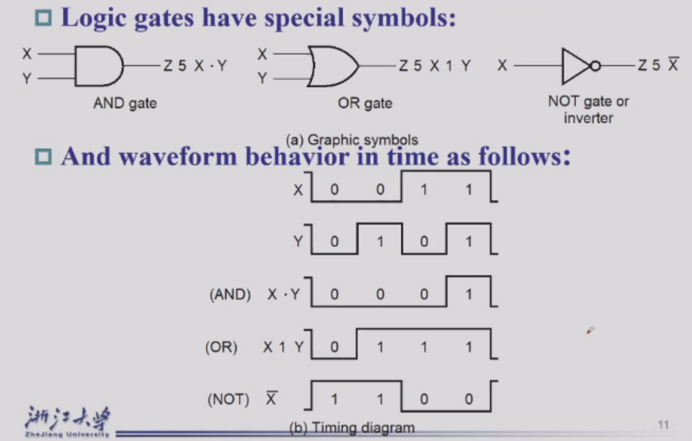

**Gate Delay**

In actual phtsical gates, if one or more input changes causes the output to change, the output change does not occur instantaneously.

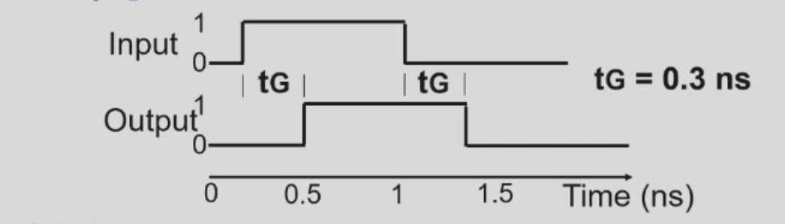

*只需要与非门，其实可以搭建出所有的逻辑门。*
<!-- Truth tables for NAND, NOR, AOI, XOR, XNOR gates -->

**NOT AND - NAND Gate**

<table style="width: 100%; border-collapse: collapse; border-top: 2px solid #e0e0e0; border-bottom: 2px solid #e0e0e0; text-align: left; background-color: transparent;">
    <thead>
        <tr style="border-bottom: 1px solid #e0e0e0;">
            <th style="padding: 10px; font-weight: bold;">$A$</th>
            <th style="padding: 10px; font-weight: bold;">$B$</th>
            <th style="padding: 10px; font-weight: bold;">$A \cdot B$</th>
            <th style="padding: 10px; font-weight: bold;">NAND ($\overline{A \cdot B}$)</th>
        </tr>
    </thead>
    <tbody>
        <tr><td style="padding: 8px;">0</td><td style="padding: 8px;">0</td><td style="padding: 8px;">0</td><td style="padding: 8px;">1</td></tr>
        <tr><td style="padding: 8px;">0</td><td style="padding: 8px;">1</td><td style="padding: 8px;">0</td><td style="padding: 8px;">1</td></tr>
        <tr><td style="padding: 8px;">1</td><td style="padding: 8px;">0</td><td style="padding: 8px;">0</td><td style="padding: 8px;">1</td></tr>
        <tr><td style="padding: 8px;">1</td><td style="padding: 8px;">1</td><td style="padding: 8px;">1</td><td style="padding: 8px;">0</td></tr>
    </tbody>
</table>

**NOT OR - NOR Gate**

<table style="width: 100%; border-collapse: collapse; border-top: 2px solid #e0e0e0; border-bottom: 2px solid #e0e0e0; text-align: left; background-color: transparent;">
    <thead>
        <tr style="border-bottom: 1px solid #e0e0e0;">
            <th style="padding: 10px; font-weight: bold;">$A$</th>
            <th style="padding: 10px; font-weight: bold;">$B$</th>
            <th style="padding: 10px; font-weight: bold;">$A + B$</th>
            <th style="padding: 10px; font-weight: bold;">NOR ($\overline{A + B}$)</th>
        </tr>
    </thead>
    <tbody>
        <tr><td style="padding: 8px;">0</td><td style="padding: 8px;">0</td><td style="padding: 8px;">0</td><td style="padding: 8px;">1</td></tr>
        <tr><td style="padding: 8px;">0</td><td style="padding: 8px;">1</td><td style="padding: 8px;">1</td><td style="padding: 8px;">0</td></tr>
        <tr><td style="padding: 8px;">1</td><td style="padding: 8px;">0</td><td style="padding: 8px;">1</td><td style="padding: 8px;">0</td></tr>
        <tr><td style="padding: 8px;">1</td><td style="padding: 8px;">1</td><td style="padding: 8px;">1</td><td style="padding: 8px;">0</td></tr>
    </tbody>
</table>

**AND-OR-INVERT (AOI) Gate**  
(Example: AOI for $A$, $B$, $C$; Output = $\overline{(A \cdot B) + C}$)

<table style="width: 100%; border-collapse: collapse; border-top: 2px solid #e0e0e0; border-bottom: 2px solid #e0e0e0; text-align: left; background-color: transparent;">
    <thead>
        <tr style="border-bottom: 1px solid #e0e0e0;">
            <th style="padding: 10px; font-weight: bold;">$A$</th>
            <th style="padding: 10px; font-weight: bold;">$B$</th>
            <th style="padding: 10px; font-weight: bold;">$C$</th>
            <th style="padding: 10px; font-weight: bold;">$(A \cdot B) + C$</th>
            <th style="padding: 10px; font-weight: bold;">AOI ($\overline{(A \cdot B) + C}$)</th>
        </tr>
    </thead>
    <tbody>
        <tr><td style="padding: 8px;">0</td><td style="padding: 8px;">0</td><td style="padding: 8px;">0</td><td style="padding: 8px;">0</td><td style="padding: 8px;">1</td></tr>
        <tr><td style="padding: 8px;">0</td><td style="padding: 8px;">0</td><td style="padding: 8px;">1</td><td style="padding: 8px;">1</td><td style="padding: 8px;">0</td></tr>
        <tr><td style="padding: 8px;">0</td><td style="padding: 8px;">1</td><td style="padding: 8px;">0</td><td style="padding: 8px;">0</td><td style="padding: 8px;">1</td></tr>
        <tr><td style="padding: 8px;">0</td><td style="padding: 8px;">1</td><td style="padding: 8px;">1</td><td style="padding: 8px;">1</td><td style="padding: 8px;">0</td></tr>
        <tr><td style="padding: 8px;">1</td><td style="padding: 8px;">0</td><td style="padding: 8px;">0</td><td style="padding: 8px;">0</td><td style="padding: 8px;">1</td></tr>
        <tr><td style="padding: 8px;">1</td><td style="padding: 8px;">0</td><td style="padding: 8px;">1</td><td style="padding: 8px;">1</td><td style="padding: 8px;">0</td></tr>
        <tr><td style="padding: 8px;">1</td><td style="padding: 8px;">1</td><td style="padding: 8px;">0</td><td style="padding: 8px;">1</td><td style="padding: 8px;">0</td></tr>
        <tr><td style="padding: 8px;">1</td><td style="padding: 8px;">1</td><td style="padding: 8px;">1</td><td style="padding: 8px;">1</td><td style="padding: 8px;">0</td></tr>
    </tbody>
</table>

**Exclusive-OR (XOR) Gate**

<table style="width: 100%; border-collapse: collapse; border-top: 2px solid #e0e0e0; border-bottom: 2px solid #e0e0e0; text-align: left; background-color: transparent;">
    <thead>
        <tr style="border-bottom: 1px solid #e0e0e0;">
            <th style="padding: 10px; font-weight: bold;">$A$</th>
            <th style="padding: 10px; font-weight: bold;">$B$</th>
            <th style="padding: 10px; font-weight: bold;">XOR ($A \oplus B$)</th>
        </tr>
    </thead>
    <tbody>
        <tr><td style="padding: 8px;">0</td><td style="padding: 8px;">0</td><td style="padding: 8px;">0</td></tr>
        <tr><td style="padding: 8px;">0</td><td style="padding: 8px;">1</td><td style="padding: 8px;">1</td></tr>
        <tr><td style="padding: 8px;">1</td><td style="padding: 8px;">0</td><td style="padding: 8px;">1</td></tr>
        <tr><td style="padding: 8px;">1</td><td style="padding: 8px;">1</td><td style="padding: 8px;">0</td></tr>
    </tbody>
</table>

**Exclusive-NOR (XNOR) Gate**

<table style="width: 100%; border-collapse: collapse; border-top: 2px solid #e0e0e0; border-bottom: 2px solid #e0e0e0; text-align: left; background-color: transparent;">
    <thead>
        <tr style="border-bottom: 1px solid #e0e0e0;">
            <th style="padding: 10px; font-weight: bold;">$A$</th>
            <th style="padding: 10px; font-weight: bold;">$B$</th>
            <th style="padding: 10px; font-weight: bold;">XNOR ($\overline{A \oplus B}$)</th>
        </tr>
    </thead>
    <tbody>
        <tr><td style="padding: 8px;">0</td><td style="padding: 8px;">0</td><td style="padding: 8px;">1</td></tr>
        <tr><td style="padding: 8px;">0</td><td style="padding: 8px;">1</td><td style="padding: 8px;">0</td></tr>
        <tr><td style="padding: 8px;">1</td><td style="padding: 8px;">0</td><td style="padding: 8px;">0</td></tr>
        <tr><td style="padding: 8px;">1</td><td style="padding: 8px;">1</td><td style="padding: 8px;">1</td></tr>
    </tbody>
</table>

## 2.2 Boolean Algebra

**Basic Equation**

1. $X + 0 = X$
2. $X \cdot 1 = X$
3. $X + 1 = 1$
4. $X \cdot 0 = 0$
5. $X + X = X$
6. $X \cdot X = X$
7. $X + \overline{X} = 1$
8. $X \cdot \overline{X} = 0$
9. $\overline{\overline{X}} = X$
10. $X + Y = Y + X$ (Commutative)
11. $XY = YX$ (Commutative)
12. $(X + Y) + Z = X + (Y + Z)$ (Associative)
13. $(XY)Z = X(YZ)$ (Associative)
14. $X(Y + Z) = XY + XZ$ (Distributive)
15. $X + YZ = (X + Y)(X + Z)$ (Distributive)
16. $\overline{X + Y} = \overline{X} \cdot \overline{Y}$ (DeMorgan's)
17. $\overline{X \cdot Y} = \overline{X} + \overline{Y}$ (DeMorgan's)

**Duality Rules**
For logic function F, *all ANDs are replaced by ORs, all ORs are replaced by ANDs*, *all 0s are replaced by 1s, and all 1s are replaced by 0s*. The resulting function is the dual of F, denoted as $F^D$.

简单来说就是等式两边，把所有的AND换成OR，所有的OR换成AND，所有的0换成1，所有的1换成0，等式依旧成立（变量不需要改变）。

**Proof of Consensus Theorem**
Example：
$$ AB+\overline{A}C+BC = AB+\overline{A}C $$
Proof:
$$ \begin{align}
AB+\overline{A}C+BC &= AB+\overline{A}C+BC(1)\\
&= AB+\overline{A}C+BC(A+\overline{A}) \\
&= AB+\overline{A}C+ABC+\overline{A}BC \\
&= AB(1+C)+\overline{A}C+\overline{A}C(1+B)\\
&= AB+\overline{A}C
\end{align} $$    

**Substitution Rules (代入规则)**
在布尔代数中，代入规则指的是：如果一个逻辑等式成立，那么你可以用*任何一个逻辑表达式（或变量）*去替换等式两边出现的*同一个变量*，替换后等式依然成立。这让我们可以利用简单的基本公式推导出更复杂的公式。

**Additional Equation**

1. $xf(x,\overline{x},y...,z_n) = xf(1,0,y...,z_n)$
2. $\overline{x}f(x,\overline{x},y...,z_n) = \overline{x}f(1,0,y...,z_n)$

同理，我们可以得到

3. $x+f(x,\overline{x},y...,z_n) = x+f(1,0,y...,z_n)$
4. $\overline{x}+f(x,\overline{x},y...,z_n) = \overline{x}+f(1,0,y...,z_n)$

除此之外，我们还可以对逻辑函数进行分解

5. $f(x,\overline{x},y...,z_n) = xf(1,0,y...,z_n) + \overline{x}f(1,0,y...,z_n)$
6. $f(x,\overline{x},y...,z_n) = (x+f(1,0,y...,z_n))( \overline{x}+f(1,0,y...,z_n))$

**两次对偶简化**

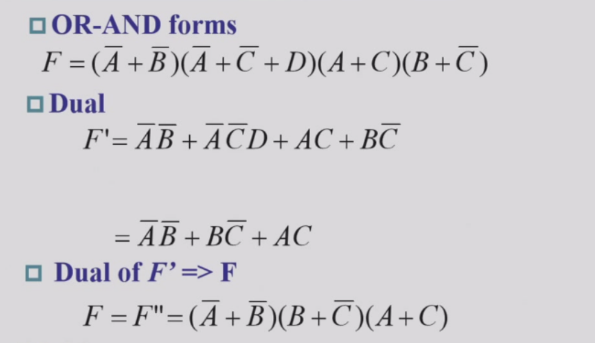

---
## 2.3 Standard Forms

**Minterm (最小项)**
- **定义**：包含所有 $n$ 个变量的**乘积项（AND项）**，每个变量以原变量($A$)或反变量($\overline{A}$)形式出现一次。该项仅在唯一的一组输入组合下输出为 1。（赋值原则：想要结果为1，原变量输入需为1，反变量输入需为0）。
- **举例**：对于系统变量 $A, B$，当输入情况为 $A=1, B=0$（即二进制 `10`，十进制为2）时，对应的最小项是 $A\cdot\overline{B}$，代号记作 $m_2$。

**Maxterm (最大项)**
- **定义**：包含所有 $n$ 个变量的**求和项（OR项）**，每个变量以原变量($A$)或反变量($\overline{A}$)形式出现一次。该项仅在唯一的一组输入组合下输出为 0。（与最小项完全相反，赋值原则：想要结果为0，原变量输入需为0，反变量输入需为1）。
- **举例**：对于系统变量 $A, B$，同样当输入情况为 $A=1, B=0$（十进制为2）时，为了让加法结果等于0，对应的最大项是 $\overline{A}+B$，代号记作 $M_2$。

*(注：由于德·摩根定律，同编号的最小项和最大项互为补数，即 $\overline{m_i} = M_i$ 且 $\overline{M_i} = m_i$)*

**规范形式 (Standard Forms)**
利用 Minterm 和 Maxterm，我们可以把任何真值表直接翻译成标准的方程式：
1. **Sum of Minterms (最小项之和 / Standard SOP)**：提取真值表中最终输出为 **1** 的所有行，把它们对应的最小项 $m_i$ 全部 **相加 (OR)**。
2. **Product of Maxterms (最大项之积 / Standard POS)**：提取真值表中最终输出为 **0** 的所有行，把它们对应的最大项 $M_i$ 全部 **相乘 (AND)**。

**综合应用举例**：
假设有一个 2 变量系统 $F(A,B)$，其功能真值表规定：
- 当输入组合为 `01`(十进制1) 和 `11`(十进制3) 时，系统由于条件满足，输出为 **1**。
- 当输入组合为 `00`(十进制0) 和 `10`(十进制2) 时，系统条件不满足，输出为 **0**。

利用上述规范形式，我们可以直接写出它的数字逻辑方程式：
- **求积之和 (SOP)**：找输出为 1 的行（第 1 和 3 行），将其最小项相加：
  $F = \Sigma m(1, 3) = m_1 + m_3 = \overline{A}B + AB$
- **求和之积 (POS)**：找输出为 0 的行（第 0 和 2 行），将其最大项相乘：
  $F = \Pi M(0, 2) = M_0 \cdot M_2 = (A + B) \cdot (\overline{A} + B)$
*(上述两个式子在逻辑上是完全等价的。)*

---
## 2.4 Circuit Optimization (电路优化)

**优化的目的**
通过特定的步骤或算法为给定的逻辑函数找到最简单的电路实现方式。为了衡量逻辑电路的简单程度，我们需要引入**成本标准 (Cost Criteria)**。

**核心衡量标准**

1. **L：Literal Cost（字面量成本）**
   - *定义*：布尔表达式中所有变量（包括原变量 $A$ 和反变量 $\overline{A}$）出现的*总次数*。
   - *计算*：直接数表达式中有多少个字母。

2. **G：Gate Input Cost（门输入成本）**
   - *定义*：实现该逻辑等式所需的所有门电路的*输入端总数*（此标准下不计算非门/反相器）。
   - *计算公式（针对SOP或POS）*：$G = L + (\text{包含} >1 \text{个字面量的项数})$
3. **GN：Gate Input Cost with NOTs（含非门的门输入成本）**
   - *定义*：在 G 的基础上，将非门（Inverter）的成本也计算在内。
   - *计算公式*：$GN = G + (\text{表达式中出现的}\mathbf{不同}\text{反变量的个数})$

**计算示例**
对于方程 $F = BD + A\overline{B}C + A\overline{C}\overline{D}$：
- *L* = 8 （表达式中一共有8个字母）
- *G* = 8 (L) + 3 (共有三个项，且每个项字面量都$>1$) = *11*
- *GN* = 11 (G) + 3 (出现了 $\overline{B}, \overline{C}, \overline{D}$ 三个不同的反变量) = *14*

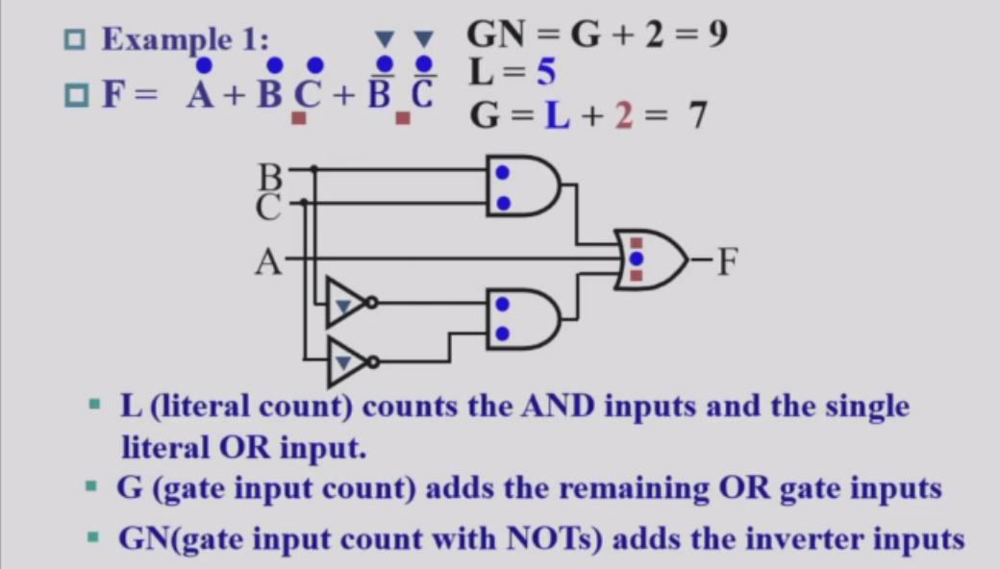

---
## 2.5 Karnaugh Map (卡诺图)

卡诺图是一种用于简化布尔表达式的图形工具。它通过将真值表以二维或多维网格形式排列，使逻辑函数的最小项或最大项直观分布。通过合并相邻的格子（代表输入变量的不同组合），可以快速找到最简逻辑表达式，减少电路实现的复杂度。

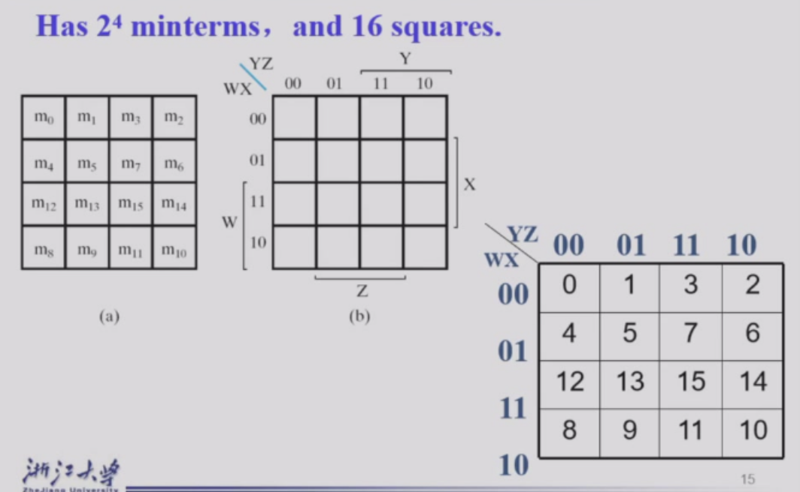
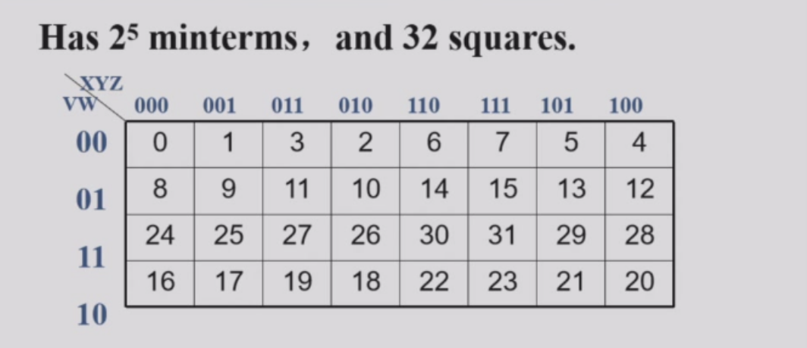

**优化方法**

- 直观地来看，2个1相邻可以消除一个变量，4个1两两相邻可以消除两个变量...（在表头和表尾相邻的1也可以合并）

再来看下面这张图

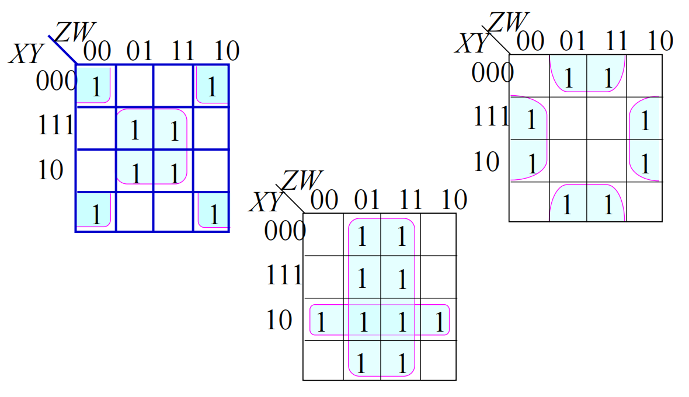

**Prime Implicant（主蕴涵项）**：

- A *Prime Implicant* is a product term obtained by combining the *maximum possible number of adjacent squares* in the map into a rectangle with the number of squares a power of 2.
- A prime implicant is called an *Essential Prime Implicant* if it is *the only prime implicant that covers includes one or more minterms*.
- Prime Implicants and Essential Prime Implicants can be determined by inspection of a K-Map

> 通过将**尽可能多**的相邻的 `1` 所在的方格（方格数为 $2^n$ 个）圈起来形成的一个乘积项。简单来说，就是卡诺图中“无法再扩大的最大的圈”。

> **质/本质主蕴涵项 (Essential Prime Implicant)**：如果卡诺图中的某一个最小项（某个 `1`）**只被唯一的一个大圈（主蕴涵项）覆盖**，那么这个大圈就是本质主蕴涵项。它意味着这个项在最终的最简表达式中是绝对不可或缺的。

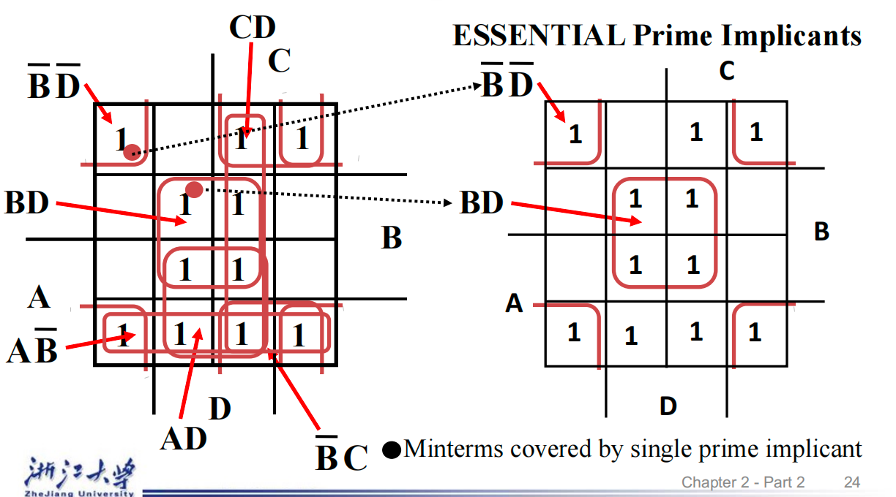

如上图中，只有左上角这两个框是 Essential Prime Implicant，因为它们覆盖的 `1` 只被它们自己覆盖，而其他的 `1` 都被多个大圈覆盖，所以其他的大圈都是非本质主蕴涵项。

把他们选出来之后，再看一下剩下的 `1`，看看还有没有被覆盖的，如果有的话就选一个非本质主蕴涵项把它覆盖掉，直到所有的 `1` 都被覆盖掉为止。

例：

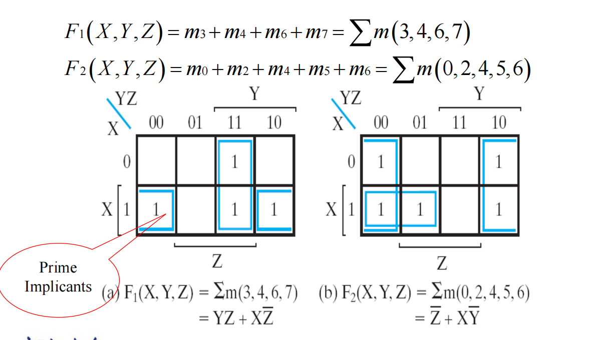

**反过来，也可以把0框起来计算**

**无关项 (Don't Cares in K-Maps)**

有时，在真值表或卡诺图中，我们会遇到一些特定的条目满足以下情况：
- 该最小项对应的**输入值永远不会出现**；或者
- 该最小项对应的**输出值根本不被系统使用**。
 
在这些情况下，系统的输出值是不需要被严格定义为 0 或 1 的。
相反，我们可以将这些输出值定义为**“无关项 (don't care)”**。
通过在真值表或卡诺图中将这些位置标记为“无关项”（通常用 **“x”** 表示），我们可以更灵活地画圈，从而**降低逻辑电路的成本**（即将 x 视作 1 或 0 来帮助凑出更大的圈，如果不用的 x 则当做 0 忽略）。
 
 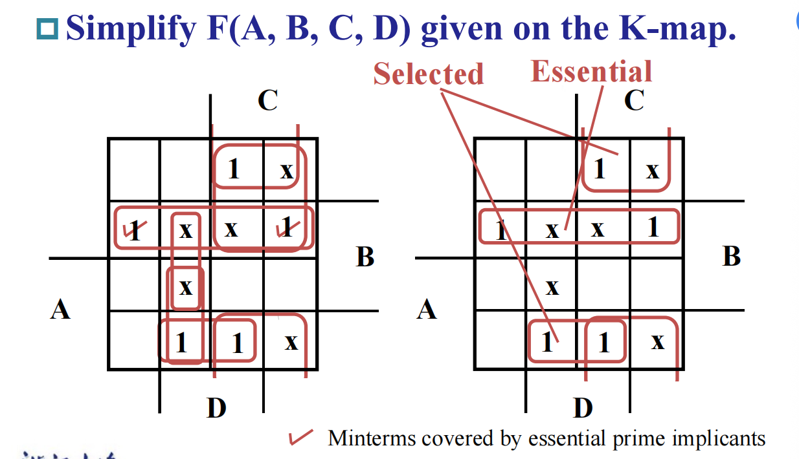

## 2.6 Additional Gates and Circuits

**Buffer**

- A buffer is a gate with the function $F=X$.

在电路中插入一个buffer可以规整电路结构。虽然buffer本身不改变信号的逻辑值，但它可以增强信号的驱动能力，使得信号在传输过程中不易衰减，保持信号的完整性。

其他的门详见表格吧

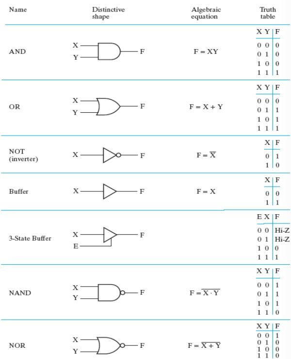

**Transmission Gate**

A transmission gate can be regarded as a switch.

**The 3-State Buffer**

当S=0时，输出的事IN0，当S=1时，输出的是IN1，两个 3-state buffer 组合成一个选择器。

**Complex Gates**

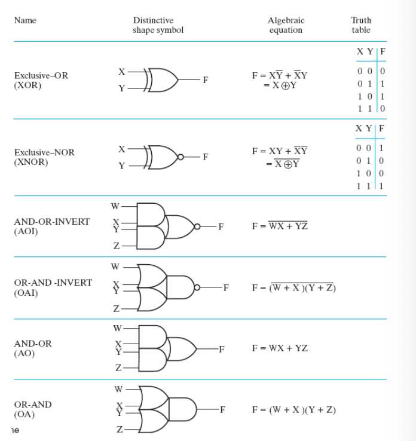

## 2.7 HDL Overview