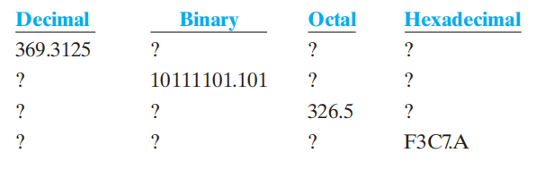
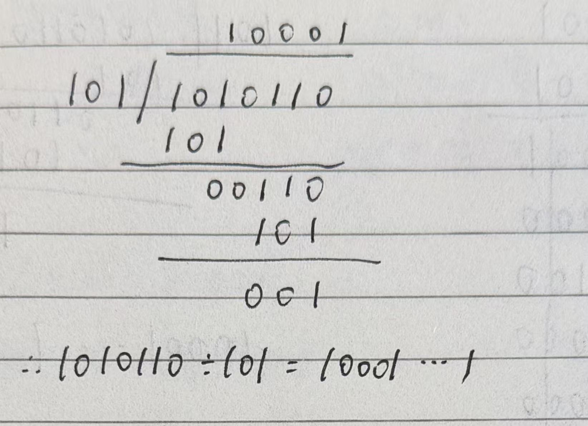

# Homework of Chapter 1

**1.3** List the binary, octal, and hexadecimal numbers from 16 to 31

*Answer:*

<table style="width: 100%; border-collapse: collapse; border-top: 2px solid #e0e0e0; border-bottom: 2px solid #e0e0e0; text-align: left; background-color: transparent;">
    <thead>
        <tr style="border-bottom: 1px solid #e0e0e0;">
            <th style="padding: 10px; font-weight: bold;">Binary</th>
            <th style="padding: 10px; font-weight: bold;">Ocral</th>
            <th style="padding: 10px; font-weight: bold;">Hexadecimal</th>
        </tr>
    </thead>
    <tbody>
        <tr><td style="padding: 8px;">1000 0</td><td style="padding: 8px;">20</td><td style="padding: 8px;">10</td></tr>
        <tr><td style="padding: 8px;">1000 1</td><td style="padding: 8px;">21</td><td style="padding: 8px;">11</td></tr>
        <tr><td style="padding: 8px;">1001 0</td><td style="padding: 8px;">22</td><td style="padding: 8px;">12</td></tr>
        <tr><td style="padding: 8px;">1001 1</td><td style="padding: 8px;">23</td><td style="padding: 8px;">13</td></tr>
        <tr><td style="padding: 8px;">1010 0</td><td style="padding: 8px;">24</td><td style="padding: 8px;">14</td></tr>
        <tr><td style="padding: 8px;">1010 1</td><td style="padding: 8px;">25</td><td style="padding: 8px;">15</td></tr>
        <tr><td style="padding: 8px;">1011 0</td><td style="padding: 8px;">26</td><td style="padding: 8px;">16</td></tr>
        <tr><td style="padding: 8px;">1011 1</td><td style="padding: 8px;">27</td><td style="padding: 8px;">17</td></tr>
        <tr><td style="padding: 8px;">1100 0</td><td style="padding: 8px;">30</td><td style="padding: 8px;">18</td></tr>
        <tr><td style="padding: 8px;">1100 1</td><td style="padding: 8px;">31</td><td style="padding: 8px;">19</td></tr>
        <tr><td style="padding: 8px;">1101 0</td><td style="padding: 8px;">32</td><td style="padding: 8px;">1A</td></tr>
        <tr><td style="padding: 8px;">1101 1</td><td style="padding: 8px;">33</td><td style="padding: 8px;">1B</td></tr>
        <tr><td style="padding: 8px;">1110 0</td><td style="padding: 8px;">34</td><td style="padding: 8px;">1C</td></tr>
        <tr><td style="padding: 8px;">1110 1</td><td style="padding: 8px;">35</td><td style="padding: 8px;">1D</td></tr>
        <tr><td style="padding: 8px;">1111 0</td><td style="padding: 8px;">36</td><td style="padding: 8px;">1E</td></tr>
        <tr><td style="padding: 8px;">1111 1</td><td style="padding: 8px;">37</td><td style="padding: 8px;">1F</td></tr>
    </tbody>
</table>

**1.9** Convert the following numbers from the give base to the other three bases listed in the table:

*Answer:*

<table style="width: 100%; border-collapse: collapse; border-top: 2px solid #e0e0e0; border-bottom: 2px solid #e0e0e0; text-align: left; background-color: transparent;">
    <thead>
        <tr style="border-bottom: 1px solid #e0e0e0;">
            <th style="padding: 10px; font-weight: bold;">Decimal</th>
            <th style="padding: 10px; font-weight: bold;">Binary</th>
            <th style="padding: 10px; font-weight: bold;">Ocral</th>
            <th style="padding: 10px; font-weight: bold;">Hexadecimal</th>
        </tr>
    </thead>
    <tbody>
        <tr><td style="padding: 8px;">369.3125</td><td style="padding: 8px;">1011 1000 1.0101</td><td style="padding: 8px;">561.21</td><td style="padding: 8px;">171.5</td></tr>
        <tr><td style="padding: 8px;">189.625</td><td style="padding: 8px;">1011 1101.101</td><td style="padding: 8px;">275.5</td><td style="padding: 8px;">BD.A</td></tr>
        <tr><td style="padding: 8px;">214.625</td><td style="padding: 8px;">1101 0110.101</td><td style="padding: 8px;">326.5</td><td style="padding: 8px;">D6.A</td></tr>
        <tr><td style="padding: 8px;">62407.625</td><td style="padding: 8px;">1111 0011 1100 0111.101</td><td style="padding: 8px;">171707.50</td><td style="padding: 8px;">F3C7.A</td></tr>
    </tbody>
</table>

**1.12** Perform the following binary multiplications:

a. 1010 x 1100

b. 0110 x 1001

c. 1111001 x 011101

*Answer:*

a.
$$ \begin{array}{cccccc}
& & & 1 & 0 & 1 & 0 \\
\times & & & 1 & 1 & 0 & 0 \\ 
\hline
& & & 0 & 0 & 0 & 0 \\
& & 0 & 0 & 0 & 0 & 0\\
& 1 & 0 & 1 & 0 & 0 & 0\\
1 & 0 & 1 & 0 & 0 & 0 & 0\\
\hline
1& 1 & 1 & 1 & 0 & 0 & 0\\
\end{array} $$

b.
$$ \begin{array}{cccccc}
& & & 0 & 1 & 1 & 0 \\
\times & & & 1 & 0 & 0 & 1 \\
\hline
& & & 0 & 1 & 1 & 0 \\
& & 0 & 0 & 0 & 0 & 0 \\
& 0 & 0 & 0 & 0 & 0 & 0 \\
0 & 1 & 1 & 0 & 0 & 0 & 0 \\
\hline
0 & 1 & 1 & 0 & 1 & 1 & 0 \\
\end{array} $$

c.
$$ \begin{array}{cccccc}
& & & & & 1 & 1 & 1 & 1 & 0 & 0 & 1 \\
\times & & & & & & 0 & 1 & 1 & 1 & 0 & 1 \\
\hline
& & & & & 1 & 1 & 1 & 1 & 0 & 0 & 1 \\
& & & & 0 & 0 & 0 & 0 & 0 & 0 & 0 & 0 \\
& & & 1 & 1 & 1 & 1 & 0 & 0 & 1 & 0 & 0 \\
& & 1 & 1 & 1 & 1 & 0 & 0 & 1 & 0 & 0 & 0 \\
& 1 & 1 & 1 & 1 & 0 & 0 & 1 & 0 & 0 & 0 & 0\\
\hline
1 & 1 & 0 & 1 & 1 & 0 & 1 & 1 & 0 & 1 & 0 & 1 \\
\end{array} $$

**1.13** Division is composed of multiplications and subtractions. Perform the binary division 1010110 ÷ 101 to obtain a quotient and remainder

*Answer:*

直接利用二进制除法算法即可，除法的方式类似于十进制的方法，这里不方便用公式打我就直接用手写的照片了

**1.16** In each of the following cases, determine the radix r:

a. $(BEE)_r = (2699)_{10}$

b. $(365)_{r} = (194)_{10}$

*Answer:*

a. 
$$\begin{aligned}
(BEE)_r &= 11 \cdot r^2 + 14 \cdot r + 14 \\
&= 11r^2 + 14r + 14 \\
&= 2699
\end{aligned}$$

解得$$r = 15$$

b.
$$\begin{aligned}
(365)_r &= 3 \cdot r^2 + 6 \cdot r + 5 \\
&= 3r^2 + 6r + 5 \\
&= 194
\end{aligned}$$

解得$$r = 7$$

**1.18** Find the binary representations for each of the following BCD numbers:

a. 0100 1000 0110 0111

b. 0011 0111 1000.0111 0101

*Answer:*

a. $0100 1000 0110 0111 = (4867)_{BCD}$
b. $0011 0111 1000.0111 0101 = (378.75)_{BCD}$

**1.19** Represent the decimal numbers 715 and 354 in BCD

*Answer:*
a. 715 in BCD is represented as 0111 0001 0101
b. 354 in BCD is represented as 0011 0101 0100

**1.28** Using the procedure given in Section 1-7, find the hexadecimal Gray code.

*Answer:*

根据 1-7 节的镜像反射法（Binary Reflected Gray Code），十六进制（0-15，即 4 位二进制）的格雷码构造如下：

1. **前一半（0~7）**：
   - 0 (0000) &rarr; **0000**
   - 1 (0001) &rarr; **0001**
   - 2 (0010) &rarr; **0011**
   - 3 (0011) &rarr; **0010**
   - 4 (0100) &rarr; **0110**
   - 5 (0101) &rarr; **0111**
   - 6 (0110) &rarr; **0101**
   - 7 (0111) &rarr; **0100**

2. **后一半（8~15）**（由前一半倒序排列，并将首位的 `0` 替换为 `1`）：
   - 8 (1000) &rarr; **1100** (由 0100 变换首位)
   - 9 (1001) &rarr; **1101** (由 0101 变换首位)
   - A (1010) &rarr; **1111** (由 0111 变换首位)
   - B (1011) &rarr; **1110** (由 0110 变换首位)
   - C (1100) &rarr; **1010** (由 0010 变换首位)
   - D (1101) &rarr; **1011** (由 0011 变换首位)
   - E (1110) &rarr; **1001** (由 0001 变换首位)
   - F (1111) &rarr; **1000** (由 0000 变换首位)

---

### 补充：1-7 Gray Codes (格雷码) 核心内容总结

**1. 背景与应用**
在普通的二进制计数中，相邻的数字之间可能会发生多位改变（例如从 3 到 4，对应 $011 \rightarrow 100$，3个比特都变了）。在诸如光学轴角编码器等物理系统中，由于传感器读取时的对齐误差，多位连续变化极易产生读取错误。因此引入了格雷码：**这是一种任意两个相邻的数值之间，只有一个比特（Bit）发生改变的二进制编码。** 这种特性完美解决了过渡状态的错误问题，同时也使其在低功耗 CMOS 电路中有重要应用（连续计数时大大减少了位置翻转次数，使格雷码计数器的输出端功耗只占二进制计数的部分）。

**2. 格雷码的构造方法**
书中针对 $0$ 到 $2^n-1$ 的连续数字序列，主要给出了两种推导构造方法：

*   **镜像反射法（Binary Reflected Gray Code）**
    *   **步骤 1**：把需要生成的格雷码平分成两半，先求出前一半数字的 $n$ 位格雷码序列（这通常与 $n-1$ 位的格雷码相同，前面直接添 `0`）。
    *   **步骤 2**：提取出前一半的序列，**按照倒序排列**，作为后半部分的雏形。
    *   **步骤 3**：将后半部分所有倒序数字的最左侧首位的 `0` 统一替换为 `1`，即可得到后一半对应的格雷码。

*   **直接转换法（偶校验/异或原二进制数）**
    *   对于一个已知的正常二进制数，也可以将其直接快速转换为对应的格雷码格式，而不用画表反射。
    *   **规则**：格雷码的最左边第一位，直接拷贝原二进制值的最左边第一位。格雷码对应的其他剩余各位，分别等于原二进制数对应位字与其左侧相邻位进行**偶校验**（即逻辑“异或”运算：两数相同取 `0`，不同取 `1`）。
    *   *示例*：将二进制数 `0100` 转换为格雷码：第一位原样为 `0`；第二位是 `parity(0,1)=1`；第三位 `parity(1,0)=1`；第四位 `parity(0,0)=0`。因此最终生成的格雷码为 `0110`。

