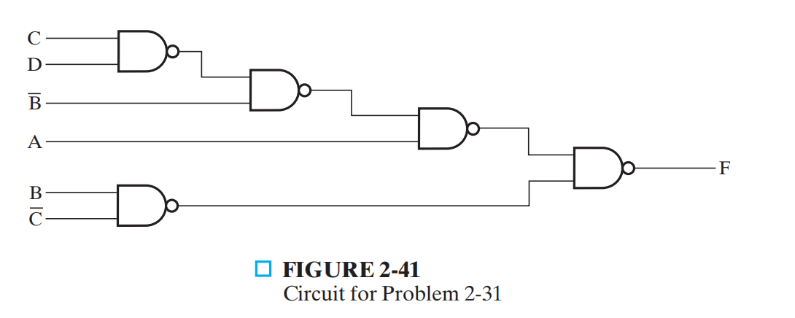

# Homework of Chapter 2

**2.1 a** Demonstrate by means of truth tables the validity of the following identities:
(a) DeMorgan’s theorem for three variables: $\overline{XYZ} = \overline{X} + \overline{Y} + \overline{Z}$
(b) The second distributive law: $X + YZ = (X + Y)(X + Z)$
(c) $\overline{X}Y + \overline{Y}Z + X\overline{Z} = X\overline{Y} + Y\overline{Z} + \overline{X}Z$

**2.2 a/c** *Prove the identity of each of the following Boolean equations, using algebraic manipulation:
(a) $\overline{X}\overline{Y} + \overline{X}Y + XY = \overline{X} + Y$
(c) $Y + \overline{X}Z + X\overline{Y} = X + Y + Z$

**2.3 a/c** Prove the identity of each of the following Boolean equations, using 
algebraic manipulation:
(a) $AB\overline{C} + B\overline{C}\ \overline{D} + BC + \overline{C}D = B + \overline{C}D$
(c) $A\overline{D} + \overline{A}B + \overline{C}D + \overline{B}C = (\overline{A} + \overline{B} + \overline{C} + \overline{D})(A + B + C + D)$

**2.6 b/d** Simplify the following Boolean expressions to expressions containing a minimum number of literals:
(b) $(\overline{A + B + C}) \cdot \overline{ABC}$
(d) $\overline{A}\ \overline{B}D + \overline{A}\ \overline{C}D + BD$

**2.10 a/c**  *Obtain the truth table of the following functions, and express each function in sum-of-minterms and product-of-maxterms form:
(a) $(XY + Z)(Y + XZ)$
(c) $WX\overline{Y} + WX\overline{Z} + WXZ + Y\overline{Z}$

**2.11 a/c/d**

For the Boolean functions E and F, as given in the following truth table:
(a) List the minterms and maxterms of each function.
(c) List the minterms of $E + F$ and $E\cdot F$ 
(d) Express E and F in sum-of-minterms algebraic form.

<table style="width: 100%; border-collapse: collapse; border-top: 2px solid #e0e0e0; border-bottom: 2px solid #e0e0e0; text-align: left; background-color: transparent;">
    <thead>
        <tr style="border-bottom: 1px solid #e0e0e0;">
            <th style="padding: 10px; font-weight: bold;">X</th>
            <th style="padding: 10px; font-weight: bold;">Y</th>
            <th style="padding: 10px; font-weight: bold;">Z</th>
            <th style="padding: 10px; font-weight: bold;">E</th>
            <th style="padding: 10px; font-weight: bold;">F</th>
        </tr>
    </thead>
    <tbody>
        <tr><td style="padding: 8px;">0</td><td style="padding: 8px;">0</td><td style="padding: 8px;">0</td><td style="padding: 8px;">0</td><td style="padding: 8px;">1</td></tr>
        <tr><td style="padding: 8px;">0</td><td style="padding: 8px;">0</td><td style="padding: 8px;">1</td><td style="padding: 8px;">1</td><td style="padding: 8px;">0</td></tr>
        <tr><td style="padding: 8px;">0</td><td style="padding: 8px;">1</td><td style="padding: 8px;">0</td><td style="padding: 8px;">1</td><td style="padding: 8px;">1</td></tr>
        <tr><td style="padding: 8px;">0</td><td style="padding: 8px;">1</td><td style="padding: 8px;">1</td><td style="padding: 8px;">0</td><td style="padding: 8px;">0</td></tr>
        <tr><td style="padding: 8px;">1</td><td style="padding: 8px;">0</td><td style="padding: 8px;">0</td><td style="padding: 8px;">1</td><td style="padding: 8px;">1</td></tr>
        <tr><td style="padding: 8px;">1</td><td style="padding: 8px;">0</td><td style="padding: 8px;">1</td><td style="padding: 8px;">0</td><td style="padding: 8px;">0</td></tr>
        <tr><td style="padding: 8px;">1</td><td style="padding: 8px;">1</td><td style="padding: 8px;">0</td><td style="padding: 8px;">1</td><td style="padding: 8px;">0</td></tr>
        <tr><td style="padding: 8px;">1</td><td style="padding: 8px;">1</td><td style="padding: 8px;">1</td><td style="padding: 8px;">0</td><td style="padding: 8px;">1</td></tr>
    </tbody>
</table>

**2.12 b** Convert the following expressions into sum- of- products and product- of-sums forms:
(b) $\overline{X} + X(X + \overline{Y})(Y + \overline{Z})$

**2.15** Optimize the following Boolean expressions using a map:
(a) $\overline{X}\ \overline{Z} + Y\overline{Z} + XYZ$
(b) $\overline{A}B + \overline{B}C + \overline{A}\ \overline{B}\  \overline{C}$
(c) $\overline{A}\ \overline{B} + A\overline{C} + \overline{B}C + \overline{A}B\overline{C}$

**2.17** Optimize the following Boolean functions, using a map:
(a) $F(W, X, Y, Z) = \sum m(0, 1, 2, 4, 7, 8, 10, 12)$
(b) $F(A, B, C, D) = \sum m(1, 4, 5 , 6, 10, 11, 12, 13, 15)$

**2.19 a** Find all the prime implicants for the following Boolean functions, and determine which are essential:
(a) $F(W, X, Y, Z) = \sum m (0, 2, 5, 7, 8, 10, 12, 13, 14, 15)$

**2.22 a** Optimize the following expressions in (1) sum- of- products and (2) product-of-sums forms:
(a) $A\overline{C} + \overline{B}D + \overline{A}CD + ABCD$

**2.25 b** Optimize the following Boolean functions F together with the don’ t- care conditions d. Find all prime implicants and essential prime implicants, and 
apply the selection rule.
(b) $F(W, X, Y, Z) = \sum m (0, 2, 4, 5, 8, 14, 15), d(W, X, Y, Z)= \sum m (7, 10, 13)$

**2.29** *The NOR gates in Figure 2-39 have propagation delay tpd = 0.073 ns and the inverter has a propagation delay tpd = 0.048 ns. What is the propagation delay of the longest path through the circuit?

**2.30** The waveform in Figure 2-40 is applied to an inverter. Find the output of the inverter, assuming that
(a) It has no delay.
(b) It has a transport delay of 0.06 ns.
(c) It has an inertial delay of 0.06 ns with a rejection time of 0.04 ns

**2.31** Assume that $t_{pd}$ is the average of $t_{PHL}$ and $t_{PLH}$. Find the delay from each input to the output in Figure 2-41 by
(a) Finding $t_{PHL}$ and $t_{PLH}$ for each path, assuming $t_{PHL} = 0.20$ ns and 
$t_{PLH} = 0.36$ ns for each gate. From these values, find $t_{pd}$ for each path.
(b) Using $t_{pd} = 0.28$ ns for each gate.
(c) Compare your answers from parts (a) and (b) and discuss any differences.

