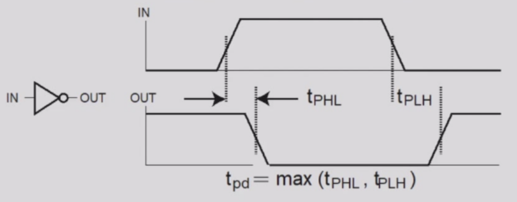
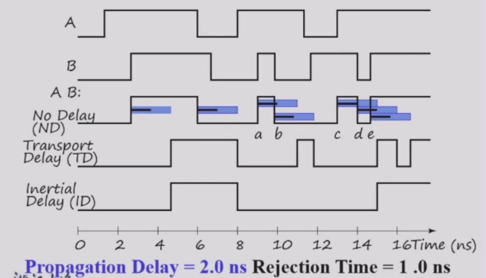
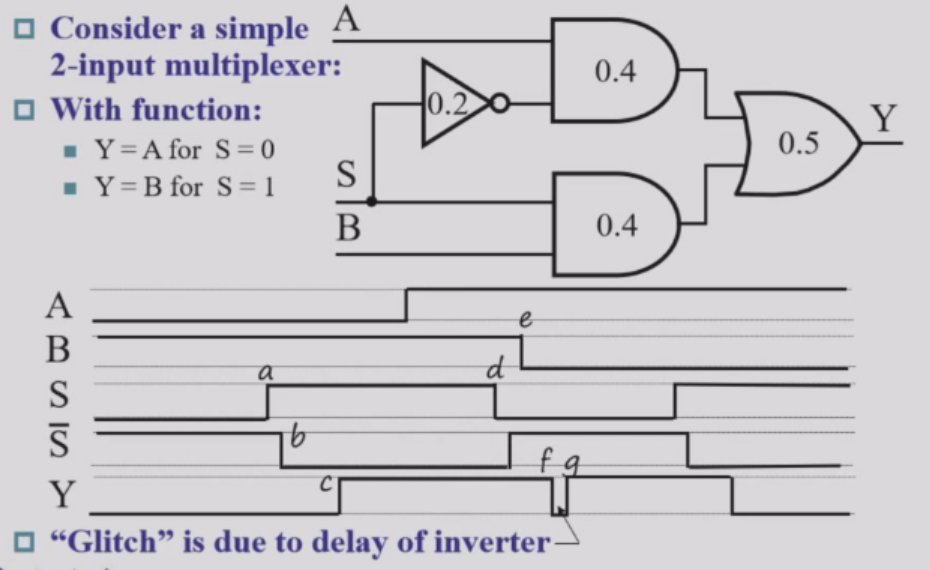
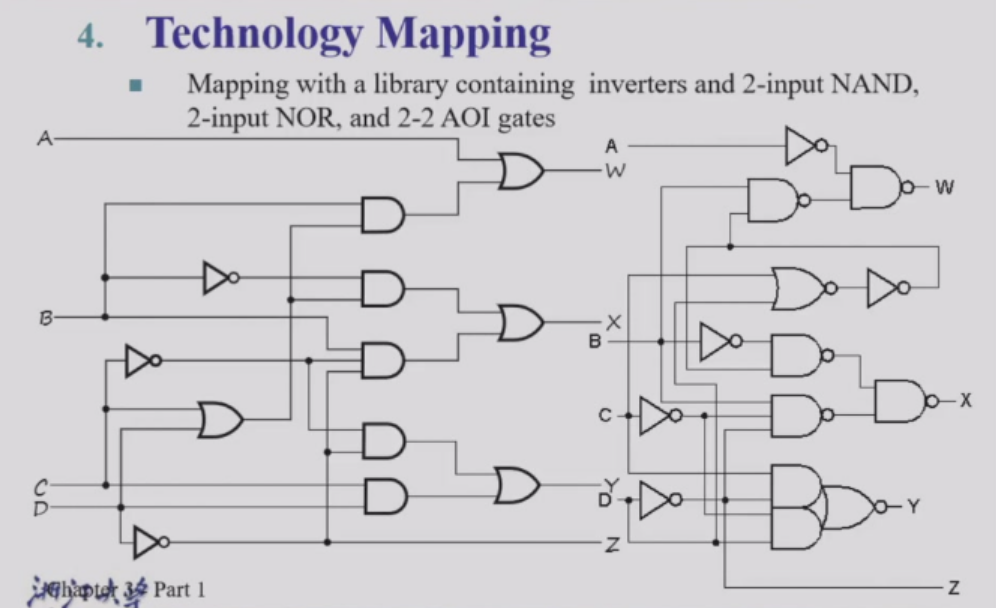
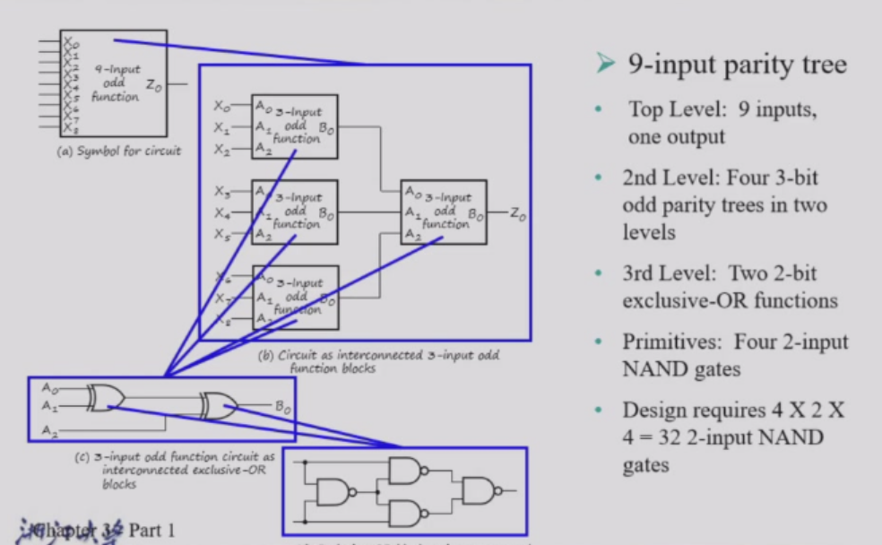
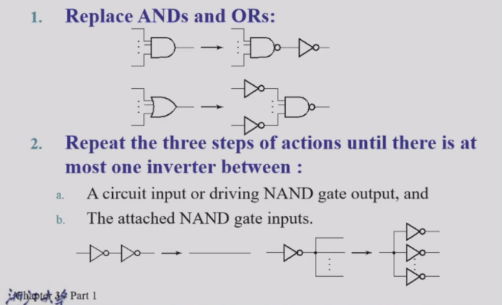
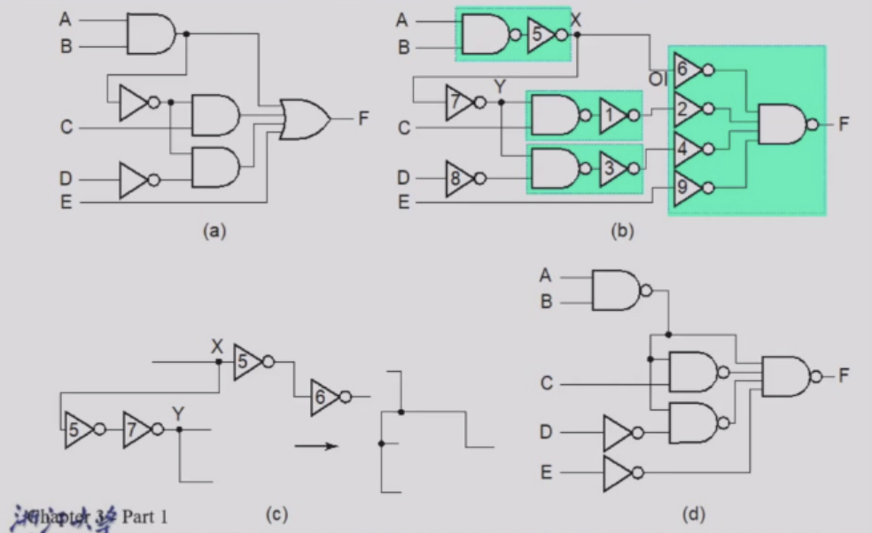
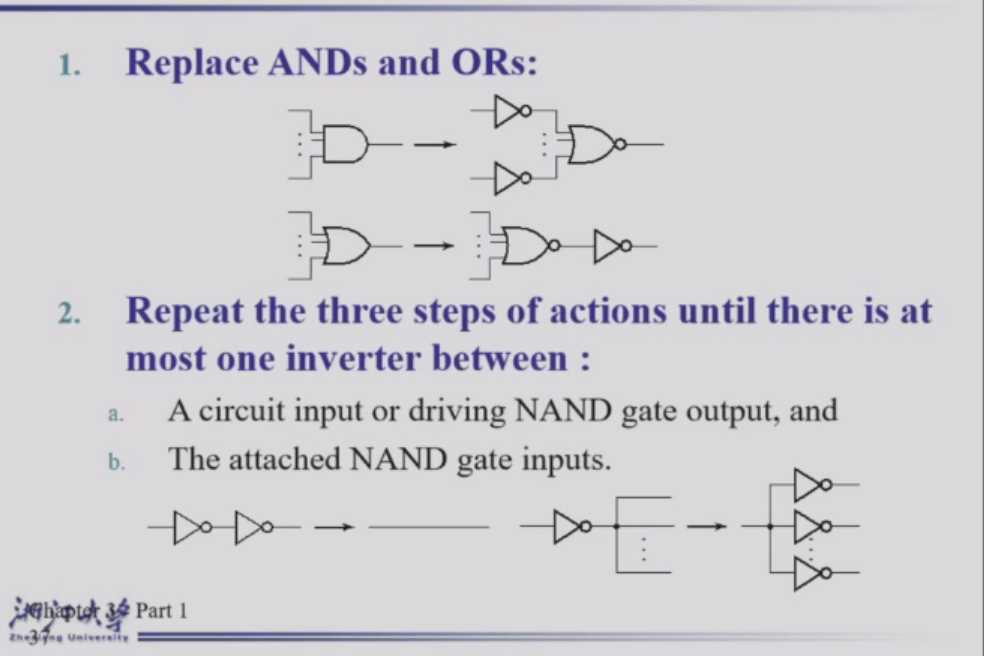
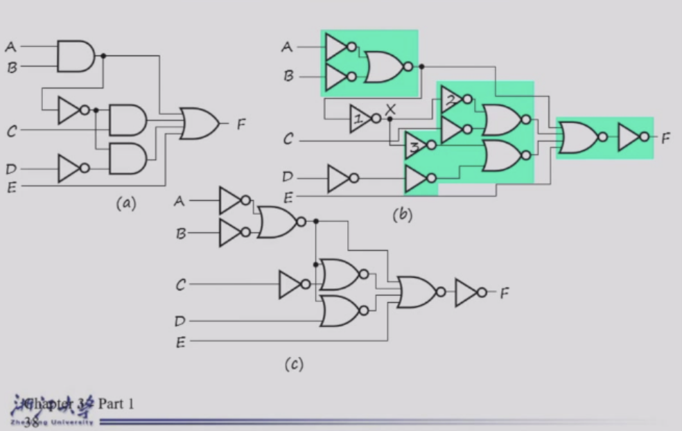
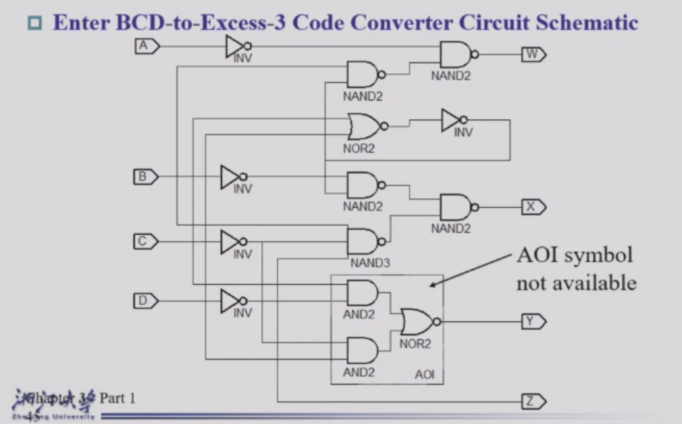

# Chapter 3 Combinational Logic Design

## Combinationla Circuits

A Combinational Circuits has
- A set of m Boolean inputs
- A set of n Boolean outputs
- n switching fuctions, each mapping the $2^m$ input combinations to a single Boolean output such that the current output depends only on the current input values.

---
## Integrated Circuits

Integrated Cricuits is a semiconductor crystal containing the electronic components for the digital gates and storage elements which are interconnected on the chip

- SSI (Small Scale Integration): Less than 10 gates per chip
- MSI (Medium Scale Integration): 10-100 gates per chip
- LSI (Large Scale Integration): 100-1000 gates per chip
- VLSI (Very Large Scale Integration): More than 1000 gates per chip

---
## Technology Parameters

Specific gate implementation technologies are characterized by the following parameters:

- **Fan-in (扇入)**: 门电路可用的输入端数量 
> The number of inputs available on a gate
- **Fan-out (扇出)**: 门电路输出端可驱动的标准负载数量 
> The number of standard loads driven by a gate output
- **Logic Levels (逻辑电平)**: 输入和输出信号中标识为 1 和 0 的电平/电压范围 
> The signal value ranges for 1 and 0 on the inputs and 1 and 0 on the outputs
- **Noise Margin (噪声容限)**: 正常输入值上可叠加的最大外部噪声电压，且该噪声不会导致电路输出发生意外改变 
> The maximum external noise voltage superimposed on a normal input value that will not cause an undesirable change in the circuit output
- **Cost for a gate (逻辑门成本)**: 衡量该门电路对集成电路总成本的贡献 
> A measure of the contribution by the gate to the cost of the integrated circuit
- **Propagation Delay (传播延迟)**: 信号状态变化从输入端传播到输出端所需的时间 
> The time required for a change in the value of a signal to propagate from an input to an output
- **Power Dissipation (功耗)**: 从电源提取并被该门电路所消耗的功率大小 
> The amount of power drawn from the power supply and consumed by the gate

**Fan-out (扇出)**

扇出 (Fan-out) 通常根据**标准负载 (standard load)** 来进行定义：

- **标准负载 (Standard Load)**：例如，1个标准负载等于1个反相器 (inverter) 的输入端所贡献的负载。
- **转换时间 (Transition time)**：门电路输出从高电平变到低电平 ($t_{HL}$) 或从低电平变到高电平 ($t_{LH}$) 所需要的时间。
- **最大扇出 (Maximum fan-out)**：一个逻辑门在**不超过其规定的最大转换时间**的前提下，所能驱动的标准负载的最大数量。

**Cost (成本)**

在集成电路 (Integrated Circuit) 中：
- 一个逻辑门的成本与其所占用的**芯片面积 (chip area)** 成正比。
- 门电路的面积大致与**晶体管的数量和尺寸 (number and size of the transistors)** 以及连接它们的**布线数量 (amount of wiring)** 成正比。
- 如果忽略布线面积，门电路的面积大致与**逻辑门输入端的数量 (gate input count)** 成正比。
- 因此，逻辑门的输入端数量是衡量逻辑门成本的一个粗略指标。

> **注意：** 如果已知逻辑门占用的实际芯片布局面积 (actual chip layout area)，将是一个准确得多的成本衡量标准。

**Propagation Delay (传播延迟)**

- **传播延迟 (Propagation delay)**：输入端的变化传播到门电路输出端所需的时间。
- **测量基准**：延迟通常在相对于高电平 (H) 和低电平 (L) 输出电压的 **50%** 处进行测量 (measured at the 50% point)。
- **方向差异**：输出信号从高到低 ($t_{PHL}$) 和从低到高 ($t_{PLH}$) 的变化可能具有**不同**的传播延迟 (having different propagation delays)。
- **参考节点定义**：高到低 (HL) 和低到高 (LH) 的转换始终是相对于**输出端 (output)** 进行定义的，而**不是输入端 (not the input)**。

**Delay Models (延迟模型)**

- **Transport delay (传输延迟)**：输出响应输入的变化，在经历一段**固定的规定延迟时间 (fixed specified delay)** 之后才发生相应的改变。
- **Inertial delay (惯性延迟)**：与传输延迟类似，但有一个关键区别：如果输入信号发生变化，导致输出试图在小于**拒绝时间 (rejection time)** 的时间间隔内发生两次改变，那么由于惯性作用，输出**不发生任何状态改变 (output changes do not occur)**。
  > 惯性延迟用于模拟典型的电子电路行为，即它能消除/拒绝输出端出现的极窄“脉冲” (rejects narrow "pulses" on the outputs)。

  

以下面这个选择器为例

由于非门的延迟，所以导致了有一个小的时间段内 $s$ 和 $\overline{S}$ 都是0，这个时候Y的输出也为0。所以在这样的情况下，无法用这种方式来做选择器。

**Fan-out and Delay (扇出与延迟)**

逻辑门输出端所承载的**扇出 (Fan-out)** 负载会影响该门电路的**传播延迟 (propagation delay)**。

- 对于一个与非门 (NAND gate)，一个切合实际的传播延迟 ($t_{pd}$) 方程示例为：
  $$t_{pd} = 0.07 + 0.021 \cdot SL \text{ (ns)}$$
  > 其中 $SL$ 是该门输出端所驱动的**标准负载数量 (number of standard loads)**。

**Cost/Performance Tradeoffs (成本/性能权衡)**

在数字电路设计中，经常需要在**成本 (Cost)** 和**性能 (Performance/Delay)** 之间做出让步与妥协。

**Gate-Level Example (门级电路示例)**：
- 一个由于非门 (NAND gate) G 直接驱动输出端的 20 个标准负载 (standard loads)，其**延迟 (delay)** 为 0.45 ns，**归一化成本 (normalized cost)** 为 2.0。
- 一个缓冲器 (buffer) H 的归一化成本为 1.5。如果我们改变设计，让与非门先驱动缓冲器，再由缓冲器来驱动这 20 个标准负载，此时的**总延迟 (total delay)** 为 0.33 ns。*(注：此时系统总成本变为 2.0 + 1.5 = 3.5)*
  
思考：在以下哪种情况下应该添加这个缓冲器？
1. **成本不能超过 2.5**。*(不能添加缓冲器，因为添加后的成本 3.5 超标)*
2. **延迟不能超过 0.40 ns**。*(必须添加缓冲器，因为直接驱动的 0.45 ns 超标，添加后 0.33 ns 满足要求)*
3. **延迟必须小于 0.40 ns 且成本小于 3.0**。*(两者都无法满足，设计要求过于苛刻，直接驱动延迟超标，加缓冲器成本超标)*

- 这种权衡 (Tradeoffs) 不仅存在于底层门级，还可以 (且经常) 在**设计层次结构 (design hierarchy) 的更高层**去完成。
- 对**成本和性能的具体约束 (Constraints on cost and performance)** 在做出妥协决定时起着主导作用。

---
## Design Procedure (设计流程)

数字组合逻辑电路的设计流程通常包含以下几个步骤：

1. **Specification (规格说明)**
   - 如果尚未有现成的规范，需要为电路编写一份**规格说明 (specification)**。

2. **Formulation (公式化 / 逻辑构建)**
   - 如果规格说明中没有给出明确关系，则需要推导出**真值表 (truth table)** 或初始的**布尔方程 (Boolean equations)**，以此来定义输入和输出之间所要求的逻辑关系。
   - 如果适用的话，应用**层次化设计 (hierarchical design)**。

3. **Optimization (优化)**
   - 应用两级 (2-level) 和多级 (multiple-level) 的**逻辑优化 (optimization)**。
   - 使用与门 (ANDs)、或门 (ORs) 和反相器/非门 (inverters) 画出**逻辑图 (logic diagram)**，或者为所产生的结果电路提供一份**网表 (netlist)**。

4. **Technology Mapping (技术映射)**
   - 将逻辑图 (logic diagram) 或网表 (netlist) **映射 (Map)** 到所选择的**架构/实现技术 (implementation technology)** 上。

5. **Verification (验证)**
   - 通过**手动 (manually)** 或使用**仿真工具 (simulation)** 来**验证 (Verify)** 最终设计的正确性 (correctness of the final design)。

**Example**

现在我要设计一个BCD码转换为 Excess-3码的组合逻辑电路。
1. **Specification**: 输入是一个4位的BCD码，输出是一个4位的Excess-3码。
2. **Formulation**: 首先我需要写出输入和输出之间的关系的真值表 (truth table)

<table style="width: 100%; border-collapse: collapse; border-top: 2px solid #e0e0e0; border-bottom: 2px solid #e0e0e0; text-align: left; background-color: transparent;">
    <thead>
        <tr style="border-bottom: 1px solid #e0e0e0;">
            <th style="padding: 10px; font-weight: bold;">BCD (ABCD)</th>
            <th style="padding: 10px; font-weight: bold;">Excess-3(WXYZ)</th>
        </tr>
    </thead>
    <tbody>
        <tr><td style="padding: 8px;">0000</td><td style="padding: 8px;">0011</td></tr>
        <tr><td style="padding: 8px;">0001</td><td style="padding: 8px;">0100</td></tr>
        <tr><td style="padding: 8px;">0010</td><td style="padding: 8px;">0101</td></tr>
        <tr><td style="padding: 8px;">0011</td><td style="padding: 8px;">0110</td></tr>
        <tr><td style="padding: 8px;">0100</td><td style="padding: 8px;">0111</td></tr>
        <tr><td style="padding: 8px;">0101</td><td style="padding: 8px;">1000</td></tr>
        <tr><td style="padding: 8px;">0110</td><td style="padding: 8px;">1001</td></tr>
        <tr><td style="padding: 8px;">0111</td><td style="padding: 8px;">1010</td></tr>
        <tr><td style="padding: 8px;">1000</td><td style="padding: 8px;">1011</td></tr>
        <tr><td style="padding: 8px;">1001</td><td style="padding: 8px;">1100</td></tr>
    </tbody>
</table>

3. **Optimization**: 通过卡诺图 (Karnaugh map) 来优化每一位输出的布尔方程 (Boolean equations)，并画出逻辑图 (logic diagram)。

$$W=A+BC+BD$$

$$X=\overline{B}C+\overline{B}D+B\overline{C}\ \overline{D}$$

$$Y=CD+\overline{C}\ \overline{D}$$

$$Z=\overline{D}$$

根据之前讲过的计算方法
$G = 7+10+6+0=23$
现在我们把$\overline{C}\ \overline{D}$这个作为整体 $T_1$， 则

$$W=A=BT_1$$

$$X=\overline{B}T_1+B\overline{T_1}$$

$$Y=CD+\overline{T_1}$$

$$Z=\overline{D}$$

此时，$G=2+4+6+4+0=16$，优化后成本降低了。

## Beginning Hierarchical Design (层次化设计)

九位数据的奇校验为例，展示了整体的层次化设计架构

层次化设计奖一整个电路拆分为可复用的模块 (reusable function blocks)，这些模块可以在不同设计中被重复使用。

## Technoloty Mapping (技术映射)

**Mapping Procedure (映射流程)**
- To NAND gates
- To NOR gates
- Mapping to multiple types of logic blocks in covered in the reading supplement: Advanced Technology Mapping.

### Mapping to NAND gates (映射至与非门)

**Assumptions (假设):**
- Gate loading and delay are ignored (忽略门负载和延迟)
- Cell library contains an inverter and n-input NAND gates, n = 2, 3, ... (单元库包含一个反相器和 n 输入与非门，n = 2, 3, ...)
- An AND, OR, inverter schematic for the circuit is available (已有电路的与门、或门、反相器原理图)

**The mapping is accomplished by (映射通过以下步骤完成):**
- Replacing AND and OR symbols (替换与门和或门符号)
- Pushing inverters through circuit fan-out points (将反相器推过电路扇出点)
- Canceling inverter pairs (消除成对的反相器)

 

### Mapping to NOR gates (映射至或非门)

**Assumptions (假设):**
- Gate loading and delay are ignored (忽略门负载和延迟)
- Cell library contains an inverter and n-input NOR gates, n = 2, 3, ... (单元库包含一个反相器和 n 输入或非门，n = 2, 3, ...)
- An AND, OR, inverter schematic for the circuit is available (已有电路的与门、或门、反相器原理图)

**The mapping is accomplished by (映射通过以下步骤完成):**
- Replacing AND and OR symbols (替换与门和或门符号)
- Pushing inverters through circuit fan-out points (将反相器推过电路扇出点)
- Canceling inverter pairs (消除成对的反相器)

 

## Verification (验证)

- **Verification (验证)** - show that the final circuit designed implements the original specification (证明最终设计的电路实现了原始定义的规格说明/规范)
- **Simple specifications are (常见的简单规范包括):**
  - truth tables (真值表)
  - Boolean equations (布尔方程)
  - HDL code (硬件描述语言 HDL 代码)
- If the above result from **formulation** and are not the **original specification**, it is critical that the formulation process be flawless for the verification to be valid!
  > 如果上述内容（真值表、方程等）来自于**公式化 (formulation)** 阶段，而不是直接来自于原始的规格说明，那么必须确保公式化过程绝对完美无瑕，最终的验证才会是有效且可靠的！

### Basic Verification Methods (基本验证方法)

**Manual Logic Analysis (手动逻辑分析)**
- Find the truth table or Boolean equations for the final circuit (求出最终设计电路的真值表或布尔方程)
- Compare the final circuit truth table with the specified truth table, or (将最终电路的真值表与定义的规范真值表进行对比，或者)
- Show that the Boolean equations for the final circuit are equal to the specified Boolean equations (证明最终电路的布尔方程在逻辑上等价于规范给定的布尔方程)

**Simulation (仿真)**
- Simulate the final circuit (or its netlist, possibly written as an HDL) and the specified truth table, equations, or HDL description using test input values that fully validate correctness.
  > 使用能充分验证其正确性的测试输入值，对最终电路（或是它的网表，也可能是由 HDL 编写的代码）以及给定的规范真值表、方程或 HDL 描述进行仿真。
- The obvious test for a combinational circuit is application of all possible "care" input combinations from the specification.
  > 对于组合逻辑电路而言，最清晰直白的测试方法就是遍历并模拟输入规范中所有“关心的 (care)”输入组合。

### Verification Example: Manual Analysis (验证示例：手动分析)

- Find the circuit truth table from the equations and compare to specification truth table:
  > 从给定的方程中推导出电路当前的真值表，然后将其与原始规范中的真值表进行逐行对比验证。（例如前面笔记中提到的 BCD 码向 Excess-3 码转换的对照表）。

### Verification Example: Simulation (验证示例：仿真)

**Simulation procedure (仿真步骤):**
- Use a schematic editor or text editor to enter a gate level representation of the final circuit
  > 使用原理图编辑器或文本编辑器来输入最终电路的**门级 (gate level) 表示**。
- Use a waveform editor or text editor to enter a test consisting of a sequence of input combinations to be applied to the circuit
  > 使用波形编辑器或文本编辑器输入一组**测试向量 (test)**，该测试由一系列施加在电路上的输入组合所构成。
  - This test should guarantee the correctness of the circuit if the simulated responses to it are correct.
    > 只要测试得到的仿真响应正确，那么这个测试应该能够充分保证电路本身的正确性。
  - Short of applying all possible "care" input combinations, generation of such a test can be difficult.
    > 然而，如果不去应用所有规范里“关心的”可能输入组合，想要生成能够 100% 覆盖并保证正确性的测试往往是非常困难的。

