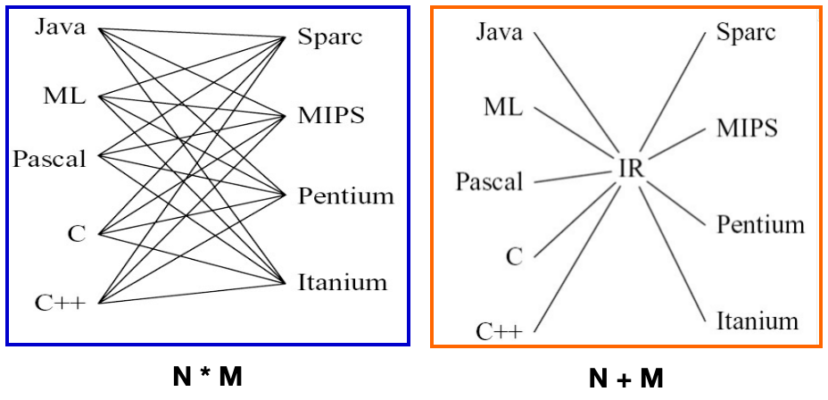
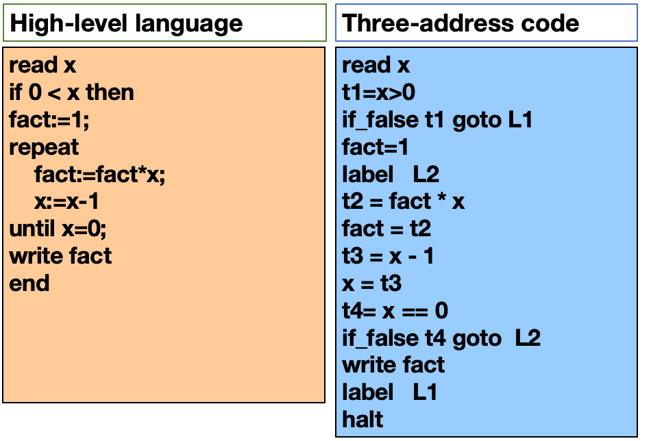

# Chapter 7 Intermediate Code

## Interface

什么是IR？：作为一种抽象的机器语言，IR是介于源代码和目标代码之间的一种代码形式。有下列不同的种类
- Three-Address Code (TAC)
- Static Single-Assignment (SSA)
- Control Flow Graph (CFG)
- Abstract Syntax Tree (AST)
- Expression Trees (IR Tree, used by Tiger Compiler)

下面这张图直观地展示了IR的作用



**Outline**
- Three-Address Code
- Intermediate Representation Tree
- Translation into IR Trees
  - Expressions
  - Simple Variables
  - Array Variables
  - Structured L-Values
  - Subscripting and Field Selection
  - Arithmetic
  - Conditionals
  - While Loops
  - For Loops
  - Function Call
- Translation of Declarations
  - Variable Definition
  - Function Definition

---
## Three-Address Code

TAC refers to the encoding method that only uses a maximum of 3 operand addresses in each instruction.
The most basic instruction of three address code:
` x = y op z
`
where `op` is a binary operator, and `x`, `y`, `z` are either variables or constants.



如何实现：用四元组的方法来实现TAC
```
t1=x>0    ---  (gt,x,0,t1)
if_false t1 goto L1  --- (if_false,t1,L1)
fact=1   --- (assign,1,_,fact)
Label L2 --- (label,L2,_,_)
```