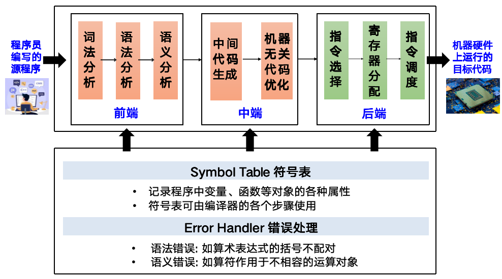
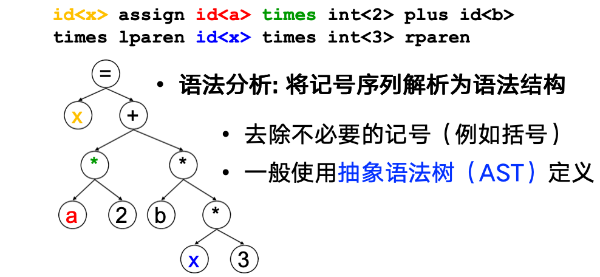
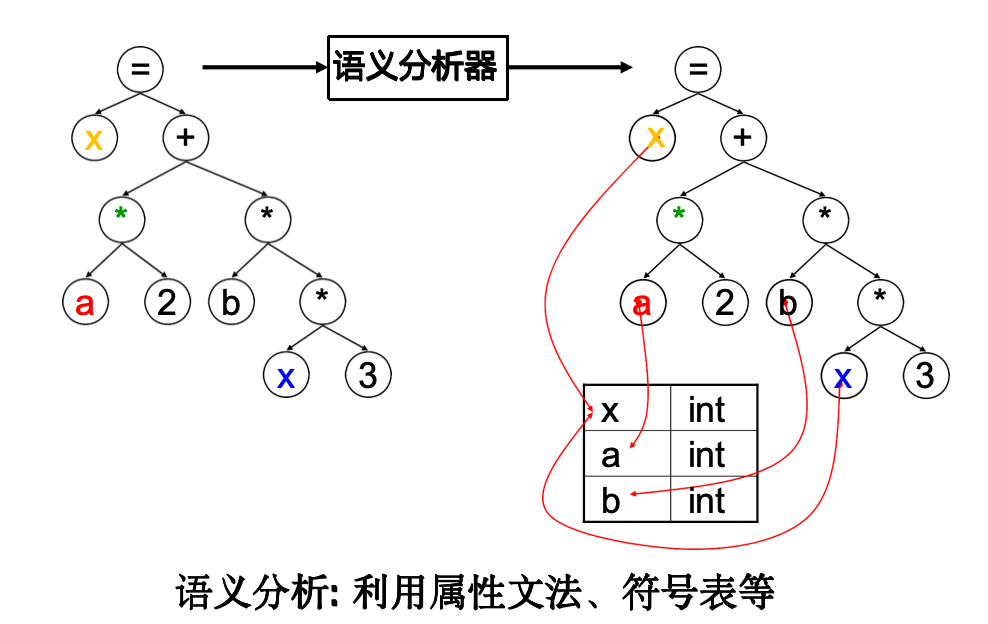
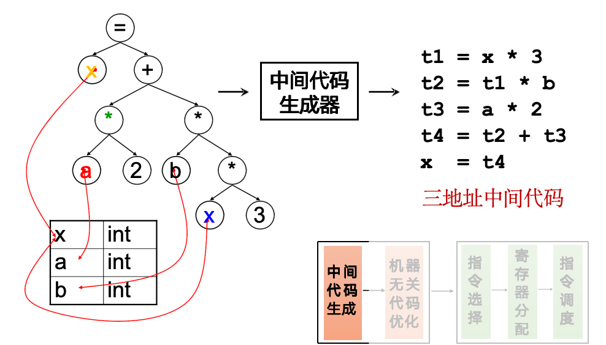
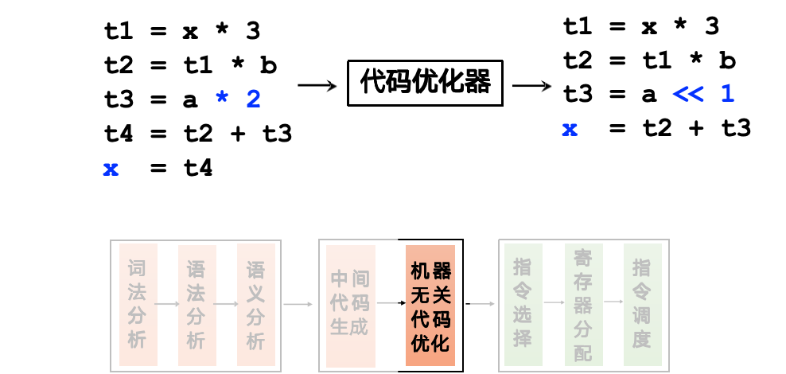
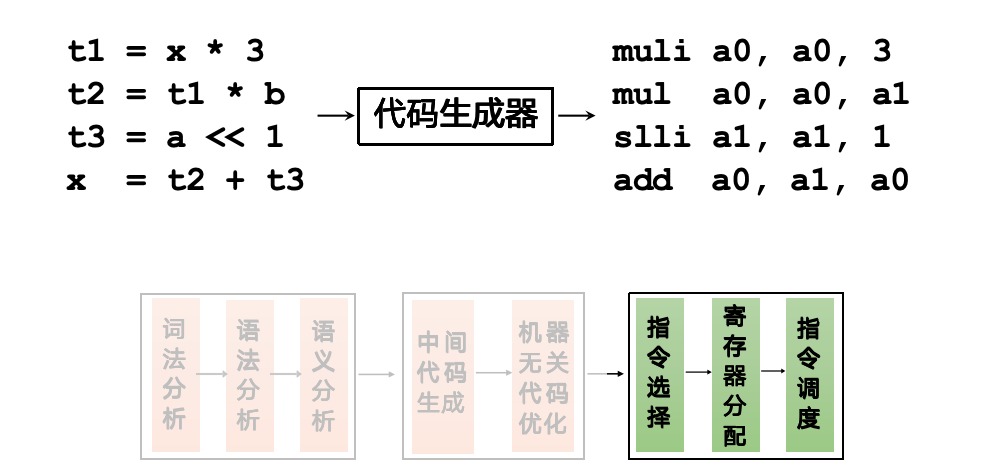
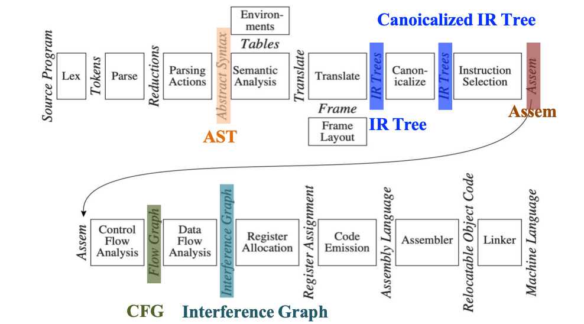

# Chapter 1 Introduction

## What is a compiler?

- A compiler is a program to translates one language to another (能够将原语言翻译为更接近机器语言的一个复杂软件)
- A Compiler is a complex program
    - From 10,000 to 1,000,000 lines of code
    - gcc has 7.5M lines of code

---

## Typical Work flow of a Compiler

一个编译器分为上述这些部分一方面是为了更容易理解和应用，另一方面可以使得组件的重用性更好

**Two Important Concepts**
- **Phases**: one or more modules operating on different abstract "languages"
- **Interfaces**: information exchanged between modules of the compiler

---

## Example

**词法分析(Lexing/Scanning/Lexical Analysis)**：将程序字符流分解为记号 (Token) 序列
- 删除字符串中不必要的部分（如空格）
- 通常使用**正则表达式**匹配（DFA定义）

---

**语法分析(Parsing/Syntactic Analysis)**：将记号序列解析谓语法结构
- 去除不必要的记号（比如括号）
- 一般使用**抽象语法树 (AST)** 定义

---

**语义分析(Semantic Analysis)**：决定语法结构的含义

---

**中间代码/表示 (IR)**：源语言与目标语言之间的桥梁

---
**基于中间表示的优化**：基于中间表示进行分析与变换

---

**目标代码生成**：把中间表示形式翻译到目标语言（指令选择、寄存器分配、指令调度）

---

## Modules and Interfaces in Tiger

**Tiger 编译器的流程**

- **抽象语法树 (AST)**：语法分析 + “Parsing Actions” 生成
- **IR Tree**：语义分析后按一定规则生成
- **Canonicalized IR Tree**：规范化 IR Tree
- **Assem**：治疗选择器生成（一种特殊的抽象汇编
- **控制流图 (CFG)**：方便进行数据流分析，如活跃变量分析 (Liveness Analysis)
- **冲突图 (Interference Graph)**：由活跃变量分析结果构造，用于指导寄存器分配