# Chapter 2 Lexical Analysis

## Overview

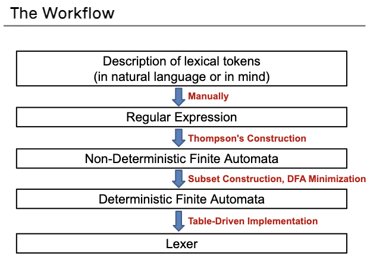

**词法分析(Lexing/Scanning/Lexical Analysis)**：将程序字符流分解为记号 (Token) 序列
- 删除字符串中不必要的部分（如空格）
- 通常使用**正则表达式**匹配（DFA定义）

将词法分析从语法分析中拆分出来，主要是为了简化整个语法分析的流程

## Lexical Token

**Definition**: A lexical token is a sequence of characters or a unit in the grammar of a programming language (e.g., teminal symbol)

**Examples of Common Tokens**

<!-- Standard Academic Table ("Three-Line Table") Style in HTML -->
<table style="width: 100%; border-collapse: collapse; border-top: 2px solid #e0e0e0; border-bottom: 2px solid #e0e0e0; text-align: left; background-color: transparent;">
    <thead>
        <tr style="border-bottom: 1px solid #e0e0e0;">
            <th style="padding: 10px; font-weight: bold;">Token Type</th>
            <th style="padding: 10px; font-weight: bold;">Example</th>
        </tr>
    </thead>
    <tbody>
        <tr>
            <td style="padding: 8px;">ID</td>
            <td style="padding: 8px;"><code>foo</code>,<code>n14</code>,<code>last</code></td>
        </tr>
        <tr>
            <td style="padding: 8px;">NUM</td>
            <td style="padding: 8px;"><code>73</code>,<code>515</code></td>
        </tr>
        <tr>
            <td style="padding: 8px;">REAL</td>
            <td style="padding: 8px;"><code>66.1</code>,<code>1e67</code></td>
        </tr>
        <tr>
            <td style="padding: 8px;">IF(Reserved words)</td>
            <td style="padding: 8px;"><code>if</code></td>
        </tr>
        <tr>
            <td style="padding: 8px;">COMMA</td>
            <td style="padding: 8px;"><code>,</code></td>
        </tr>
        <tr>
            <td style="padding: 8px;">NOTEQ</td>
            <td style="padding: 8px;"><code>!=</code></td>
        </tr>
        <tr>
            <td style="padding: 8px;">LPAREN</td>
            <td style="padding: 8px;"><code>(</code></td>
        </tr>
        <tr>
            <td style="padding: 8px;">RPAREN</td>
            <td style="padding: 8px;"><code>)</code></td>
        </tr>
    </tbody>
</table>

**Examples of non-tokens**
下列类型的输入不会放入到词法分析中作为token分析

<!-- Standard Academic Table ("Three-Line Table") Style in HTML -->
<table style="width: 100%; border-collapse: collapse; border-top: 2px solid #e0e0e0; border-bottom: 2px solid #e0e0e0; text-align: left; background-color: transparent;">
    <thead>
        <tr style="border-bottom: 1px solid #e0e0e0;">
            <th style="padding: 10px; font-weight: bold;">Token Type</th>
            <th style="padding: 10px; font-weight: bold;">Example</th>
        </tr>
    </thead>
    <tbody>
        <tr>
            <td style="padding: 8px;">comment</td>
            <td style="padding: 8px;"><code>/* I am a comment 8/</code></td>
        </tr>
        <tr>
            <td style="padding: 8px;">preprocessor directive</td>
            <td style="padding: 8px;"><code>#include<...></code></td>
        </tr>
        <tr>
            <td style="padding: 8px;">preprocessor directive</td>
            <td style="padding: 8px;"><code>#define NUMS 5,6</code></td>
        </tr>
        <tr>
            <td style="padding: 8px;">blanks, tabs, and new-lines</td>
            <td style="padding: 8px;"><code>...</code></td>
        </tr>
    </tbody>
</table>

**The Workflow**
- Description of lexical tokens
- Regular Expression
- Deterministic Finite Automata
- Lexer

---

## Regular Expression

**A regular expression (RE) is defined inductively**:
- **$a$**: ordinary character stands for itself
- **$\epsilon$**: the empty string
- **$M | N$**: either M or N (alternation), where M, N are RE
- **$M \cdot N$**: N followed by M (concatenation), where M, N are RE
- **$R^*$ (Kleene closure)**: concatenation of a RE R zero or more times ($R^*=\epsilon |R|RR|RRR|...$)

正则表达式的定义是以一种递归的方式进行的，关于最后三个定义的方式做如下举例：
- $L((a|b)|(c|d)) = \{a, b, c, d\}$
- $L((a|b)\cdot c) = \{ac, bc\}$
- $L(((a|b)\cdot b)^*) = \{\epsilon, ab, bb, abab, bbbb, abbb, bbab ...\}$

在写正则表的事的时候，结合符号和空符号可能会被省略，同时我们认为，**Kleene closure优先级高于结合 (concatenation)，结合 (concatenation) 优先级高于选择 (alternation)**：
- $ab | c$ means $(a\cdot b)|c$
- $(a|)$ means $(a|\epsilon)$

与此同时，我们引入更多的表示方法(abbreviations):
- $[abcd]$ means $(a|b|c|d)$
- $[b-g]$ means $[bcdefg]$
- $[b-gM-Qkr]$ means $[bcdefgMNOPQkr]$
- $M?$ means $(M|\epsilon)$
- $M+$ means $(M\cdot M*)$ 
- "a.+*" 单独表示这个字符串

从上述事例中可以发现，有可能有多种同时符合正则表达式的拆分方式，比如说IF和ID连续的时候，需要让编译器明白将IF和ID的内容拆分来看，而不是将IF和ID统一识别为ID。为了解决上述问题，我们采用下列两个规则

- **Longest match:** The longest initial substring of the input that can match any regular expression is taken as the next token. (尽可能的匹配符合规则的最长字符串)
- **Rule priority:** 
    - For a particulat longest initial substring, the first regular expression that can match determines its token-type
    - This means that the order of writing down the regular-expression rules has significance

---

## Finite Automata (有限状态自动机)

**A finite automaton**:
- A finite set of states
- edges lead from one state to another
- each edge is labeled with a symbol
- one state is the *start state*
- a certain of the states are distinguished as *final states* (double circles)

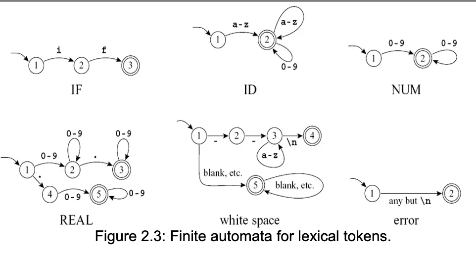

**Deterministic finite automaton (DFA)**: In a DFA, no two edges leaving from the same state are labeled with the same symbol （每个状态变化的过程是确定的）

**Accept and reject (DFA的接受和拒绝)**
- Starting in the start state, for each character in the input string the automaton follows exactly one edge to get to the next state
- The edge must be labeled with the input character
- After making n transitions for an n-character string, if the automaton is in a final state, then *it accepts* the string.
- If it is not in a final state, or if at some point there was no appropriately labeled edge to follow, *it rejects*.

The language recognized by an automaton is the set of strings that it accepts.

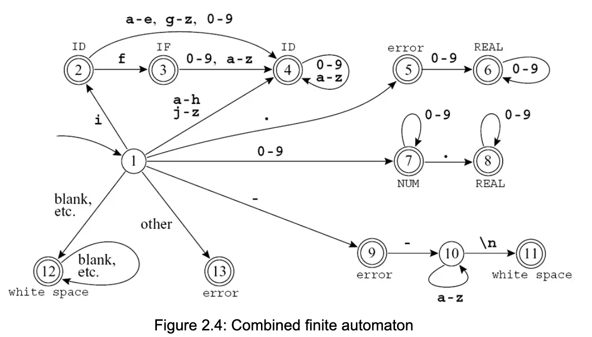

我们可以把这样一张图转变为一个表状态的表达，同时引入 *state 0 (dead state)* 表示这个接下来的字符无法被当前的自动机接受

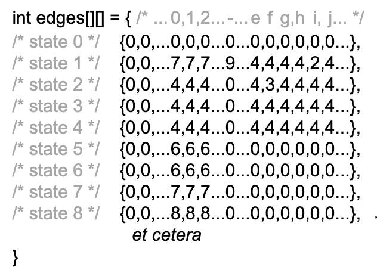

**How to recognize the longest match?**

Two variables:
- *Last-Final* (the state number of the most recent final state)
- *Input-Position-at-Last-Final*

When a dead state is reached, the variables tell what token was matched and where it ended

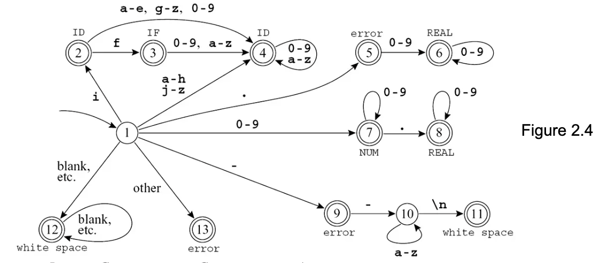
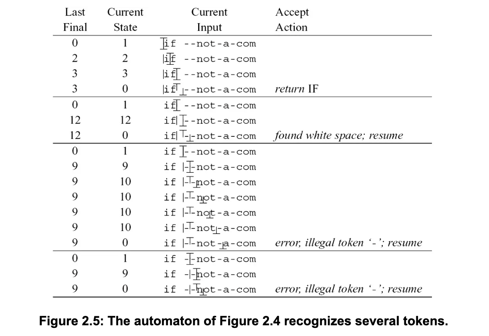

---

## Nonedeterministic Finite Automata (NFA)

*Nonedeterministic Finite Automata (NFA)*: 
- Have to choose one from the edges to follow out of a state
- Have special edges labeled with $\epsilon$

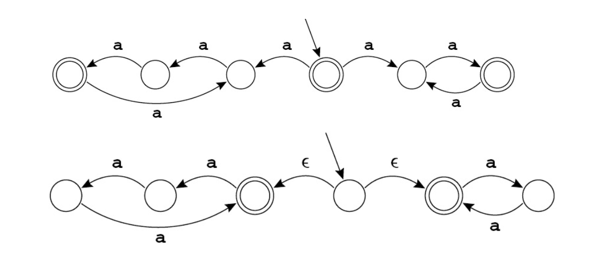

对于计算机来说，需要在NFA中进行不同路径的选择是很难的，所以NFA只用于将正则表达式先进行转换，然后在转变为DFA。接下来需要了解如何把正则表达式转换为NFA。

*Thompson's Construction*

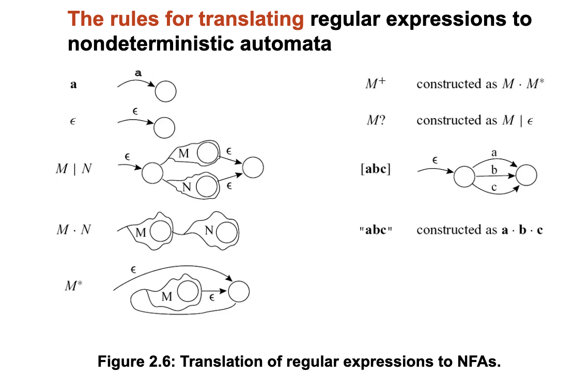

**Example**

- *if* {return IF;}
- *[a-z][a-z0-9]\** {return ID;}
- *[0-9]+* {return NUM;}
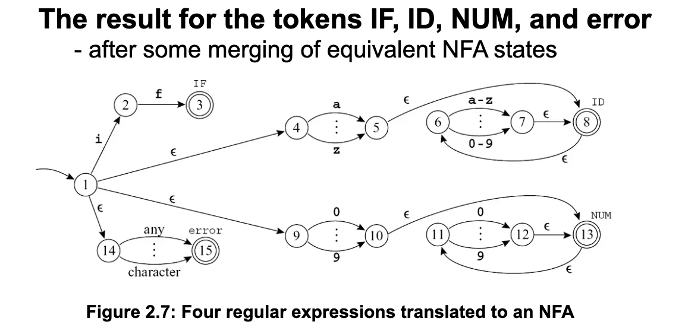

理解了正则表达式如何转变为NFA之后，需要学习如何将NFA转变为DFA

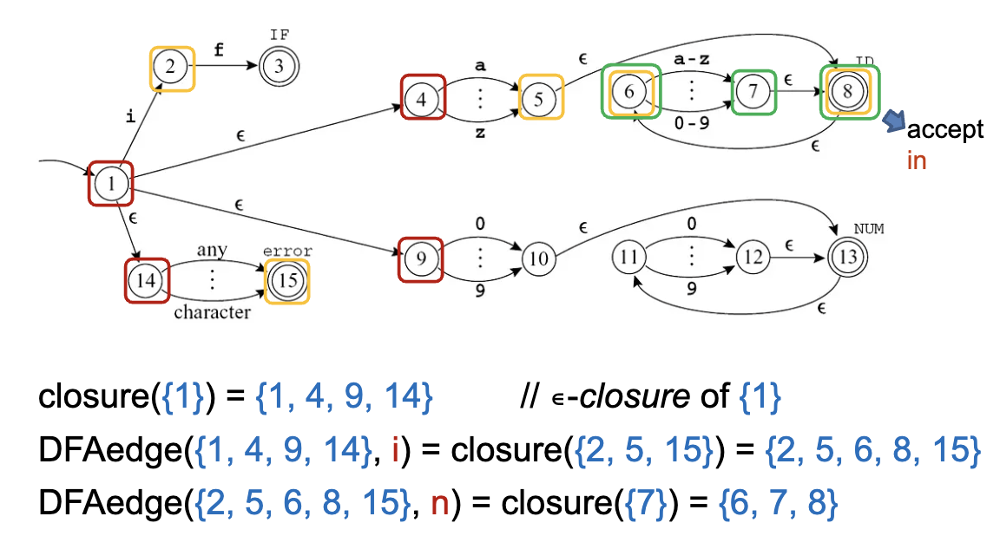

算闭包的时候一定要算 经过 $\epsilon$ 能够到达的所有状态，转换的方法可以按照上述例子中的步骤进行

⚠️：这个算法的问题在于，每一次给定一个字符，比如说"in", "if", 都要做一次扫描和转化，会非常的复杂，所以要用空间换时间，来解决上述问题

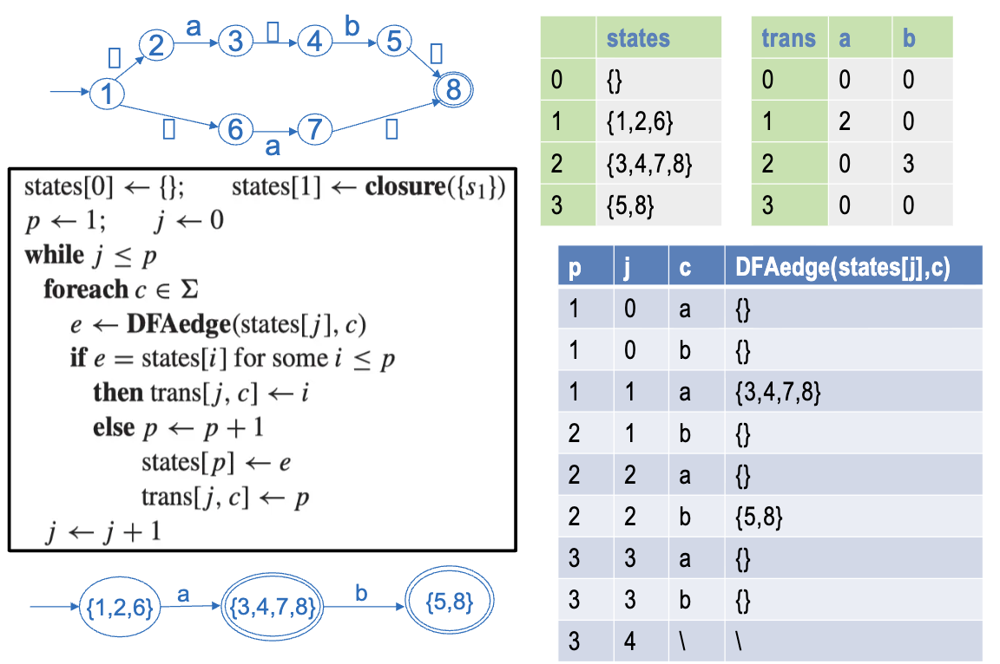

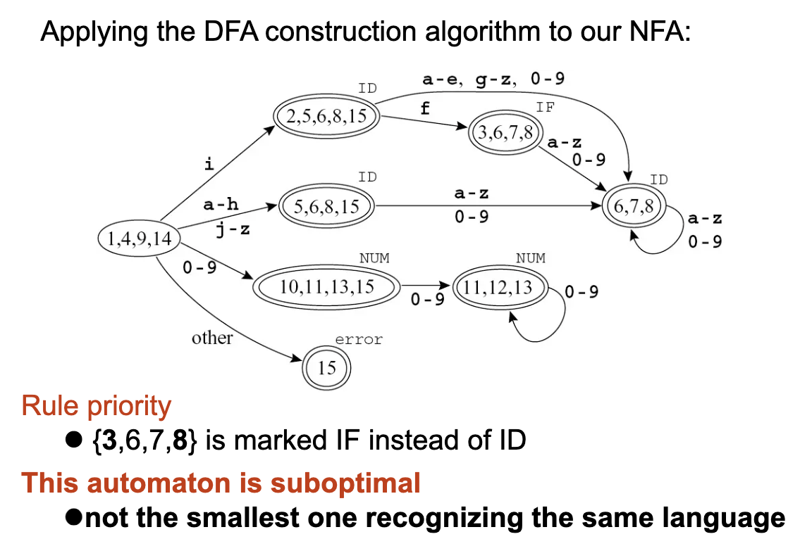

上述这个转化的结果中，NUM，第二行ID的两个状态可以进行合并。

**关于合并**

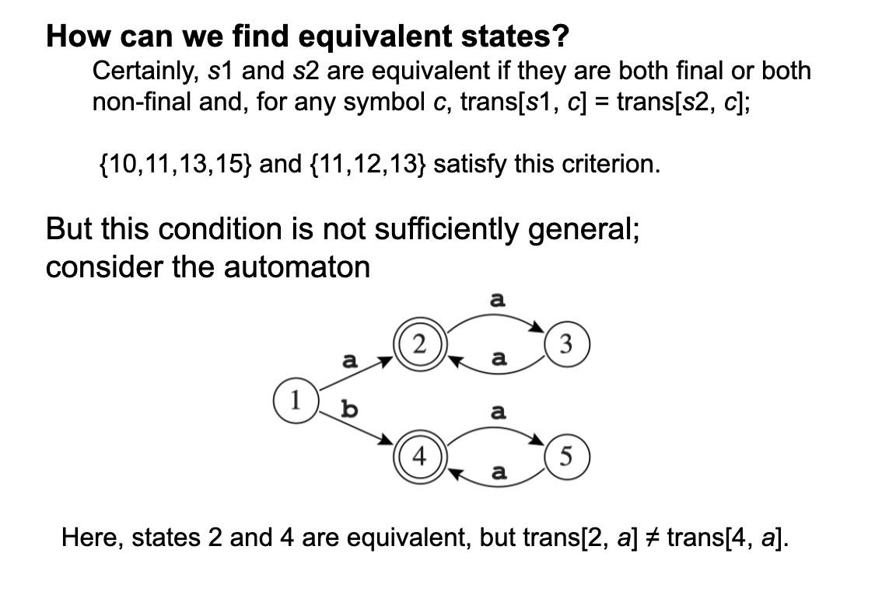

上面这一页PPT中所提到的判断方法，示例中2和4状态应该不是等价的，但是从逻辑上来看，2和4应该是等价的状态才对。所以要根据如下的方法来判断

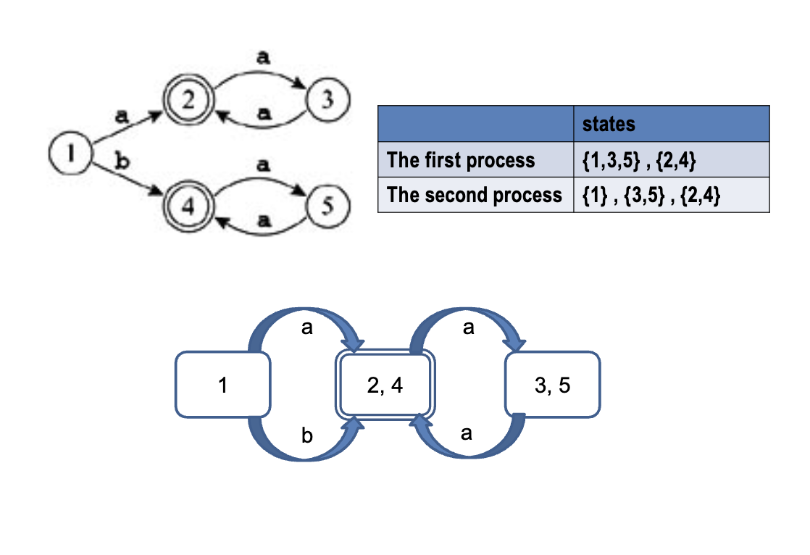

上图中自顶向下的流程对于等价类的划分更加合适，上图中第一步根据不同的状态结果（接受状态，过程状态）划分，然后再在子集之中继续进行划分

---

## Lex: A Lexical Analyzer Generator

**The format of a Lex input file**:
{ definitions }
%%
{ rules }
%% 
{ auxiliary routines}

**Example**
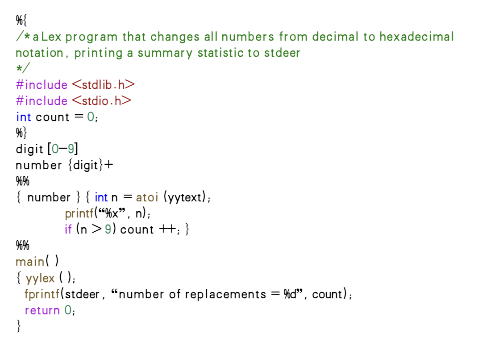

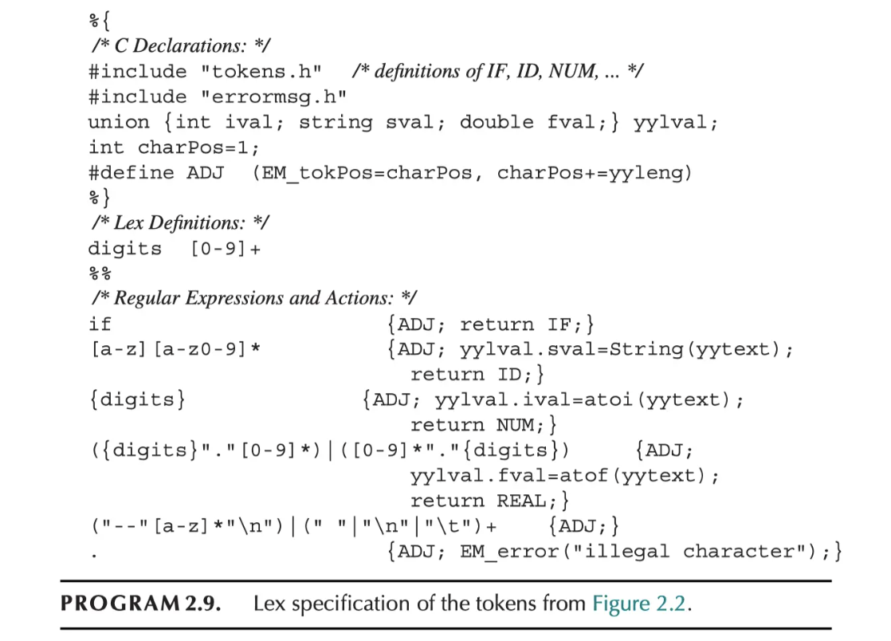

## Homework of Chapter 2

**2.1** Write regular expressions for each of the following.
a. Strings over the alphabet {a, b, c} where the first a precedes the first b.
b. Strings over the alphabet {a, b, c} with an even number of a’s.
c. Binary numbers that are multiples of four.
d. Binary numbers that are greater than 101001.
e. Strings over the alphabet {a, b, c} that don’t contain the contiguous substring baa.
f. The language of nonnegative integer constants in C, where number beginning with 0 are octal constants and other numbers are decimal
constants.
g. Binary numbers n such that there exists an integer solution of $a^n+b^n = c^n$

**2.2** For each of the following, explain why you’re not surprised that there is noregular expression defining it.
a. Strings of a’s and b’s where there are more a’s than b’s.
b. Strings of a’s and b’s that are palindromes (the same forward as backward).
c. Syntactically correct C programs

**2.5** Convert these NFAs to deterministic finite automata.

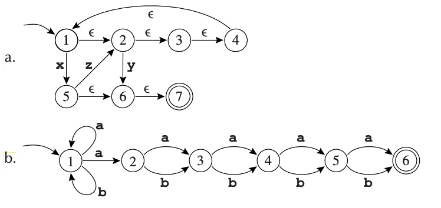

**2.6** Find two equivalent states in the following automaton, and merge them toproduce a smaller automaton that recognizes the same language. Repeat until there are no longer equivalent states.

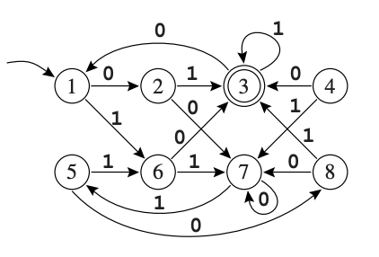

Actually, the general algorithm for minimizing finite automata works in reverse. First, find all pairs of inequivalent states. States X, Y are inequivalent if
X is final and Y is not or (by iteration) if $X \xrightarrow{*} X'$ and $Y \xrightarrow{*} Y'$ and $X', Y'$ areinequivalent. After this iteration ceases to find new pairs of inequivalent states,then X, Y are equivalent if they are not inequivalent. See Hopcroft and Ullman[1979], Theorem 3.10