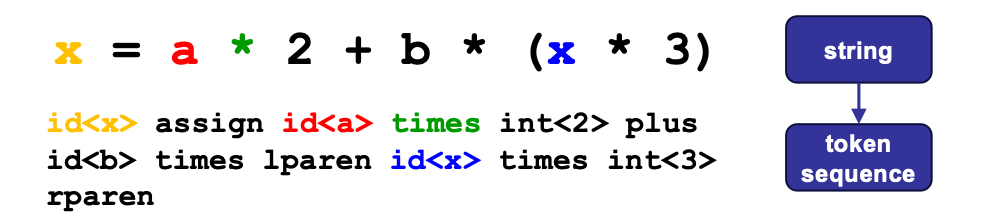
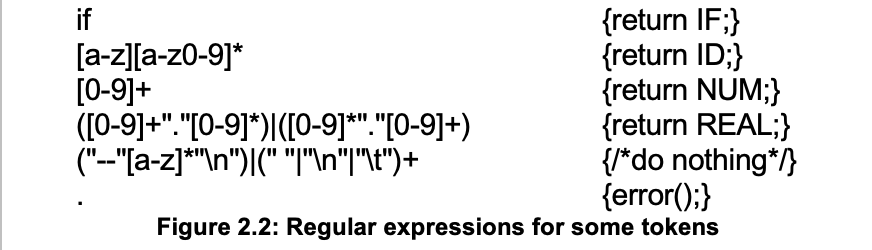

# Chapter 2 Lexical Analysis

## Overview

**词法分析(Lexing/Scanning/Lexical Analysis)**：将程序字符流分解为记号 (Token) 序列
- 删除字符串中不必要的部分（如空格）
- 通常使用**正则表达式**匹配（DFA定义）

将词法分析从语法分析中拆分出来，主要是为了简化整个语法分析的流程

## Lexical Token

**Definition**: A lexical token is a sequence of characters or a unit in the grammar of a programming language (e.g., teminal symbol)

**Examples of Common Tokens**

<!-- Standard Academic Table ("Three-Line Table") Style in HTML -->
<table style="width: 100%; border-collapse: collapse; border-top: 2px solid #e0e0e0; border-bottom: 2px solid #e0e0e0; text-align: left; background-color: transparent;">
    <thead>
        <tr style="border-bottom: 1px solid #e0e0e0;">
            <th style="padding: 10px; font-weight: bold;">Token Type</th>
            <th style="padding: 10px; font-weight: bold;">Example</th>
        </tr>
    </thead>
    <tbody>
        <tr>
            <td style="padding: 8px;">ID</td>
            <td style="padding: 8px;"><code>foo</code>,<code>n14</code>,<code>last</code></td>
        </tr>
        <tr>
            <td style="padding: 8px;">NUM</td>
            <td style="padding: 8px;"><code>73</code>,<code>515</code></td>
        </tr>
        <tr>
            <td style="padding: 8px;">REAL</td>
            <td style="padding: 8px;"><code>66.1</code>,<code>1e67</code></td>
        </tr>
        <tr>
            <td style="padding: 8px;">IF(Reserved words)</td>
            <td style="padding: 8px;"><code>if</code></td>
        </tr>
        <tr>
            <td style="padding: 8px;">COMMA</td>
            <td style="padding: 8px;"><code>,</code></td>
        </tr>
        <tr>
            <td style="padding: 8px;">NOTEQ</td>
            <td style="padding: 8px;"><code>!=</code></td>
        </tr>
        <tr>
            <td style="padding: 8px;">LPAREN</td>
            <td style="padding: 8px;"><code>(</code></td>
        </tr>
        <tr>
            <td style="padding: 8px;">RPAREN</td>
            <td style="padding: 8px;"><code>)</code></td>
        </tr>
    </tbody>
</table>

**Examples of non-tokens**
下列类型的输入不会放入到词法分析中作为token分析

<!-- Standard Academic Table ("Three-Line Table") Style in HTML -->
<table style="width: 100%; border-collapse: collapse; border-top: 2px solid #e0e0e0; border-bottom: 2px solid #e0e0e0; text-align: left; background-color: transparent;">
    <thead>
        <tr style="border-bottom: 1px solid #e0e0e0;">
            <th style="padding: 10px; font-weight: bold;">Token Type</th>
            <th style="padding: 10px; font-weight: bold;">Example</th>
        </tr>
    </thead>
    <tbody>
        <tr>
            <td style="padding: 8px;">comment</td>
            <td style="padding: 8px;"><code>/* I am a comment 8/</code></td>
        </tr>
        <tr>
            <td style="padding: 8px;">preprocessor directive</td>
            <td style="padding: 8px;"><code>#include<...></code></td>
        </tr>
        <tr>
            <td style="padding: 8px;">preprocessor directive</td>
            <td style="padding: 8px;"><code>#define NUMS 5,6</code></td>
        </tr>
        <tr>
            <td style="padding: 8px;">blanks, tabs, and new-lines</td>
            <td style="padding: 8px;"><code>...</code></td>
        </tr>
    </tbody>
</table>

**The Workflow**
- Description of lexical tokens
- Regular Expression
- Deterministic Finite Automata
- Lexer

---

## Regular Expression

**A regular expression (RE) is defined inductively**:
- **$a$**: ordinary character stands for itself
- **$\epsilon$**: the empty string
- **$M | N$**: either M or N (alternation), where M, N are RE
- **$M \cdot N$**: N followed by M (concatenation), where M, N are RE
- **$R^*$ (Kleene closure)**: concatenation of a RE R zero or more times ($R^*=\epsilon |R|RR|RRR|...$)

正则表达式的定义是以一种递归的方式进行的，关于最后三个定义的方式做如下举例：
- $L((a|b)|(c|d)) = \{a, b, c, d\}$
- $L((a|b)\cdot c) = \{ac, bc\}$
- $L(((a|b)\cdot b)^*) = \{\epsilon, ab, bb, abab, bbbb, abbb, bbab ...\}$

在写正则表的事的时候，结合符号和空符号可能会被省略，同时我们认为，**Kleene closure优先级高于结合 (concatenation)，结合 (concatenation) 优先级高于选择 (alternation)**：
- $ab | c$ means $(a\cdot b)|c$
- $(a|)$ means $(a|\epsilon)$

与此同时，我们引入更多的表示方法(abbreviations):
- $[abcd]$ means $(a|b|c|d)$
- $[b-g]$ means $[bcdefg]$
- $[b-gM-Qkr]$ means $[bcdefgMNOPQkr]$
- $M?$ means $(M|\epsilon)$
- $M+$ means $(M\cdot M*)$ 
- "a.+*" 单独表示这个字符串

从上述事例中可以发现，有可能有多种同时符合正则表达式的拆分方式，比如说IF和ID连续的时候，需要让编译器明白将IF和ID的内容拆分来看，而不是将IF和ID统一识别为ID。为了解决上述问题，我们采用下列两个规则

- **Longest match:** The longest initial substring of the input that can match any regular expression is taken as the next token. (尽可能的匹配符合规则的最长字符串)
- **Rule priority:** 
比如说if8符合最长匹配规则，而if8中if已经符合IF类的规则，则匹配为IF和8
    - For a particulat longest initial substring, the first regular expression that can match determines its token-type
    - This means that the order of writing down the regular-expression rules has significance