# Chapter 3 Syntax Analysis

## What is syntax analysis?

**Syntax**: the way in which words are put together to form phrases clauses or sentences.

**Syntax analysis**: parsing the phrase structure of the program. The parser is constructed based on the grammar and extracts abstract syntax from a stream of tokens.

## Why do we need syntax analysis?

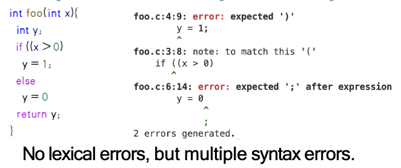

语法分析可以帮助我们判断在词法分析之后的token序列是否符合我们所规定的语法规范，同时可以生成一个 **抽象语法树 (AST)** 来表示程序的结构。

## How to build a parser?

1. Specifying the syntax of a programming language with *Context-Free Grammar (CFG)*

2. Build the parser based on the Context-Free Grammar (CFG) 
- *Top-down parsing*: predictive parsing (LL parsing)
- Bottom-up parsing: LR parsing

3. More about parsing:
- Automatic Parser Generation
- Error Recovery

## Context-Free Grammar (CFG)

Not all strings of tokens are programs. A parser must distinguish between valid and invalid strings of tokens. Thus, we need:
- *A language for describing valid strings of tokens*
- *A method for determining whether a given string of tokens is valid*

**Context-Free Grammar (CFG)** : natural for recursive structure

**A CFG consists of:**
- A set of *terminal T*: symbols from the alphabet
- A set of *nonterminal N*
- A start symbol *$S\in N$*
- A set of *productions* : $X\to Y_1Y_2...Y_k$ where $X\in N$ and $Y_i\in T\cup N$

## Derive strings based on a CFG

- Begin with a string with only the start symbol $S$.
- Repeatedly replace a nonterminal with the right-hand side of a production until there are no nonterminals left.

Let G be a CFG with start symbol $S$. Then the language $L(G)$ of G is:
$$ \{ a_1 \dots a_n \mid \forall_i a_i \in T \land S \xrightarrow{*} a_1 \dots a_n \} $$


**Example 1**

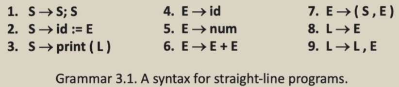

这个文法有 S, E, L 三个 non-terminal, 有 $\{id,num,print,:=,;,+,(,),,\}$，假设它对应的源程序如下：
$$a := 7; b := c + (d := 5 + 6, d); print(b)$$
这个程序结果词法分析后是：
$$id := num; id := id + (id := num + num, id); print(id)$$

**Example 2**

与上述的文法相同，对于源程序$a := 7; b := c + 2$我们来看下面这个推导过程:
```
S
S; S
id := E; S
id := num; S
id := num; id := E
id := num; id := E + E
id := num; id := id + E
id := num; id := id + num
```
在上面的推导过程中，我们每一次选取最左边的非终结符进行扩展，因此称为*最左推导 (leftmost derivation)*。同样的，我们也可以每一次选取最右边的非终结符进行扩展，这样的推导过程称为*最右推导 (rightmost derivation)*。

但是很显然如果不使用最左推导，这个句子还有一种推导过程：
```
S 
=> S; S 
=> S; S; S 
=> id:=E; S; S
=> id:=num; S; S
=> id:=num; id:=E; S
=> id:=num; id:=num; S
=> id:=num; id:=num; id:=E
=> id:=num; id:=num; id:=num
```
因此我们可以看出如果不使用一种固定的推导规则这个句子有两种不同的推导过程，因此这个文法是**二义性的 (ambiguous)**。

同样是最左推导的情况下，也可能产生两种不同的推导过程

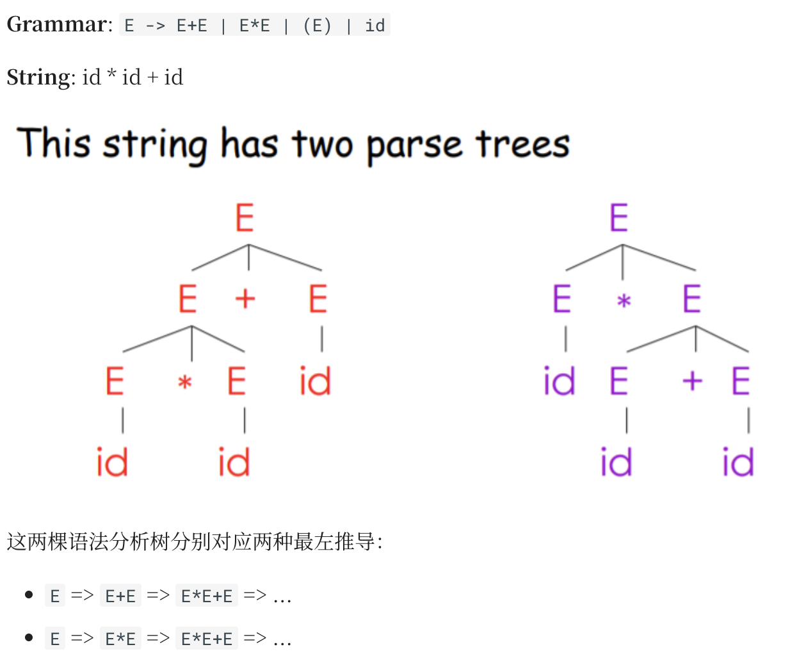

上例中，我们一般选取左边那种理解，因为我们认为 * 比 + 具有更高的 优先级 (precedence) 。那么我们可以通过重写，强制这种优先级：`E -> T+E | T , T -> F*T | F , F -> id | (E)`
通过这种方式，我们强制了 id 和 () 具有最高优先级（因为他们会被作为一个整体展开），* 次之， + 优先级最低。这样，上例就只有唯一一种最左推导

## EOF Marker

`$` : end of file (EOF)

To indicate that `$` must come after a complete S-Phrase, add a new start symbol `S'` and a new production `S' -> S $`.

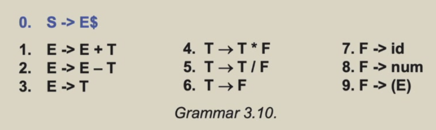

## Predictive Parsing -First and Follow Sets

- $First(\gamma)$: if $\gamma \xrightarrow{*}t\beta$, then $t \in First(\gamma)$

$\gamma$ can derive at t in the first position, $First(\gamma)$ is the set of terminals that can begin strings derived from $\gamma$.

> 根据我自己的理解，再重新阐释一下关于First这个集合的定义和用法。首先在语法分析的过程中，我们会读取到当前的输入token，记为t。现在我们语言规则的推导方法有很多种，比如 $A->a$ 或者 $A->b$，我们必须要知道我现在选择 $A->a$ 或者 $A->b$，最后得到的结果的最前面的token是否是t，如果是我们就可以选择这种方法，如果不是则需要换一种方法。所以我们用 $First(a)$ 来表示从a这个非终结符出发，最终得到的字符串的第一个token的集合，如果这个token集合包含t，那么我们就可以选择 $A->a$ 这种方法。

- $Follow(x)$: if $S \xrightarrow{*}\beta Xt\delta$, then $t \in Follow(x)$

$Follow(x)$ is the set of terminals that can immediately follow X: $t\in Follow(X)$ if there is any derivation containing Xt. This can occur if the derivation contains XYZt where Y and Z both derive $\epsilon$.

---

> 同样根据我的理解，再阐释一下关于 **Follow 集合** 的定义和用法。
> 
> 在语法分析时，`First` 集合帮我们解决了大部分预测问题，但有一种**极其特殊的“隐身”情况** `First` 处理不了：**如果某条推导分支最终变成了空串（$\epsilon$），我们该怎么办？**
> 
> 假设我们当前面对非终结符 $A$，读取到的输入 token 是 $t$。我们有一条推导规则 $A \to \alpha$。正常情况下我们会看 $t$ 在不在 $First(\alpha)$ 里。但如果 $\alpha$ 最终能推导出空串（即 $\alpha \xrightarrow{*} \epsilon$，相当于这一整条分支直接“消失”了），那么 $A$ 展开后就没有自己的字符去和 $t$ 匹配了。我们要报错吗？
> 
> **不能马上报错！** 因为如果 $A$ 在这里隐身消失了，那么在原本的句型结构中，原本排在 $A$ 后面的其他符号就会向前补位，去跟当前的 token $t$ 进行匹配。
> 
> 这时我们就需要知道：在整个语言的语法结构里，**到底有哪些终结符（token）是有资格合法地排在非终结符 $A$ 的正后方的？** 
> 
> 这就是 $Follow(A)$ 的定义：它是一个集合，包含了从起始符号出发的所有合法句型中，**能够紧挨在 $A$ 后面的所有终结符**。
> 
> **Follow 集在预测分析中的核心用法：**
> 如果当前输入的 token $t$ 并不在推导规则的 `First` 集合中，但这条规则能够推导出空串 $\epsilon$，此时我们就去查被展开的非终结符 $A$ 的 `Follow` 集合。**一旦发现 $t \in Follow(A)$，我们就会果断选择 $A \to \epsilon$（或使其推导出 $\epsilon$ 的那条分支）**。意思是：“我让 $A$ 在这里直接消失让路，因为我知道 $t$ 是合法排在 $A$ 后面的，把匹配 $t$ 的任务交给后面的符号即可。”

**Example**

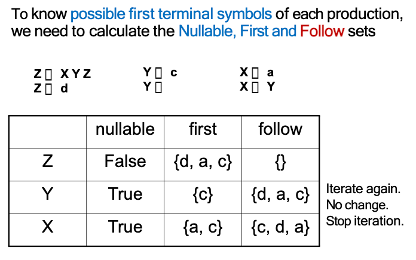

关于Follow集合，比如说有一条规则是 $X\to Y$ 但是Y可空，那么需要把 $Follow(X)$ 也加入到 $Follow(Y)$ 中，因为如果Y消失了，那么X后面就直接跟着 $Follow(X)$ 了。

下一步就可以根据上面这张表做接下来的对应表

遍历产生式，如果当前的产生式是 $A\to \alpha$，我们就把 $First(\alpha)$ 中的每个终结符 $t$ 加入到 $M[A,t]$ 中，如果 $\alpha$ 可空，那么我们还要把 $Follow(A)$ 中的每个终结符 $t$ 加入到 $M[A,t]$ 中。

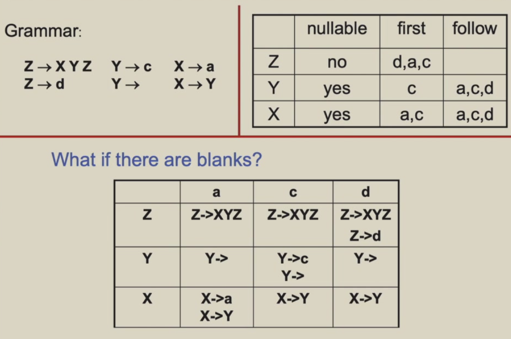

代码的遍历实现

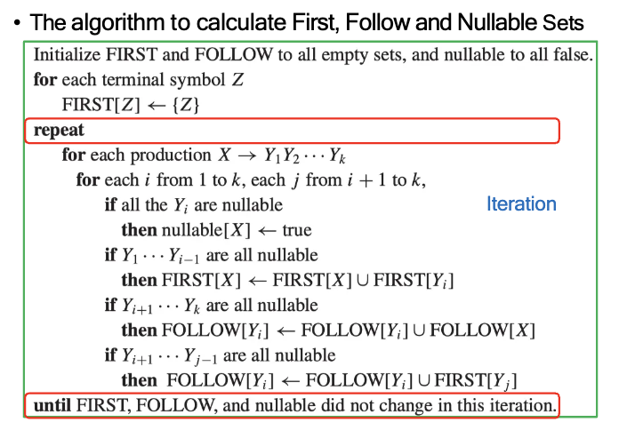


**LL(1) grammar:** LL(1)的文法我们只需要看当前输入的token就可以唯一确定下一步的推导规则

**LL(k) grammar:** LL(k)的文法我们需要看当前输入的token以及接下来k-1个token才能唯一确定下一步的推导规则(k比较大的时候，表格会非常大)

**利用栈来实现推导**

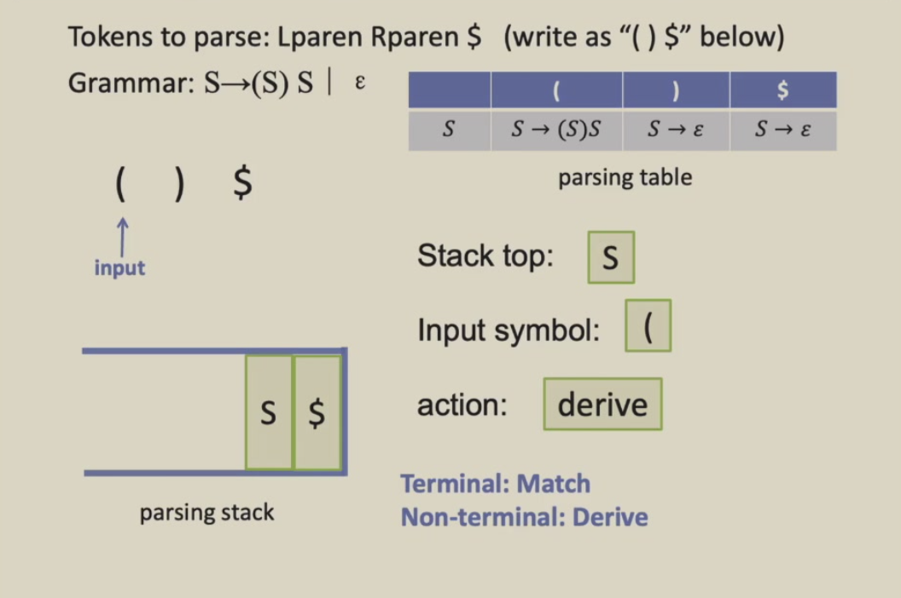

根据左括号，那我现在把S从栈弹出去然后把对应的推导结果压进来

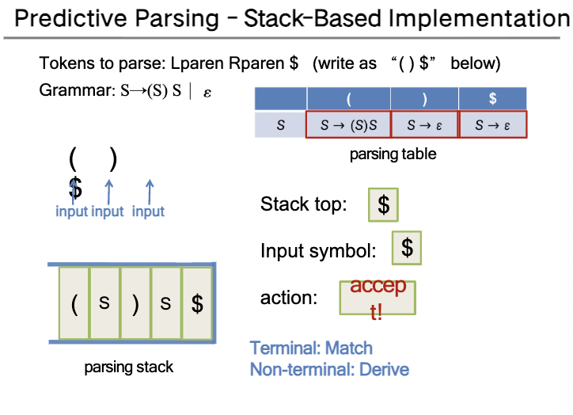


## Error Recovery

**Deleting , Replacing , Inserting**

token错误的方法和种类不多，要么多了要么少了要么用错了


## Quiz 2

Consider the following grammar:
```
S -> A
S -> B
A -> e
A -> f
B -> (C)
C -> SD
D -> AD
D ->
```
a. Calculate the Nullable, FIRST, and FOLLOW sets for nonterminals in the grammar;

b. Construct the LL(1) parsing table for the grammar;

c. Explain whether the grammar is LL(1) or not.


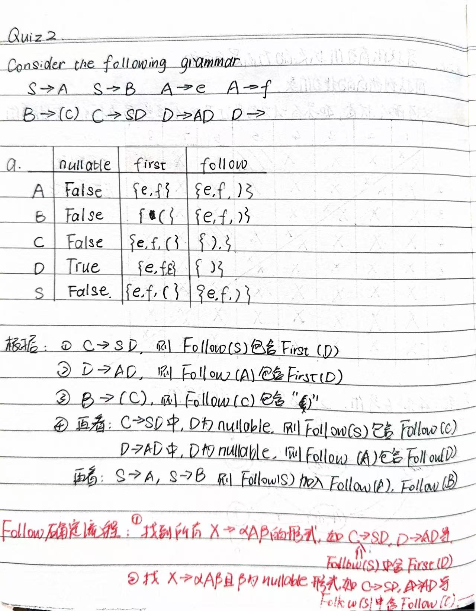 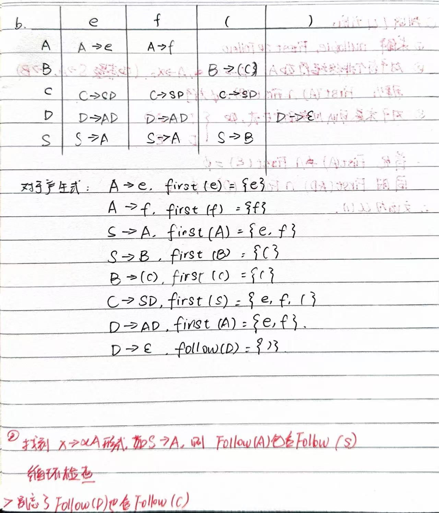 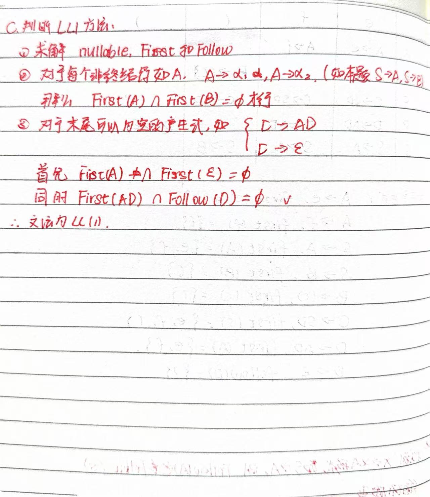

## Homework 3-1

a. Caculate nullable First and Follow for this grammar:
```
S -> u B D z
B -> B v
B -> w
D -> E F
E -> y
E -> 
F -> x
F -> 
```
b. Construct the LL(1) parsing table for the grammar;
c. Give evidence that this grammar is not LL(1).
d. Modify the grammar as little as possinle to make it an LL(1) grammar that accepts the same language.

To fix this, we need to eliminate the left recursion on `B`. 
The original rules for `B` are:
`B -> B v | w`
This generates strings of the form `w`, `wv`, `wvv`, etc. ($wv^*$).
We can rewrite this using right recursion:
`B -> w B'`
`B' -> v B' | ` ($\epsilon$)

The modified LL(1) grammar is:
```text
S  -> u B D z
B  -> w B'
B' -> v B'
B' -> 
D  -> E F
E  -> y
E  -> 
F  -> x
F  -> 
```
This new grammar accepts the exact same language but is LL(1) conflict-free.

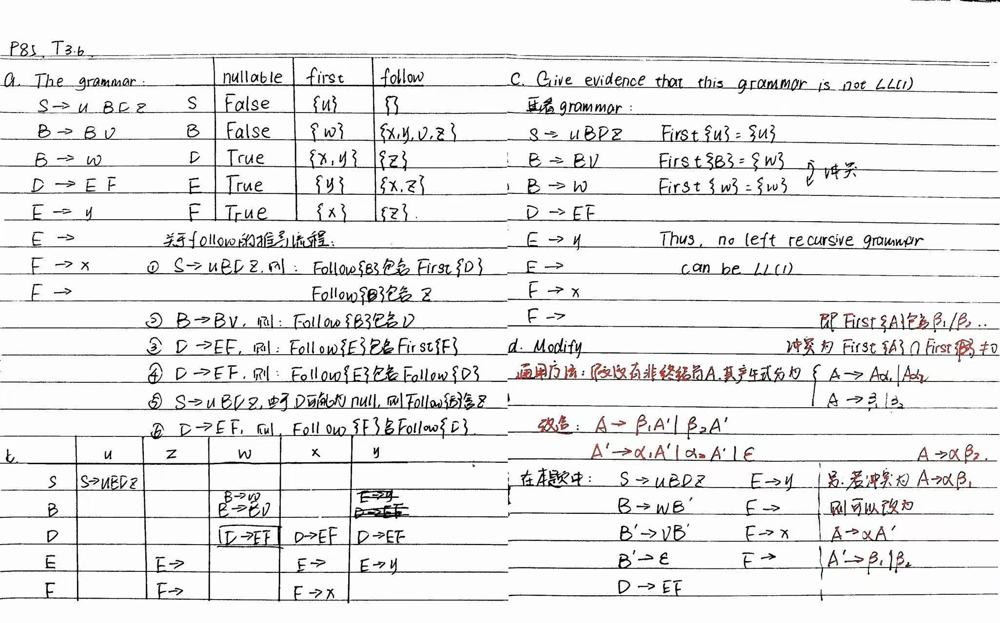