# Chapter 3-2 Syntax Analysis

## Bottom-Up Parsing

**LR(K) Parsing**: The most prevalent type
- Shift-Reduce parsing
- More powerful than LL(K) parsing: able to postpone the decision until it has seen input tokens corresponding to the entire right-hand side of the production in question.
- *Left-to-right parse, Rightmost derivation, K tokens of lookahead*

**Details**

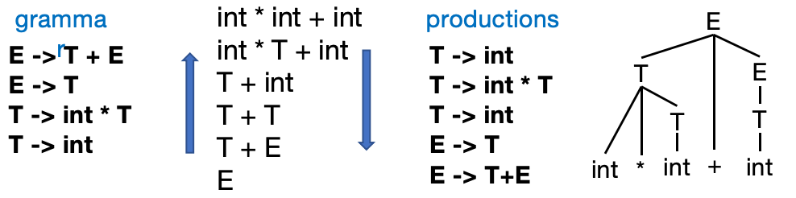

- 第一步，我们需要用产生式去替换原有的式子，第一个我们只能选择 `T->int`进行替换，因为只有这一个式子的产生结果存在于当前的式子中。
- 第二步，这个式子来替换谁？应该替换成 `int*T+int` 第一个int不替换是因为替换之后的结果式子没有产生式可以产生。
- 下一步在选择产生式子 `T->int*T`，按照相同的方法替换。


**算法化**

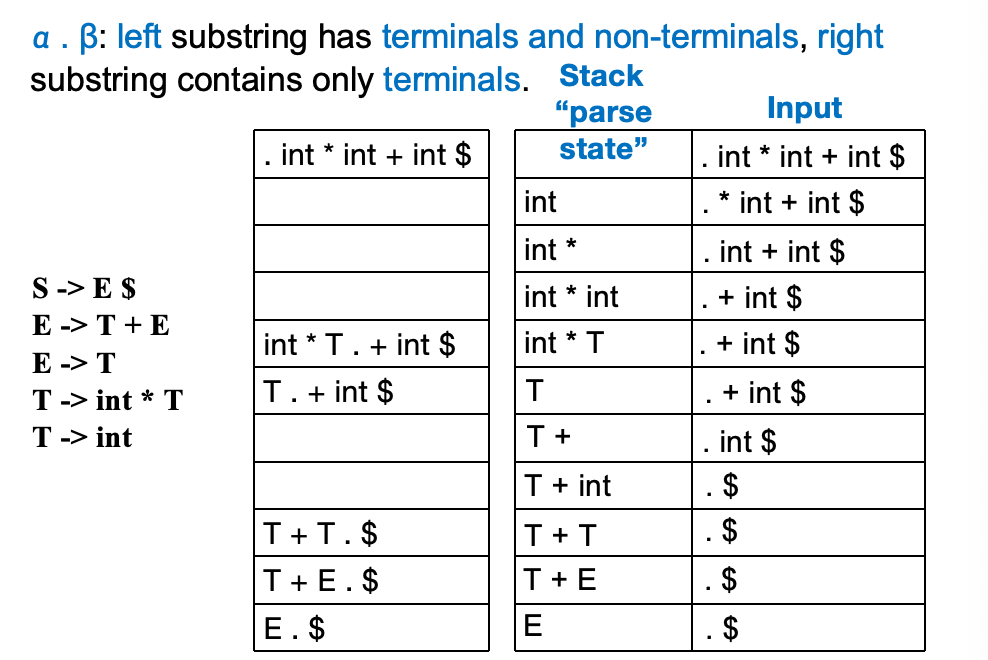

- *Shift*: 将输入串中的一个token压入栈中
- *Reduce*: 将栈顶的符号串替换成一个非终结符
- *Accept*: 接受输入串
- *Error*: 报错

**LR(0) Parsing**

LR(0) 文法是指仅通过查看栈就能进行分析的文法，在做出移进/归约决策时无需任何前瞻。可以用DFA来识别LR(0)文法。

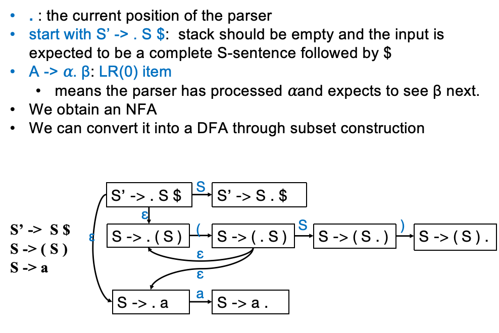

将其转换为DFA

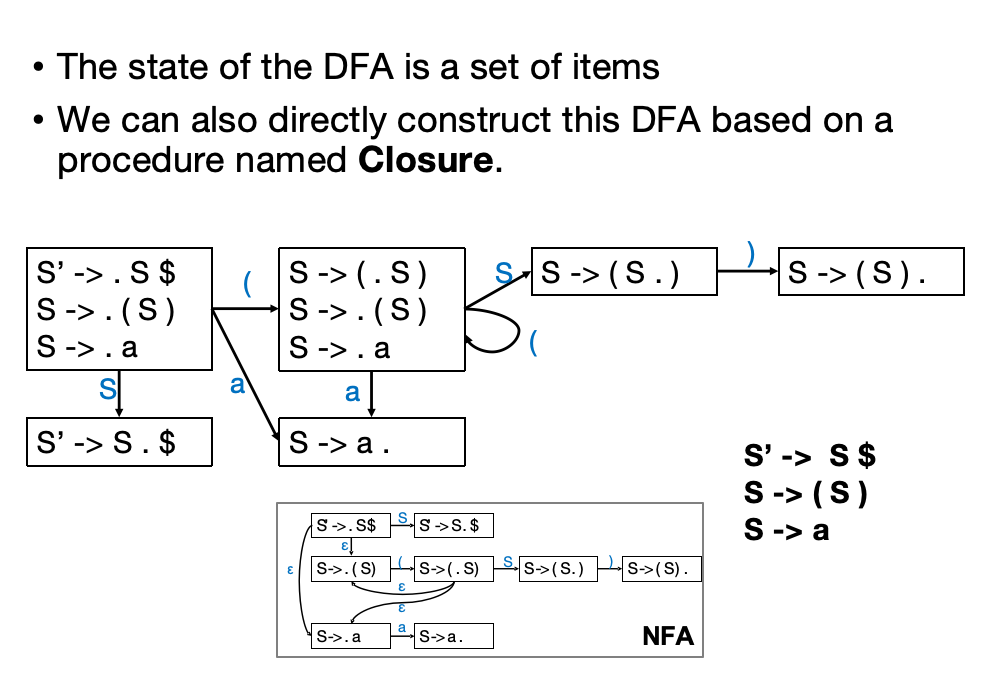

**Another Example**

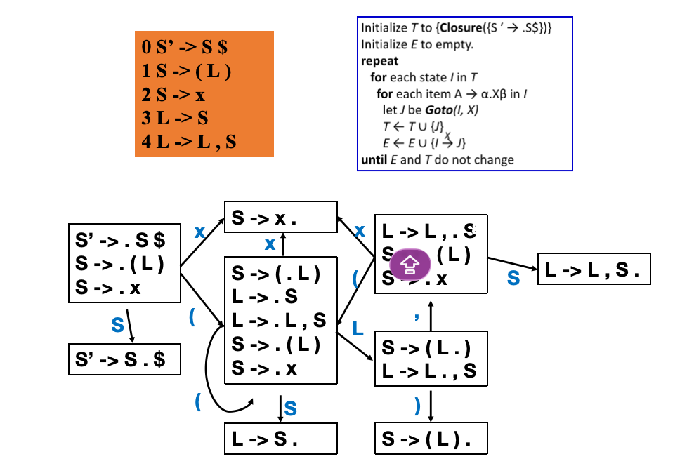

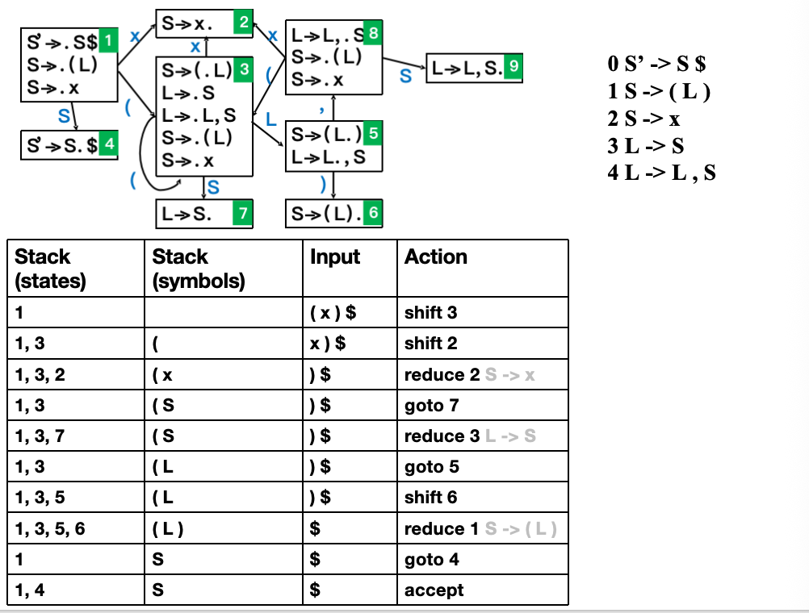

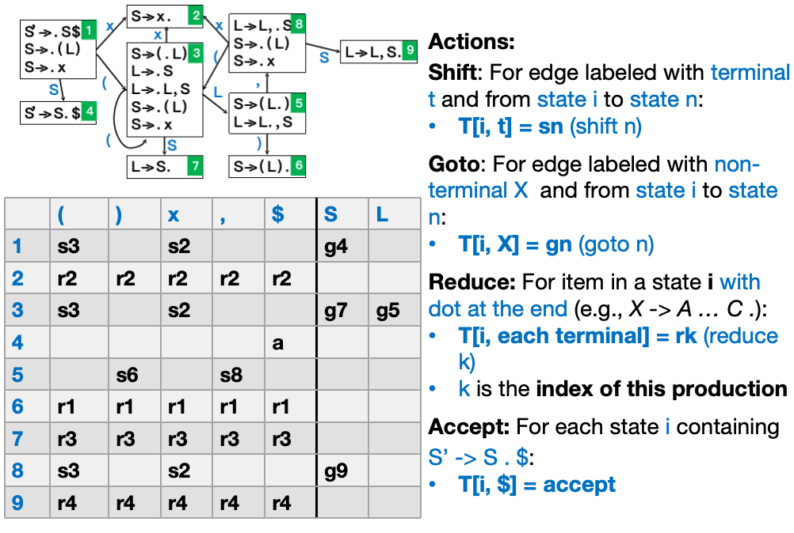

goto和shift的区别是，goto的情况下状态战压栈，但是符号栈不变；而shift的情况下状态栈和符号栈都要压栈。

LR(0)虽然简单，但是会出现移进/归约冲突和归约/归约冲突

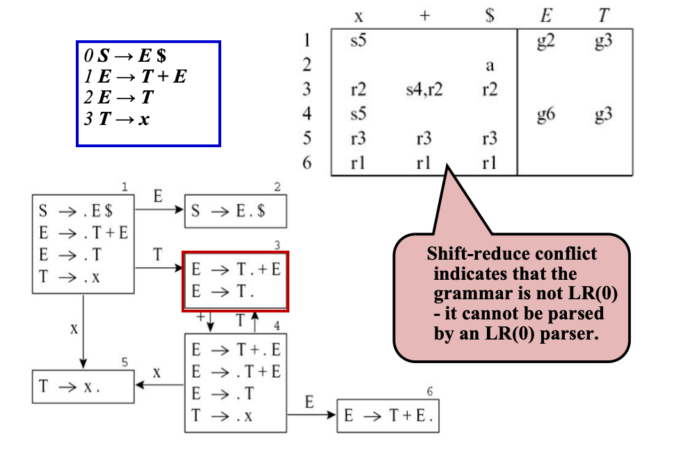

上面这个问题其实很容易解决，其实不难发现，对于一个式子 `int + int`，前一个int我们可以替换成E或者是T，但是我们不会这么做，因为我们可以很简单的看出E后面不能跟+。也就是多算一步 *FOLLOW集* 就可以解决这个问题了。

**SLR**

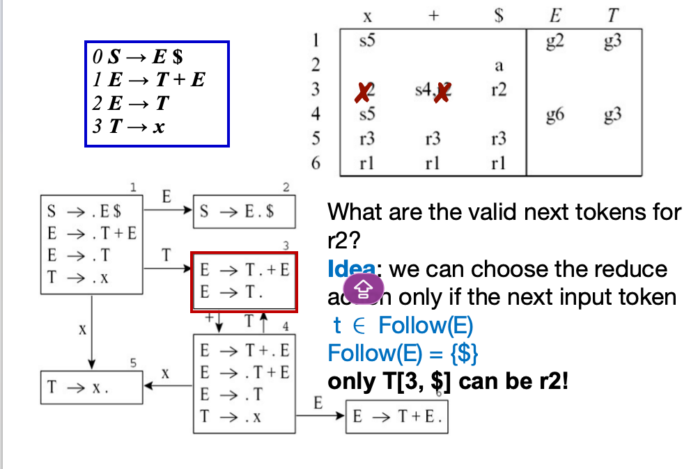

但是还会出现问题

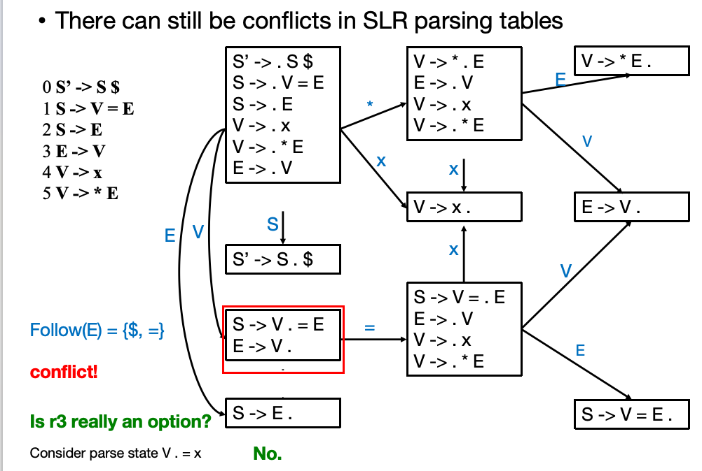

上述红框部分还是会出现一个问题，在这种情况下可以规约，也可以继续输入等号，但是从直观的视角上来看，如果先把V规约为E，后面是不可能跟上=的，所以从逻辑上来看，这个也不是一个真的冲突。所以需要引入一个新的概念 *Lookahead* 来解决这个问题。

**LR(1)**

所以LR(1)的总体规则如下
- $(A -> \alpha. \beta, x)$。这其中$\alpha$是当前在处理的token，$\beta$是后续的token，x是lookahead。

通过例子来看更加直观：

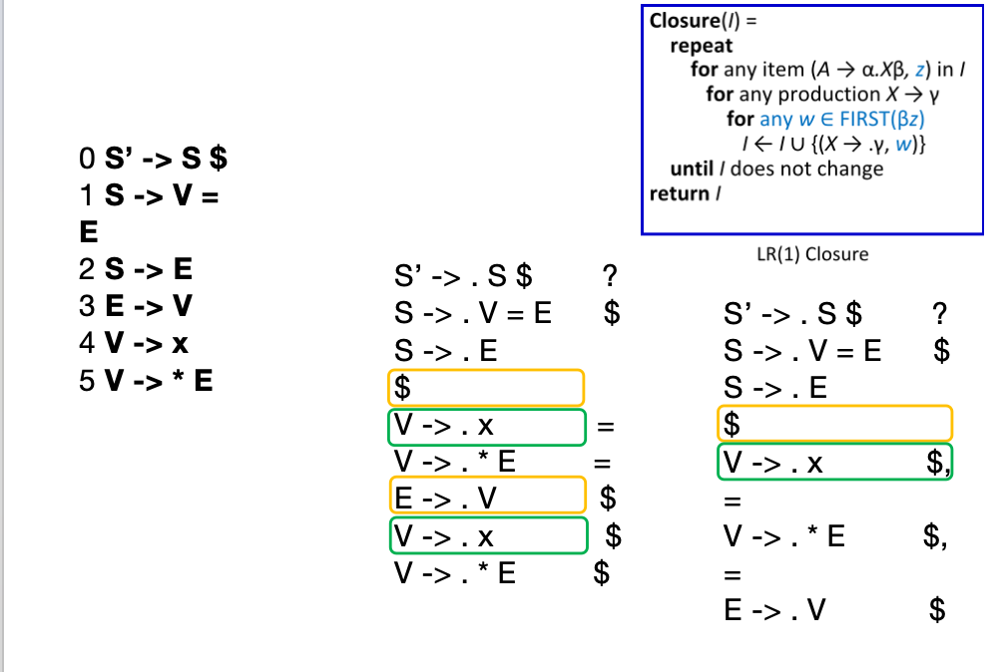

1. 把最初始的产生式 `S'->.S$` 拿来，因为它可以产生 `S`， 所以我们把S开头的产生式也全部拿来
2. `S->V=E` 和 `S->E` 那么这两个式子的first就是`$`然后依次类推

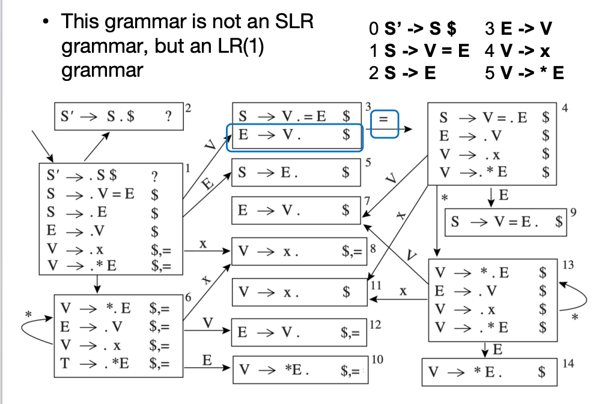

**LALR**

显而易见的，LR(1)的表格巨大而且重复的状态很多，所以我们可以把那些核心状态相同的状态合并成一个状态，这样就得到了LALR(1)文法。

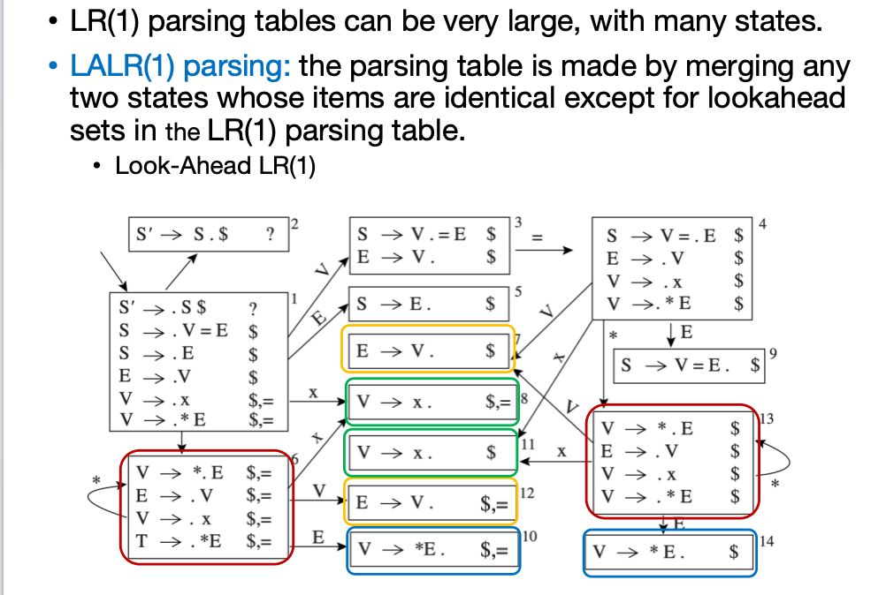

但是LALR(1)文法虽然节省了空间，但是会引入一些新的冲突

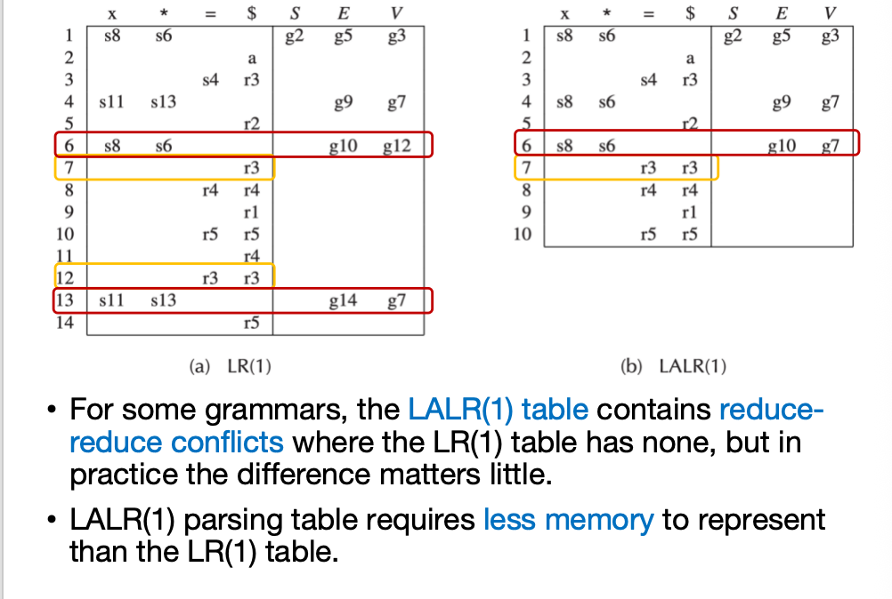

**文法总结**

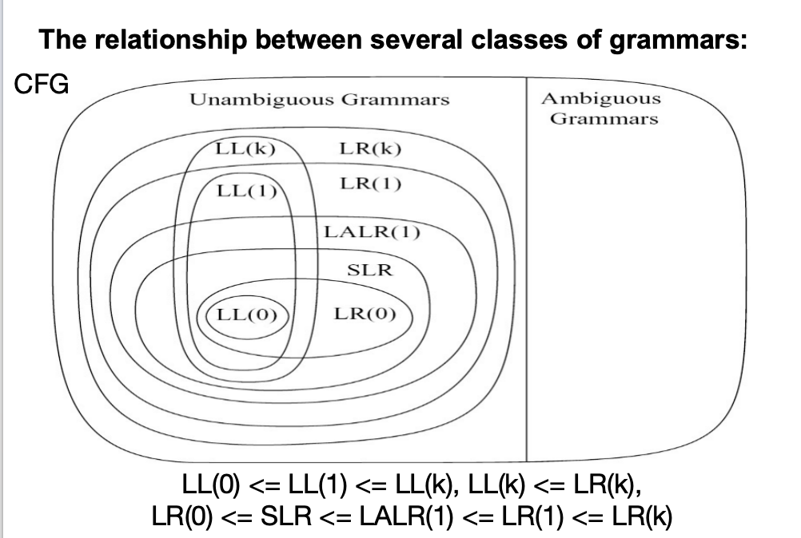

LL(0)等规则，分析起来简单直观但是同时分析的能力也很弱；LR(0)分析能力强但是分析表格巨大；LR(1)分析能力更强但是表格更大；LALR(1)分析能力稍逊于LR(1)但是表格小很多。

## Homework 3-2

**T1 (3.9)**

Diagram the LR(0) states for Grammar 3.26, build the SLR parsing table, and identify the conflicts.

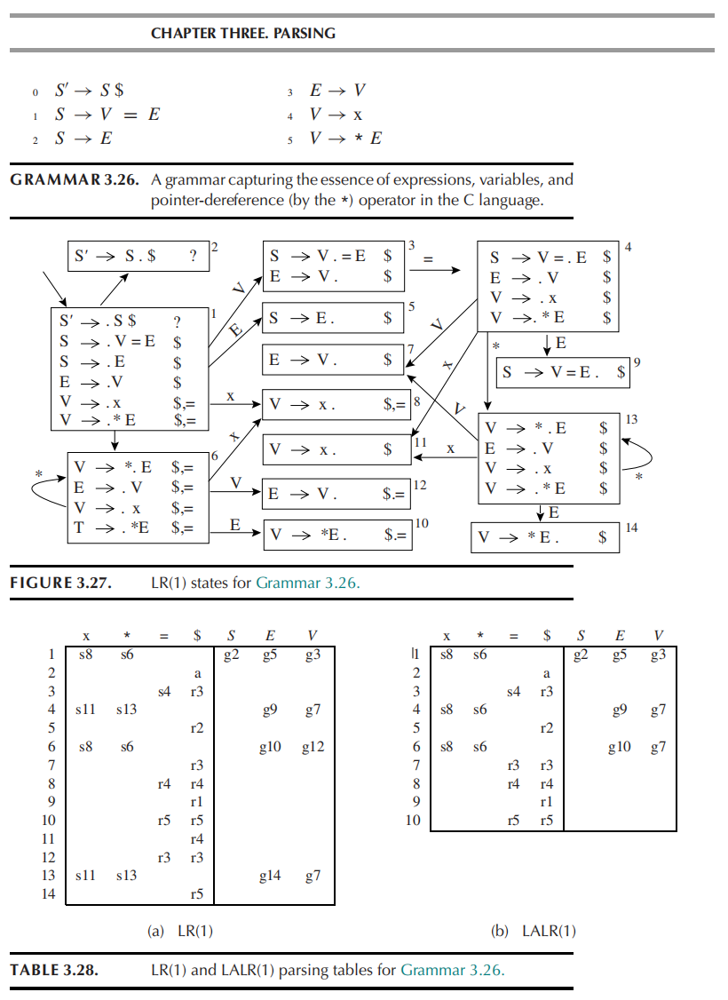

**T2 (3.13)**

Show that this grammar is LALR(1) but not SLR:

```
0 S -> X $
1 X -> M a
2 X -> b M c
3 X -> d c
4 X -> b d a
5 M -> d
```

**T3 (3.14)**

Show that this grammar is LL(1) but not LALR(1):

```
1 S -> ( X
2 S -> E ]
3 S -> F )
4 X -> E )
5 X -> F ]
6 E -> A
7 F -> A
8 A -> 
```