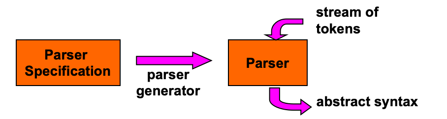
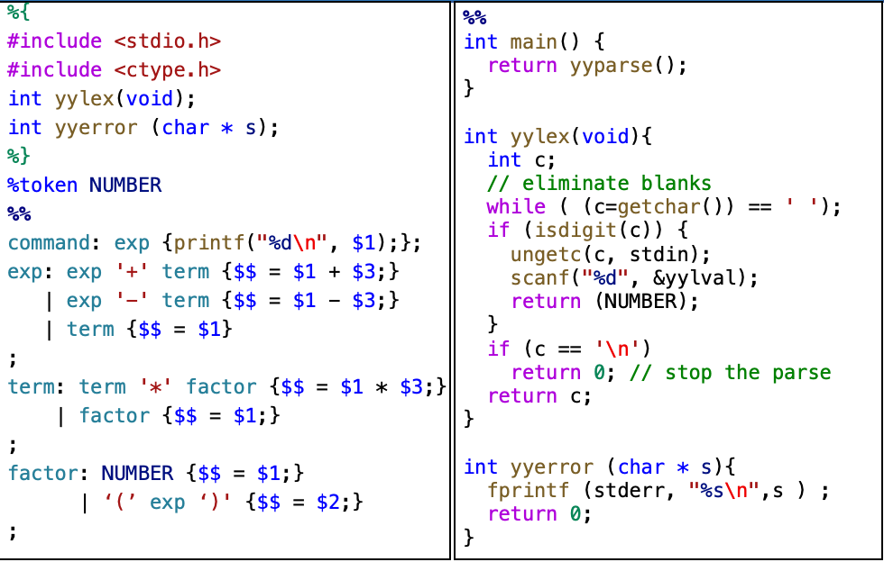

# Chapter 3-3 Syntax Analysis

## Parser Implementation 如何设计一个语法分析器？

1. Write a parser from scratch
2. Use a Parser Generator

> 自动的语法分析器效率没有人手搓的高



## Yacc

**Yacc**: Yet another compiler-compiler （用来写编译器的编译器
- *Input*: a specification file (Usually with .y extension)
- *Output*: an output file consisting of C source code for the parser (Usually with .c extension)

> A Yacc Specification file has the basic format
> ```
> {definitions}
> %%
> {rules}
> %%
> {auxiliary routines}
> ```

**Example**



- *yyparse()*: is declared to return an integer value, whichn is 0 if the parse succeeds and 1 if it does not.
- The yyparse proceedure calls a lexer procedure (yylex)
- Yacc expects the end of input to be signaled by a return of the null value 0 by yylex
- *yylex* return a token type or 0 and *yylval* stores the semantic value.
- *yyerror* prints an error message when an error is encountered during the parse.

> - yyparse 是 Yacc 自动生成的语法分析主函数，是整个语法分析流程的入口（解析成功返回0，失败返回1）
> - yyparse 不会直接读取输入，而是通过不断调用yylex来获取 token
> - yylex 必须用 返回0 来告诉 yyparse 输入已经处理完毕，yyparse收到0后会结束语法分析流程
> - yylex 正常结束返回token类型，输入结束返回0，yylval存储token的语义值

## Recognizing Tokens

**Example YACC Code Structure:**

```C
%{
#include <stdio.h>
#include <ctype.h>
int yylex(void);
int yyerror (char * s);
%}
%token NUMBER
%%
command: exp {printf("%d\n", $1);};
exp: exp '+' term {$$ = $1 + $3;}
   | exp '-' term {$$ = $1 - $3;}
   | term {$$ = $1}
;
term: term '*' factor {$$ = $1 * $3;}
    | factor {$$ = $1;}
;
factor: NUMBER {$$ = $1;}
      | '(' exp ')' {$$ = $2;}
;
%%
```

- 定义区 `%{...%}`: 包含头文件、函数声明(yylex,yyerror)等。
- `%token NUMBER`: 定义一个 NUMBER 类型的 token。
- 规则区 `%%...%%`: 
    - `command` 规则：当解析到 `command` 时，执行 `printf("%d\n", $1);` 输出结果。
    - `exp` 规则：定义了表达式的递归结构，并在每个规则后面使用 `$$` 和 `$i` 来计算表达式的值。
    - `term` 和 `factor` 规则：定义了乘法和括号的处理方式。

**Two Ways of Recognizing Tokens:**
- 语法规则中用单引号括起来的字符（如 `'+'`）表示一个 token。
- 通过 `%token` 定义的 token（如 `%token NUMBER`）表示一个 token类型
- 除此之外，指定语法的开始符号（如 `%start command`）也是一个 token。

---
## Rules

**Rule {Action Code}**

- 一条语法规则后面跟着用 `{...}` 包裹的动作代码。
- 当前面归约(reduce)到该规则时，则马上运行动作代码。
- 动作代码通常写在规则的最后面，但也可以嵌入在中间（如 `factor: '(' exp ')' {$$ = $2;}`），但不允许在规则的开头。

---
## Pseudo variables: `$$`, `$1`, `$3`

- 上述这些变量我们称为伪变量，这是Yacc里专门用来取值、存值的变量。
- 词法分析器 `yylex` 会把单词的实际值存到 `yylval` 里，供语法分析器使用。
- 默认情况下 `yyval=0`, 读到数字彩绘被复制
- `$$` 是当前规则左边符号的值，`$1` 是当前规则右边第一个符号的值，`$2` 是右边第二个符号的值，以此类推。
- 这些值都会被Yacc存在值栈 (value stack) 中，供后续规则使用。

> 例如：
> `exp: exp '+' term {$$ = $1 + $3;}`这个语句中
> - 规则： `exp -> exp + term`
> - 动作代码：`{ $$ = $1 + $3; }`
> - 当这个规则被归约时，Yacc会把当前规则右边的第一个符号（即 `exp`）的值存到 `$1` 中，把第三个符号（即 `term`）的值存到 `$3` 中，然后执行动作代码，把 `$1` 和 `$3` 的值相加，并把结果存到 `$$` 中，这样 `$$` 就成为了当前规则左边符号（即 `exp`）的值。


## Example

<!-- Standard Academic Table ("Three-Line Table") Style in HTML -->
<table style="width: 100%; border-collapse: collapse; border-top: 2px solid #e0e0e0; border-bottom: 2px solid #e0e0e0; text-align: left; background-color: transparent;">
    <thead>
        <tr style="border-bottom: 1px solid #e0e0e0;">
            <th style="padding: 10px; font-weight: bold;">Action</th>
            <th style="padding: 10px; font-weight: bold;">Symbol Stack</th>
            <th style="padding: 10px; font-weight: bold;">Value Stack</th>
        </tr>
    </thead>
    <tbody>
        <tr>
            <td style="padding: 8px;">Shift</td>
            <td style="padding: 8px;"><code>NUM</code></td>
            <td style="padding: 8px;">3 (from yylval)</td>
        </tr>
        <tr>
            <td style="padding: 8px;">reduce</td>
            <td style="padding: 8px;"><code>factor</code></td>
            <td style="padding: 8px;">3</td>
        </tr>
        <tr>
            <td style="padding: 8px;">reduce</td>
            <td style="padding: 8px;"><code>term</code></td>
            <td style="padding: 8px;">3</td>
        </tr>
        <tr>
            <td style="padding: 8px;">Shift</td>
            <td style="padding: 8px;"><code>term, '*'</code></td>
            <td style="padding: 8px;">3, 0 (default)</td>
        </tr>
        <tr>
            <td style="padding: 8px;">Shift</td>
            <td style="padding: 8px;"><code>term, '*', NUM</code></td>
            <td style="padding: 8px;">3, 0, 4</td>
        </tr>
        <tr>
            <td style="padding: 8px;">reduce</td>
            <td style="padding: 8px;"><code>term, '*', factor</code></td>
            <td style="padding: 8px;">3, 0, 4</td>
        </tr>
        <tr>
            <td style="padding: 8px;">reduce</td>
            <td style="padding: 8px;"><code>term</code></td>
            <td style="padding: 8px;">12</td>
        </tr>
        <tr>
            <td style="padding: 8px;">reduce</td>
            <td style="padding: 8px;"><code>exp</code></td>
            <td style="padding: 8px;">12</td>
        </tr>
        <tr>
            <td style="padding: 8px;">reduce</td>
            <td style="padding: 8px;"><code>command</code></td>
            <td style="padding: 8px;"></td>
    </tbody>
</table>


> 初始状态：符号栈为空，值栈为空。
> 1. Shift NUM: 将 NUM 移入符号栈，值栈中对应的值为 3（从 yylval 获取）。
> 2. Reduce factor: 将 NUM 归约为 factor，因为匹配规则`factor : NUMBER { $$ = $1; }`，符号栈中 NUM 弹出， factor压栈，值栈中对应的值仍为 3。
> 3. Reduce term: 将 factor 归约为 term，因为匹配规则`term : factor { $$ = $1; }`，符号栈中 factor 弹出， term 压栈，值栈中对应的值仍为 3。
> 4. Shift '*': 将 '*' 移入符号栈，值栈中对应的值为 0（默认值）。
> 5. Shift NUM: 将 NUM 移入符号栈，值栈中对应的值为 4（从 yylval 获取）。
> 6. Reduce factor: 将 NUM 归约为 factor，因为匹配规则`factor : NUMBER { $$ = $1; }`，符号栈中 NUM 弹出， factor压栈，值栈中对应的值为 3，0，4.
> 7. Reduce term '*' factor: 将 term '*' factor 归约为 term，因为匹配规则`term : term '*' factor { $$ = $1 * $3; }`，符号栈中 term、'*'、factor 弹出，新的 term 压栈，值栈中对应的值为 3 * 4 = 12。
> 8. Reduce exp: 将 term 归约为 exp，因为匹配规则`exp : term { $$ = $1; }`，符号栈中 term 弹出，新的 exp 压栈，值栈中对应的值为 12。
> 9. Reduce command: 将 exp 归约为 command，因为匹配规则`command : exp { printf("%d\n", $1); }`，符号栈中 exp 弹出，执行 `printf("%d\n", $1);` 输出 12。
---
## YYSTYPE

Consider the rules:

```text
exp -> exp op term | term
op -> '+' | '-'
```

- 对于 *exp* 和 *op* 的值，**它们的类型是什么？**
- **不同的语法规则/符号通常需要不同类型的值**（例如 *exp* 可能是个数字类型，而 *op* 是字符类型）。
- 在 Yacc 中该如何处理这种多类型的情况？
  - **方法一：使用 `%union` 声明**
    直接在 Yacc 规范文件（首部）使用 `%union` 来声明一个联合体：
    ```c
    %union { 
        double val;
        char op; 
    }
    ```
  - **方法二：重定义 `YYSTYPE` 宏**
    在定义区或独立的头文件里定义一个新的数据类型（如结构体或类），然后**通过宏定义将 `YYSTYPE` 设置为该类型**：
    - 注意：采用此方法时，必须在对应的动作代码（Action code）中手动去构造、提取这其中的具体字段。
    ```c
    #define YYSTYPE ASTNode
    ```
    - `YYSTYPE` 的默认定义是 `#define YYSTYPE int`，如果不进行重定义，所有符号的值类型都将默认为 `int`。

## %union & %type

- 所有的**非终结符 (non-terminals)** 的值都是通过用户在规则后提供的动作代码（Action code）来计算和获取的的。
- **终结符 (Tokens)** 也可以有自己的值，这通常是在词法分析器 (Lexer) 中通过给 `yylval` 赋值来实现的。
- 使用 **`%union`** 声明一个联合体，用以列出所有可能会用到的值类型集合（这实际上是在为 Yacc 定义多类型的 `YYSTYPE`）。
- 使用 **`%type`** 将具体的文法符号（包括终结符和非终结符）与 `%union` 中的特定成员类型绑定起来。

**使用 `%union` 和 `%type` 的示例：**

```c
%token NUMBER
%union { 
    double val;
    char op; 
}
%type <val> exp term NUMBER
%type <op> op
%%

command : exp { printf("%f\n", $1); }
        ;
exp : exp op term {
        switch ($2){
            case '+' : $$=$1+$3; break;
            case '-' : $$=$1-$3; break;
        }
    }
    | term {$$ = $1;}
    ;
op : '+' {$$ = $1;}
   | '-' {$$ = $1;}
   ;
```

这里面的 `%type <val> exp term NUMBER` 表示 `exp`、`term` 和 `NUMBER` 这三个符号的值绑定到 `union` 中的 `val` 成员，类型都是 `double`，而 `%type <op> op` 表示 `op` 的值类型是 `char`。在动作代码中，我们可以直接使用 `$1`, `$2`, `$3` 等来访问这些符号的值，并且它们的类型已经被正确地定义和绑定了。

---
## Embedded Action
