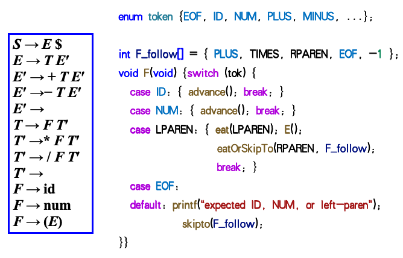
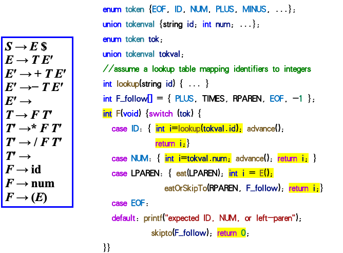
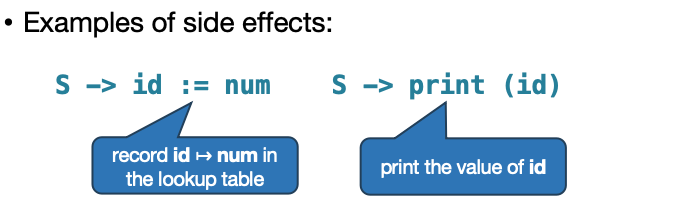
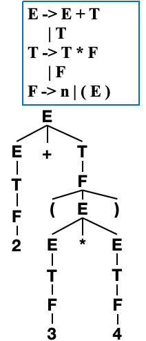
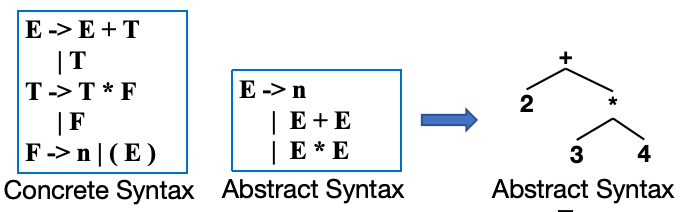
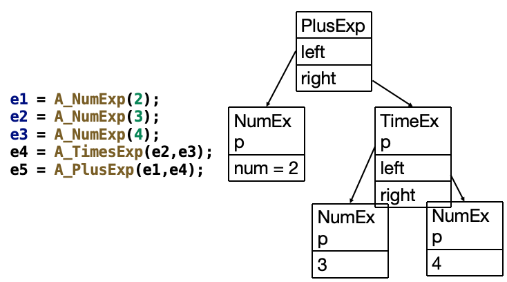

# Chapter 4 

## Semantic Actions (语义动作)

- 词法分析器的核心任务是进行语法合法性检查，判读那输入的代码是否符合给定的语法规则
- 编译器实际需求不仅是语法检查，还需要：
    - 构建语法树 (AST)
    - 执行语义分析：类型检查，作用域检查，变量绑定等
    - 生成中间表示 (IR)：把高级语言转换成与平台无关的中间代码，为最终生成机器码做准备
- 语义动作 (Semantic Actions) ：绑定在语法规则上的代码，在语法分析器识别到对应语法结构时自动执行，用来完成上面的三类工作。
    - 递归下降语法分析器 (Recursive Descent Parser) ：在每个语法规则的函数中直接编写语义动作代码。
    - Yacc/Bison 等工具：在语法规则中使用 `{ ... }` 来编写语义动作代码，这些代码会在对应的归约操作时执行。

---
## Recursive Descent（递归下降语法分析基础）



- 左侧进行了 LL(1) 的语法规则分析
- 右侧是对应的递归下降语法分析器实现
    - `advance()`: 读取下一个 token
    - `eat(token)`: 检查当前输入是否匹配预期的 token，如果匹配则继续，否则报错
    - `F_follow()`: 处理 `F` 的后续部分，判断是 `* F` 还是空



- 新增的语义相关定义，使用 `tokenval` 来存储每个token的语义值
- 在 `F()` 函数中，当匹配到 `NUMBER` 时，将其值存储在 `tokenval` 中，并返回这个值
- 用返回值来传递语义信息，例如 `E()` 和 `T()` 函数返回计算结果，`F()` 返回数字的值
- 语义动作与语法规则一一对应
- 完全自顶向下，从跟节点S开始，递归调用子节点，一边匹配语法一边计算值

> 递归下降分析器的语义动作有三种实现方法：
> 1. 函数返回值：每个函数返回一个值，表示该语法结构的计算结果。
> 2. 函数的副作用/全局变量：使用全局变量来存储当前计算的结果。
> 3. 两者结合，函数返回值用于传递计算结果，副作用用于维护状态或上下文信息。



> 语义值的类型系统：
> 终结符：比如 NUM 对应 int 类型（存储数值），ID 对应 string 类型（存储变量名）。
> 非终结符：比如E（表达式）对应 int 类型（存储计算结果）， type 对应自定义的类型枚举。


## Abstract Parse Trees (抽象语法树)


抽象语法树的作用：
- 如果在语义动作中写编译器会导致可维护性和可读性都很差，且执行顺序完全绑定了解析顺序
- 抽象语法树可以把语法分析和语义分析分离，提高代码的可维护性和可读性

**Parse Tree (语法树)**：完整地表示输入代码的语法结构，包括所有的终结符和非终结符节点。


> 具体语法树的缺点：
> 1. 包含大量冗余信息：如括号、运算符等，这些在后续的编译阶段并不需要。
> 2. 结构复杂，难以维护和理解。
> 3. 强行依赖语法规则，语法规则一旦修改就会影响整个编译器。

**Abstract Syntax Tree (抽象语法树)**：只保留对编译器后续阶段有意义的节点，去掉冗余的语法细节。

如何从具体语法转换到抽象语法树：
- 移除 E/T/F 等中间非终结符，直接用E表示表达式。
- 移除括号等无意义的语法符号，只保留运算符和操作数。
- 完全消除语法规则的影响，只保留代码的「语义结构」。



对于一个抽象语法 `E->n | E+E | E*E`，我们可以定义一个对应的抽象语法树节点类型：
```C
// 定义AST节点类型：数字、加法、乘法
typedef enum { A_numExp, A_plusExp, A_timesExp } NodeKind;

// 前向声明
typedef struct A_exp_ *A_exp;

// AST节点结构体
struct A_exp_ {
    NodeKind kind;  // 节点类型（区分数字/加法/乘法）
    union {         // 联合体：不同类型节点存储不同数据
        int num;                    // 数字节点：存储数值
        struct { A_exp left; A_exp right; } plus;  // 加法节点：左右子树
        struct { A_exp left; A_exp right; } times; // 乘法节点：左右子树
    } u;
};

//节点构造函数封装，保证节点结构正确
A_exp A_NumExp(int num);          // 构造数字节点
A_exp A_PlusExp(A_exp left, A_exp right);  // 构造加法节点
A_exp A_TimesExp(A_exp left, A_exp right); // 构造乘法节点
```

再构造加法节点
```C
A_exp A_PlusExp(A_exp left, A_exp right) {
    // 1. 分配内存（checked_malloc：带检查的内存分配）
    A_exp e = checked_malloc(sizeof(*e));
    // 2. 设置节点类型为加法
    e->kind = A_plusExp;
    // 3. 绑定左右子树
    e->u.plus.left = left;
    e->u.plus.right = right;
    // 4. 返回节点指针
    return e;
}
```



**用Yacc自动构建抽象语法树：**

```c
%left PLUS
%left TIMES  // 定义优先级：TIMES高于PLUS，保证运算顺序

%%
exp : NUM        { $$ = A_NumExp($1); }  // 数字归约为exp，构造NumExp节点
    | exp PLUS exp { $$ = A_PlusExp($1, $3); }  // 加法归约，构造PlusExp节点
    | exp TIMES exp { $$ = A_TimesExp($1, $3); } // 乘法归约，构造TimesExp节点
%%
```

- 语法分析器（Yacc）在归约时，自动调用对应的 AST 构造函数：
    - 识别 `NUM` 时，调用 `A_NumExp`，把数字值$1封装成节点，赋值给$$（`exp` 的语义值）。
    - 识别 `exp + exp` 时，调用 `A_PlusExp` ，把左右两个 `exp` 的 `AST` 节点 `$1` 和 `$3` 组合成加法节点。
    - 识别 `exp * exp` 时，调用 `A_TimesExp`，同理。
- 最终，根节点exp的语义值`$$`，就是整个表达式的完整 AST 根指针。

---
## Positions (抽象语法树中的位置信息)

- **为什么需要记录位置信息？**
    - 在**单遍编译器 (One-pass compiler)** 中，词法分析、语法分析和语义分析是同时进行的。如果出现需要向用户报告的类型错误，直接读取词法分析器维护的**“当前位置 (current position)”**全局变量，就能很好地近似出报错位置。
    - 在使用**抽象语法树 (AST)** 数据结构的编译器中，词法分析在语义分析开始之前就已经结束，因此无法直接依赖词法分析器的“当前位置”。如果此时发生类型错误，该如何定位报错的源代码位置？

- **如何记录位置信息？**
    - 必须将抽象语法树中每个节点的源文件位置给记录下来。
    - **实现方式：** 在抽象语法数据结构中添加 `pos` 字段，这些字段用来指示生成该抽象语法结构的字符在最原始源文件中的位置。
    - 例如构造节点时传入位置参数：`A_NumExp(3, pos)` ，将其映射为具体的源文件坐标 `(line 1, pos 3)`。

- **如何设置 `pos` 字段的值？**
    - 首先，词法分析器 (lexer) 必须把每个 token 的起始和结束位置传递给语法分析器 (parser)。
    - 对于语法分析器：理想情况下，它应该在维护**语义值栈 (semantic value stack)** 的同时，额外维护一个**位置栈 (position stack)**，使得每个符号的位置信息都可以直接传递给语义动作使用。
    - **支持情况：Bison 支持这套机制，而 Yacc 不支持。**

- **Yacc 中的解决方案：**
    - 针对 Yacc 不维护位置栈的问题，一种解决方法是：**定义一个非终结符 `pos`**，将其语义值设为源文件的位置类型（如行号，或行号加列号）。
    - 这样可以通过匹配这个空产生式来获取它前面符号的位置，例如获取 `PLUS` 操作符的位置。
    - **Yacc 代码示例：**
      ```c
      %{ extern A_OpExp (A_exp,A_binop,A_exp,position); %}
      %union { int num; string id; position pos;...};
      %type <pos> pos
      
      // 在 exp 和 PLUS 之后插入非终结符 pos，用 $3 获取它的语义值（即位置信息），原先的第二个 exp 变为 $4
      exp: exp PLUS pos exp {$$= A_OpExp($1, A_plus, $4, $3); }
      
      // pos 匹配空串（动作在 PLUS 归约完后触发），直接将词法分析器中的全局变量赋给 $$
      pos: /* empty */ { $$ = EM_tokpos; }  
      ```