# Chapter 5 Semantic Analysis (语义分析)

先回顾一下整个编译器的工作流程

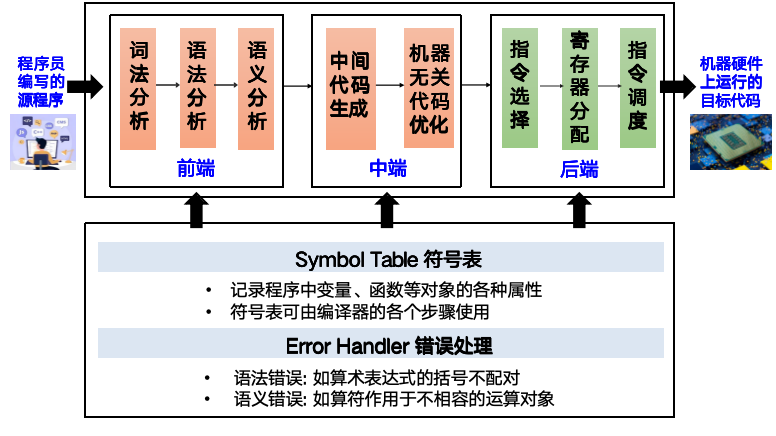

---
## Overview
**Semantic**: of or relating to meaning in language

**Semantic Analysis**:
- connects variable definitions to their uses
- checks that each expression has a correct type
- translates the abstract syntax into a simpler representation suitable for generating machine code (in Chapter 7)

> - 将变量定义与其使用相连接
> - 检查每个表达式具有正确的类型
> - 将抽象语法转换为更简单的表示形式，以便生成机器代码（在第 7 章中介绍）

## Symbol Table (符号表)

- The semantic analysis phase is characterized by the maintenance of symbol tables (also called environments) mapping identifiers to their types and locations.
- Declarations of identifiers v.s. uses of identifiers
- An environment is a set of bindings denoted by $\mapsto$:

> - 语义分析阶段的特点在于维护符号表（也称为环境），将标识符映射到其类型和位置。
> - 标识符的声明与标识符的使用
> - 环境是一组绑定关系，用“$\mapsto$”表示：

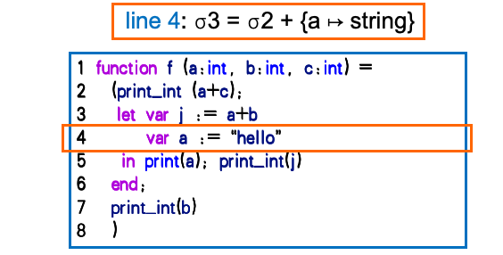

- 在上述这个图片中展示了 `let` `in` 的用法，在 `let` 和 `in` 之间定义的变量 `x` 只能在 `in` 之后使用。

接下来逐行分析变化过程
- line 1: $\sigma 1 =\sigma 0+\{a\mapsto \text{int},b\mapsto \text{int},c\mapsto \text{int}\}$ （`+`的意思是将新的绑定关系添加到环境中）
- line 2: 没有更新，因为没有新的定义。但是需要查表进行类型的匹配
- line 3: $\sigma 2 = \sigma 1+\{j\mapsto \text{int}\}$
- line 4: $\sigma 3 = \sigma 2+\{a\mapsto \text{string}\}$，在这一行之后 $\sigma 3$ 中 `a` 的类型被更新了而$\sigma 2$ 中 `a` 的类型仍然是 `int`
- line 6: discard $\sigma 3$，恢复到 $\sigma 1$，因为 `a` 的作用域已经结束了
- line 7: look up `b` in $\sigma 1$
- line 8: discard $\sigma 1$，恢复到 $\sigma 0$

## 如何实现符号表

**Functional Style**:
- Keep $\sigma 1$ as it is while creating $\sigma 2$ and $\sigma 3$ by adding new bindings to $\sigma 1$.
- 容易回滚

**Imperative Style**:
- Modify $\sigma 1$ in place to create $\sigma 2$ and $\sigma 3$.
- 需要保存修改的过程以便回滚 (undo stack)

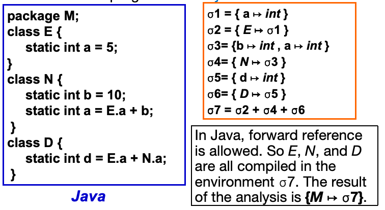

## Efficient Imperative Symbol Table

- **Hash table**能够实现快速的查找，同时和外部的数据相结合实现快速的删除

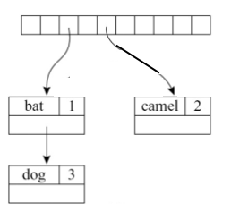

```C
struct bucket {
    string key;
    void *binding;
    struct bucket *next;
}

#define SIZE 109
struct bucket *table[SIZE];

unsigned int hash(char *s0){
    unsigned int h=0;
    char *s;
    for(s=s0;*s;s++){
        h=(h*65599)+*s;
    }
    return h;
}

struct bucket *Bucket (string key, void *binding, struct bucket *next) {
  struct bucket *b=checked_malloc(sizeof(*b));
  b->key = key; b->binding = binding; b->next = next;
  return b; 
}

void insert(string key, void *binding) {
  int index=hash(key)%SIZE;
  table[index]=Bucket(key, binding, table[index]); 
}
void *lookup(string key) {
  int index=hash(key)%SIZE 
  struct bucket *b;
  for (b = table[index]; b; b=b->next) 
    if (0==strcmp(b->key,key)) 
      return b->binding; 
  return NULL; 
}
void pop(string key) { 
  int index=hash(key)%SIZE
  table[index]=table[index].next; 
} 

```
- 语义分析阶段的特点在于维护符号表（当符号表 $\sigma$ 已经包含 $a \mapsto \text{τ1}$ 时，也考虑 $\sigma + \{a \mapsto \text{τ2}\}$。插入函数将 $a \mapsto \text{τ1}$ 保留在桶中，并将 $a \mapsto \text{τ2}$ 放在列表的前面。
$$hash(a) -> <a, τ2 > -> <a, τ1>$$
- 当在 a 的作用域结束时执行 pop(a) 操作时，$\sigma$ 会被恢复。（插入和弹出操作以栈的方式进行。）
$$hash(a) -> <a, τ1>$$


## Efficient Functional Symbol Table

下面这个图是Imperative Style的实现方式

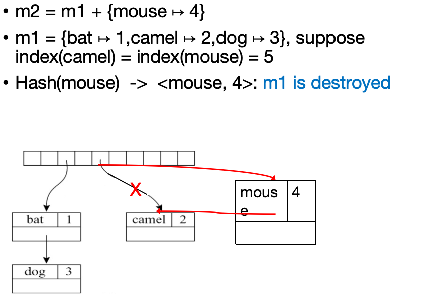

要想使得表更新的时候不修改原来的表，那么

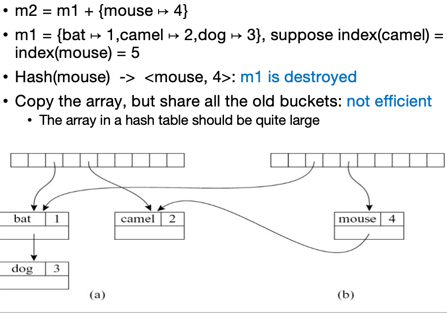

但是往往在一个程序中，哈希表的数量巨大，如果单纯用哈希表的话对于内存相当不友好，所以我们可以采用一个查找也很方便的数据结构--二叉搜索树

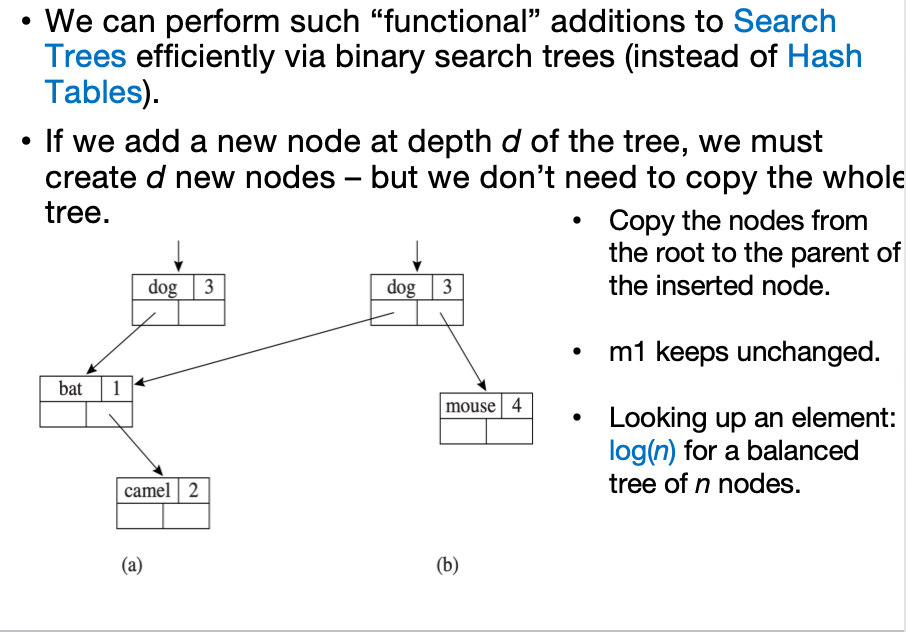

同时变量的长短我也不关心，所以我们可以把变量映射为符号，每次只需要对符号进行比较然后确定其在二叉搜索树中的位置即可

- S_beginScope: Remembers the current state of the table.
- S_endScope: Restores the table to where it was at the most recent beginScope that has not already been ended.

> - S_beginScope：记住表的当前状态。
> - S_endScope：将表恢复到最近的 beginScope 的位置，该 beginScope 尚未结束。


**The interface of symbol table**:
```C
typedef struct S_symbol_ *S_symbol;
S_symbol S_symbol (string);     // string -> symbol
string S_name(S_symbol);     // symbol -> string
typedef struct TAB_table_ *S_table;
S_table S_empty(void);     // create an empty symbol table
void S_enter(S_table t, S_symbol sym, void *value);  // enter binding
void *S_look(S_table t, S_symbol sym);  // look up symbol
void S_beginScope(S_table t);  // remember current table state
void S_endScope(S_table t);  // restore to most recent beginScope 
```

下列是详细的函数实现
```C
static S_symbol mksymbol (string name , S_symbol next) {
  S_symbol s = checked_malloc(sizeof(*s));
  s->name = name; s->next = next;
  return s;
}
S_symbol S_symbol (string name) {
	int index = hash(name)%SIZE;
	S_symbol syms = hashtable[index].sym;
	for (sym = syms; sym; sym = sym->next)
	  if (0 == strcmp(sym->name, name)) return sym;
	sym = mksymbol(name, syms);
	hashtable[index] = sym;
   return sym;
}
string S_name (S_symbol sym) {
  return sym->name;
}
```

**Auxiliary stack**:
- Showing in what order the symbols were “pushed” into the symbol table. 
- As each symbol is popped, the head binding in its bucket is removed.
- beginScope: pushes a special marker onto the stack
- endScope: pops symbols off the stack until finds the topmost marker. 

> - 显示符号被“推入”符号表的顺序。
> - 每当一个符号被弹出时，其桶中的头绑定被移除。
> - beginScope：在堆栈上推送一个特殊标记
> - endScope：弹出堆栈上的符号，直到找到最顶部的标记。

- The auxiliary stack can be integrated into the Binder by having a global variable top showing the most recent Symbol bound in the table. 
- Pushing: copy top into the prevtop field of the Binder.

> - 辅助堆栈可以通过在Binder中使用一个全局变量top来显示表中最近绑定的符号来集成。
> - 推送：将top复制到Binder的prevtop字段中。
```C
struct TAB_table_ {
  binder table[TABSIZE];
  void *top;
};
static binder Binder(void *key, void *value, binder next, void *prevtop) {
  binder b = checked_malloc(sizeof(*b));
  b->key = key; b->value=value; b->next=next; 
  b->prevtop = prevtop; 
  return b;
}
```

## Bindings for the Tiger Compiler

Tiger has two separate name spaces
- Type Environment: mapping type names to types
- Value Environment: mapping variable and function names to their types and locations

> Tiger 有两个独立的命名空间
- 类型环境：将类型名称映射到类型 $let type a = int$ 中 `a` 的类型是 `int`
- 值环境：将变量和函数名称映射到它们的类型和位置 $let var a :=1$ 中 `a` 的类型是 `int`

在Tiger编译器中实现类型环境和值环境的绑定关系

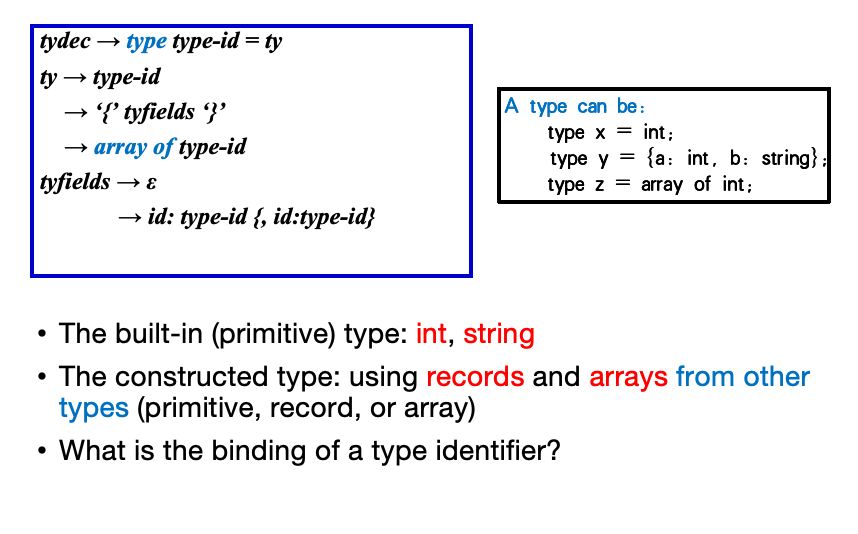

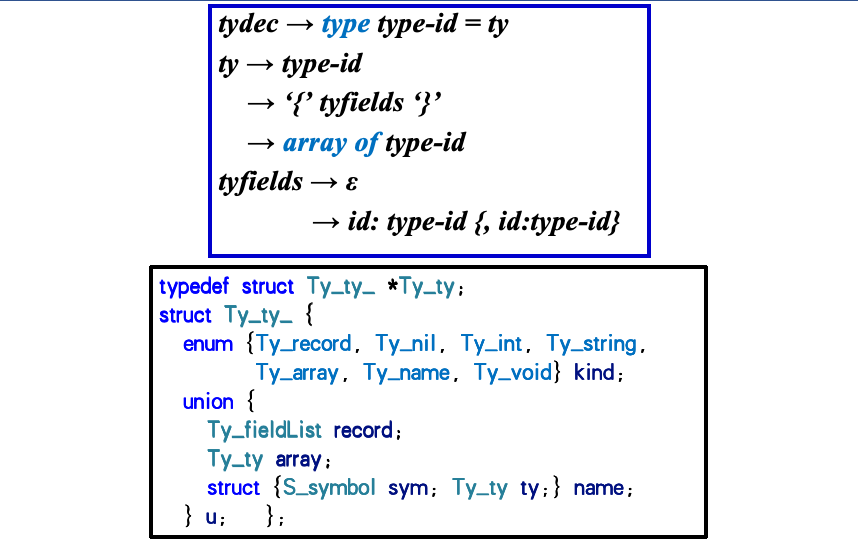

看下面这个例子，上面这种语法不行是因为 `a` 和 `b` 虽然里面的内容类型是相同的，但是地址是不同的，无法使用 `i:=j` 来进行赋值

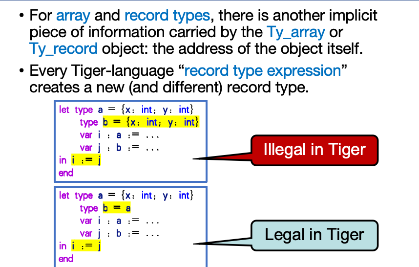

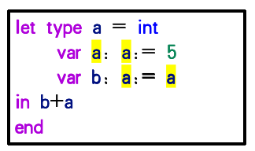

左边这个图中，可以看出
- 第一个 `a` 是类型变量，是被定义的类型变量，表示 `a` 是一个类型
- 第二个 `a` 是类型变量，表示给 `a` 强制复制为 `a` 的类型
- 第三个 `a` 是类型变量，表示给 `b` 强制复制为 `a` 的类型
- 第四个 `a` 是值变量，因为出现在表达式中

```C
typedef struct E_enventry_ *E_enventry;
struct E_enventry_ {
  enum {E_varEntry, E_funEntry} kind;
  union {
    struct {Ty_ty ty;} var;
    struct {Ty_tyList formals; Ty_ty result;} fun;
  } u;
};
E_enventry E_VarEntry(Ty_ty ty); 
E_enventry E_FunEntry(Ty_tyList formals, Ty_ty result);
S_table E_base_tenv(void);   // Ty_ty environment
S_table E_base_venv(void);   // E_enventry environment
```

## Type Checking expressions (类型检查表达式)

语义分析模块包含四个在语法树上重复执行的功能：
```C
Struct expty transVar (S_table venv, S_table tenv, A_var v);
Struct expty transExp (S_table venv, S_table tenv, A_exp a);
Void transDec (S_table venv, S_table tenv, A_dec d);
Ty_ty transTY (S_table tenv, A_ty a);
```

- transVar: translates a variable and returns its type
- transExp: translates an expression and returns its type
- transDec: translates a declaration and returns nothing
- transTY: translates a type and returns the type

> - transVar：翻译一个变量并返回它的类型
> - transExp：翻译一个表达式并返回它的类型
> - transDec：翻译一个声明并返回无
> - transTY：翻译一个类型并返回该类型

**transExp**:
- *arguments*: value environment `venv`, type environment `tenv`, expression `a`
- *results*: containing a translated expression and its type
```C
struct expty {Tr_exp exp; Ty_ty ty;};
```

Tiger's non-overloaded type-cheking for '+' expression
```C
struct expty transExp(S_table venv, S_table tenv, A_exp a){
switch(a->kind) {
   ...
   case A_opExp: {
     A_oper oper = a->u.op.oper;
     struct expty left =transExp(venv,tenv,a->u.op.left);
     struct expty right=transExp(venv,tenv,a->u.op.right); 
     if (oper==A_plusOp) {
       if (left.ty->kind!=Ty_int)
         EM_error(a->u.op.left->pos, "integer required");
       if (right.ty->kind!=Ty_int)
         EM_error(a->u.op.right->pos,"integer required");
       return expTy(NULL,Ty_Int()); 
     }...
   }
 } 
 assert(0); /* should have returned from some clause of the switch */
}
```

```C
struct expty transVar(S_table venv, S_table tenv, A_var v ) {
switch(v->kind) {
  case A_simpleVar: {
    E_enventry x = S_look(venv, v->u.simple);
    if (x && x->kind == E_varEntry)   // v is a defined var in value env
      return expTy(NULL, actual_ty(x->u.var.ty));   // skip placeholders
    else {
      EM_error(v->pos, “undefined variable %s”, S_name(v->u.simple));
      return expTy(NULL, Ty_Int());}
  }
  case A_fieldVar:
    ...
 }
}
```

## Variable devlarations

一旦遇到一个let，则进入下列函数对于变量类型进行修改
```C
struct expty transExp (S_table venv, S_table tenv, A_exp a) {
  switch(a->kind) {
    ...
    case A_letExp: {
      struct expty exp; 
      A_decList d; 
      S_beginScope(venv); S_beginScope(tenv);
      for (d = a->u.let.decs; d; d=d->tail)
        transDec(venv,tenv,d->head);
      exp = transExp(venv,tenv,a->u.let.body); 
      S_endScope(tenv); S_endScope(venv); 
      return exp;   }
  }...
}
```

对于一个表达式 $var x:=exp$，则我们需要知道exp的类型是什么，然后将 $x$ 的类型绑定为 $exp$ 的类型

```C
void transDec(S_table venv, S_table tenv, A_dec d) {
  switch(d->kind) { 
    case A_varDec: { 
      struct expty e = transExp(venv,tenv,d->u.var.init);
      S_enter(venv, d->u.var.var, E_VarEntry(e.ty));
    }
  ...
  }
  ...
```

对于一个表达式 $var x:type-id:=exp$，则我们需要知道比较$type-id$和$exp$的类型是否匹配，如果匹配则将 $x$ 的类型绑定为 $type-id$ 的类型

## Function declarations

对于语句 `function id (tyfields) : type-id = exp`

```C
void transDec(S_table venv, S_table tenv, A_dec d) { 
  switch(d->kind) {
    ...
    case A_functionDec: {
      A_fundec f = d->u.function->head;
      Ty_ty resultTy = S_look(tenv, f->result); 
      Ty_tyList formalTys = makeFormalTyList(tenv,f->params); 
      S_enter(venv, f->name, E_FunEntry(formalTys,resultTy));
      S_beginScope(venv); 
      {A_fieldList l; Ty_tyList t;
       for(l=f->params, t=formalTys; l; l=l->tail, t=t->tail)
         S_enter(venv,l->head->name,E_VarEntry(t->head));
      } 
      transExp(venv, tenv, d->u.function->body); 
      S_endScope(venv); 
      break; 
    } 
    ...
}
```

上面这个函数是一个简化的方法，只能处理一下情况的函数
- 只能处理单个函数
- 只能处理又返回值的函数
- 不能处理程序错误
- 不能处理主体表达式的类型是否与所声明的结果类型相匹配

## Recursive Declarations

对于表达式 $type list ={first:int, rest:list}$，我们需要先将 `list` 绑定为一个类型变量(占位符)，然后再将 `list` 的类型绑定为一个记录类型，这样就可以处理递归类型了

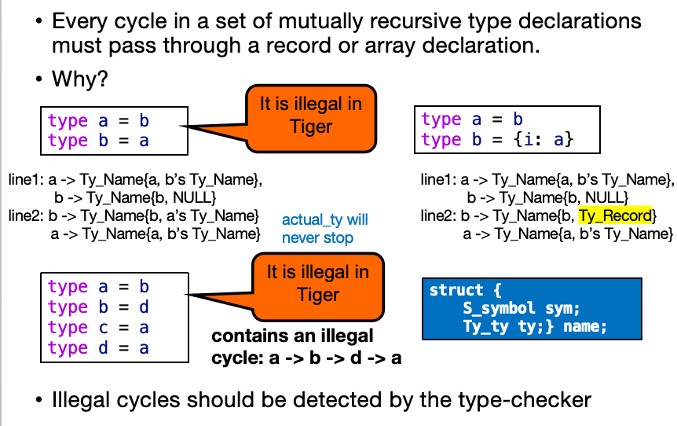

## Recuresive Functions

`f calls g, g calls f` 的情况，我们需要先将 `f` 和 `g` 都绑定为一个函数类型变量(占位符)，然后再将 `f` 和 `g` 的类型绑定为一个函数类型，这样就可以处理递归函数了