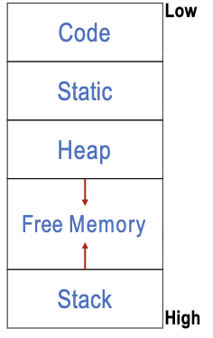
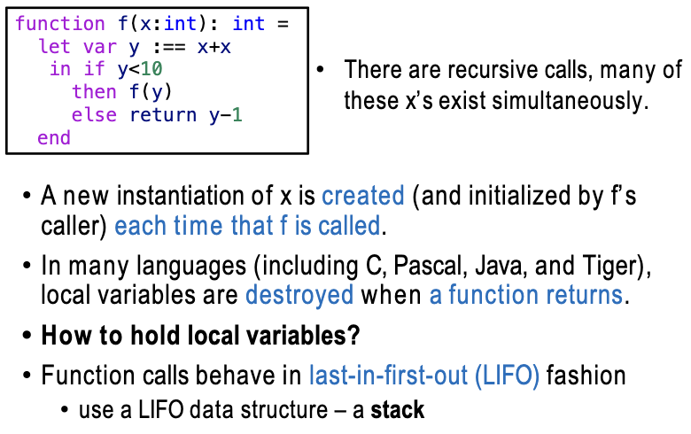
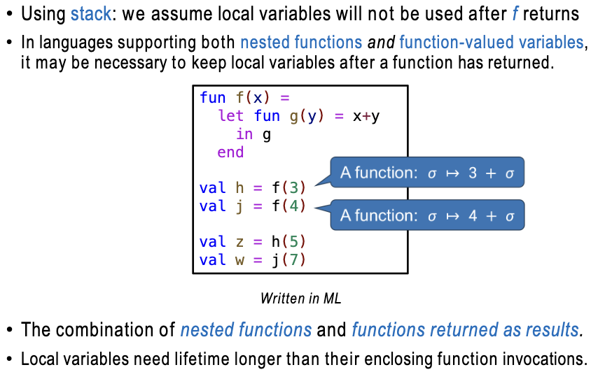
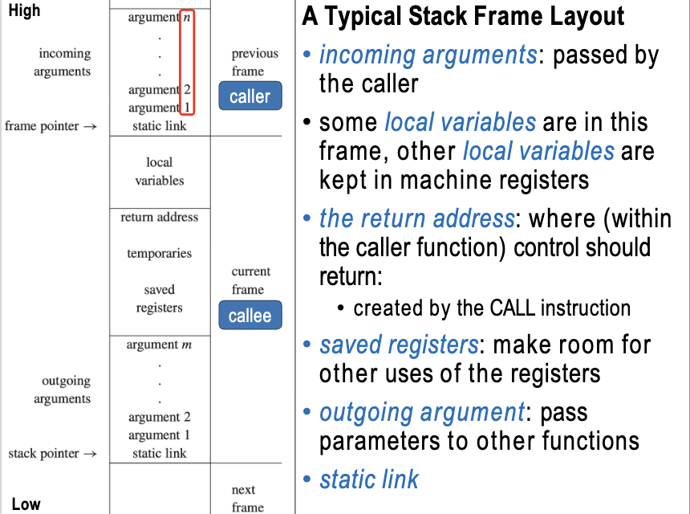
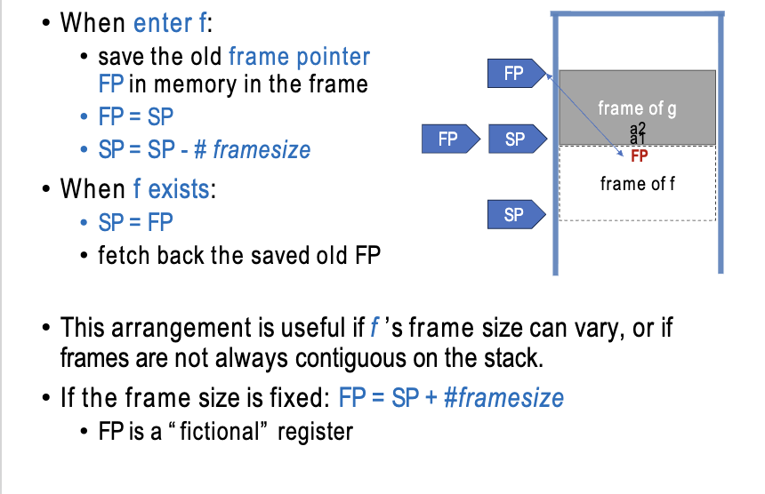
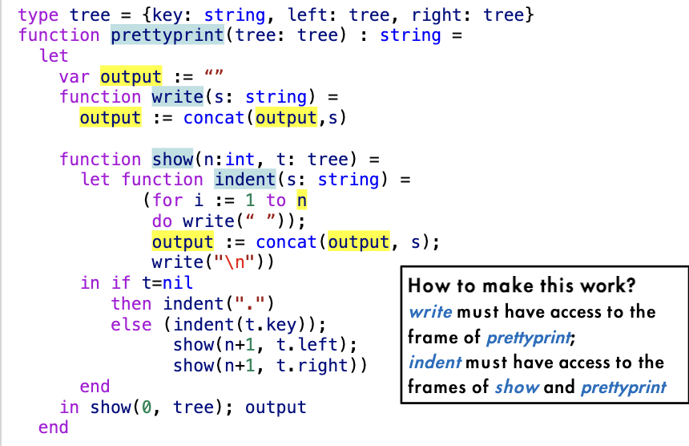
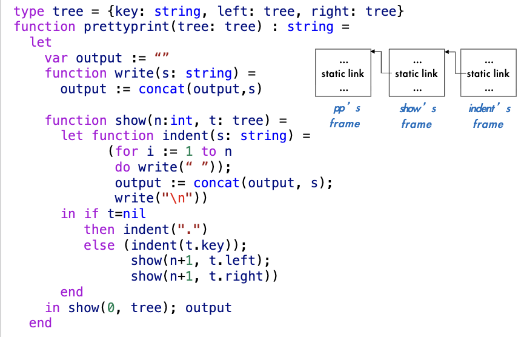
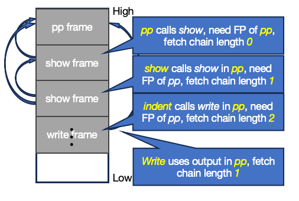

# Chapter 6 Activation Records

## Storage Organization

A typical way of subdividing memory is:
- **Code**: the executable target code
- **Static**: the data objects of which the size can be known at compile time
  - *global constants*
  - *data generated by compiler*
- **Stack**: data structures called activation records that get generated during procedure calls
- **Heap**: data that is alloocated and deallocated under program control
  - 比如C语言中malloc就会存储在 heap 中,而局部变量则存储在 stack 中



---

## Example



> - 每一次递归调用函数，都需要对 x 进行一次实例化，那么我就需要在 stack 中保存所有版本的 x 的值
> - 使用 stack 是因为其 LIFO 的特点
> - 每一个递归调用的函数结束之后，都会将对应的 activation record 从 stack 中弹出

## Higher Order Function



> - 对于上述这种语言，它具有两种特性：1. 可以再函数中嵌套函数 2. 可以讲函数作为参数传递。即 Nested Function 和 function-valued variables。比如ML和Scheme等函数式编程语言就具有这两种特性。
> - 这种语法无法使用stack来实现，因为 stack 只能保存函数的局部变量（局部变量在一个函数结束后就被弹栈了，下一次再调用的时候就不知道前一个的值），而无法保存函数本身

---
## Stack Frame

对于一个栈，从数据结构的角度来说只能压栈和弹栈，只能访问栈顶元素，但是这种特性无法满足函数调用和局部变量保存的需求。


我们把 stack 当成一个 array来处理，stack pointer右侧是allocated的部分，左边是未分配的部分。



对下面这个例子
```C
g:
  f(a,b,c){
    h(d,e);
  }
```

g函数里面调用了f函数，那门在f函数中的这些参数a,b,c是g为f所准备好的数据，会存放在caller的 incoming argument 区域。而f里面调用h，h所需要的参数d,e是f为h准备好的数据，那么就存放在f的 outgoing argument 区域。

**Frame Pointer**: 为什么这里fp上方的数据存储要从argument n存放到argument 1.是因为当我f需要用到第一个参数的时候，我只需要访问fp+1就可以了，而不需要访问fp+n，这样就可以节省一次加法运算。



> - 对于上面这个流程有一个问题，在fp向下移动的时候，我们如果要弹栈回复到前面的状态，我们就需要保存前面的位置到下面frame中的某个位置。
> - fp和sp两个指针可以实现不同framesize的函数调用。如果framesize是固定的话，那就只需要一个指针

---
## Registers

访问寄存器比访问内存要快得多，所以现代的机器会使用大量的寄存器。一旦使用寄存器之后我们就需要考虑寄存器的分配问题

比如当f使用寄存器r来保存自己的局部变量时，如果f调用了g，而g也使用了寄存器r来保存自己的局部变量，那么当g结束之后，f就无法访问到之前保存在r中的值了。所以我们采用下述方法
- r is a caller-save register if the caller must save and restore it
- r is a callee-save register if it is the responsibility of the callee

---
## Parameter Passing

所有的传参数我们也希望通过寄存器来完成，但是寄存器的数量有限，所以也只有有限个寄存器能够用传参数。

- Leaf Procedure：没有调用其他函数的函数，对于这种函数的参数可以直接用寄存器来传递参数
- Interprocedural Register Allocation：对于调用其他函数的函数，我们可以通过分析来确定哪些寄存器是 caller-save 的，哪些寄存器是 callee-save 的，然后根据这个分析结果来决定使用哪个寄存器来传递参数
- Dead Parameter：如果一个参数在函数中没有被使用，那么我们也可以用寄存器来传递。

---
## Return Address

假设函数 g 调用函数 f，那么在 g 中调用 f 之前，g 的下一条指令地址（也就是 return address）需要被保存起来，以便 f 执行完之后能够正确地返回到 g 中继续执行。

在实际的处理过程中，例如MIPS架构会用一个 designated register `ra`来保存这个return address。如果没有的话，就需要保存到被调用者的frame中，后续在被调用者结束的时候再从frame中取出这个return address来返回。

---
## Frame Resident Variables

Modern procedure-call convention will:
- pass function parameters in registers
- pass the return address in a register
-   return the function result in a register

**变量会存储到memory （in stack frame）中只有以下几种情况：**
- 该变量将通过引用传递，因此它必须具有内存地址（例如，在 C 语言中为“&”）；
- 该变量由当前过程内部嵌套的过程访问（对于过程间寄存器分配来说，这并非必要）；
- 该值太大，无法放入单个寄存器；
- 该变量是一个数组，需要地址运算来提取组件；
- 保存该变量的寄存器需要用于特定目的，例如参数传递（如上所述）；
- 局部变量和临时值太多，无法全部放入寄存器，这时其中一些会被“溢出”到帧中。

**逃逸变量：**
- 该变量将通过引用传递
- 取地址
- 被嵌套函数访问

逃逸变量必须要被写入到memory中，因为它们需要一个内存地址来访问，而寄存器没有地址。

---
## Static Links

**Block Structure**: 在允许嵌套函数的语言中，函数可以在另一个函数内部定义，这种结构被称为块结构。这种结构会导致一个函数使用在当前函数外部定义的变量。

要解决上述问题我们可以用下面几种方法：
- **Static Links**: 每个 activation record 中都包含一个指向其静态父函数的指针，这样当一个函数需要访问其外部定义的变量时，可以通过静态链接来找到对应的 activation record，从而访问到这些变量。
- **Display**: 维护一个全局数组，数组的每个元素都指向当前正在执行的函数的 activation record，这样当一个函数需要访问其外部定义的变量时，可以通过 display 来找到对应的 activation record，从而访问到这些变量。
- **Lambda lifting**: 将嵌套函数提升为顶层函数，并将其需要访问的外部变量作为参数传递给它，这样就不需要使用静态链接或 display 来访问外部变量了。

**Immediately Enclosing Function**: 在块结构中，每个函数都有一个直接外部函数，即定义该函数的函数。静态链接就是通过指向直接外部函数的 activation record 来实现访问外部变量的。



在prettyprint这个函数中
- 声明变量output
- 声明函数 write，使用变量output
- 声明函数show，使用变量t
  - 声明函数indent，使用变量n，output，调用函数write
- pretty print中调用show，使用变量output



栈结构梳理：
- 栈最上方是猪函数prettyprint的frame
- 对于函数show来说，static link首先要指向prettyprint的FP位置，因为函数需要能够连接到 `Immediately Enclosing Function`，也就是prettyprint函数，这样才能访问到prettyprint中的变量output。这样在show中就可以获得变量output
- 同理，对于函数indent来说，static link指向show的FP位置。这样在indent中可以获得n，再利用show可以获得变量output。
- 对于write函数来说（write函数在这里才出现是因为他在这里才被调用），他的定义是在prettyprint中的，所以他的static link指向prettyprint的FP位置，这样在write中就可以获得变量output。
- 在下面又调用了show，show调用了show自己，只需要把show本身的staticlink复制过来即可，所以这里的show的static link指向prettyprint的FP位置。

