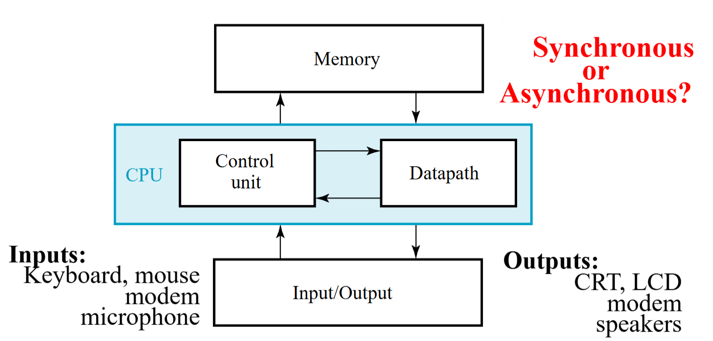
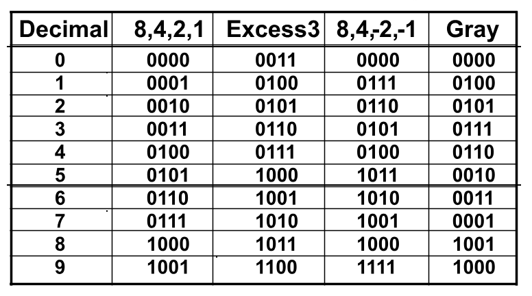
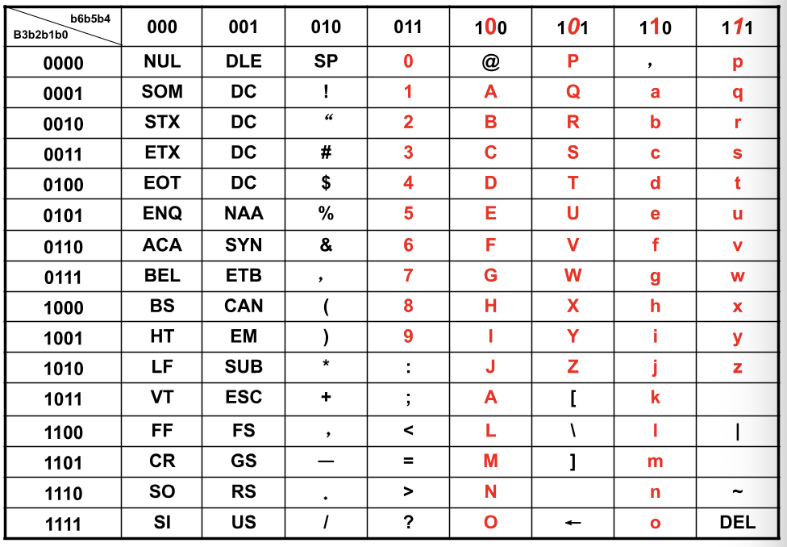

# Chapter 1 Digital Systems and Information

## 1.1 信号 Signal

**Analog and Digital Signal**
现实世界中的信息大多数是 **连续 (continuous)** 的，但是在计算机的环境下很多信息是依靠 **离散 (discrete)** 的方式传递的

**Time Sequence Signal**

- **模拟信号(Analog)**: continuous value and time
- **异步离散信号(Digital asynchronous)**: discrete value and continuous time
- **同步离散信号(Digital synchronous)**: continuous value and time

**High and Low Voltage**


- 对于输入和输出，高低电位的判定范围是不相同的，**宽进严出**的设计方案可以提高电路在噪音影响下的稳定性
- 在高电位和低电位的判定范围之间还存在一个**未定义 (undefined)** 的，如果输出的电平处在浮动区间，则其认定值将是随机的

---

## 1.2 数字系统 Digital System

**定义**
- 接受一组离散的信息输入
- 离散的内部消息（系统状态）
- 生成一组离散的信息输出

**分类**

- **组合逻辑系统 (Combinational Logical System)**：
    - No state present
    - Output function: $f_{Output}=Function(Input)$
    - 系统输出完全依赖输入决定
- **时序逻辑系统(Sequential System)**：
    - State present
    - State updated at discrete times: **同步时序系统(Synchronous Sequential System)**
    - State updated at any time: **异步时序系统(Asynchronous Sequential System)**
    - State function: $f_{State}=Fuction(State, Input)$
    - Output function: $f_{Output}=Function(State)\ or\ Function(State, Input)$
    - 输入改变系统状态，系统的输出可能由系统状态和输入的共同决定

---

## 1.3 数字计算机系统 Digital Computer System

A common system used on the discrete elements in the information processing



**特点**
- 通用性 Commonality
- 灵活性 Flexibility
- 多用途性 Versatility

**计算机内的信息表达**
- 使用二进制数字系统：
- 二进制信号表示一个位
- 多位数字用于表示数据，指令可在计算机中执行
- 模拟信号会自动转换为数字值，用于模拟数字转换设备中 (ADC) 中

---

## 1.4 计算机架构 Computer Architecture

**存储 Memory**

能够存储来自输入、输出以及中间结果的程序和数据
- 主存 Main memory
- 缓存 Cache
- 外部存储 External memory

**总线 Datapath(BUS)**: 
- 处理器总线Processor bus
- I/O BUS: Different data transfer rates of the two buses

**控制单元 Control Unit**

监测不同部分之间的信息交流情况

**中央处理器 CPU(Central processor Unit)**

包括中央处理器 CPU, 浮点运算单元 FPU, 内存管理单元 MMU, 以及内部缓存 Internal Cache

**I/O设备 Input/Output device(I/O)**

用于信息处理系统之间相互交流的设备

**嵌入式系统 Embedded System**

Specific computer systems, like microcontollers, digital signal processors. 更具体一点，比图说打印机，洗衣机等等

---

## 1.5 Number Systems

计算机领域常见的进制主要是 **二进制(binary)**，**八进制(octal)**，**十进制(decimal)**和**十六进制(hexadecimal)**

**二进制与八进制、十六进制的相互转换**
- 二进制转换为八进制：取三位二进制数转换为一位八进制数，反之亦然
- 二进制转换为十六进制：取四位二进制数转换为以为十六进制数，反之亦然
- 上述所说的取x位数均是从小数点两侧开始取，无论是整数部分还是小数部分

$$ 
\begin{align}
(67.731)_8&=(110\ 111\ .111\ 011\ 001)_2\\
(11\ 111\ 101\ .010\ 011\ 11)_2&=(375.236)_8\\
(3AB4.1)_{16} &=(0111\ 1010\ 1011\ 100\ .0001)_2\\
(111\ 1101\ . 0100\ 1111)2&=(7D.4F)_{16}\\
\end{align}
$$

**二进制与十进制的相互转换**
需要了解十进制和二进制转换过程中对于小数部分的处理，具体的小数部分处理方法如下：

```
十进制： 10.25

二进制小数部分转换过程（整数部分比较容易：1010）：
- 0.25*2=0.5（0）
- 0.5*2=1（1）

可得二进制最终结果为1010.01
```

⚠️： 十进制小数转换为二进制的过程中不一定能够完全准确转换，但是二进制小数转换为十进制的时候是可以准确转换的

**BCD adder**

在真实世界中大部分数据使用十进制表示的，所以我们需要研究如何用二进制方便快捷的表示十进制。

BCD码利用四位二进制数来表示一位十进制数（类似于二进制和十六进制之间的关系），这样子转换的过程比较方便，具体的就是用（0000-1001来表示十进制的0-9）

$$
\begin{align}448 + 489 &= (0100\ 0100\ 1000)_{BCD} + (0100\ 1000\ 1001)_{BCD}\\
&= (1000\ 1101\ 0001)_{BCD} + (0000\ 0110\ 0110)\\
&= (1001\ 0011\ 0111)\\
\end{align}
$$

对于上面这个例子，个位和十位分别在原来的计算值上面加了6（0110），规则如下：
- 该位的BCD码相加后结果大于9
- 二进制相加时该为直接向高位产生了进位

---
## 1.6 Codes

**余三码 Excess 3**

余三码是对于上述BCD码的一种改进，核心思路是在BCD码的基础上，增加一个大小为3的偏移量。仔细观察下表，在余三码的计算方法下，0按位取反就是9，1按位取反就是8。我们先来看余三码的加法

$$
\begin{align}548 + 389 &= (1000\ 0111\ 1011)_{Ex3} + (0110\ 1011\ 1100)_{Ex3}\\
&= (1111\ 0011\ 0111)_{Ex3} + (1101(最高位减去3，这里用的补码)\ 0011\ 0011)\\
&= (1001\ 0011\ 0111)\\
\end{align}
$$
- 计算结果一定要按照个位计算完成在计算十位这样的方式进行
- 个位和十位都有进位，所以都要加上3
- 百位没有进位，所以要减去3

减法计算在硬件上有些优势，但是实在有些复杂加上ppt没有详细表述，这里也不详细解释了



**格雷码 Gray code**

格雷码的特征就是：相邻的两个数在二进制的表示下只相差一位，对于格雷码的计算，第k个数的格雷码就是$k XOR (k>>1)$,不过是这个结果和上表中的计算方法稍有不同


**奇偶校验码 Parity-Bit Error-Detection Codes**

- 奇交验 (odd parity)：在数据后面加上一位校验位，校验位保证整租数据中所有的1是奇数个
- 偶交验 (even parity)：在数据后面加上一位校验位，校验位保证整租数据中所有的1是偶数个

**字符编码 Character Code**

- *American Standard Code for Information Interchange (ASCII)*: 94 Graphic printing and 34 Non-printing characters (7 bit)



- *Properties of ASCII*:
    - Digits 0 to 9 span Hexadecimal values $30_{16}$ to $39_{16}$
    - Upper case A-Z span $41_{16}$ to $5A_{16}$
    - Lower case a-z span $61_{16}$ to $7A_{16}$
    - Lower to upper case translation and vice versa (occurs by flipping bit 5)

- *Unicode*
    - UTF-8: 1-4 B (Single byte compatible with ASCII)
    - UTF-16: 2 or 4 B
    - UTF-32: 4B

UTF-8 在不同 B 编码下的区分方法


