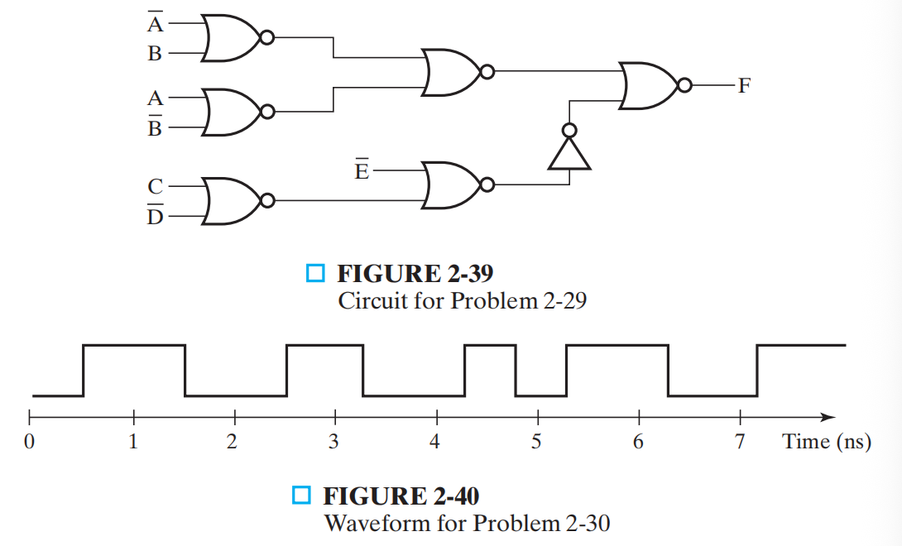
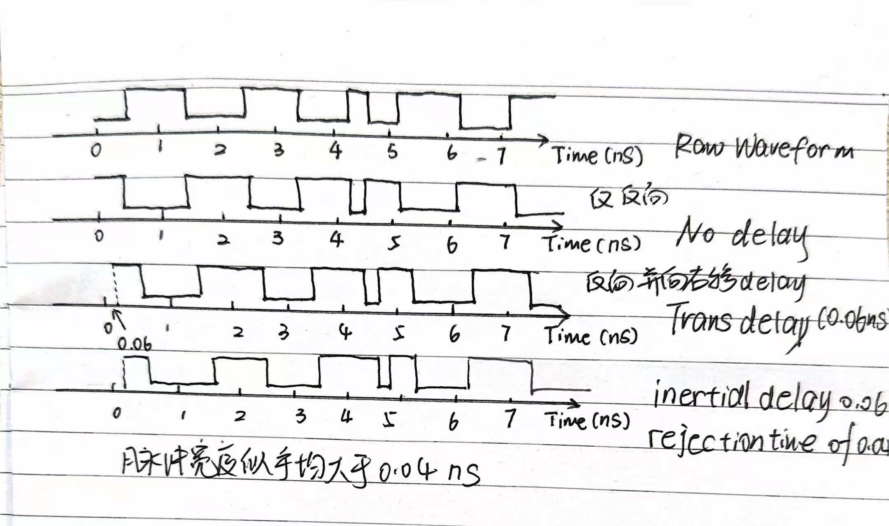

# Homework of Chapter 2

**2.1 a** Demonstrate by means of truth tables the validity of the following identities:
(a) DeMorgan’s theorem for three variables: $\overline{XYZ} = \overline{X} + \overline{Y} + \overline{Z}$
(b) The second distributive law: $X + YZ = (X + Y)(X + Z)$
(c) $\overline{X}Y + \overline{Y}Z + X\overline{Z} = X\overline{Y} + Y\overline{Z} + \overline{X}Z$

**Answer**
(a) $\overline{XYZ} = \overline{X} + \overline{Y} + \overline{Z}$
<table style="width: 100%; border-collapse: collapse; border-top: 2px solid #e0e0e0; border-bottom: 2px solid #e0e0e0; text-align: left; background-color: transparent;">
    <thead>
        <tr style="border-bottom: 1px solid #e0e0e0;">
            <th style="padding: 10px; font-weight: bold;">$X$</th>
            <th style="padding: 10px; font-weight: bold;">$Y$</th>
            <th style="padding: 10px; font-weight: bold;">$Z$</th>
            <th style="padding: 10px; font-weight: bold;">$\overline{XYZ}$</th>
            <th style="padding: 10px; font-weight: bold;">$\overline{X} + \overline{Y} + \overline{Z}$</th>
        </tr>
    </thead>
    <tbody>
        <tr>
        <td style="padding: 8px;">0</td>
        <td style="padding: 8px;">0</td>
        <td style="padding: 8px;">0</td>
        <td style="padding: 8px;">1</td>
        <td style="padding: 8px;">1</td></tr>
        <tr>
        <td style="padding: 8px;">1</td>
        <td style="padding: 8px;">0</td>
        <td style="padding: 8px;">0</td>
        <td style="padding: 8px;">1</td>
        <td style="padding: 8px;">1</td></tr>
        <tr>
        <td style="padding: 8px;">0</td>
        <td style="padding: 8px;">1</td>
        <td style="padding: 8px;">0</td>
        <td style="padding: 8px;">1</td>
        <td style="padding: 8px;">1</td></tr>
        <tr>
        <td style="padding: 8px;">0</td>
        <td style="padding: 8px;">0</td>
        <td style="padding: 8px;">1</td>
        <td style="padding: 8px;">1</td>
        <td style="padding: 8px;">1</td></tr>
        <tr>
        <td style="padding: 8px;">1</td>
        <td style="padding: 8px;">1</td>
        <td style="padding: 8px;">0</td>
        <td style="padding: 8px;">1</td>
        <td style="padding: 8px;">1</td></tr>
        <tr>
        <td style="padding: 8px;">1</td>
        <td style="padding: 8px;">0</td>
        <td style="padding: 8px;">1</td>
        <td style="padding: 8px;">1</td>
        <td style="padding: 8px;">1</td></tr>
        <tr>
        <td style="padding: 8px;">0</td>
        <td style="padding: 8px;">1</td>
        <td style="padding: 8px;">1</td>
        <td style="padding: 8px;">1</td>
        <td style="padding: 8px;">1</td></tr>
        <tr>
        <td style="padding: 8px;">1</td>
        <td style="padding: 8px;">1</td>
        <td style="padding: 8px;">1</td>
        <td style="padding: 8px;">0</td>
        <td style="padding: 8px;">0</td></tr>
    </tbody>
</table>

(b) $X + YZ = (X + Y)(X + Z)$
<table style="width: 100%; border-collapse: collapse; border-top: 2px solid #e0e0e0; border-bottom: 2px solid #e0e0e0; text-align: left; background-color: transparent;">
    <thead>
        <tr style="border-bottom: 1px solid #e0e0e0;">
            <th style="padding: 10px; font-weight: bold;">$X$</th>
            <th style="padding: 10px; font-weight: bold;">$Y$</th>
            <th style="padding: 10px; font-weight: bold;">$Z$</th>
            <th style="padding: 10px; font-weight: bold;">$X+YZ$</th>
            <th style="padding: 10px; font-weight: bold;">$(X+Y)(X+Z)$</th>
        </tr>
    </thead>
    <tbody>
        <tr>
        <td style="padding: 8px;">0</td>
        <td style="padding: 8px;">0</td>
        <td style="padding: 8px;">0</td>
        <td style="padding: 8px;">0</td>
        <td style="padding: 8px;">0</td></tr>
        <tr>
        <td style="padding: 8px;">1</td>
        <td style="padding: 8px;">0</td>
        <td style="padding: 8px;">0</td>
        <td style="padding: 8px;">1</td>
        <td style="padding: 8px;">1</td></tr>
        <tr>
        <td style="padding: 8px;">0</td>
        <td style="padding: 8px;">1</td>
        <td style="padding: 8px;">0</td>
        <td style="padding: 8px;">0</td>
        <td style="padding: 8px;">0</td></tr>
        <tr>
        <td style="padding: 8px;">0</td>
        <td style="padding: 8px;">0</td>
        <td style="padding: 8px;">1</td>
        <td style="padding: 8px;">0</td>
        <td style="padding: 8px;">0</td></tr>
        <tr>
        <td style="padding: 8px;">1</td>
        <td style="padding: 8px;">1</td>
        <td style="padding: 8px;">0</td>
        <td style="padding: 8px;">1</td>
        <td style="padding: 8px;">1</td></tr>
        <tr>
        <td style="padding: 8px;">1</td>
        <td style="padding: 8px;">0</td>
        <td style="padding: 8px;">1</td>
        <td style="padding: 8px;">1</td>
        <td style="padding: 8px;">1</td></tr>
        <tr>
        <td style="padding: 8px;">0</td>
        <td style="padding: 8px;">1</td>
        <td style="padding: 8px;">1</td>
        <td style="padding: 8px;">0</td>
        <td style="padding: 8px;">0</td></tr>
        <tr>
        <td style="padding: 8px;">1</td>
        <td style="padding: 8px;">1</td>
        <td style="padding: 8px;">1</td>
        <td style="padding: 8px;">1</td>
        <td style="padding: 8px;">1</td></tr>
    </tbody>
</table>

(c) $\overline{X}Y + \overline{Y}Z + X\overline{Z} = X\overline{Y} + Y\overline{Z} + \overline{X}Z$

<table style="width: 100%; border-collapse: collapse; border-top: 2px solid #e0e0e0; border-bottom: 2px solid #e0e0e0; text-align: left; background-color: transparent;">
    <thead>
        <tr style="border-bottom: 1px solid #e0e0e0;">
            <th style="padding: 10px; font-weight: bold;">$X$</th>
            <th style="padding: 10px; font-weight: bold;">$Y$</th>
            <th style="padding: 10px; font-weight: bold;">$Z$</th>
            <th style="padding: 10px; font-weight: bold;">$\overline{X}Y + \overline{Y}Z + X\overline{Z}$</th>
            <th style="padding: 10px; font-weight: bold;">$X\overline{Y} + Y\overline{Z} + \overline{X}Z$</th>
        </tr>
    </thead>
    <tbody>
        <tr>
        <td style="padding: 8px;">0</td>
        <td style="padding: 8px;">0</td>
        <td style="padding: 8px;">0</td>
        <td style="padding: 8px;">0</td>
        <td style="padding: 8px;">0</td></tr>
        <tr>
        <td style="padding: 8px;">1</td>
        <td style="padding: 8px;">0</td>
        <td style="padding: 8px;">0</td>
        <td style="padding: 8px;">1</td>
        <td style="padding: 8px;">1</td></tr>
        <tr>
        <td style="padding: 8px;">0</td>
        <td style="padding: 8px;">1</td>
        <td style="padding: 8px;">0</td>
        <td style="padding: 8px;">1</td>
        <td style="padding: 8px;">1</td></tr>
        <tr>
        <td style="padding: 8px;">0</td>
        <td style="padding: 8px;">0</td>
        <td style="padding: 8px;">1</td>
        <td style="padding: 8px;">1</td>
        <td style="padding: 8px;">1</td></tr>
        <tr>
        <td style="padding: 8px;">1</td>
        <td style="padding: 8px;">1</td>
        <td style="padding: 8px;">0</td>
        <td style="padding: 8px;">1</td>
        <td style="padding: 8px;">1</td></tr>
        <tr>
        <td style="padding: 8px;">1</td>
        <td style="padding: 8px;">0</td>
        <td style="padding: 8px;">1</td>
        <td style="padding: 8px;">1</td>
        <td style="padding: 8px;">1</td></tr>
        <tr>
        <td style="padding: 8px;">0</td>
        <td style="padding: 8px;">1</td>
        <td style="padding: 8px;">1</td>
        <td style="padding: 8px;">1</td>
        <td style="padding: 8px;">1</td></tr>
        <tr>
        <td style="padding: 8px;">1</td>
        <td style="padding: 8px;">1</td>
        <td style="padding: 8px;">1</td>
        <td style="padding: 8px;">0</td>
        <td style="padding: 8px;">0</td></tr>
    </tbody>
</table>

**2.2 a/c** *Prove the identity of each of the following Boolean equations, using algebraic manipulation:
(a) $\overline{X}\ \overline{Y} + \overline{X}Y + XY = \overline{X} + Y$
(c) $Y + \overline{X}Z + X\overline{Y} = X + Y + Z$

**Answer**
(a)
$$
\begin{aligned}
&\overline{X}\ \overline{Y}+\overline{X}Y+XY \\
=&\overline{X}\ \overline{Y}+\overline{X}Y+\overline{X}Y+XY\\
=&\overline{X}(\overline{Y}+Y)+Y(\overline{X}+X)\\
=&\overline{X}+Y
\end{aligned}
$$

(b)
$$
\begin{aligned}
&Y + \overline{X}Z + X\overline{Y}\\
=& Y(\overline{X}+X)+\overline{X}Z+X\overline{Y}\\
=& X(\overline{Y}+Y)+\overline{X}Z+\overline{X}Y\\
=& X + \overline{X}Z+\overline{X}Y\\
=& X(1+Z) +\overline{X}Z+\overline{X}Y\\
=& Z+X+\overline{X}Y\\
=& X+Y+Z
\end{aligned}
$$

---
**2.3 a/c** Prove the identity of each of the following Boolean equations, using 
algebraic manipulation:
(a) $AB\overline{C} + B\overline{C}\ \overline{D} + BC + \overline{C}D = B + \overline{C}D$
(c) $A\overline{D} + \overline{A}B + \overline{C}D + \overline{B}C = (\overline{A} + \overline{B} + \overline{C} + \overline{D})(A + B + C + D)$

**Answer**

(a)
$$
\begin{aligned}
&AB\overline{C} + B\overline{C}\ \overline{D} + BC + \overline{C}D\\
=& AB\overline{C}+ BC(A+1) + B\overline{C}\ \overline{D}+\overline{C}D(B+1)\\
=& AB(\overline{C}+C)+ BC + B\overline{C}(\overline{D}+D)+\overline{C}D\\
=& AB+ BC + +B\overline{C}+\overline{C}D\\
=& B(A+C+\overline{C})+\overline{C}D\\
=&B+\overline{C}D
\end{aligned}
$$

(c)
> 辅助证明
$$
\begin{aligned}
&\overline{A}B+\overline{B}C+\overline{A}C\\
=&\overline{A}B+\overline{B}C+\overline{A}C(B+\overline{B})\\
=&\overline{A}B(1+C)+\overline{B}C(1+\overline{A})\\
=&\overline{A}B+\overline{B}C\\
\end{aligned}
$$

根据上面的辅助证明，我们得到了布尔代数中的**一致性定理推论**，即任意满足形式 $XY + \overline{X}Z + YZ$ 的三项式中，多余的 $YZ$ 可以被完全吸收。

现在我们来处理题目的等式右侧，将它全部展开：
$$
\begin{aligned}
&(\overline{A} + \overline{B} + \overline{C} + \overline{D})(A + B + C + D)\\
=& 0 + \overline{A}B + \overline{A}C + \overline{A}D\\
+&\overline{B}A + 0 + \overline{B}C + \overline{B}D\\
+&\overline{C}A + \overline{C}B + 0 + \overline{C}D\\
+&\overline{D}A + \overline{D}B + \overline{D}C+0
\end{aligned}
$$

展开后一共有 12 项不为 0 的项，我们要证明它们最终等于左侧的 4 个目标项：$A\overline{D} + \overline{A}B + \overline{C}D + \overline{B}C$ 。因此我们要把剩下的 8 项全都通过辅助证明的方法“吸收”掉。

为了更直观得得到左侧目标，我们以目标项基点作为吸收主力：
**第一步：核心目标项直接进行初步清理（以目标 $A\overline{D}, \overline{A}B, \overline{C}D, \overline{B}C$ 作为发起点）**
1. $A\overline{D} + \overline{C}D + \mathbf{A\overline{C}} =  A\overline{D} + \overline{C}D$ ，吸收项 $\mathbf{\overline{C}A}$ ($\mathbf{A\overline{C}}$)。
2. $\overline{A}B + \overline{B}C + \mathbf{\overline{A}C} = \overline{A}B + \overline{B}C$ ，吸收项 $\mathbf{\overline{A}C}$。
3. $\overline{B}C + \overline{C}D + \mathbf{\overline{B}D} = \overline{B}C + \overline{C}D$ ，吸收项 $\mathbf{\overline{B}D}$。
4. $\overline{A}B + A\overline{D} + \mathbf{B\overline{D}} = \overline{A}B + A\overline{D}$ ，吸收项 $\mathbf{\overline{D}B}$ ($\mathbf{B\overline{D}}$)。

此时 12 个项被吸收了 4 个，还剩下 8 个。这 8 项中包含我们的 4 个终极目标项（$A\overline{D}, \overline{A}B, \overline{B}C, \overline{C}D$），以及 4 个残余项（$\overline{A}D, A\overline{B}, B\overline{C}, C\overline{D}$）。

**第二步：利用池子中剩余的其他项作为中间桥梁，继续吸收剩余 4 项（基于同样的辅助证明定律）**
在未被完全剥离的第一轮展开组合中，我们依然可以运用一致性定理找出消去残余项的关系：
5. 因为 $\overline{A}C + \overline{C}D + \mathbf{\overline{A}D} = \overline{A}C + \overline{C}D$，吸收项 $\mathbf{\overline{A}D}$。
6. 因为 $A\overline{C} + \overline{B}C + \mathbf{A\overline{B}} = A\overline{C} + \overline{B}C$ ，吸收项 $\mathbf{\overline{B}A}$ ($\mathbf{A\overline{B}}$)。
7. 因为 $B\overline{D} + \overline{C}D + \mathbf{B\overline{C}} = B\overline{D} + \overline{C}D$ ，吸收项 $\mathbf{\overline{C}B}$ ($\mathbf{B\overline{C}}$)。
8. 因为 $\overline{A}C + A\overline{D} + \mathbf{C\overline{D}} = \overline{A}C + A\overline{D}$ ，吸收项 $\mathbf{\overline{D}C}$ ($\mathbf{C\overline{D}}$)。

经过这两轮纯代数吸收操作，原式中除了目标项外的所有 8 个多余项（4个过渡项和4个残留项）都被利用一致性定理交叉消去了。
因此：
$$
\begin{aligned}
&= A\overline{D} + \overline{A}B + \overline{C}D + \overline{B}C
\end{aligned}
$$

---
**2.6 b/d** Simplify the following Boolean expressions to expressions containing a minimum number of literals:
(b) $(\overline{A + B + C}) \cdot \overline{ABC}$
(d) $\overline{A}\ \overline{B}D + \overline{A}\ \overline{C}D + BD$

**Answer**
(b)
$$
\begin{aligned}
&(\overline{A + B + C}) \cdot \overline{ABC}\\
=&(\overline{A}\ \overline{B}\ \overline{C}) \cdot (\overline{A} + \overline{B} + \overline{C})\\
=& \overline{A}\ \overline{B}\ \overline{C}\cdot\overline{A} + \overline{A}\ \overline{B}\ \overline{C}\cdot\overline{B} + \overline{A}\ \overline{B}\ \overline{C}\cdot\overline{C}\\
=& \overline{A}\ \overline{B}\ \overline{C} + \overline{A}\ \overline{B}\ \overline{C} + \overline{A}\ \overline{B}\ \overline{C}\\
=& \overline{A}\ \overline{B}\ \overline{C}
\end{aligned}
$$

(d)
$$
\begin{aligned}
&\overline{A}\ \overline{B}D + \overline{A}\ \overline{C}D + BD\\
=& D(\overline{A}\ \overline{B} + \overline{A}\ \overline{C} + B)\\
=& D(B + \overline{B}\ \overline{A} + \overline{A}\ \overline{C})\\
=& D(B + \overline{A} + \overline{A}\ \overline{C})\\
=& D(B + \overline{A}(1 + \overline{C}))\\
=& D(\overline{A} + B)
\end{aligned}
$$

---

**2.10 a/c**  *Obtain the truth table of the following functions, and express each function in sum-of-minterms and product-of-maxterms form:
(a) $(XY + Z)(Y + XZ)$
(c) $WX\overline{Y} + WX\overline{Z} + WXZ + Y\overline{Z}$

**Answer**
(a) 先化简出判断条件：$F = (XY + Z)(Y + XZ) = XY + XYZ + YZ + XZ = XY + YZ + XZ$

<table style="width: 100%; border-collapse: collapse; border-top: 2px solid #e0e0e0; border-bottom: 2px solid #e0e0e0; text-align: left; background-color: transparent;">
    <thead>
        <tr style="border-bottom: 1px solid #e0e0e0;">
            <th style="padding: 10px; font-weight: bold;">$X$</th>
            <th style="padding: 10px; font-weight: bold;">$Y$</th>
            <th style="padding: 10px; font-weight: bold;">$Z$</th>
            <th style="padding: 10px; font-weight: bold;">$F$</th>
        </tr>
    </thead>
    <tbody>
        <tr><td style="padding: 8px;">0</td><td style="padding: 8px;">0</td><td style="padding: 8px;">0</td><td style="padding: 8px;">0</td></tr>
        <tr><td style="padding: 8px;">0</td><td style="padding: 8px;">0</td><td style="padding: 8px;">1</td><td style="padding: 8px;">0</td></tr>
        <tr><td style="padding: 8px;">0</td><td style="padding: 8px;">1</td><td style="padding: 8px;">0</td><td style="padding: 8px;">0</td></tr>
        <tr><td style="padding: 8px;">0</td><td style="padding: 8px;">1</td><td style="padding: 8px;">1</td><td style="padding: 8px;">1</td></tr>
        <tr><td style="padding: 8px;">1</td><td style="padding: 8px;">0</td><td style="padding: 8px;">0</td><td style="padding: 8px;">0</td></tr>
        <tr><td style="padding: 8px;">1</td><td style="padding: 8px;">0</td><td style="padding: 8px;">1</td><td style="padding: 8px;">1</td></tr>
        <tr><td style="padding: 8px;">1</td><td style="padding: 8px;">1</td><td style="padding: 8px;">0</td><td style="padding: 8px;">1</td></tr>
        <tr><td style="padding: 8px;">1</td><td style="padding: 8px;">1</td><td style="padding: 8px;">1</td><td style="padding: 8px;">1</td></tr>
    </tbody>
</table>

- **Sum-of-minterms:** $F(X,Y,Z) = \sum m(3, 5, 6, 7)$

所以用SOM表示就是 $F(X,Y,Z) = \overline X YZ + X\overline Y Z + XY\overline Z + XYZ$
- **Product-of-maxterms:** $F(X,Y,Z) = \prod M(0, 1, 2, 4)$
  
所以用POM表示就是 $F(X,Y,Z) = (X + Y + Z)(X + Y + \overline Z)(X + \overline Y + Z)(\overline X + Y + Z)$

(c) 先化简：$F = WX\overline{Y} + WX\overline{Z} + WXZ + Y\overline{Z} = WX\overline{Y} + WX(\overline{Z} + Z) + Y\overline{Z} = WX(1+\overline{Y}) + Y\overline{Z} = WX + Y\overline{Z}$

<table style="width: 100%; border-collapse: collapse; border-top: 2px solid #e0e0e0; border-bottom: 2px solid #e0e0e0; text-align: left; background-color: transparent;">
    <thead>
        <tr style="border-bottom: 1px solid #e0e0e0;">
            <th style="padding: 10px; font-weight: bold;">$W$</th>
            <th style="padding: 10px; font-weight: bold;">$X$</th>
            <th style="padding: 10px; font-weight: bold;">$Y$</th>
            <th style="padding: 10px; font-weight: bold;">$Z$</th>
            <th style="padding: 10px; font-weight: bold;">$F$</th>
        </tr>
    </thead>
    <tbody>
        <tr><td style="padding: 8px;">0</td><td style="padding: 8px;">0</td><td style="padding: 8px;">0</td><td style="padding: 8px;">0</td><td style="padding: 8px;">0</td></tr>
        <tr><td style="padding: 8px;">0</td><td style="padding: 8px;">0</td><td style="padding: 8px;">0</td><td style="padding: 8px;">1</td><td style="padding: 8px;">0</td></tr>
        <tr><td style="padding: 8px;">0</td><td style="padding: 8px;">0</td><td style="padding: 8px;">1</td><td style="padding: 8px;">0</td><td style="padding: 8px;">1</td></tr>
        <tr><td style="padding: 8px;">0</td><td style="padding: 8px;">0</td><td style="padding: 8px;">1</td><td style="padding: 8px;">1</td><td style="padding: 8px;">0</td></tr>
        <tr><td style="padding: 8px;">0</td><td style="padding: 8px;">1</td><td style="padding: 8px;">0</td><td style="padding: 8px;">0</td><td style="padding: 8px;">0</td></tr>
        <tr><td style="padding: 8px;">0</td><td style="padding: 8px;">1</td><td style="padding: 8px;">0</td><td style="padding: 8px;">1</td><td style="padding: 8px;">0</td></tr>
        <tr><td style="padding: 8px;">0</td><td style="padding: 8px;">1</td><td style="padding: 8px;">1</td><td style="padding: 8px;">0</td><td style="padding: 8px;">1</td></tr>
        <tr><td style="padding: 8px;">0</td><td style="padding: 8px;">1</td><td style="padding: 8px;">1</td><td style="padding: 8px;">1</td><td style="padding: 8px;">0</td></tr>
        <tr><td style="padding: 8px;">1</td><td style="padding: 8px;">0</td><td style="padding: 8px;">0</td><td style="padding: 8px;">0</td><td style="padding: 8px;">0</td></tr>
        <tr><td style="padding: 8px;">1</td><td style="padding: 8px;">0</td><td style="padding: 8px;">0</td><td style="padding: 8px;">1</td><td style="padding: 8px;">0</td></tr>
        <tr><td style="padding: 8px;">1</td><td style="padding: 8px;">0</td><td style="padding: 8px;">1</td><td style="padding: 8px;">0</td><td style="padding: 8px;">1</td></tr>
        <tr><td style="padding: 8px;">1</td><td style="padding: 8px;">0</td><td style="padding: 8px;">1</td><td style="padding: 8px;">1</td><td style="padding: 8px;">0</td></tr>
        <tr><td style="padding: 8px;">1</td><td style="padding: 8px;">1</td><td style="padding: 8px;">0</td><td style="padding: 8px;">0</td><td style="padding: 8px;">1</td></tr>
        <tr><td style="padding: 8px;">1</td><td style="padding: 8px;">1</td><td style="padding: 8px;">0</td><td style="padding: 8px;">1</td><td style="padding: 8px;">1</td></tr>
        <tr><td style="padding: 8px;">1</td><td style="padding: 8px;">1</td><td style="padding: 8px;">1</td><td style="padding: 8px;">0</td><td style="padding: 8px;">1</td></tr>
        <tr><td style="padding: 8px;">1</td><td style="padding: 8px;">1</td><td style="padding: 8px;">1</td><td style="padding: 8px;">1</td><td style="padding: 8px;">1</td></tr>
    </tbody>
</table>

- **Sum-of-minterms:** $F(W,X,Y,Z) = \sum m(2, 6, 10, 12, 13, 14, 15)$

所以用SOM表示就是 $F(W,X,Y,Z) = \overline{W}\ \overline{X}Y\overline{Z} + \overline{W}X\overline{Y}\overline{Z} + \overline{W}XY\overline{Z} + W\overline{X}\ \overline{Y}\ \overline{Z} + W\overline{X}\ \overline{Y}Z + W\overline{X}YZ + WXYZ$

- **Product-of-maxterms:** $F(W,X,Y,Z) = \prod M(0, 1, 3, 4, 5, 7, 8, 9, 11)$

所以用POM表示就是 $F(W,X,Y,Z) = (W + X + Y + Z)(W + X + Y + \overline{Z})(W + X + \overline{Y} + Z)(W + X + \overline{Y} + \overline{Z})(W + \overline{X} + Y + Z)(W + \overline{X} + Y + \overline{Z})(\overline{W} + X + Y + Z)(\overline{W} + X + Y + \overline{Z})(\overline{W} + X + \overline{Y} + Z)$

---

**2.11 a/c/d**

For the Boolean functions E and F, as given in the following truth table:
(a) List the minterms and maxterms of each function.
(c) List the minterms of $E + F$ and $E\cdot F$ 
(d) Express E and F in sum-of-minterms algebraic form.

<table style="width: 100%; border-collapse: collapse; border-top: 2px solid #e0e0e0; border-bottom: 2px solid #e0e0e0; text-align: left; background-color: transparent;">
    <thead>
        <tr style="border-bottom: 1px solid #e0e0e0;">
            <th style="padding: 10px; font-weight: bold;">X</th>
            <th style="padding: 10px; font-weight: bold;">Y</th>
            <th style="padding: 10px; font-weight: bold;">Z</th>
            <th style="padding: 10px; font-weight: bold;">E</th>
            <th style="padding: 10px; font-weight: bold;">F</th>
        </tr>
    </thead>
    <tbody>
        <tr><td style="padding: 8px;">0</td><td style="padding: 8px;">0</td><td style="padding: 8px;">0</td><td style="padding: 8px;">0</td><td style="padding: 8px;">1</td></tr>
        <tr><td style="padding: 8px;">0</td><td style="padding: 8px;">0</td><td style="padding: 8px;">1</td><td style="padding: 8px;">1</td><td style="padding: 8px;">0</td></tr>
        <tr><td style="padding: 8px;">0</td><td style="padding: 8px;">1</td><td style="padding: 8px;">0</td><td style="padding: 8px;">1</td><td style="padding: 8px;">1</td></tr>
        <tr><td style="padding: 8px;">0</td><td style="padding: 8px;">1</td><td style="padding: 8px;">1</td><td style="padding: 8px;">0</td><td style="padding: 8px;">0</td></tr>
        <tr><td style="padding: 8px;">1</td><td style="padding: 8px;">0</td><td style="padding: 8px;">0</td><td style="padding: 8px;">1</td><td style="padding: 8px;">1</td></tr>
        <tr><td style="padding: 8px;">1</td><td style="padding: 8px;">0</td><td style="padding: 8px;">1</td><td style="padding: 8px;">0</td><td style="padding: 8px;">0</td></tr>
        <tr><td style="padding: 8px;">1</td><td style="padding: 8px;">1</td><td style="padding: 8px;">0</td><td style="padding: 8px;">1</td><td style="padding: 8px;">0</td></tr>
        <tr><td style="padding: 8px;">1</td><td style="padding: 8px;">1</td><td style="padding: 8px;">1</td><td style="padding: 8px;">0</td><td style="padding: 8px;">1</td></tr>
    </tbody>
</table>

**Answer**
(a)
- **E 的最小项与最大项:** $E = \sum m(1, 2, 4, 6) = \prod M(0, 3, 5, 7)$
- **F 的最小项与最大项:** $F = \sum m(0, 2, 4, 7) = \prod M(1, 3, 5, 6)$

(c)
- **$E + F$ 的最小项:** $\sum m(0, 1, 2, 4, 6, 7)$
- **$E \cdot F$ 的最小项:** $\sum m(2, 4)$

(d)
- **E 的最小项之和代数表达式:** $E = \overline{X}\ \overline{Y}Z + \overline{X}Y\overline{Z} + X\overline{Y}\ \overline{Z} + XY\overline{Z}$
- **F 的最小项之和代数表达式:** $F = \overline{X}\ \overline{Y}\ \overline{Z} + \overline{X}Y\overline{Z} + X\overline{Y}\ \overline{Z} + XYZ$

---

**2.12 b** Convert the following expressions into sum-of-products and product-of-sums forms:
(b) $\overline{X} + X(X + \overline{Y})(Y + \overline{Z})$

**Answer**
$$
\begin{aligned}
F &= \overline{X} + X(X + \overline{Y})(Y + \overline{Z})\\
&= \overline{X} + (X + X\overline{Y})(Y + \overline{Z})\\
&= \overline{X} + X(Y + \overline{Z}) \quad \text{(利用吸收律 } X+X\overline{Y}=X\text{)}\\
&= \overline{X} + XY + X\overline{Z}\\
&= \overline{X} + Y + X\overline{Z} \quad \text{(利用吸收律 } \overline{X}+XY=\overline{X}+Y\text{)}\\
&= \overline{X} + Y + \overline{Z} \quad \text{(利用吸收律 } \overline{X}+X\overline{Z}=\overline{X}+\overline{Z}\text{)}
\end{aligned}
$$
- **乘积之和 (SOP):** $\overline{X} + Y + \overline{Z}$
- **和之乘积 (POS):** $\overline{X} + Y + \overline{Z}$ 

*(注：$\overline{X} + Y + \overline{Z}$ 可视为一个独立项，同时满足最简的 SOP 和 POS 形式)。*

---

**2.15** Optimize the following Boolean expressions using a map:
(a) $\overline{X}\ \overline{Z} + Y\overline{Z} + XYZ$
(b) $\overline{A}B + \overline{B}C + \overline{A}\ \overline{B}\  \overline{C}$
(c) $\overline{A}\ \overline{B} + A\overline{C} + \overline{B}C + \overline{A}B\overline{C}$

**Answer**
(a) 包含最小项 $m(0, 2, 6, 7) \Rightarrow F = \overline{X}\ \overline{Z} + XY$
(b) 包含最小项 $m(0, 1, 2, 3, 5) \Rightarrow F = \overline{A} + \overline{B}C$
(c) 包含最小项 $m(0, 1, 2, 4, 5, 6) \Rightarrow F = \overline{B} + \overline{C}$

---

**2.17** Optimize the following Boolean functions, using a map:
(a) $F(W, X, Y, Z) = \sum m(0, 1, 2, 4, 7, 8, 10, 12)$
(b) $F(A, B, C, D) = \sum m(1, 4, 5 , 6, 10, 11, 12, 13, 15)$

**Answer**
(a) $F = \overline{X}\ \overline{Z} + \overline{Y}\ \overline{Z} + \overline{W}\ \overline{X}\ \overline{Y} + \overline{W}XYZ$
(b) $F = \overline{A}\ \overline{C}D + \overline{A}B\overline{D} + B\overline{C} + A\overline{B}C + ACD$

---

**2.19 a** Find all the prime implicants for the following Boolean functions, and determine which are essential:
(a) $F(W, X, Y, Z) = \sum m (0, 2, 5, 7, 8, 10, 12, 13, 14, 15)$

**Answer**
(a)
- **质蕴含项 (Prime Implicants):** $\overline{X}\ \overline{Z}, XZ, WX, W\overline{Z}$
- **核心质蕴含项 (Essential Prime Implicants):** $\overline{X}\ \overline{Z}$ (覆盖了 $m_0, m_2$) 以及 $XZ$ (覆盖了 $m_5, m_7$)

---

**2.22 a** Optimize the following expressions in (1) sum-of-products and (2) product-of-sums forms:
(a) $A\overline{C} + \overline{B}D + \overline{A}CD + ABCD$

**Answer**
(a) 最小项: $m(1, 3, 7, 8, 9, 11, 12, 13, 15)$, 最大项 (零点): $M(0, 2, 4, 5, 6, 10, 14)$
- **(1) 乘积之和 (SOP):** $F = A\overline{C} + \overline{B}D + CD$
- **(2) 和之乘积 (POS):** $F = (A + D)(\overline{C} + D)(A + \overline{B} + C)$

---

**2.25 b** Optimize the following Boolean functions F together with the don’ t- care conditions d. Find all prime implicants and essential prime implicants, and 
apply the selection rule.
(b) $F(W, X, Y, Z) = \sum m (0, 2, 4, 5, 8, 14, 15), d(W, X, Y, Z)= \sum m (7, 10, 13)$

**Answer**
(b)
- **质蕴含项 (Prime Implicants):** $\overline{X}\ \overline{Z}, XZ, \overline{W}\ \overline{Y}\ \overline{Z}, \overline{W}X\overline{Y}, WXY, WY\overline{Z}$
- **核心质蕴含项 (Essential Prime Implicants):** $\overline{X}\ \overline{Z}$ (唯一覆盖了 $m_2$ 和 $m_8$)
- **选择规则 (Selection Rule):** 我们首先选取核心质蕴含项 $\overline{X}\ \overline{Z}$。剩余需要覆盖的最小项为 $4, 5, 14, 15$。与其选择 $XZ$ 造成覆盖重叠并导致额外还需要 2 个独立的质蕴含项拼凑（总共将形成 4 项组合），我们直接进行映射划分：$\overline{W}X\overline{Y}$ 可以精确覆盖 $4, 5$；$WXY$ 可以精确覆盖 $14, 15$。 
- **优化后的最简函数 (Optimized Function):** $F = \overline{X}\ \overline{Z} + \overline{W}X\overline{Y} + WXY$

---

**2.29** *The NOR gates in Figure 2-39 have propagation delay tpd = 0.073 ns and the inverter has a propagation delay tpd = 0.048 ns. What is the propagation delay of the longest path through the circuit?

**Answer**

或非门的延迟为0.073ns,反相器的延迟为0.048ns
则从C口的信号的延迟最长$0.073*2+0.048=0.194$ns

---

**2.30** The waveform in Figure 2-40 is applied to an inverter. Find the output of the inverter, assuming that
(a) It has no delay.
(b) It has a transport delay of 0.06 ns.
(c) It has an inertial delay of 0.06 ns with a rejection time of 0.04 ns

---

**2.31** Assume that $t_{pd}$ is the average of $t_{PHL}$ and $t_{PLH}$. Find the delay from each input to the output in Figure 2-41 by
(a) Finding $t_{PHL}$ and $t_{PLH}$ for each path, assuming $t_{PHL} = 0.20$ ns and $t_{PLH} = 0.36$ ns for each gate. From these values, find $t_{pd}$ for each path.
(b) Using $t_{pd} = 0.28$ ns for each gate.
(c) Compare your answers from parts (a) and (b) and discuss any differences.

**Answer**

(a)
从高到低是PHL,从低到高是PLH，但是这道题里面的门都是与非门，则直接根据门的数量来计算

<table style="width: 100%; border-collapse: collapse; border-top: 2px solid #e0e0e0; border-bottom: 2px solid #e0e0e0; text-align: left; background-color: transparent;">
    <thead>
        <tr style="border-bottom: 1px solid #e0e0e0;">
            <th style="padding: 10px; font-weight: bold;">Type</th>
            <th style="padding: 10px; font-weight: bold;">$C$</th>
            <th style="padding: 10px; font-weight: bold;">$D$</th>
            <th style="padding: 10px; font-weight: bold;">$\overline{B}$</th>
            <th style="padding: 10px; font-weight: bold;">$A$</th>
            <th style="padding: 10px; font-weight: bold;">$B$</th>
            <th style="padding: 10px; font-weight: bold;">$\overline{C}$</th>
        </tr>
    </thead>
    <tbody>
        <tr>
        <td style="padding: 8px;">$t_{PHL}$</td>
        <td style="padding: 8px;">0.80 ns</td>
        <td style="padding: 8px;">0.80 ns</td>
        <td style="padding: 8px;">0.60 ns</td>
        <td style="padding: 8px;">0.40 ns</td>
        <td style="padding: 8px;">0.40 ns</td>
        <td style="padding: 8px;">0.40 ns</td>
        </tr>
        <tr>
        <td style="padding: 8px;">$t_{PLH}$</td>
        <td style="padding: 8px;">1.44 ns</td>
        <td style="padding: 8px;">1.44 ns</td>
        <td style="padding: 8px;">1.08 ns</td>
        <td style="padding: 8px;">0.72 ns</td>
        <td style="padding: 8px;">0.72 ns</td>
        <td style="padding: 8px;">0.72 ns</td>
        </tr>
        <tr>
        <td style="padding: 8px;">$t_{pd}$</td>
        <td style="padding: 8px;">1.12 ns</td>
        <td style="padding: 8px;">1.12 ns</td>
        <td style="padding: 8px;">0.84 ns</td>
        <td style="padding: 8px;">0.56 ns</td>
        <td style="padding: 8px;">0.56 ns</td>
        <td style="padding: 8px;">0.56 ns</td>
        </tr>
    </tbody>
</table>

(b) 平均延迟的结果和上一小问的结果完全一样

(c) 第二小问给出的每个门的平均延迟和第一小问中给出的t_{PHL}和t_{PLH}的平均值完全一样，所以两者的结果完全一样。但是第一小问的数据可以计算出每条路径的高到低和低到高的延迟，而第二小问只能得到平均值，无法区分不同路径的延迟差异。
