# Chapter 2 Combinational Logic Circuits

## 2.1 二进制逻辑与门电路 Binary Logic and Gates

**二进制逻辑 Binary Logic**
- *二进制变量 Binary variables*: take on one of two values (0 and 1)
- *逻辑操作符 Logical operators*: operate on binary values and binary variables (AND, OR, NOT).
- *逻辑门 Logical Gate*: implement logic functions
- *布尔运算式 Boolean Algebra*
- 
**逻辑操作符 Logical Operations**
- *AND*: $\cdot$, $\times$, $\land$ or none
- *OR*: $+$， $\lor$
- *NOT*: $\neg $, $'$
  
**Truth table**

<!-- Standard Academic Table ("Three-Line Table") Style in HTML -->
<table style="width: 100%; border-collapse: collapse; border-top: 2px solid #e0e0e0; border-bottom: 2px solid #e0e0e0; text-align: left; background-color: transparent;">
    <thead>
        <tr style="border-bottom: 1px solid #e0e0e0;">
            <th style="padding: 10px; font-weight: bold;">$A$</th>
            <th style="padding: 10px; font-weight: bold;">$B$</th>
            <th style="padding: 10px; font-weight: bold;">$A \cdot B$ (AND)</th>
            <th style="padding: 10px; font-weight: bold;">$A + B$ (OR)</th>
            <th style="padding: 10px; font-weight: bold;">$A'$ (NOT A)</th>
        </tr>
    </thead>
    <tbody>
        <tr>
            <td style="padding: 8px;">0</td>
            <td style="padding: 8px;">0</td>
            <td style="padding: 8px;">0</td>
            <td style="padding: 8px;">0</td>
            <td style="padding: 8px;">1</td>
        </tr>
        <tr>
            <td style="padding: 8px;">0</td>
            <td style="padding: 8px;">1</td>
            <td style="padding: 8px;">0</td>
            <td style="padding: 8px;">1</td>
            <td style="padding: 8px;">1</td>
        </tr>
        <tr>
            <td style="padding: 8px;">1</td>
            <td style="padding: 8px;">0</td>
            <td style="padding: 8px;">0</td>
            <td style="padding: 8px;">1</td>
            <td style="padding: 8px;">0</td>
        </tr>
        <tr>
            <td style="padding: 8px;">1</td>
            <td style="padding: 8px;">1</td>
            <td style="padding: 8px;">1</td>
            <td style="padding: 8px;">1</td>
            <td style="padding: 8px;">0</td>
        </tr>
    </tbody>
</table>

**逻辑门电路的表示 Logic gates have special symbols**


**门延迟 Gate Delay**

在实际的物理层面实现的时候，会有门电路的延迟出现。


**多输入门电路**

可以引入有多个输入引脚的与门和或门

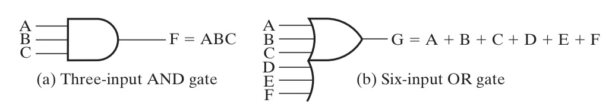

*只需要与非门/或非门，其实可以搭建出所有的逻辑门。*

有空的话可以看一下这一片文章的具体内容 https://www.electronics-tutorials.ws/logic/universal-gates.html
<!-- Truth tables for NAND, NOR, AOI, XOR, XNOR gates -->

**与非门 NOT AND - NAND Gate**

<table style="width: 100%; border-collapse: collapse; border-top: 2px solid #e0e0e0; border-bottom: 2px solid #e0e0e0; text-align: left; background-color: transparent;">
    <thead>
        <tr style="border-bottom: 1px solid #e0e0e0;">
            <th style="padding: 10px; font-weight: bold;">$A$</th>
            <th style="padding: 10px; font-weight: bold;">$B$</th>
            <th style="padding: 10px; font-weight: bold;">$A \cdot B$</th>
            <th style="padding: 10px; font-weight: bold;">NAND ($\overline{A \cdot B}$)</th>
        </tr>
    </thead>
    <tbody>
        <tr><td style="padding: 8px;">0</td><td style="padding: 8px;">0</td><td style="padding: 8px;">0</td><td style="padding: 8px;">1</td></tr>
        <tr><td style="padding: 8px;">0</td><td style="padding: 8px;">1</td><td style="padding: 8px;">0</td><td style="padding: 8px;">1</td></tr>
        <tr><td style="padding: 8px;">1</td><td style="padding: 8px;">0</td><td style="padding: 8px;">0</td><td style="padding: 8px;">1</td></tr>
        <tr><td style="padding: 8px;">1</td><td style="padding: 8px;">1</td><td style="padding: 8px;">1</td><td style="padding: 8px;">0</td></tr>
    </tbody>
</table>

**或非门 NOT OR - NOR Gate**

<table style="width: 100%; border-collapse: collapse; border-top: 2px solid #e0e0e0; border-bottom: 2px solid #e0e0e0; text-align: left; background-color: transparent;">
    <thead>
        <tr style="border-bottom: 1px solid #e0e0e0;">
            <th style="padding: 10px; font-weight: bold;">$A$</th>
            <th style="padding: 10px; font-weight: bold;">$B$</th>
            <th style="padding: 10px; font-weight: bold;">$A + B$</th>
            <th style="padding: 10px; font-weight: bold;">NOR ($\overline{A + B}$)</th>
        </tr>
    </thead>
    <tbody>
        <tr><td style="padding: 8px;">0</td><td style="padding: 8px;">0</td><td style="padding: 8px;">0</td><td style="padding: 8px;">1</td></tr>
        <tr><td style="padding: 8px;">0</td><td style="padding: 8px;">1</td><td style="padding: 8px;">1</td><td style="padding: 8px;">0</td></tr>
        <tr><td style="padding: 8px;">1</td><td style="padding: 8px;">0</td><td style="padding: 8px;">1</td><td style="padding: 8px;">0</td></tr>
        <tr><td style="padding: 8px;">1</td><td style="padding: 8px;">1</td><td style="padding: 8px;">1</td><td style="padding: 8px;">0</td></tr>
    </tbody>
</table>

**AND-OR-INVERT (AOI) Gate**  

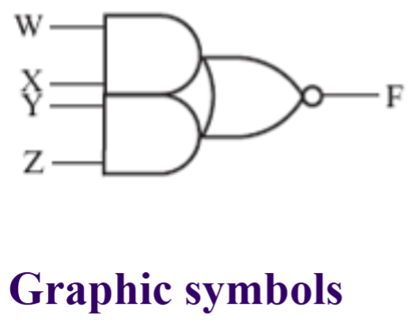
(Example: AOI for $A$, $B$, $C$; Output = $\overline{(A \cdot B) + C}$)

<table style="width: 100%; border-collapse: collapse; border-top: 2px solid #e0e0e0; border-bottom: 2px solid #e0e0e0; text-align: left; background-color: transparent;">
    <thead>
        <tr style="border-bottom: 1px solid #e0e0e0;">
            <th style="padding: 10px; font-weight: bold;">$A$</th>
            <th style="padding: 10px; font-weight: bold;">$B$</th>
            <th style="padding: 10px; font-weight: bold;">$C$</th>
            <th style="padding: 10px; font-weight: bold;">$(A \cdot B) + C$</th>
            <th style="padding: 10px; font-weight: bold;">AOI ($\overline{(A \cdot B) + C}$)</th>
        </tr>
    </thead>
    <tbody>
        <tr><td style="padding: 8px;">0</td><td style="padding: 8px;">0</td><td style="padding: 8px;">0</td><td style="padding: 8px;">0</td><td style="padding: 8px;">1</td></tr>
        <tr><td style="padding: 8px;">0</td><td style="padding: 8px;">0</td><td style="padding: 8px;">1</td><td style="padding: 8px;">1</td><td style="padding: 8px;">0</td></tr>
        <tr><td style="padding: 8px;">0</td><td style="padding: 8px;">1</td><td style="padding: 8px;">0</td><td style="padding: 8px;">0</td><td style="padding: 8px;">1</td></tr>
        <tr><td style="padding: 8px;">0</td><td style="padding: 8px;">1</td><td style="padding: 8px;">1</td><td style="padding: 8px;">1</td><td style="padding: 8px;">0</td></tr>
        <tr><td style="padding: 8px;">1</td><td style="padding: 8px;">0</td><td style="padding: 8px;">0</td><td style="padding: 8px;">0</td><td style="padding: 8px;">1</td></tr>
        <tr><td style="padding: 8px;">1</td><td style="padding: 8px;">0</td><td style="padding: 8px;">1</td><td style="padding: 8px;">1</td><td style="padding: 8px;">0</td></tr>
        <tr><td style="padding: 8px;">1</td><td style="padding: 8px;">1</td><td style="padding: 8px;">0</td><td style="padding: 8px;">1</td><td style="padding: 8px;">0</td></tr>
        <tr><td style="padding: 8px;">1</td><td style="padding: 8px;">1</td><td style="padding: 8px;">1</td><td style="padding: 8px;">1</td><td style="padding: 8px;">0</td></tr>
    </tbody>
</table>

**异或门 Exclusive-OR (XOR) Gate**

相同为0，不同为1；也可以理解为两个值里面只有一个是1的时候才是1

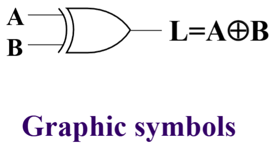 

<table style="width: 100%; border-collapse: collapse; border-top: 2px solid #e0e0e0; border-bottom: 2px solid #e0e0e0; text-align: left; background-color: transparent;">
    <thead>
        <tr style="border-bottom: 1px solid #e0e0e0;">
            <th style="padding: 10px; font-weight: bold;">$A$</th>
            <th style="padding: 10px; font-weight: bold;">$B$</th>
            <th style="padding: 10px; font-weight: bold;">XOR ($A \oplus B$)</th>
        </tr>
    </thead>
    <tbody>
        <tr><td style="padding: 8px;">0</td><td style="padding: 8px;">0</td><td style="padding: 8px;">0</td></tr>
        <tr><td style="padding: 8px;">0</td><td style="padding: 8px;">1</td><td style="padding: 8px;">1</td></tr>
        <tr><td style="padding: 8px;">1</td><td style="padding: 8px;">0</td><td style="padding: 8px;">1</td></tr>
        <tr><td style="padding: 8px;">1</td><td style="padding: 8px;">1</td><td style="padding: 8px;">0</td></tr>
    </tbody>
</table>


**同或门 Exclusive-NOR (XNOR) Gate**

相同为1，不同为0；也可以理解为两个值里面只有一个是1的时候才是0

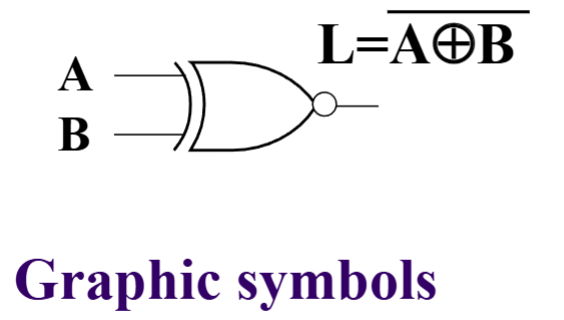

<table style="width: 100%; border-collapse: collapse; border-top: 2px solid #e0e0e0; border-bottom: 2px solid #e0e0e0; text-align: left; background-color: transparent;">
    <thead>
        <tr style="border-bottom: 1px solid #e0e0e0;">
            <th style="padding: 10px; font-weight: bold;">$A$</th>
            <th style="padding: 10px; font-weight: bold;">$B$</th>
            <th style="padding: 10px; font-weight: bold;">XNOR ($\overline{A \oplus B}$)</th>
        </tr>
    </thead>
    <tbody>
        <tr><td style="padding: 8px;">0</td><td style="padding: 8px;">0</td><td style="padding: 8px;">1</td></tr>
        <tr><td style="padding: 8px;">0</td><td style="padding: 8px;">1</td><td style="padding: 8px;">0</td></tr>
        <tr><td style="padding: 8px;">1</td><td style="padding: 8px;">0</td><td style="padding: 8px;">0</td></tr>
        <tr><td style="padding: 8px;">1</td><td style="padding: 8px;">1</td><td style="padding: 8px;">1</td></tr>
    </tbody>
</table>

## 2.2 Boolean Algebra

**Basic Equation**

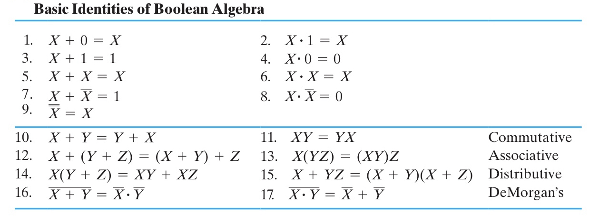

运算式中存在优先级：
- 括号
- 非
- 与
- 或

**扩展运算**

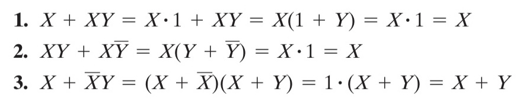
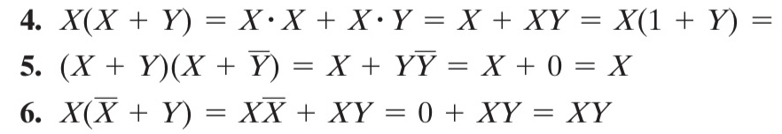

**对偶法则 Duality Rules**

一个表达式的对偶 (dual)为，将所有的 *与* 和 *或* 对调得到的式子。 

简单来说就是等式两边，把所有的AND换成OR，所有的OR换成AND，所有的0换成1，所有的1换成0，等式依旧成立（变量不需要改变）。

**一致性定理的证明 Proof of Consensus Theorem**
Example：
$$ AB+\overline{A}C+BC = AB+\overline{A}C $$
Proof:
$$ \begin{align}
AB+\overline{A}C+BC &= AB+\overline{A}C+BC(1)\\
&= AB+\overline{A}C+BC(A+\overline{A}) \\
&= AB+\overline{A}C+ABC+\overline{A}BC \\
&= AB(1+C)+\overline{A}C+\overline{A}C(1+B)\\
&= AB+\overline{A}C
\end{align} $$    

**替代法则 Substitution Rules**
在布尔代数中，代入规则指的是：如果一个逻辑等式成立，那么你可以用 *任何一个逻辑表达式（或变量）* 去替换等式两边出现的 *同一个变量*，替换后等式依然成立。这让我们可以利用简单的基本公式推导出更复杂的公式。

**Additional Equation**

1. $xf(x,\overline{x},y...,z_n) = xf(1,0,y...,z_n)$
2. $\overline{x}f(x,\overline{x},y...,z_n) = \overline{x}f(1,0,y...,z_n)$

同理，我们可以得到

3. $x+f(x,\overline{x},y...,z_n) = x+f(1,0,y...,z_n)$
4. $\overline{x}+f(x,\overline{x},y...,z_n) = \overline{x}+f(1,0,y...,z_n)$

除此之外，我们还可以对逻辑函数进行分解

5. $f(x,\overline{x},y...,z_n) = xf(1,0,y...,z_n) + \overline{x}f(1,0,y...,z_n)$
6. $f(x,\overline{x},y...,z_n) = (x+f(1,0,y...,z_n))( \overline{x}+f(1,0,y...,z_n))$

**两次对偶简化**

$F=(\overline A+\overline B)(\overline A+\overline C+D)(A+C)(B+\overline C)$
$\overline F=\overline A\ \overline B+\overline A\ \overline C D+AC+B\overline C=\overline A\ \overline B+B\overline C+AC$
$F=(\overline A+\overline B)(B+\overline C)(A+C)$


---
## 2.3 规范形式与标准形式 Canonical Forms & Standard Forms

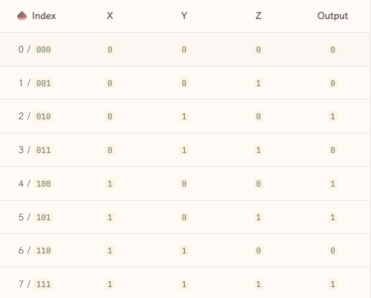

**最小项之和 Sum of Minterms, SOM**
- **定义**：包含所有 $n$ 个变量的**乘积项（AND项）**，每个变量以原变量($A$)或反变量($\overline{A}$)形式出现一次。该项仅在唯一的一组输入组合下输出为 1。（赋值原则：想要结果为1，原变量输入需为1，反变量输入需为0）。
  
对于本章开头的这张真值表来说，输出为1的只有010，110，101以及111这四种情况，那么在我们最终的表达中就要选择这四个输出为1的表达：
$$Output = \overline XY\overline Z+X\overline Y\ \overline Z+X\overline YZ+XYZ$$
从表达式里面我们可以理解为，最小项之和从输出为1的角度入手，枚举了所有输出为1的可能

**最大项之积 Prodcuct of Maxterms, POM**
- **定义**：包含所有 $n$ 个变量的**求和项（OR项）**，每个变量以原变量($A$)或反变量($\overline{A}$)形式出现一次。该项仅在唯一的一组输入组合下输出为 0。（与最小项完全相反，赋值原则：想要结果为0，原变量输入需为0，反变量输入需为1）。

对于本章开头的这张真值表来说，输出为0的只有000，001，011，110这四种情况，那么我们最终的表达中就要选择这四个输出为0的表达：
$$Output=(X+Y+Z)(X+Y+\overline Z)(X+\overline Y+\overline Z)(\overline X+\overline Y+Z)$$

对于上面这个是在来说，只有满足其中四种情况中的一种才能使得结果为0，反之输出为1

*(注：由于德·摩根定律，同编号的最小项和最大项互为补数，即 $\overline{m_i} = M_i$ 且 $\overline{M_i} = m_i$)*

**规范形式 (Standard Forms)**
利用 Minterm 和 Maxterm，我们可以把任何真值表直接翻译成标准的方程式：
1. **Sum of Minterms (最小项之和 / Standard SOP)**：提取真值表中最终输出为 **1** 的所有行，把它们对应的最小项 $m_i$ 全部 **相加 (OR)**。
2. **Product of Maxterms (最大项之积 / Standard POS)**：提取真值表中最终输出为 **0** 的所有行，把它们对应的最大项 $M_i$ 全部 **相乘 (AND)**。

**综合应用举例**：
假设有一个 2 变量系统 $F(A,B)$，其功能真值表规定：
- 当输入组合为 `01`(十进制1) 和 `11`(十进制3) 时，系统由于条件满足，输出为 **1**。
- 当输入组合为 `00`(十进制0) 和 `10`(十进制2) 时，系统条件不满足，输出为 **0**。

利用上述规范形式，我们可以直接写出它的数字逻辑方程式：
- **求积之和 (SOP)**：找输出为 1 的行（第 1 和 3 行），将其最小项相加：
  $F = \Sigma m(1, 3) = m_1 + m_3 = \overline{A}B + AB$
- **求和之积 (POS)**：找输出为 0 的行（第 0 和 2 行），将其最大项相乘：
  $F = \Pi M(0, 2) = M_0 \cdot M_2 = (A + B) \cdot (\overline{A} + B)$
*(上述两个式子在逻辑上是完全等价的。)*

---
## 2.4 Circuit Optimization (电路优化)

**优化的目的**
通过特定的步骤或算法为给定的逻辑函数找到最简单的电路实现方式。为了衡量逻辑电路的简单程度，我们需要引入**成本标准 (Cost Criteria)**。

**核心衡量标准**

1. **L：Literal Cost（字面量成本）**
   - *定义*：布尔表达式中所有变量（包括原变量 $A$ 和反变量 $\overline{A}$）出现的*总次数*。
   - *计算*：直接数表达式中有多少个字母。

2. **G：Gate Input Cost（门输入成本，不含非门）**
   - *定义*：实现该逻辑等式所需的所有门电路的*输入端总数*（此标准下不计算非门/反相器）。
   - *计算公式（针对SOP或POS）*：$G = L + (\text{包含} >1 \text{个字面量的项数})$
3. **GN：Gate Input Cost with NOTs（门输入成本，含非门）**
   - *定义*：在 G 的基础上，将非门（Inverter）的成本也计算在内。
   - *计算公式*：$GN = G + (\text{表达式中出现的}\mathbf{不同}\text{反变量的个数})$

**计算示例**
对于方程 $F = BD + A\overline{B}C + A\overline{C}\ \overline{D}$：
- *L* = 8 （表达式中一共有8个字母）
- *G* = 8 (L) + 3 (共有三个项，且每个项字面量都$>1$) = *11*
- *GN* = 11 (G) + 3 (出现了 $\overline{B}, \overline{C}, \overline{D}$ 三个不同的反变量) = *14*

对于方程 $F=ABC+\overline{A}\ \overline{B}\ \overline{C}$
- *L* = 6 （表达式中一共有6个字母）
- *G* = 6 (L) + 2 (共有两个项，且每个项字面量都$>1$) = *8*
- *GN* = 8 (G) + 3 (出现了 $\overline{A}, \overline{B}, \overline{C}$ 三个不同的反变量) = *11*

对于方程 $F=(A+\overline{C})(\overline{B}+C)(\overline{A}+B)$
- *L* = 6 （表达式中一共有6个字母）
- *G* = 6 (L) + 3 (共有两个项，且每个项字面量都$>1$) = *9*
- *GN* = 9 (G) + 3 (出现了 $\overline{A}, \overline{B}, \overline{C}$ 三个不同的反变量) = *12*
  
对于方程 $F=(A+\overline{B})(A+D)(B+C+\overline{D})(\overline{B}+\overline{C}+D)$
- *L* = 10 （表达式中一共有6个字母）
- *G* = 10 (L) + 4 (共有两个项，且每个项字面量都$>1$) = *14*
- *GN* = 14 (G) + 3 (出现了 $\overline{B}, \overline{C}, \overline{D}$ 三个不同的反变量) = *17*


---
## 2.5 Karnaugh Map (卡诺图)

卡诺图是一种用于简化布尔表达式的图形工具。它通过将真值表以二维或多维网格形式排列，使逻辑函数的最小项或最大项直观分布。通过合并相邻的格子（代表输入变量的不同组合），可以快速找到最简逻辑表达式，减少电路实现的复杂度。

对于字面量X和Y，我们可以用一张二维的表格来表示所有的情况，对于三个或者四个字面量，我们也可以用二维表格来表示

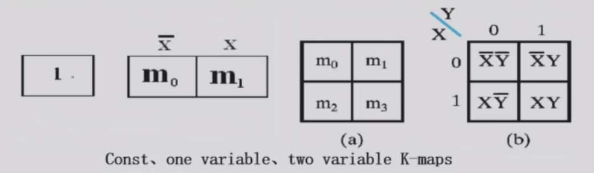

下图展示了如何用一张二维表个来表示三个字面量，但是要注意对于 $YZ$ 排列顺序需要按照格雷码的方法排列，这样我们可以在后续的过程中发现相邻的最小项，以达到合并的结果。

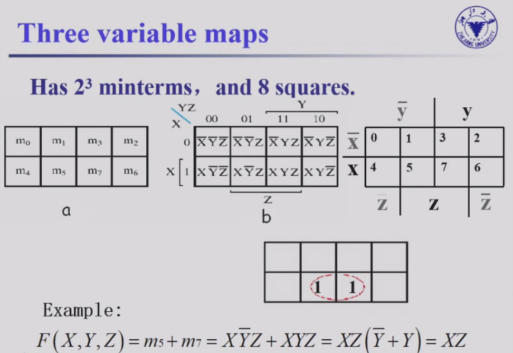

对于四个变量来说也是类似


除了上面的表示方法，其实也可以按照下面的这样表示，在视觉上可能会更加直观

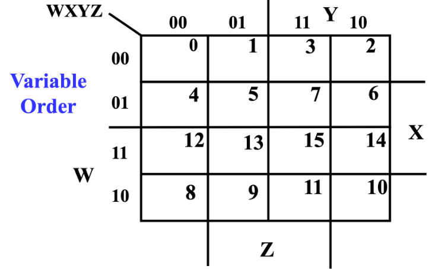

**优化方法**

在了解了卡诺图的表示方法之后，我们需要指导如何利用卡诺图进行表达的优化，我们可以先从简单的三个字面量的情况开始讨论


- 2，3，6，7表示表达式在010,011,110,111三种情况下输出1，则根据我们前面对于表格的设计在表格中写入1
- 从这张图可以很明显的看出，结果在y=1的情况下输出1，结果在y=0的情况下输出0；与x和z其实都没有关系。不过这样的表达还不够只管
- 当我们把右边四个方框框在一起的时候，我们发现这个方框横跨了x，z的0和1的值，同时也没有其他值为1的方框没有包含在这个大方框之中了，所以我们可以确定 $F=y$

类似的，我们可以总结这方面的规律：

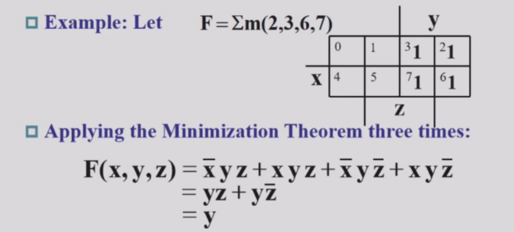

- 对于$2^1$大小的矩形，我们可以消除一个变量
- 对于$2^2$大小的矩形，我们可以消除两个变量
- 依次类推 （在画矩形的时候一定要把整个表格视为一个连续的，即右边框和左边框实际是相连接的，下边框和上边框也是向连接的）

**无关项 (Don't Cares in K-Maps)**

有时，在真值表或卡诺图中，我们会遇到一些特定的条目满足以下情况：
- 该最小项对应的**输入值永远不会出现**；或者
- 该最小项对应的**输出值根本不被系统使用**。
 
在这些情况下，系统的输出值是不需要被严格定义为 0 或 1 的。
相反，我们可以将这些输出值定义为**“无关项 (don't care)”**。
通过在真值表或卡诺图中将这些位置标记为“无关项”（通常用 **“x”** 表示），我们可以更灵活地画圈，从而**降低逻辑电路的成本**（即将 x 视作 1 或 0 来帮助凑出更大的圈，如果不用的 x 则当做 0 忽略）。

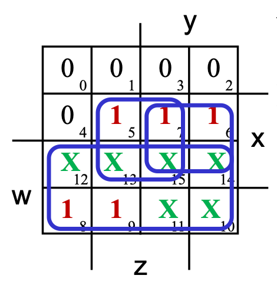
 


**Implicant（蕴涵项）**

蕴含项指的是一个由 $2^n$个1或者无关项组成的矩形块，并且矩形块可以合并为一个乘积项
蕴含项分为*主蕴含项 (Prime implicant)* 和基本主蕴含项* (Essential Prime implicant)*
- 主蕴含项则是在卡诺图中的极大蕴含项，就是当前卡诺图中最大的矩形
- 如果一个主蕴含项包含了至少一个“只属于它自己”的 1（即这个 1 不被其他任何主蕴含项包含），那么它就是基本主蕴含项。
  
先从简单一点的图片入手，在左侧的两个主蕴含项包含了直属于他自己的1，所以是基本主蕴含项；而右侧这个蕴含项实际上是一个冗余的蕴含项，因为其没有包含属于自己的1

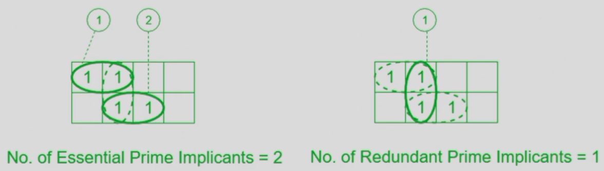

再来看下图中稍微复杂一些的情况，只有左上角这两个框是 Essential Prime Implicant，因为它们覆盖的 `1` 只被它们自己覆盖，而其他的 `1` 都被多个大圈覆盖，所以其他的大圈都是非本质主蕴涵项。

把他们选出来之后，再看一下剩下的 `1`，看看还有没有被覆盖的，如果有的话就选一个非本质主蕴涵项把它覆盖掉，直到所有的 `1` 都被覆盖掉为止。


例：


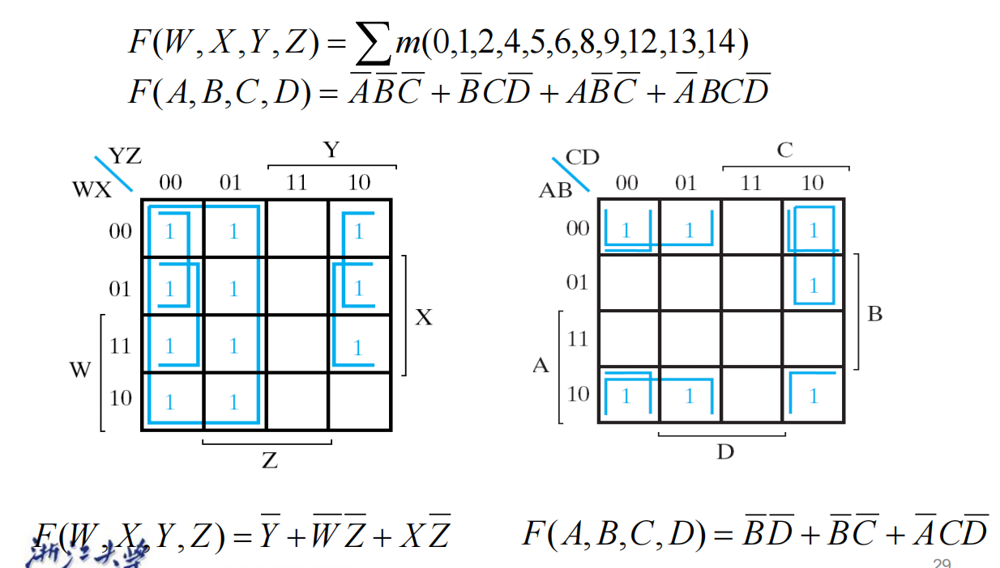

**反过来，也可以把0框起来计算**

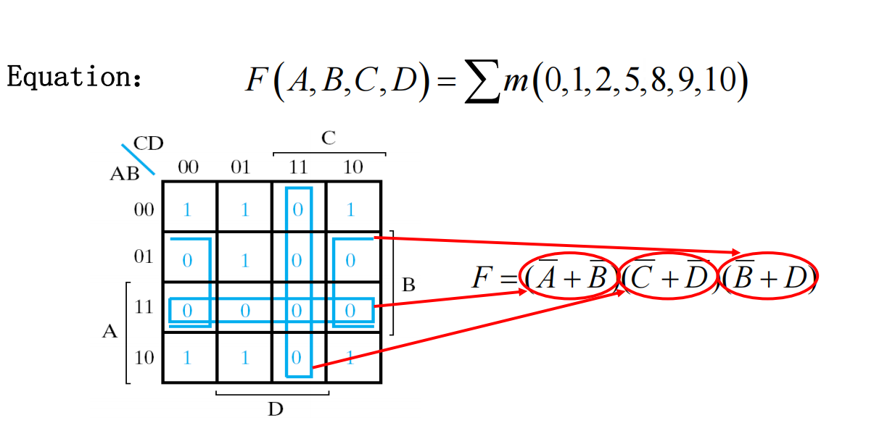


## 2.6 Additional Gates and Circuits

**Buffer**

- A buffer is a gate with the function $F=X$.

在电路中插入一个buffer可以规整电路结构。虽然buffer本身不改变信号的逻辑值，但它可以增强信号的驱动能力，使得信号在传输过程中不易衰减，保持信号的完整性。

其他的门详见表格吧


**传输门 Transmission Gate**

一个传输门可以被视为一个开关

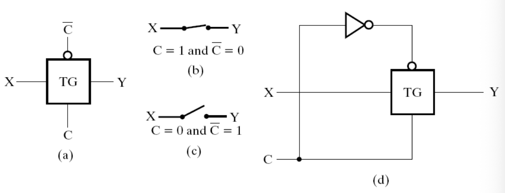

**三态缓冲器 The 3-State Buffer**

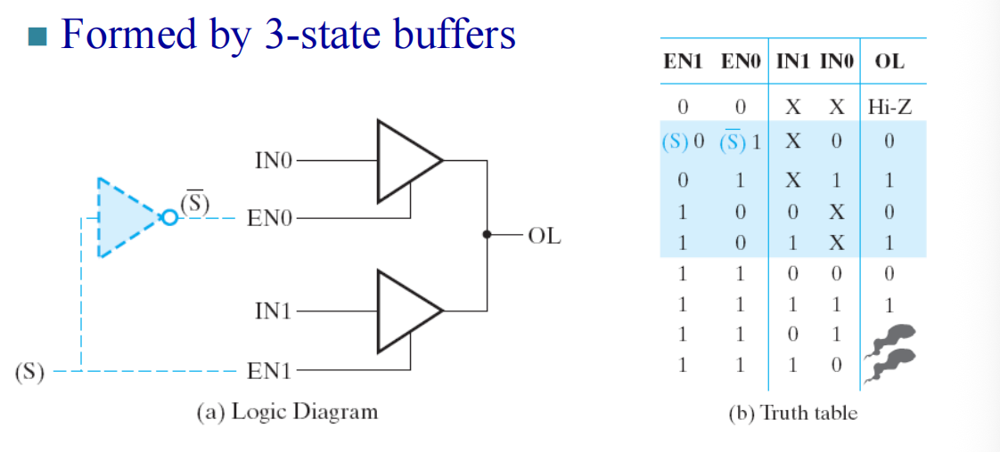

当S=0时，输出的事IN0，当S=1时，输出的是IN1，两个 3-state buffer 组合成一个选择器。

**Complex Gates**


## 2.7 HDL Overview

**HDL（硬件描述语言）简介**

- HDL（Hardware Description Language）用于描述和建模数字电路的结构和行为，常见的有 Verilog 和 VHDL。
- HDL 代码可用于仿真（验证逻辑功能）和综合（生成门级电路）。
- 基本结构包括模块（module/entity）、端口（input/output）、信号（wire/reg）、过程块（always/process）等。
- 组合逻辑可用 assign（Verilog）或 concurrent assignment（VHDL）描述；时序逻辑需用时钟敏感的过程块。
- 设计流程：编写 HDL → 仿真验证 → 综合实现 → 下载到硬件（如 FPGA）。
- HDL 支持层次化设计，可将复杂电路分解为多个子模块。
- 例子（Verilog）：
    ```verilog
    module and_gate(input A, input B, output Y);
        assign Y = A & B;
    endmodule
    ```
- 例子（VHDL）：
    ```vhdl
    entity and_gate is
        Port ( A, B : in STD_LOGIC; Y : out STD_LOGIC );
    end and_gate;
    architecture Behavioral of and_gate is
    begin
        Y <= A and B;
    end Behavioral;
    ```
- HDL 使数字系统的设计、验证和实现更加高效和自动化。
