# Chapter 3 Combinational Logic Design

## 逻辑电路分类

- **组合逻辑电路 Combinational Circuit**
  - 拥有 $m$ 个输入和 $n$ 个输出，其中包含了 $2^m$ 种输入组合，以及对应的 $n$ 个不同的函数
  - 他的输出值依赖于这 $m$ 个输入的组合
- **时序逻辑电路 Sequential Logic Circuit**
  - 与组合逻辑电路对应的，时序电路具有记忆功能，他的输出可能还依赖之前的结果或者说是系统的状态

---
## 集成电路 Integrated Circuits

集成电路是一种半导体晶体，在其芯片上集成了数字门电路和存储元件的电子组件，并将它们相互连接。

- 小规模集成 Small Scale Integration, SSI: 每片芯片小于 10 个门电路
- 中等规模集成 Medium Scale Integration, MSI: 每片芯片 10 到 100 个门电路
- 大规模集成 Large Scale Integration, LSI: 每片芯片 100 到 1000 个门电路
- 超大规模集成 Very Large Scale Integration, VLSI: 每片芯片大于 1000 个门电路

---
## 工艺参数 Technology Parameters

具体的门电路实现技术具有以下这些特征参数：

- **扇入 Fan-in**: 门电路可用的输入端数量 
- **扇出 Fan-out**: 门电路输出端可驱动的标准负载数量 
- **逻辑电平 Logic Levels**: 输入和输出信号中标识为 1 和 0 的电平/电压范围 
- **噪声容限Noise Margin**: 正常输入值上可叠加的最大外部噪声电压，且该噪声不会导致电路输出发生意外改变 
- **逻辑门成本Cost for a gate**: 衡量该门电路对集成电路总成本的贡献 
- **传播延迟 Propagation Delay**: 信号状态变化从输入端传播到输出端所需的时间 
- **功耗 Power Dissipation**: 从电源提取并被该门电路所消耗的功率大小 

**扇出 Fan-out**

扇出 (Fan-out) 通常根据**标准负载 (standard load)** 来进行定义：

- **标准负载 (Standard Load)**：例如，1个标准负载等于1个反相器 (inverter) 的输入端所贡献的负载。
- **转换时间 (Transition time)**：门电路输出从高电平变到低电平 ($t_{HL}$) 或从低电平变到高电平 ($t_{LH}$) 所需要的时间。
- **最大扇出 (Maximum fan-out)**：一个逻辑门在**不超过其规定的最大转换时间**的前提下，所能驱动的标准负载的最大数量。

关于转换时间，做如下详细讲解：
- $t_{LH}$, rise time: 等于栅极输出 $V_{CC}$ 的 10% 到 90% 所需要的时间
- $t_{HL}$, fall time: 等于栅极输出 $V_{CC}$ 的 90% 到 10% 所需要的时间

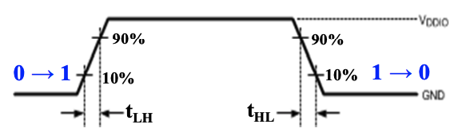
同时，随着负载的增加，转换的时间也会增加（以为给电容充电的时间会增加），在扇出定义中提到的“最大负载”就是指它的转换时间不超过它预定的的最大转换时间

**传播延迟 Propagation Delay**

- **传播延迟**：输入端的变化传播到门电路输出端所需的时间。
- **测量基准**：延迟通常在相对于高电平 (H) 和低电平 (L) 输出电压的 **50%** 处进行测量 (measured at the 50% point)。
- **方向差异**：输出信号从高到低 ($t_{PHL}$) 和从低到高 ($t_{PLH}$) 的变化可能具有**不同**的传播延迟 (having different propagation delays)。
- **参考节点定义**：高到低 (HL) 和低到高 (LH) 的转换始终是相对于**输出端 (output)** 进行定义的，而**不是输入端 (not the input)**。

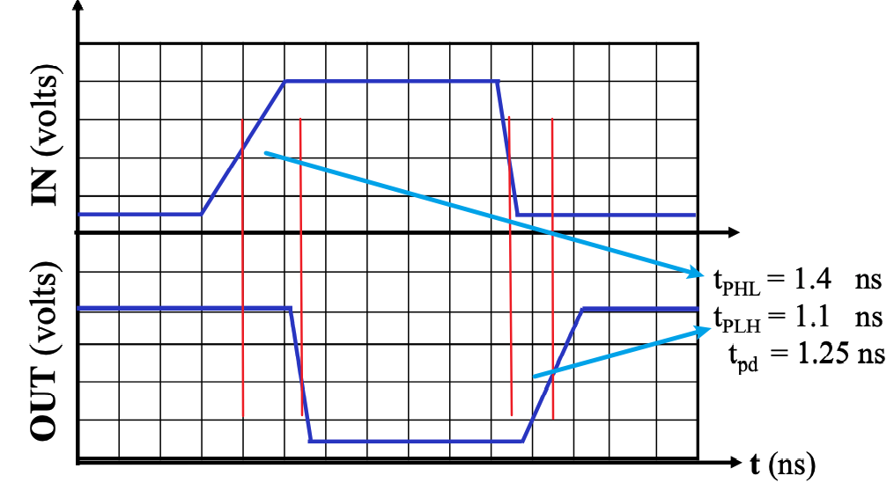

**转换时间&传播延迟**

转换时间专注于时间的变化，而传播延迟包含了输入的变化和输出的变化整个过程，从时序图上的表示来看，转换时间只需要输出的时序图极氪；但是传播延迟则是通过比较输入与输出的偏差来表示的。

**延迟模型 Delay Models**

- **Transport delay (传输延迟)**：输出响应输入的变化，在经历一段**固定的规定延迟时间 (fixed specified delay)** 之后才发生相应的改变。
- **Inertial delay (惯性延迟)**：与传输延迟类似，但有一个关键区别：如果输入信号发生变化，导致输出试图在小于**拒绝时间 (rejection time)** 的时间间隔内发生两次改变，那么由于惯性作用，输出**不发生任何状态改变 (output changes do not occur)**。在这种模型下，噪声会被过滤
  > 惯性延迟用于模拟典型的电子电路行为，即它能消除/拒绝输出端出现的极窄“脉冲” (rejects narrow "pulses" on the outputs)。

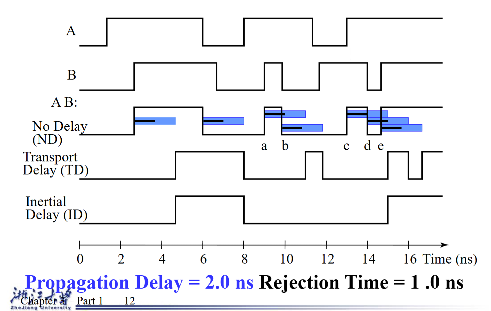
以下面这个选择器为例

由于非门的延迟，所以导致了有一个小的时间段内 $s$ 和 $\overline{S}$ 都是0，这个时候Y的输出也为0。所以在这样的情况下，无法用这种方式来做选择器。

**成本 Cost**

在集成电路 (Integrated Circuit) 中：
- 一个逻辑门的成本与其所占用的**芯片面积 (chip area)** 成正比。
- 门电路的面积大致与**晶体管的数量和尺寸 (number and size of the transistors)** 以及连接它们的**布线数量 (amount of wiring)** 成正比。
- 如果忽略布线面积，门电路的面积大致与**逻辑门输入端的数量 (gate input count)** 成正比。
- 因此，逻辑门的输入端数量是衡量逻辑门成本的一个粗略指标。

> **注意：** 如果已知逻辑门占用的实际芯片布局面积 (actual chip layout area)，将是一个准确得多的成本衡量标准。

**Fan-out and Delay (扇出与延迟)**

逻辑门输出端所承载的**扇出 (Fan-out)** 负载会影响该门电路的**传播延迟 (propagation delay)**。

- 对于一个与非门 (NAND gate)，一个切合实际的传播延迟 ($t_{pd}$) 方程示例为：
  $$t_{pd} = 0.07 + 0.021 \cdot SL \text{ (ns)}$$
在这其中，0.07为固定延迟，0.021为一个标准负载带来的延迟系数，SL则是标准化的负载量

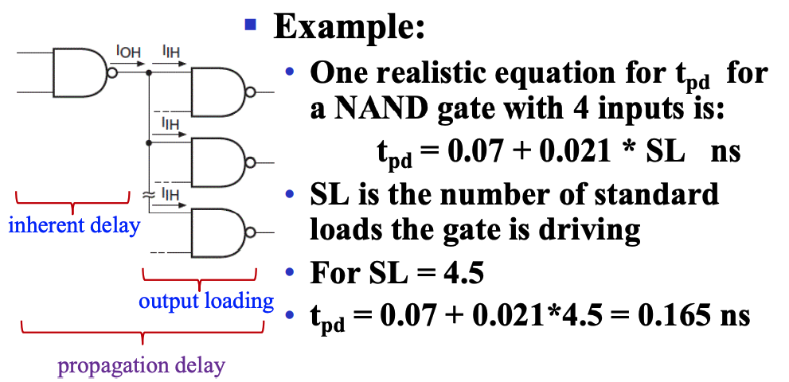

> 其中 $SL$ 是该门输出端所驱动的**标准负载数量 (number of standard loads)**。

**Cost/Performance Tradeoffs (成本/性能权衡)**

在数字电路设计中，经常需要在**成本 (Cost)** 和**性能 (Performance/Delay)** 之间做出让步与妥协。

**Gate-Level Example (门级电路示例)**：
- 一个由于非门 (NAND gate) G 直接驱动输出端的 20 个标准负载 (standard loads)，其**延迟 (delay)** 为 0.45 ns，**归一化成本 (normalized cost)** 为 2.0。
- 一个缓冲器 (buffer) H 的归一化成本为 1.5。如果我们改变设计，让与非门先驱动缓冲器，再由缓冲器来驱动这 20 个标准负载，此时的**总延迟 (total delay)** 为 0.33 ns。*(注：此时系统总成本变为 2.0 + 1.5 = 3.5)*
  
思考：在以下哪种情况下应该添加这个缓冲器？
1. **成本不能超过 2.5**。*(不能添加缓冲器，因为添加后的成本 3.5 超标)*
2. **延迟不能超过 0.40 ns**。*(必须添加缓冲器，因为直接驱动的 0.45 ns 超标，添加后 0.33 ns 满足要求)*
3. **延迟必须小于 0.40 ns 且成本小于 3.0**。*(两者都无法满足，设计要求过于苛刻，直接驱动延迟超标，加缓冲器成本超标)*

- 这种权衡 (Tradeoffs) 不仅存在于底层门级，还可以 (且经常) 在**设计层次结构 (design hierarchy) 的更高层**去完成。
- 对**成本和性能的具体约束 (Constraints on cost and performance)** 在做出妥协决定时起着主导作用。

---
## 设计流程 Design Procedure

数字组合逻辑电路的设计流程通常包含以下几个步骤：

1. **规格说明 Specification**
   - 如果尚未有现成的规范，需要为电路编写一份**规格说明 (specification)**。

2. **公式化 Formulation**
   - 如果规格说明中没有给出明确关系，则需要推导出**真值表 (truth table)** 或初始的**布尔方程 (Boolean equations)**，以此来定义输入和输出之间所要求的逻辑关系。
   - 如果适用的话，应用**层次化设计 (hierarchical design)**。

3. **优化 Optimization**
   - 应用两级 (2-level) 和多级 (multiple-level) 的**逻辑优化 (optimization)**。
   - 使用与门 (ANDs)、或门 (ORs) 和反相器/非门 (inverters) 画出**逻辑图 (logic diagram)**，或者为所产生的结果电路提供一份**网表 (netlist)**。

4. **工艺映射 Technology Mapping**
   - 将逻辑图 (logic diagram) 或网表 (netlist) **映射 (Map)** 到所选择的**架构/实现技术 (implementation technology)** 上。

5. **验证 Verification**
   - 通过**手动 (manually)** 或使用**仿真工具 (simulation)** 来**验证 (Verify)** 最终设计的正确性 (correctness of the final design)。

**Example**

现在我要设计一个BCD码转换为 Excess-3码的组合逻辑电路。
1. **Specification**: 输入是一个4位的BCD码，输出是一个4位的Excess-3码。
2. **Formulation**: 首先我需要写出输入和输出之间的关系的真值表 (truth table)

<table style="width: 100%; border-collapse: collapse; border-top: 2px solid #e0e0e0; border-bottom: 2px solid #e0e0e0; text-align: left; background-color: transparent;">
    <thead>
        <tr style="border-bottom: 1px solid #e0e0e0;">
            <th style="padding: 10px; font-weight: bold;">BCD (ABCD)</th>
            <th style="padding: 10px; font-weight: bold;">Excess-3(WXYZ)</th>
        </tr>
    </thead>
    <tbody>
        <tr><td style="padding: 8px;">0000</td><td style="padding: 8px;">0011</td></tr>
        <tr><td style="padding: 8px;">0001</td><td style="padding: 8px;">0100</td></tr>
        <tr><td style="padding: 8px;">0010</td><td style="padding: 8px;">0101</td></tr>
        <tr><td style="padding: 8px;">0011</td><td style="padding: 8px;">0110</td></tr>
        <tr><td style="padding: 8px;">0100</td><td style="padding: 8px;">0111</td></tr>
        <tr><td style="padding: 8px;">0101</td><td style="padding: 8px;">1000</td></tr>
        <tr><td style="padding: 8px;">0110</td><td style="padding: 8px;">1001</td></tr>
        <tr><td style="padding: 8px;">0111</td><td style="padding: 8px;">1010</td></tr>
        <tr><td style="padding: 8px;">1000</td><td style="padding: 8px;">1011</td></tr>
        <tr><td style="padding: 8px;">1001</td><td style="padding: 8px;">1100</td></tr>
    </tbody>
</table>

3. **Optimization**: 通过卡诺图 (Karnaugh map) 来优化每一位输出的布尔方程 (Boolean equations)，并画出逻辑图 (logic diagram)。

$$W=A+BC+BD$$

$$X=\overline{B}C+\overline{B}D+B\overline{C}\ \overline{D}$$

$$Y=CD+\overline{C}\ \overline{D}$$

$$Z=\overline{D}$$

根据之前讲过的计算方法
$G = 7+10+6+0=23$
现在我们把$\overline{C}\ \overline{D}$这个作为整体 $T_1$， 则

$$W=A=BT_1$$

$$X=\overline{B}T_1+B\overline{T_1}$$

$$Y=CD+\overline{T_1}$$

$$Z=\overline{D}$$

此时，$G=2+4+6+4+0=16$，优化后成本降低了。

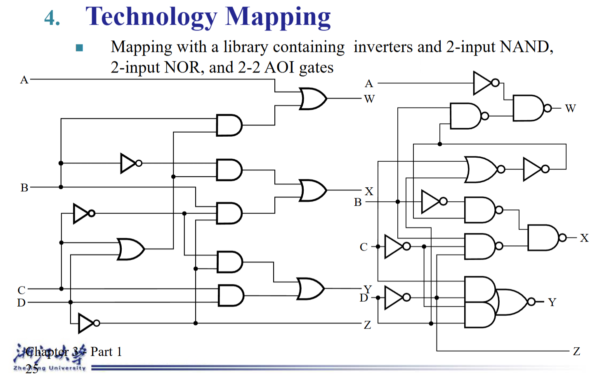

---
## 层次化设计架构 Beginning Hierarchical Design

九位数据的奇校验为例，展示了整体的层次化设计架构

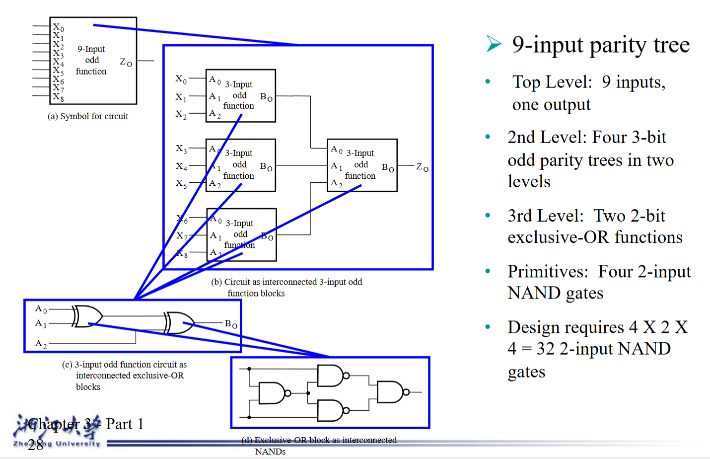

层次化设计奖一整个电路拆分为可复用的模块 (reusable function blocks)，这些模块可以在不同设计中被重复使用。

---
## 工艺映射 Technoloty Mapping

**Mapping Procedure (映射流程)**
- 映射为与非门
- 映射为或非门

### 映射至与非门 Mapping to NAND gates

**假设:**
- 忽略门负载和延迟
- 单元库包含一个反相器和 n 输入与非门，n = 2, 3, ...
- 已有电路的与门、或门、反相器原理图

**映射通过以下步骤完成:**
- 替换与门和或门符号
- 将反相器推过电路扇出点
- 消除成对的反相器

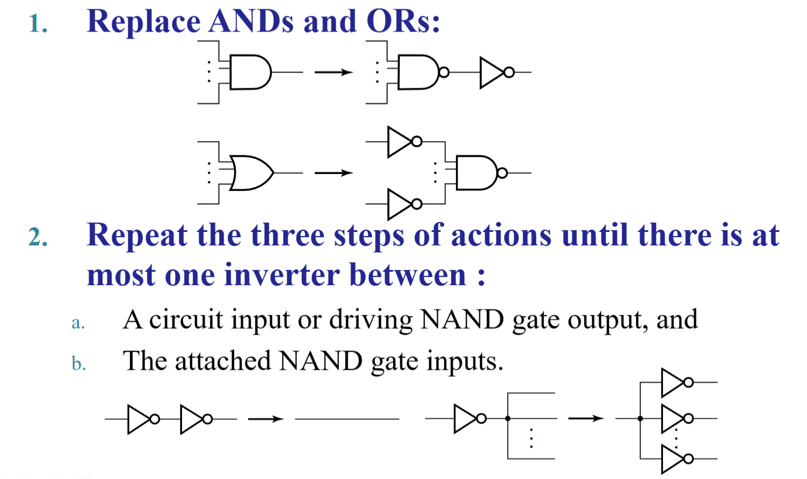 
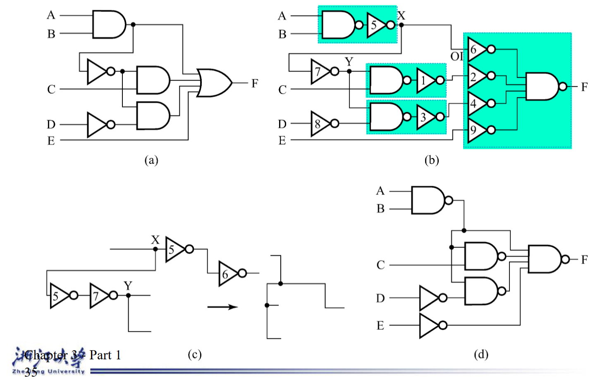

### Mapping to NOR gates (映射至或非门)

**假设:**
- 忽略门负载和延迟
- 单元库包含一个反相器和 n 输入或非门，n = 2, 3, ...
- 已有电路的与门、或门、反相器原理图

**映射通过以下步骤完成:**
- 替换与门和或门符号
- 将反相器推过电路扇出点
- 消除成对的反相器

 
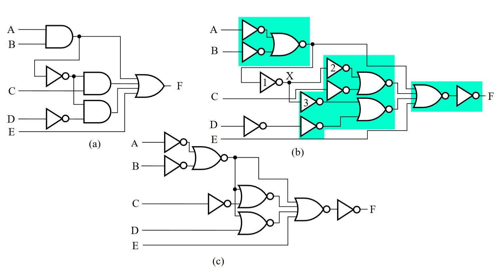

---
## 验证 Varification

- **验证** - 证明最终设计的电路实现了原始定义的规格说明/规范
- **常见的简单规范包括:**
  - 真值表
  - 布尔方程
  - 硬件描述语言 HDL 代码
- 如果上述内容（真值表、方程等）来自于**公式化 (formulation)** 阶段，而不是直接来自于原始的规格说明，那么必须确保公式化过程绝对完美无瑕，最终的验证才会是有效且可靠的！

### 基本验证方法 Basic Verification Methods

**手动逻辑分析 Manual Logic Analysis**
- 求出最终设计电路的真值表或布尔方程
- 将最终电路的真值表与定义的规范真值表进行对比
- 证明最终电路的布尔方程在逻辑上等价于规范给定的布尔方程

**仿真 Simulation**
- 使用能充分验证其正确性的测试输入值，对最终电路（或是它的网表，也可能是由 HDL 编写的代码）以及给定的规范真值表、方程或 HDL 描述进行仿真。
- 对于组合逻辑电路而言，最清晰直白的测试方法就是遍历并模拟输入规范中所有“关心的 (care)”输入组合。

---
## 基本逻辑函数 Rudimentary logic functions

**对于单一变量X的函数**

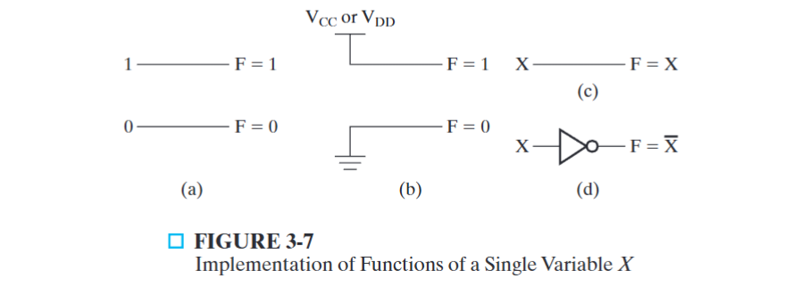

**对于多个bit的函数**

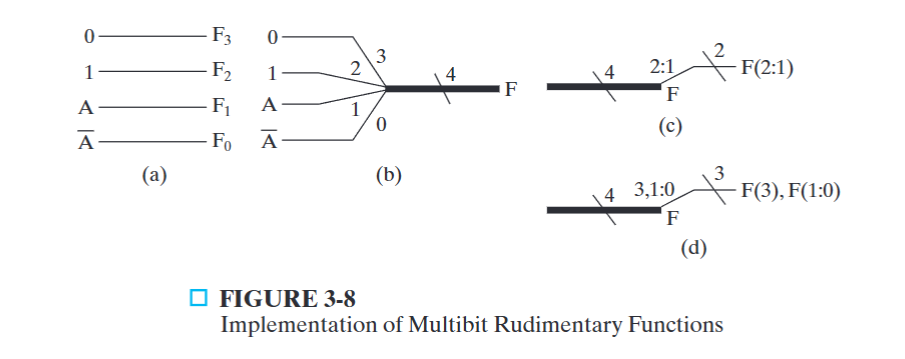

- 宽线（粗线）表示总线，代表一组信号（向量）
- 在 (b) 中，$F=(F_3,F_2,F_1,F_0)$ 其中 $F_3$ 是最高位 MSB
- 在 (c) 中，$4$ 表示总线 $F$ 是 $4$ 位宽，$2:1$ 表示取出第二位和第一位，即取出 $(F_2,F_1)$ 作为一个小的信号组
- 在 (d) 中，可以不连续的取位数，即 $3,1:0$ 表示取出 $(F_3,F_1,F_0)$
  
**使能函数 Enabling Function**

- Enabling 表示当一个控制信号（使能信号）有效的时候，允许输入信号直接传递到输出
- Disabling 表示当一个控制信号（使能信号）无效的时候，阻止信号通过。
- 在 (a) 中，EN=1时，F输出结果与X相同；当EN=0时，F输出0
- 在 (b) 中，EN=1时，F输出结果与X相同；当EN=0时，F输出0

---
## 解码器 Decoders

解码器的定义：
- 输入：n 位二进制代码
- 输出：m 位二进制代码
- 条件：*m大于等于n，同时不超过2的n次*
- 关系：每个有效输入组合对应唯一的一个输出组合

功能块表示方法：
- 我们用 **n-to-m line decoder** 来表示n位到m位的解码器，比如(2-to-4 line decoder/3-to-8 decoder)

先从最简单的例子开始

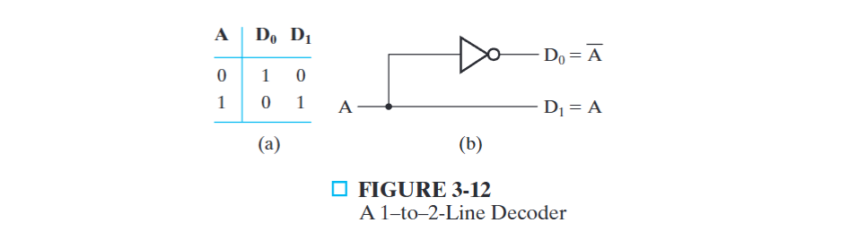
在上图中，展示了一个 1-to-2 line decoder，当输入 $A=0$ 时，输出 $D_0D_1=10$;当输入 $A=1$ 时，输出 $D_0D_1=01$;

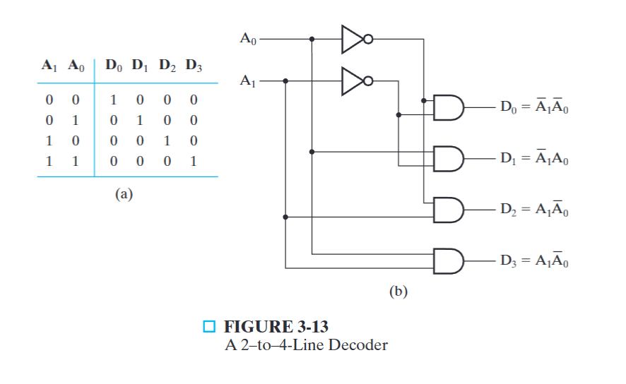
在这张图中，展示了一个2-to-4 line decoder，具体的内容就不再赘述了，很明显用四位的输出一一对应了两位的输入的所有可能

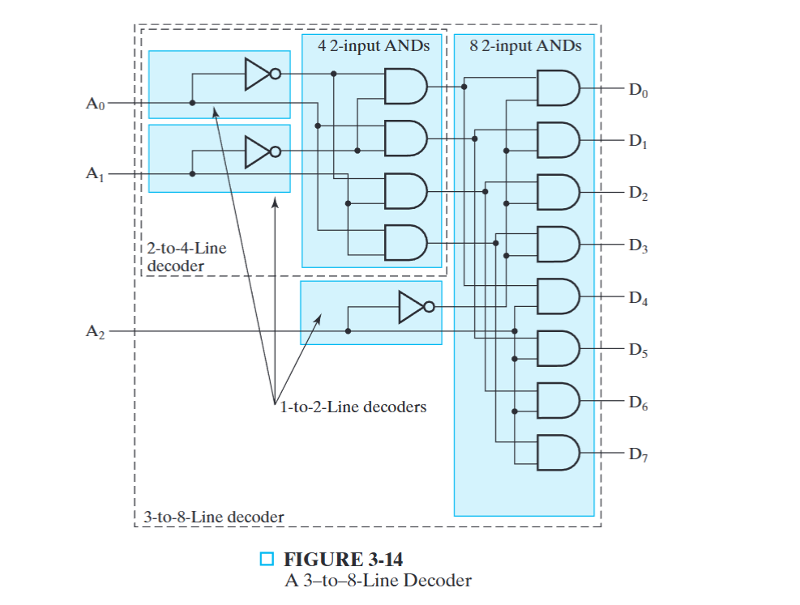 
这张图就稍显复杂了，这张图主要是展示了如何使用我们前面图片中所使用的 1-to-2 line decoder 和 2-to-4 line decoder 来构成一个 3-to-8 line decoder
- 输入：$A_2,A_1,A_0$,一共有 $2^3=8$种组合
- 输出：8条线$D_0,D_1,D_2,D_3,D_4,D_5,D_6,D_7,$
- 思路：把3位拆分成两组，一部分是高位 $A_2$, 一部分是低位 $A_1,A_0$
- 第一层：我们用 1-to-2 line decoder 处理高位，高位输入为0时输出10；输入为1时输出01。我们利用这个信号来选区。
  从逻辑图中可以看到，当输入为0，即高位输出10的时候，$D_4-D_7$必然输出为0，因此此时选中的区域是$D_0-D_3$；相对应的，当输入为1的时候，选中的区域是 $D_4-D_7$
- 第二层：用 2-to-4 line decoder 处理低位

**扩展**
接下来我们要把这种扩展的方法扩展到 $k-to-2^k$ line decoder上面
- 思路：递归地把输入为书分为两组，分别译码，然后再用AND门组合
- 假设输入k是偶数，则把k位输入平均分为两组，每组用一个 $k/2-to-2^(k/2)$ 译码器，然后输出用 $2^k$ 个与门
- 假设输入k时奇数，则把k位输入分为 $(k+1)/2$ 和 $(k-1)/2$分别译码，然后输出用 $2^k$ 个与门

本质上就是把一个稠密的编码解码为了一个稀疏的编码

---
## 编码器 Encoders

编码器就是解码器的反过程，用于把输入的 n 位二进制代码转换成输出的输出的 m 位二进制代码。典型的使用方法是将恰好有一位为1的输入码转换成该位位置对应的二进制码，比如：
- 0001 -> 00
- 0010 -> 01
- 0100 -> 10
- 1000 -> 11

**应用实例**：十进制的BCD编码器
- 输入：十根线 $D_0,D_1,\dots D_9$, 对应十进制的数字0-9
- 输出：四根线 $A_3,A_2,A_1,A_0$, 对应BCD码的表示方法
- 从输出的角度来推导逻辑关系：
  - $A_3$: 十进制为8和9的时候为1
  - $A_2$: 十进制为4，5，6，7的时候为1
  - $A_1$: 十进制为2，3，6，7的时候为1
  - $A_1$: 十进制为1，3，5，7，9的时候为1
- 根据上述的逻辑设计逻辑门即可，比较简单。同时6，7出现的时候$A_2$，$A_1$均为1，所以可以将这两个的输如捆绑输出到$A_2$，$A_1$简化电路

**优先编码器 Priority Encoder**

如果有多于一个输入为1，上面的这种思路的编码器就会出现错误；此时我们引入优先编码器：当多个输入为1时，只响应优先级最高的那个

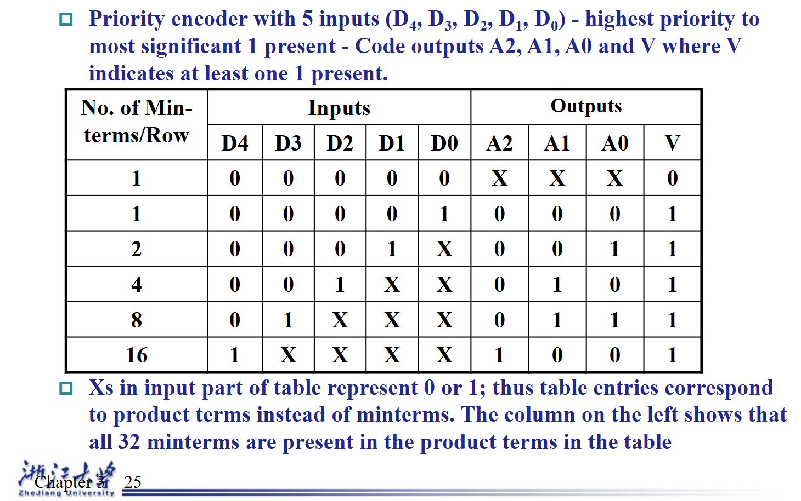
上图展示了一个5输入优先编码器的真值表，$D_4$的优先级最高，输出是$A_2,A_1,A_0$
- X是无关项，可以是0也可以是1，不影响我们的输出
- 从真值表中观察输入和输出的关系我们可以得到
  - $A_2=D_4$
  - $A_1=\overline D_4 D_3+\overline D_4 \ \overline D_3 D_2$
  - $A_0=\overline D_4\ \overline D_3\ \overline D_2 D_1+\overline D_4 D_3$
  - $V=D_4+D_3+D_2+D_1+D_0$

---
## 多路选择器 Multiplexers

**选择**: 在数字系统和计算机中，从多个信息源种挑选出一个送到输出，是非常关键的功能
**选择电路的组成部分**：
- 信息输入端
- 单一输出
- 控制线
**选择的实现方式**
- 多路选择器 Multiplexers
- 三态门或传输们 three-state logic or transmission gates

**多路选择器 Multiplexers**

典型的输入输出：
- 输入：n根选择输入:$S_{n-1},\dots,S_0$
- 输入信息 :$2^n$,$I_{2^n-1},\dots,I_0$, 不一定完全达到 $2^n$的数量

**2-to-1-line 选择器**

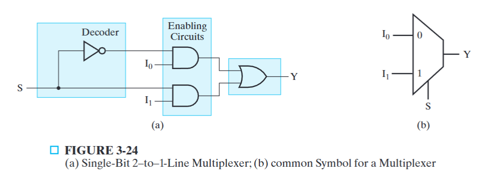

- 一根选择线S
- 两个信息输入 $I_0,I_1$
- $S=0, Y=I_0$
- $S=1, Y=I_1$

根据上述可以得到逻辑方程 $Y=\overline S \cdot I_0+S\cdot I_1$

**4-to-1-Line Multiplexer**

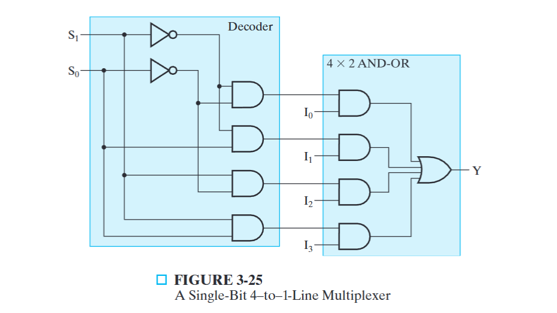

**64-to-1-Line Multiplexer**

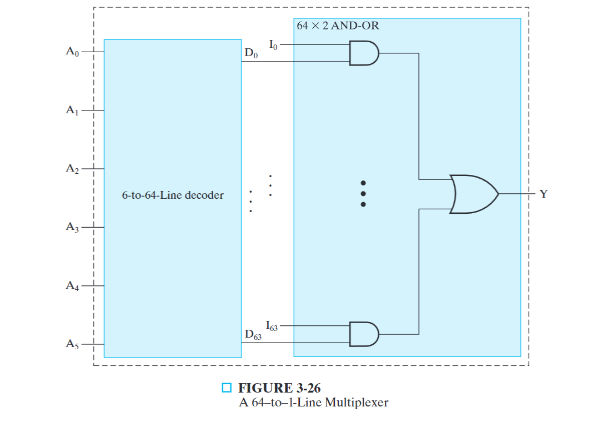 

**多路选择器位的扩展 Multiplexer Width Expansion**

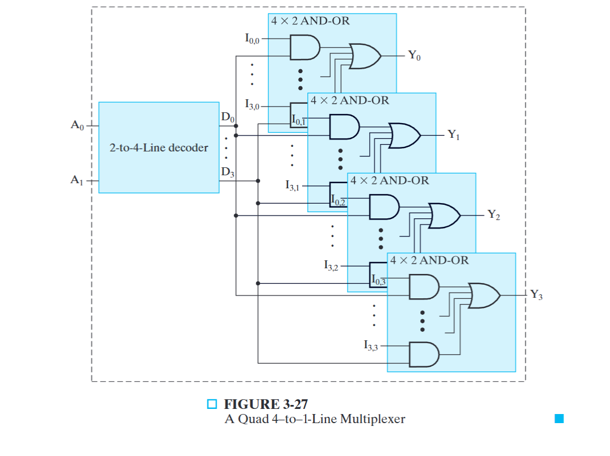

在选择线数量不变的情况下，我们用相同的选择线来控制多个MUX，这样就完成了MUX的位的扩展

**三态门用于实现选择器**

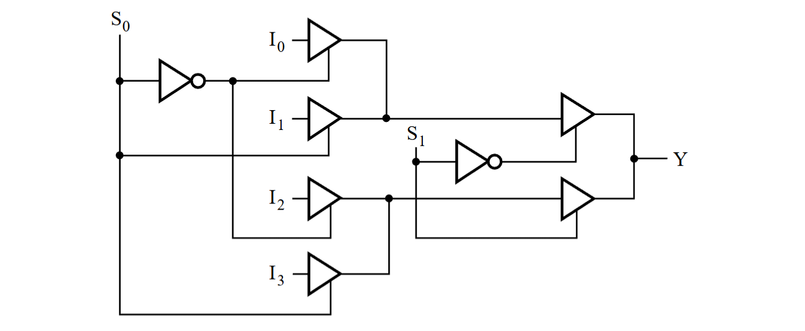

在上图 $I_0$ 和 $I_1$相交的地方实际上是一个或门，通过用上述这种结构的选择器，大大减少了门电路的开销 

**如何用MUX实现多个函数**
- 写出真值表
- 将函数的输入变量按顺序接到MUX的选择输入端 $S_{n-1},\dots,S_0$
- 用 MUX 的输出变量标记输出
- 根据真值表的值，固定MUX的信息输入

