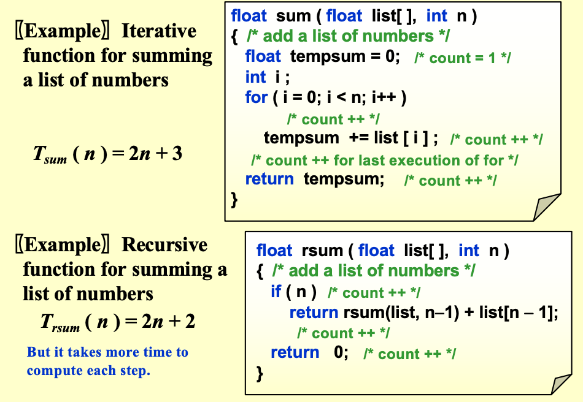

# Chapter 2 算法分析

## 定义

一个算法是一个有限的指令集合，如果被允许执行，可以完成特定的任务。此外，所有算法必须满足以下标准：

- **输入**：有*零个或多个*外部提供的量
- **输出**：至少产生一个量
- **确定性**：每条指令都是*清晰和明确的*
- **有限性**：算法必须在*有限*的步骤后终止
- **有效性**：每条指令必须足够基本，以至于原则上可以由一个使用铅笔和纸的人执行。

**程序和算法**

- 一个程序使用编程语言编写，并且不一定是有限的（比如说操作系统，网站服务等）
- 一个算法可以用人类语言、流程图、某些编程语言或伪代码来描述。

## 时间和空间复杂度


- $T_{avg}(N)$: 平均时间复杂度
- $T_{worst}(N)$: 最坏情况时间复杂度

**Example**



## 渐近表示方法

- $T(N) = O(f(N))$: 存在正的常数 $c$ 和 $N_0$，使得对于所有 $N \geq N_0$，都有 $T(N) \leq c \cdot f(N)$。
- $T(N) = \Omega(f(N))$: 存在正的常数 $c$ 和 $N_0$，使得对于所有 $N \geq N_0$，都有 $T(N) \geq c \cdot f(N)$。
- $T(N) = \Theta(f(N))$: 存在正的常数 $c_1$、$c_2$ 和 $N_0$，使得对于所有 $N \geq N_0$，都有 $c_1 \cdot f(N) \leq T(N) \leq c_2 \cdot f(N)$。
- $T(N) = o(f(N))$: 对于任何正的常数 $c$，存在一个常数 $N_0$，使得对于所有 $N \geq N_0$，都有 $T(N) < c \cdot f(N)$。

**Example:**

- $T(N) = 2N + 3$，我们可以说 $T(N) = O(N)$，因为存在常数 $c$ 和 $N_0$ 使得对于所有 $N \geq N_0$，都有 $2N + 3 \leq c \cdot N$。
- $T(N) = 2^N + N^2$，我们可以说 $T(N) = \Omega(2^N)$，因为存在常数 $c$ 和 $N_0$ 使得对于所有 $N \geq N_0$，都有 $2^N + N^2 \geq c \cdot 2^N$。

**渐近表示法的规则**

- 如果 $T_1(N) = O(f(N))$ 且 $T_2(N) = O(g(N))$，则
    - $T_1(N) + T_2(N) = O(\max(f(N), g(N)))$
    - $T_1(N) \cdot T_2(N) = O(f(N) \cdot g(N))$
- 如果 $T(N)$ 是一个 $k$ 次多项式，则 $T(N) = O(N^k)$
- $log^k N = O(N)$ 对于任何常数 $k$。

**渐近表示法的计算规则**

- **for 循环**：内部语句 × 迭代次数
- **嵌套 for**：语句 × 各层循环大小乘积
- **连续语句**：取最大复杂度
- **if/else**：取条件 + S1 与 S2 中较大者


## 练习下面的时间复杂度计算

**练习1**
```C
int MaxSubsequenceSum(const int A[], int N) {
    int ThisSum, MaxSum, i, j, k;
    MaxSum = 0;                // 1
    for (i = 0; i < N; i++)     // 2 起点i
        for (j = i; j < N; j++) {// 3 终点j
            ThisSum = 0;        // 4
            for (k = i; k <= j; k++)//5 累加i~j
                ThisSum += A[k];//6
            if (ThisSum > MaxSum)//7
                MaxSum = ThisSum;//8
        }
    return MaxSum;             //9
}
```

**练习2**
```C
int MaxSubsequenceSum(const int A[], int N) {
    int ThisSum, MaxSum, i, j;
    MaxSum = 0;                //1
    for (i = 0; i < N; i++) {  //2 起点i
        ThisSum = 0;           //3
        for (j = i; j < N; j++) {//4 终点j
            ThisSum += A[j];   //5 直接累加
            if (ThisSum > MaxSum)//6
                MaxSum = ThisSum;//7
        }
    }
    return MaxSum;             //8
}
```

**练习3**
```C
int MaxSubsequenceSum(const int A[], int N) {
    int ThisSum, MaxSum, j;
    ThisSum = MaxSum = 0;          //1
    for (j = 0; j < N; j++) {      //2
        ThisSum += A[j];           //3
        if (ThisSum > MaxSum)      //4
            MaxSum = ThisSum;      //5
        else if (ThisSum < 0)      //6
            ThisSum = 0;           //7
    }
    return MaxSum;                //8
}
```

**练习4**

```C
int BinarySearch(const ElementType A[], ElementType X, int N) {
    int Low, Mid, High;
    Low = 0; High = N - 1;            //1
    while (Low <= High) {            //2
        Mid = (Low + High) / 2;      //3
        if (A[Mid] < X)              //4
            Low = Mid + 1;           //5
        else if (A[Mid] > X)         //6
            High = Mid - 1;          //7
        else
            return Mid;              //8 找到
    }
    return -1;                       //9 没找到
}
```

答案：
- 练习1：$O(N^3)$
- 练习2：$O(N^2)$
- 练习3：$O(N)$
- 练习4：$O(\log N)$