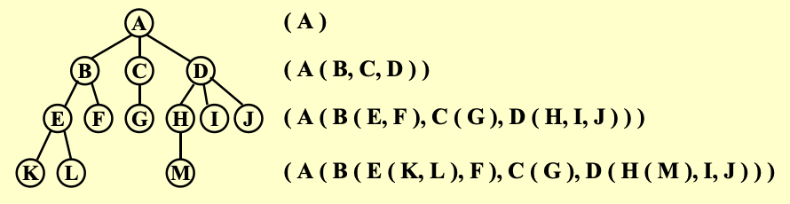
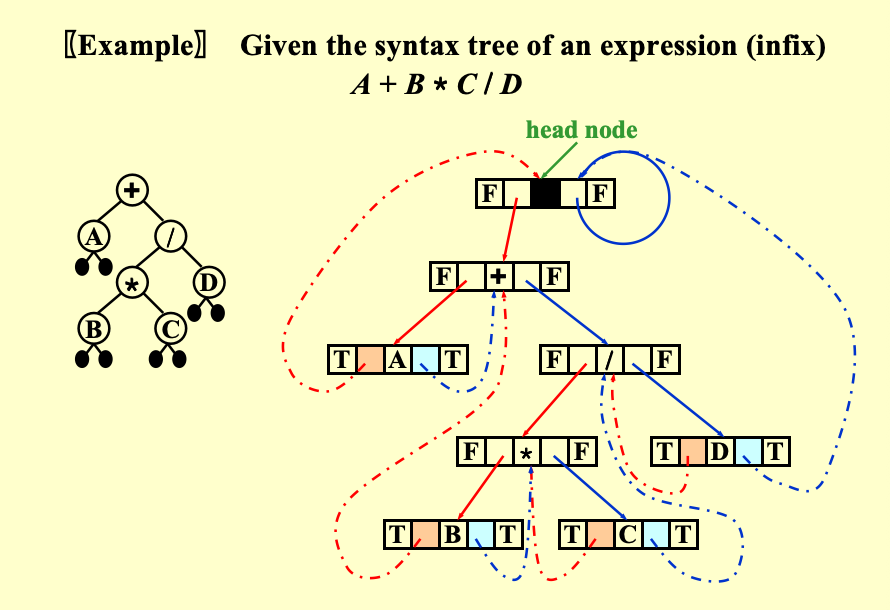
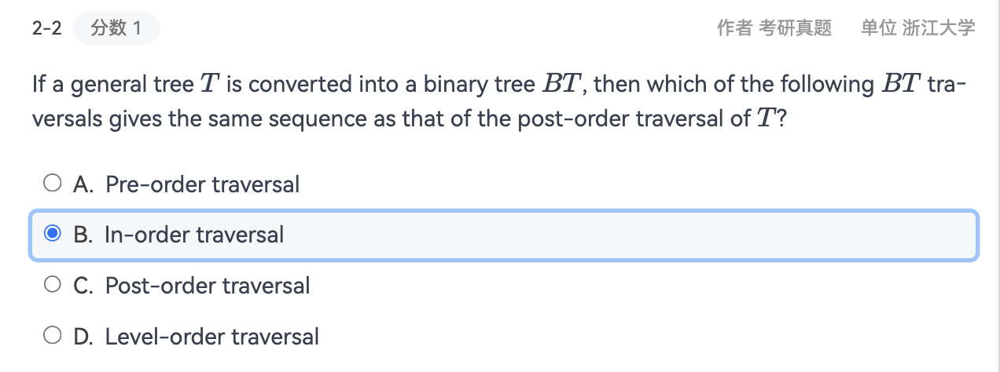
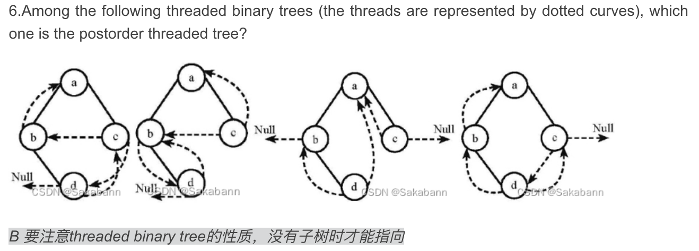
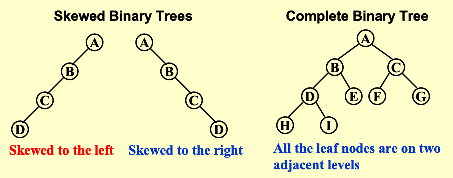
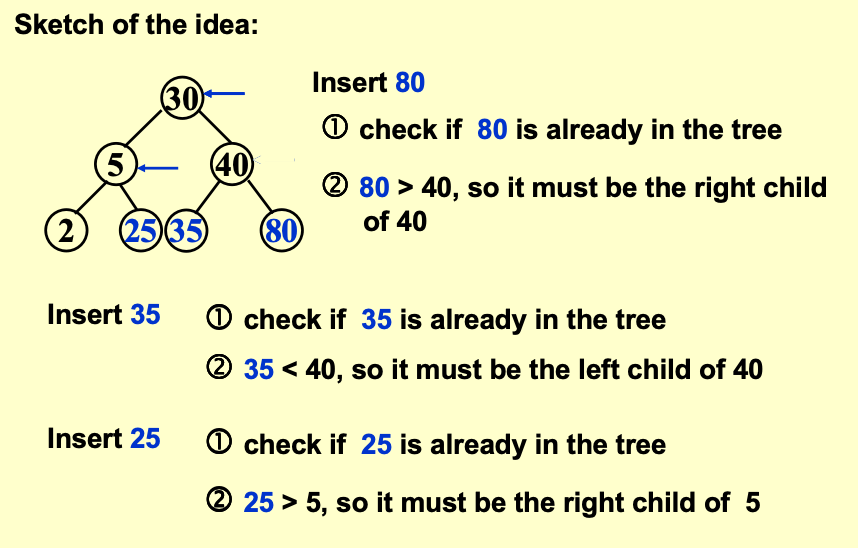
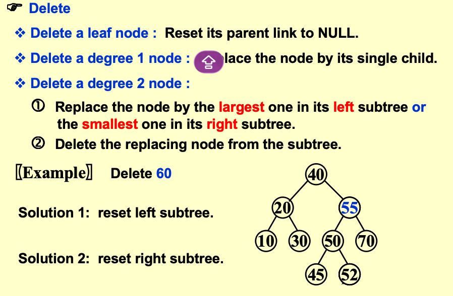

# Chapter4 Tree

## 预备知识

**定义**

树是一种节点的集合。该集合可以为空；否则，树由以下部分组成：
- 一个特殊的节点 r，称为根节点
- 零个或多个非空子树 T1, T2, ..., Tk，每个子树的根节点通过一条有向边与 r 相连

> 非空树包含一个根节点和零个或多个子树
> 有N个节点的树有N-1条边

**术语**
- *节点度 Degree of a node*: 节点拥有的子树数量
- *树的度 Degree of a tree*: 树中所有节点的度的最大值
- *父节点 parent*: 拥有子树的节点
- *子节点 children*: 父节点的子树根节点
- *兄弟节点 siblings*:  同一父节点的子节点
- *叶子节点 leaf*: 度为 0 的节点（无子女）
- *从 n1 到 nk 的路径 path from n1 to nk*: 从n1​到nk​的唯一节点序列，ni​是ni+1​的父节点
- *路径长度 length of a path*: 路径上边的数量
- *节点深度 Depth of a node*: 从根节点到该节点的路径长度
- *节点高度 Height of a node*: 从该节点到叶节点的最长路径长度
- *树的高度 Height of a tree*: 根节点的高度
- *节点的祖先 ancestors of a node*: 从根节点到该节点路径上的所有节点
- *节点的子孙 descendants of a node*: 以该节点为根的子树中的所有节点

## 树的表示方法

**链式表示**

用嵌套列表表示树的层级关系，根节点为外层列表首元素，子树以此作为后续元素嵌套



> 每个节点的存储空间由子节点数量决定，大小不固定，不利于统一管理。

**First Child/Next Sibling 表示法**

为每个节点设计三个域：`Element`, `FirstChild`, `NextSibling`，分别存储节点元素、指向第一个子节点的指针、指向下一个兄弟节点的指针。


## Binary Tree

二叉树是每个节点的子节点数量不超过 2的树（即度≤2），每个节点最多有*左孩子（Left）*和*右孩子（Right）*。

**表达树 Expression Tree**

表达式树是语法树的一种，用于表达算术表达式，叶节点为操作数，非叶节点为操作符，完美契合二叉树的结构。

*表达式树的创建*
1. 优先从后缀表达式（逆波兰表达式）创建，遇到操作数则创建节点并压栈
2. 遇到操作符则弹出栈顶的两个节点（先弹出的为右子树，后弹出的为左子树），创建新节点并将其作为父节点连接两个子树，再将新节点压栈
3. 最后栈顶的节点即为表达式树的根节点

> 对表达式树做不同的遍历，可得到表达式的不同形式
> - 前序遍历 (Preorder)：操作符在前，得到前缀表达式（波兰表达式）
> - 中序遍历 (Inorder)：操作符在中，得到中缀表达式（常规表达式）
> - 后序遍历 (Postorder)：操作符在后，得到后缀表达式（逆波兰表达式）

**Binary Tree Traversal**

对于任意树，我们都可以用前序/后序/层序的方式来遍历
- 前序遍历：访问根节点，递归访问左子树，递归访问右子树
- 后序遍历：递归访问左子树，递归访问右子树
- 层序遍历：按节点的深度从 0 开始，逐层访问（用队列实现，入队根节点，出队时访问并入队子节点）。

对于二叉树，我们还可以使用中序遍历，即先中序遍历左子树 → 访问根节点 → 再中序遍历右子树


**Threaded Binary Tree**

线索二叉树的诞生是为了解决二叉树空指针浪费和遍历效率低的问题而设计的优化结构

> 对于一个二叉树来说，总指针一共有2N个，因为总共有N个节点，每个节点有两个指针域。其中只有N-1个指针域被用来连接节点，剩余的N+1个指针域是空指针。线索二叉树将这些空指针利用起来，改为指向节点在某种遍历方式下的前驱或后继节点，从而实现更高效的遍历。

*线索二叉树的定义*：将二叉树的空指针改为指向节点在某种遍历方式下的前驱或后继节点，并增加一个标志位来区分指针类型（0表示指向子树，1表示指向前驱/后继）。
*以中序为例*
- 若节点的左指针为空，则将其替换为中序前驱的指针
- 若节点的右指针为空，则将其替换为中序后继的指针
- 不允许存在“游离线索”，必须为线索二叉树添加头节点，头节点的左孩子指向二叉树的第一个中序节点

```C
typedef  struct  ThreadedTreeNode  *PtrToThreadedNode;
typedef  PtrToThreadedNode  ThreadedTree;
struct  ThreadedTreeNode {
       int            LeftThread;   // 为TRUE时，Left是线索（非孩子）
       ThreadedTree   Left;         // 左指针/左线索
       ElementType    Element;      // 数据域
       int            RightThread;  // 为TRUE时，Right是线索（非孩子）
       ThreadedTree   Right;        // 右指针/右线索
};
```

- `LeftThread=TRUE`：Left 指向中序前驱；`FALSE`：Left 指向左孩子；
- `RightThread=TRUE`：Right 指向中序后继；`FALSE`：Right 指向右孩子。

*如果是后序遍历*

- 若节点的左指针为空，则将其替换为后序前驱的指针
- 若节点的右指针为空，则将其替换为后序后继的指针
- 不允许存在“游离线索”，必须为线索二叉树添加头节点，头节点的右孩子指向二叉树的第一个后序节点




## 节点计算题

- 总结点数：$N = n_0 + n_1 + n_2$ 
- 叶子节点数为度为2的节点数+1：$n_0 = n_2 + 1$
- 边数=总结点数-1=所有节点的度数之和：$N-1 = 0*n_0 + 1*n_1 + 2*n_2$

> 上面的第一个和第三个式子可以推出第二个





## Search Tree


**堆和完全二叉树**


**二叉树的特点**
- 二叉树的第i层最多有$2^{i-1}$个节点
- 深度为k的二叉树最多有$2^k - 1$个节点
- 其他详见前面的“节点计算题“章节

**The Search Tree ADT**

*定义*: 二叉搜索树是一种二叉树。它可能为空。如果不为空，则满足以下性质：
- 每个节点都有一个键，该键为整数，并且键值各不相同。
- 非空左子树中的所有键值必须小于该子树根节点的键值。
- 非空右子树中的所有键值必须大于该子树根节点的键值。
- 左子树和右子树也都是二叉搜索树。

*Objects*: A finite ordered list with zero or more elements.
*Operations*:
- `SearchTree MakeEmpty(SearchTree T)`: 将树T置空
- `Position Find(ElementType X, SearchTree T)`: 在树T中查找
- `Position FindMin(SearchTree T)`: 查找树T中键值最小的节点
- `Position FindMax(SearchTree T)`: 查找树T中键值最大的节点
- `SearchTree Insert(ElementType X, SearchTree T)`: 将元素X插入
- `SearchTree Delete(ElementType X, SearchTree T)`: 删除元素X
- `ElementType Retrieve(Position P)`: 返回位置P处节点的键值

**Implementation of Search Tree**

```C
Position  Find( ElementType X,  SearchTree T ) 
{ 
       if ( T == NULL ) 
              return  NULL;  /* not found in an empty tree */
       if ( X < T->Element )  /* if smaller than root */
              return  Find( X, T->Left );  /* search left subtree */
       else 
              if ( X > T->Element )  /* if larger than root */
                     return  Find( X, T->Right );  /* search right subtree */
              else   /* if X == root */
                     return  T;  /* found */
} 
```

循环方式
```C
Position  Iter_Find( ElementType X,  SearchTree T ) 
{ 
       /* iterative version of Find */
       while  ( T )   {
              if  ( X == T->Element )  
                     return T ;  /* found */
              if  ( X < T->Element )
                     T = T->Left ; /*move down along left path */
              else
                     T = T-> Right ; /* move down along right path */
       }  /* end while-loop */
       return  NULL ;   /* not found */
} 
```

下面是关于FindMin和FindMax的递归实现，迭代实现与之类似
```C
Position  FindMin( SearchTree T ) 
{ 
      if ( T == NULL )   
          return  NULL; /* not found in an empty tree */
      else 
          if ( T->Left == NULL )   return  T;  /* found left most */
          else   return  FindMin( T->Left );   /* keep moving to left */
} 
```

```C
Position  FindMax( SearchTree T ) 
{ 
      if ( T != NULL ) 
              while ( T->Right != NULL )   
	              T = T->Right;   /* keep moving to find right most */
      return T;  /* return NULL or the right most */
} 
```

插入的方法



```C
SearchTree  Insert( ElementType X, SearchTree T ) 
{ 
      if ( T == NULL ) { /* Create and return a one-node tree */ 
	T = malloc( sizeof( struct TreeNode ) ); 
	if ( T == NULL ) 
	   FatalError( "Out of space!!!" ); 
	else { 
	   T->Element = X; 
	   T->Left = T->Right = NULL; } 
      }  /* End creating a one-node tree */
     else  /* If there is a tree */
 	if ( X < T->Element ) 
	   T->Left = Insert( X, T->Left ); 
	else 
	   if ( X > T->Element ) 
	      T->Right = Insert( X, T->Right ); 
	   /* Else X is in the tree already; we'll do nothing */ 
    return  T;   /* Do not forget this line!! */ 
}
```
删除的方法



```C
SearchTree  Delete( ElementType X, SearchTree T ) 
{    Position  TmpCell; 
      if ( T == NULL )   Error( "Element not found" ); 
      else  if ( X < T->Element )  /* Go left */ 
	    T->Left = Delete( X, T->Left ); 
               else  if ( X > T->Element )  /* Go right */ 
	           T->Right = Delete( X, T->Right ); 
	         else  /* Found element to be deleted */ 
	           if ( T->Left && T->Right ) {  /* Two children */ 
	               /* Replace with smallest in right subtree */ 
	               TmpCell = FindMin( T->Right ); 
	               T->Element = TmpCell->Element; 
	               T->Right = Delete( T->Element, T->Right );  } /* End if */
	           else {  /* One or zero child */ 
	               TmpCell = T; 
	               if ( T->Left == NULL ) /* Also handles 0 child */ 
		         T = T->Right; 
	               else  if ( T->Right == NULL )  T = T->Left; 
	               free( TmpCell );  }  /* End else 1 or 0 child */
      return  T; 
}
```

