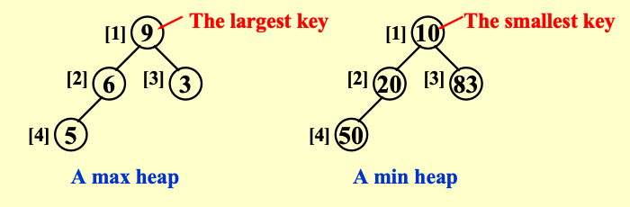
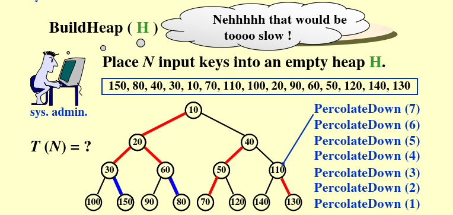

# Chapter 5 Priority Queues (Heaps)

## ADT 模型

**对象**: 一个有限的有序列表，包含零个或多个元素
**Operations**:
- `PriorityQueue Initialize(int Max Elements)`: 创建一个空的优先队列，最大元素个数为 Max Elements。
- `ElementType DeleteMin(PriorityQueue H)`: 从优先队列 H 中删除并返回最小元素。
- `void insert(ElementType X, PriorityQueue H)`: 将元素 X 插入优先队列 H 中。
- `int FindMin(PriorityQueue H)`: 返回优先队列 H 中最小元素的值。

优先队列是一种特殊的队列，元素按照优先级大小出队，而不是按照插入顺序。

---
## 简单实现方式

**普通数组**
- `Insertion`：将元素插入数组末尾，时间复杂度为 O(1)。
- `DeleteMin`：扫描整个数组找到最小元素并删除，时间复杂度为 O(n)。

**普通链表**
- `Insertion`：将元素插入链表末尾，时间复杂度为 O(1)。
- `DeleteMin`：扫描整个链表找到最小元素并删除，时间复杂度为 O(n)。

**有序数组**
- `Insertion`：将元素插入数组中合适的位置，时间复杂度为 O(n)。
- `DeleteMin`：直接删除数组第一个元素，时间复杂度为 O(1)。

**有序链表**
- `Insertion`：将元素插入链表中合适的位置，时间复杂度为 O(n)。
- `DeleteMin`：直接删除链表第一个元素，时间复杂度为 O(1)。

## 二叉堆 Binary Heap

**完全二叉树**：节点编号与完美二叉树的前n个节点一一对应

- 一个高度为h的完全二叉树有 $2^h$ 到 $2^{h+1}-1$ 个节点。($h=\lfloor \log_2 n \rfloor$)

**Lemma**: 在一个拥有n个节点的完全二叉树中，节点编号为 $1, 2, \ldots, n$，则对于每个节点 $i$：
- 父节点编号为 $\lfloor i/2 \rfloor$。
- 左子节点编号为 $2i$。
- 右子节点编号为 $2i + 1$。

```C
PriorityQueue  Initialize( int  MaxElements ) 
{ 
     PriorityQueue  H; 
     if ( MaxElements < MinPQSize ) 
	return  Error( "Priority queue size is too small" ); 
     H = malloc( sizeof ( struct HeapStruct ) ); 
     if ( H ==NULL ) 
	return  FatalError( "Out of space!!!" ); 
     /* Allocate the array plus one extra for sentinel */ 
     H->Elements = malloc(( MaxElements + 1 ) * sizeof( ElementType )); 
     if ( H->Elements == NULL ) 
	return  FatalError( "Out of space!!!" ); 
     H->Capacity = MaxElements; 
     H->Size = 0; 
     H->Elements[ 0 ] = MinData;  /* set the sentinel */
     return  H; 
}
```

**堆序性质**: 最小堆的每个节点的键值都不大于其子节点（如果有）的键值。最小堆是一种完全二叉树，同时也是一棵最小树。



如上图所示，对于最大堆来说，每个节点的节点值都大于或等于其子节点，所以根节点为最大值。最小堆反过来。

**堆的基础操作**:

`Insert`：将元素插入堆中，时间复杂度为 O(log n)。

- 将新元素放在数组的末尾（完全二叉树的下一个位置）
- 如果比父节点小，就交换（最小堆）
- 重复直到满足堆序

```C
/* H->Element[ 0 ] is a sentinel */ 
void  Insert( ElementType  X,  PriorityQueue  H ) 
{ 
     int  i; 

     if ( IsFull( H ) ) { 
	Error( "Priority queue is full" ); 
	return; 
     } 

     for ( i = ++H->Size; H->Elements[ i / 2 ] > X; i /= 2 ) 
	H->Elements[ i ] = H->Elements[ i / 2 ]; 

     H->Elements[ i ] = X; 
}
```

`DeleteMin`：删除堆中的最小元素，时间复杂度为 O(log n)。
- 根节点是最小值，保存之后删除
- 用最后一个元素替换根节点
- 向下下滤，直到满足堆序

```C
ElementType  DeleteMin( PriorityQueue  H ) 
{ 
    int  i, Child; 
    ElementType  MinElement, LastElement; 
    if ( IsEmpty( H ) ) { 
         Error( "Priority queue is empty" ); 
         return  H->Elements[ 0 ];   } 
    MinElement = H->Elements[ 1 ];  /* save the min element */
    LastElement = H->Elements[ H->Size-- ];  /* take last and reset size */
    for ( i = 1; i * 2 <= H->Size; i = Child ) {  /* Find smaller child */ 
         Child = i * 2; 
         if (Child != H->Size && H->Elements[Child+1] < H->Elements[Child]) 
	       Child++;     
         if ( LastElement > H->Elements[ Child ] )   /* Percolate one level */ 
	       H->Elements[ i ] = H->Elements[ Child ]; 
         else     break;   /* find the proper position */
    } 
    H->Elements[ i ] = LastElement; 
    return  MinElement; 
}
```

**其他堆操作**:

```C
// 最小堆结构
#define MinData -99999999  // 哨兵（最小值）
typedef int ElementType;

struct HeapStruct {
    int Capacity;   // 最大容量
    int Size;       // 当前元素个数
    ElementType *Elements; // 数组（从1开始存）
};

typedef struct HeapStruct *PriorityQueue;
```

- `DecreaseKey`：将堆中某个元素的键值减小，然后根据堆的规则进行重新排序，时间复杂度为 O(log n)。

```C
// 将位置p的元素减小到 value（value必须比原值小）
void DecreaseKey(int p, ElementType value, PriorityQueue H) {
    if (p < 1 || p > H->Size) return;
    if (value > H->Elements[p]) return; // 只能减小，不能变大

    H->Elements[p] = value;

    // 上滤 Percolate Up
    int i;
    for (i = p; H->Elements[i / 2] > H->Elements[i]; i /= 2) {
        // 父节点更大 → 交换
        ElementType temp = H->Elements[i / 2];
        H->Elements[i / 2] = H->Elements[i];
        H->Elements[i] = temp;
    }
}
```

- `IncreaseKey`：将堆中某个元素的键值增大，然后根据堆的规则进行重新排序，时间复杂度为 O(log n)。

```C
// 将位置p的元素增大到 value（value必须比原值大）
void IncreaseKey(int p, ElementType value, PriorityQueue H) {
    if (p < 1 || p > H->Size) return;
    if (value < H->Elements[p]) return; // 只能增大

    H->Elements[p] = value;

    // 下滤 Percolate Down
    int i, child;
    ElementType last = H->Elements[p];
    for (i = p; i * 2 <= H->Size; i = child) {
        child = i * 2;
        // 找较小的孩子
        if (child != H->Size && H->Elements[child + 1] < H->Elements[child]) {
            child++;
        }
        if (last > H->Elements[child]) {
            H->Elements[i] = H->Elements[child];
        } else {
            break;
        }
    }
    H->Elements[i] = last;
}
```

`Delete`：
   - 删除堆中某个元素，
   - 先DecreaseKey到最小，
   - 然后上浮到根，
   - 最后DeleteMin，
   - 时间复杂度为 O(log n)。

```C
// 删除位置 p 的元素
void Delete(int p, PriorityQueue H) {
    // 第一步：把p位置改成最小值 → 自动上浮到根
    DecreaseKey(p, MinData, H);

    // 第二步：删除根（最小值）
    DeleteMin(H);
}
```

`BuildHeap`：
       - 把 N 个元素直接放进数组（不用排序）
       - 找到最后一个非叶子节点：下标 = N/2
       - 从 N/2 一直到 1，每个节点执行一次 Percolate Down（下滤）
       - 时间复杂度为 O(n)。



```C
// 下滤函数（给BuildHeap用）
void PercolateDown(int p, PriorityQueue H) {
    int i, child;
    ElementType last = H->Elements[p];
    for (i = p; i * 2 <= H->Size; i = child) {
        child = i * 2;
        if (child != H->Size && H->Elements[child + 1] < H->Elements[child]) {
            child++;
        }
        if (last > H->Elements[child]) {
            H->Elements[i] = H->Elements[child];
        } else {
            break;
        }
    }
    H->Elements[i] = last;
}

// 批量建堆 O(N)
void BuildHeap(PriorityQueue H, ElementType arr[], int n) {
    H->Size = n;
    // 把n个元素直接放进数组
    for (int i = 1; i <= n; i++) {
        H->Elements[i] = arr[i - 1];
    }
    // 从 n/2 一直到 1，逐个下滤
    for (int i = n / 2; i >= 1; i--) {
        PercolateDown(i, H);
    }
}
```

**应用：找第K大元素**

给定N个元素和整数K，找到第K大元素
- 排序:O(NlogN)
将数组按照降序排序，然后直接取第K个元素
- 用最小堆维护K个最大元素:O(NlogK)
- 用快速选择算法:O(N)平均
