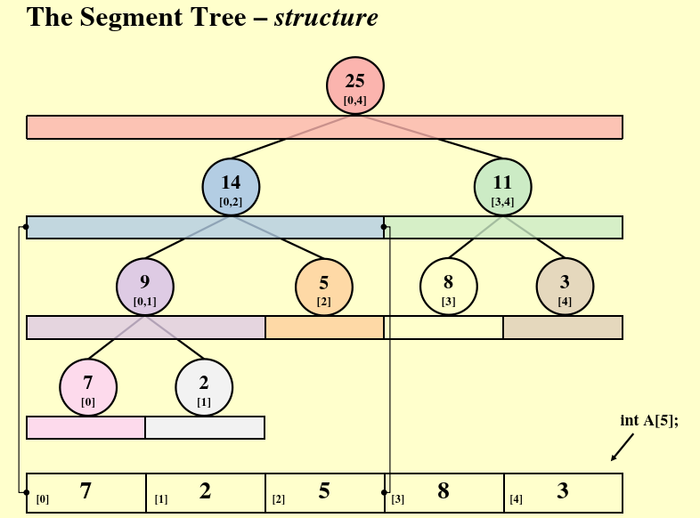
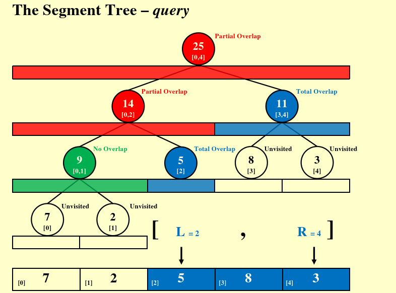
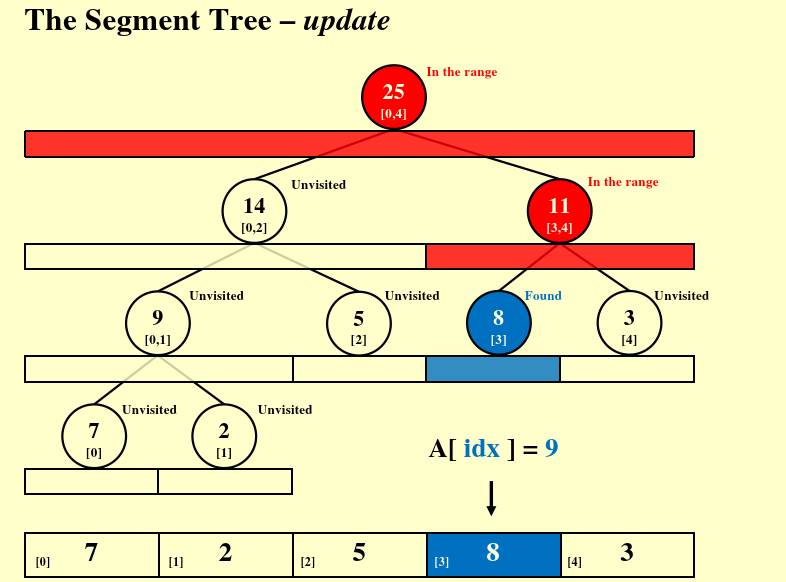

# Chapter 6 The Segment Tree

## 问题背景
- 我们现在有一个长度为N的数组
- 我们需要频繁地计算任意区间 [L,R] 内所有元素的和

最简单的方法就是写一个循环累加：
```C
ElementType Query(ElementType A[],int L, int R){
    ElementType sum=0;
    for (int i=L;i<=R; ++i)
        sum+=A[i];
    return sum;
}
```
对于上述算法存在以下问题：
- 每次查询的时间复杂度为O(N),当N很大且查询非常频繁时，效率极低。

**因此我们需要引入线段树，其结构大致如下**



上述图片中最上方是一个含有五个元素的数组数组 `A[5]`
- 线段树的每个节点代表一个区间 `[start, end]`， 并存储该区间的聚合信息
- 比如说根节点的做孩子 `[0,2]`, 存储的就是 `7+2+5=14`

从上述例子中不难看出，线段树是一颗完全二叉树，同时每个非叶子结点的值由其两个字节点的值合并得到

## 如何构建线段树

存储方式
- 使用数字 `tree[10]` 存储线段树节点，下标从1开始
- 节点 `i` 的左孩子索引： `2*i`, 右孩子索引： `2*i+1`
- 树的节点总数小于4N，实际上是 $2 * 2^{\lceil \log_2 N \rceil} - 1$

```C
void Build(int node, int start, int end){
    if (start ==end){
        tree[node]=A[start]; //叶子结点，直接存储数组元素
        return;
    }
    int mid = (start+end)/2;
    Build(2*node,start, mid); //递归左子树
    Build(2*node+1,mide+1,end); //递归右子树
    tree[node]=tree[2*node]+tree[2*node+1];
}
```
- 每个节点被访问一次，节点数为O(N),所以建树O(N)
- 建树只需要一次，但是后续的查询和更新才是频繁地操作

## 线段树的区间查询



在上面这个例子中，我们需要查询的范围是 `[L=2,R=4]`

节点与查询区间的关系分为三种：
- 完全重叠：节点区间被查询区间包含，直接返回该节点的值
- 无重叠：节点区间完全在查询区间之外
- 部分重叠：节点区间与查询区间相交，递归进入左右孩子

```C
int Query(int node, int start, int end, int L, int R){
    if(R < start || end < L){
        return 0;
    }
    if(L <= start && end <= R){
        return tree[node];
    }
    int mid=(start + end)/2;
    int left_sum = Query(2*node, start, mid, L, R);
    int right_sum= Query(2*node+1, start, mid, L, R);
    return left_sum+right_sum;
}
```

## 线段树的更新



将 `A[idx]` 修改为新的值

- 从根节点出发，判断 `idx` 位于左子树还是右子树
- 沿着路径一直走到叶子结点
- 更新叶子结点的值
- 回溯时，重新计算路径上所有祖先节点的值

```C
void update(int node, int start, int end, int idx, int val){
    if(start==end){
        tree[node]=val;
        return;
    }
    int mid=(start+end)/2;
    if(start <= idx && idx <= mid){
        Update(2*node, start, mid, idx, val);
    }
    else{
        Update(2*node+1, mid+1, end, idx, val);
    }
    tree[node]=tree[2*node] + tree[2*node+1];
}
```

## 总结

线段树的所用不仅限于求和，线段树可以用来存储任何满足结合律的聚合操作，例如：
- 最小值
- 最大值
- 最大公约数
- 平均值
- 只需要修改根节点关于左右子树的结合方式节课