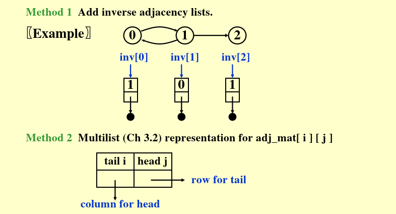
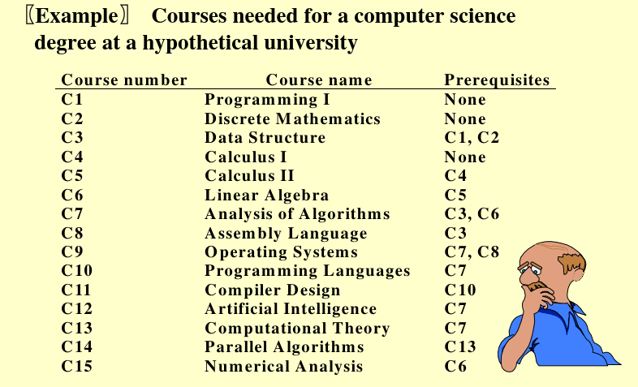

# Chapter 7 Graph Algorithms

## 定义

**图 `G(V,E)` 由两部分组成：**
- `V`: 非空有限定点集合
- `E`: 有限边集合

**无向图**：边 $(v_i,v_j)$ 和 $(v_j,v_i)$ 表示同一条边，即边没有方向
**有向图**：与无向图相反的定义，边具有方向

**限制条件：**
- 不允许自环：即一条边的两个端点不能是同一个顶点
- 不考虑多重边：即两个顶点之间最多只有一条边

**完全图**：在允许的边数限制下，边数达到最大的图
- 对于无向图来说，边数为 `n(n-1)/2`
- 对于有向图来说，边数为 `n(n-1)`

**子图**：$G' \subset G$ 表示 $V(G') \subseteq V(G)$ 且 $E(G') \subseteq E(G)$

**路径**
- 从 $v_p$ 到 $v_q$ 的一个顶点序列，相邻定点之间有边连接
- 路径长度：路径上边的条数
- 简单路径：除了收尾可能相同以外，其他定点互不相同

**环**：起点等于终点的简单路径

**连通性（无向图）**： 
- 两个顶点是联通的，如果他们之间存在路径。
- 一个无向图是联通的，如果任意两个不同的顶点都联通

**连通分量 (Connected Component)**: 无向图的最大连通子图（即不能再添加任何顶点或边且保持连通）

**树**：一种连通且无环的无向图（树的边数=顶点数-1）

**有向图的强连通**：有向图G是强连通的，如果对任意一对定点，相互之间均存在有向路径。而弱连通指的就是，将边视为无向图之后是连通的

**强连通分量**：极大强连通子图

**度**：
- 无向图中：一个顶点的度是与其关联的边数
- 有向图中：
  - 入度：指向该顶点的边数
  - 出度：从该顶点出发的边数
  - 度=入度+出度

**DAG**：有向无环图(Directed Acyclic Graph)

## 图的表示方法

**邻接矩阵（Adjacency Matrix）**
对于一个 `n*n` 的矩阵，其中：
- 对于无向图，`adj_mat[i][j]=1` 如果 `(i,j)` 是边，否则为0
- 对于有向图，`adj_mat[i][j]=1` 如果存在从顶点 `i` 到顶点 `j` 的边，否则为0

特点：
- 无向图的邻接矩阵是对称的，可以只存储一半
- 存储空间复杂度为 $O(n^2)$
- 查询边是否存在的时间复杂度为 $O(1)$
- 遍历所有边的时间复杂度为 $O(n^2)$

节省空间的方法：
- 将对称矩阵压缩为一维数组 `adj_mat[n*(n-1)/2]` 中
- 元素 `adj_mat[i*(i-1)/2 + j]` 存储边 `(i,j)` 的信息，其中 `i>j`

**邻接表（Adjacency List）**

每个顶点维护一个链表，链表中包含所有与该点相邻的顶点。对于有向图，链表中包含所有从该顶点出发的边所连接的顶点。对于无向图，每条边会被存储两次

空间复杂度：
- 有n个头指针，2e个边界点
- 总空间： $O(n+2e)=O(n+e)$

这样的存储方式要查找某个顶点的所有邻接点非常高效，但是要查询两点之间是否存在边则需要遍历链表。

**有向图的邻接表**

- 每个顶点的链表存储其所有出边的邻接点
- 需要额外的空间来存储入边的信息，需要额外的数据结构

方法1：逆邻接表
- 单独维护一个逆邻接表，存储每个顶点的入边信息

方法2：多重表
- 将邻接矩阵中对称的两个元素合并表示，用于同时处理行和列方向



**邻接多重表 （Adjacency Multilist）**：
- 在普通的邻接表中，无向图的每条边对应两个节点，则会存在冗余信息
- 邻接多重表将同一条边的两个节点合并为一个节点，该节点包含两个顶点编号以及两个指针，分别指向两个顶点的邻接链表

优点：
- 可以方便标记边是否被访问过
- 空间大致相同，但多了一个 `mark` 字段来标记边是否被访问

**带权边 (Weighted Edge)**：
- 邻接矩阵和邻接表都可以扩展来存储边的权重信息
- 邻接矩阵：将元素值从0/1扩展为权重
- 邻接表：在链表节点中添加一个字段来存储权重

## 拓扑排序 Topological Sort

**为什么需要拓扑排序？**

如下图所示，一个计算机科学学位所需要的课程列表如下，有些课程有先修课程的要求：



则我们用下面这个规则来表示他们之间的关系：
- 如果课程A是课程B的先修课程，则在图中添加一条从A指向B的有向边

我们的最终目标是要找到一个线性的顺序，使得每门课程都在它的先修课程之后被安排。这个问题就是一个典型的拓扑排序问题。

**偏序与AOV网**

定义：
- 前驱(Predecessor)：如果从 `v_i` 到 `v_j` 存在路径，则 `v_i` 是 `v_j` 的前驱
- 后继(Successor)：如果从 `v_i` 到 `v_j` 存在路径，则 `v_j` 是 `v_i` 的后继
- 直接前驱/后继：如果存在边 `(v_i,v_j)`，则 `v_i` 是 `v_j` 的直接前驱，`v_j` 是 `v_i` 的直接后继
- *偏序关系*
  - 传递性：`i->k` 且 `k->j` 则 `i->j`
  - 反自反性：`i->i` 不成立
- **AOV网**：Activity on Vertex Network，即顶点表示活动的有向图。可行的AOV网络必须是一个DAG（有向无环图）

**拓扑排序的定义**

一个图G的拓扑排序是将所有顶点排成一个线性序列，使得对于任意两个顶点，如果 `i` 是 `j` 的前驱，则 `i` 在 `j` 之前。


## 简单的拓扑排序算法

算法思路
- 重复以下步骤直到没有顶点剩余
  - 找到一个入度为0的顶点
  - 输出该顶点
  - 将其从图中删除（即删除与该顶点相关的所有边）
- 如果在某一步找不到入度为0的顶点，则说明图中存在环，无法进行拓扑排序

```C
void Topsort(Graph G) {
    int Counter;
    Vertex V, W;
    for (Counter = 0; Counter < NumVertex; Counter++) {
        V = FindNewVertexOfDegreeZero();   // O(|V|) 每次查找
        if (V == NotAVertex) {
            Error("Graph has a cycle");
            break;
        }
        TopNum[V] = Counter;   // 或输出V
        for (each W adjacent to V)
            Indegree[W]--;
    }
}
```

复杂度: 每次循环都要扫描所有顶点来找到入度为0的顶点，时间复杂度为 `O(|V|^2)`，对于稀疏图来说效率较低。

**改进的拓扑排序**

优化思路：
- 在每次删除顶点之后，只有该顶点的邻接点的入度会改变，因此我们可以使用一个队列来存储所有入度为0的顶点，避免每次都扫描所有顶点。

算法步骤：
- 计算每个顶点的入度
- 将所有入度为0的顶点加入队列
- 重复以下步骤直到队列为空
  - 从队列中取出一个顶点 `V`
  - 输出该顶点
  - 对于每个与 `V` 相邻的顶点 `W`，将 `W` 的入度减1
  - 如果 `W` 的入度变为0，则将 `W` 加入队列
- 如果在某一步队列为空但仍有顶点未输出，则说明图中存在环，无法进行拓扑排序

```C
void Topsort(Graph G) {
    Queue Q;
    int Counter = 0;
    Vertex V, W;
    Q = CreateQueue(NumVertex); MakeEmpty(Q);
    for (each vertex V)
        if (Indegree[V] == 0) Enqueue(V, Q);
    while (!IsEmpty(Q)) {
        V = Dequeue(Q);
        TopNum[V] = ++Counter;
        for (each W adjacent to V)
            if (--Indegree[W] == 0) Enqueue(W, Q);
    }
    if (Counter != NumVertex)
        Error("Graph has a cycle");
    DisposeQueue(Q);
}
```

复杂度: 每个顶点和每条边都被处理一次，时间复杂度为 `O(|V| + |E|)`，对于稀疏图来说效率较高。


## 最短路径算法

**问题定义**
- 输入：一个带权图 `G(V,E)` 和一个源点 `s`
- 输出：从源点 `s` 到图中每个顶点的最短路径长度

**负权环 (Negative Weight Cycle)**：
- 如果如中存在一个环，其总权重为负数，则称该环为负权环
- 如果存在负权环，则最短路径长度可以无限小，因此无法定义最短路径
  
**无权最短路径 (Unweighted Shortest Path)**：

无权图的特点：每条边的权重相同（通常为1），因此最短路径就是边数最少的路径
核心思想：广度优先搜索（BFS）
- 从源点 `s` 开始，先找到距离为0的顶点，即为 `s` 本身
- 然后找到距离为1的顶点，即与 `s` 直接相连的顶点
- 接着找到距离为2的顶点，即与距离为1的顶点相连的顶点
- 以此类推，直到找到所有顶点的最短路径长度

数据结构：使用一个表 (Table) 来记录每个顶点的状态
- `Dist`: 记录从源点 `s` 到每个顶点的最短路径长度，初始值为无穷大（或一个足够大的数）
- `Known`: 记录每个顶点是否已经确定了最短路径长度，初始值为 `false`
- `Path`: 记录每个顶点的前驱顶点，初始值为 `null`

```C
void Unweighted(Table T) {
    int CurrDist;
    Vertex V, W;
    for (CurrDist = 0; CurrDist < NumVertex; CurrDist++) {
        for (each vertex V) {
            if (!T[V].Known && T[V].Dist == CurrDist) {
                T[V].Known = true;
                for (each W adjacent to V) {
                    if (T[W].Dist == Infinity) {
                        T[W].Dist = CurrDist + 1;
                        T[W].Path = V;
                    }
                }
            }
        }
    }
}
```

上述伪代码逻辑说明：
- 外层循环 `CurrDist` 从0开始，逐渐增加，表示当前正在处理的距离层次
- 内层循环遍历所有顶点 `V`，如果 `V` 还未确定最短路径且其距离等于当前层次 `CurrDist`，则将其标记为已知
- 对于每个与 `V` 相邻的顶点 `W`，如果 `W` 的距离仍为无穷大，说明这是第一次访问到 `W`，则将 `W` 的距离更新为 `CurrDist + 1`，并将 `V` 记录为 `W` 的前驱
- 这样，算法通过层次遍历的方式逐步确定每个顶点的最短路径长度，最终完成所有顶点的最短路径计算。

时间复杂度：
- 外层循环最多执行 `O(|V|)` 次，因为每个顶点的距离最多为 `|V|-1`
- 内层循环每次执行 `O(|V|)` 次，遍历所有顶点
- 总体时间复杂度为 `O(|V|^2)`，对于稀疏图来说效率较低

**无权图最短路径-队列优化**

改进思路：
- 使用一个队列来保存当前距离已确定但尚未处理其邻接点的顶点
- 初始时将s入队
- 每次从队列中取出一个顶点V，处理其邻接点W，如果W的距离为无穷大，则更新W的距离并将W入队
- 这样可以避免每次都扫描所有顶点，时间复杂度降低到 `O(|V| + |E|)`

```C
void Unweighted(Table T) {
    Queue Q;
    Vertex V, W;
    Q = CreateQueue(NumVertex); MakeEmpty(Q);
    Enqueue(S, Q);
    while (!IsEmpty(Q)) {
        V = Dequeue(Q);
        T[V].Known = true;   // 实际上不需要，因为每个顶点只入队一次
        for (each W adjacent to V) {
            if (T[W].Dist == Infinity) {
                T[W].Dist = T[V].Dist + 1;
                T[W].Path = V;
                Enqueue(W, Q);
            }
        }
    }
    DisposeQueue(Q);
}
```

**Dijkstra算法**

适用条件：
- 所有边的权重非负
- 解决单源最短路径问题

算法思路：
- 维护一个集合 `S`，包含已经确定最短路径的顶点
- 初始时，`S` 只包含源点 `s`
- 对于不在 `S` 中的顶点 `u`, 定义 `Distance[u]` 为从 `s` 出发，当前只经过 `S` 中的顶点到达 `u` 的最短路径长度
- 每次从不在 `S` 中的顶点中选择一个具有最小 `Distance` 值的顶点 `u`，将其加入 `S`
- 当 `u` 加入 `S` 后，更新所有与 `u` 相邻的顶点 `v` 的 `Distance[v]` 值，如果 `Distance[u] + Weight(u, v) < Distance[v]`，则更新 `Distance[v]`

```C
void Dijkstra(Table T) {
    Vertex V, W;
    for (;;) {
        V = smallest unknown distance vertex;
        if (V == NotAVertex) break;
        T[V].Known = true;
        for (each W adjacent to V) {
            if (!T[W].Known) {
                if (T[V].Dist + Cvw < T[W].Dist) {
                    Decrease(T[W].Dist to T[V].Dist + Cvw);
                    T[W].Path = V;
                }
            }
        }
    }
}
```

**Dijkstra算法的两种实现**

1. 线性扫描
   - 每次在未知的顶点中寻找最小 `Dist` 时，直接扫描整个表
   - 查找复杂度为 `O(|V|)`, 总体时间复杂度为 `O(|V|^2)`
2. 最小堆
   - 使用最小堆来维护所有未知顶点的距离
   - 查找最小距离顶点：`DeleteMin` 操作，时间复杂度为 `O(log|V|)`
   - 更新距离：`DecreaseKey` 操作，时间复杂度为 `O(log|V|)`
   - 总体时间复杂度为 `O((|V| + |E|) log|V|)`, 对于稀疏图来说效率较高

**处理负权边的算法**

不能通过简单的加常数来消除负权边，因为这会改变路径的相对长度关系，可能导致错误的最短路径结果。

**Bellman-Ford算法**
  
算法思路：
- 使用队列来存放距离发生变化的顶点
- 初始时将源点 `s` 入队
- 每次出队一个顶点 `V`，对于每个与 `V` 相邻的顶点 `W`，如果 `T[V].Dist + Cvw < T[W].Dist`，则更新 `T[W].Dist` 并将 `W` 入队
- 重复上述过程，直到队列为空
- 如果在某次迭代中，某个顶点的距离被更新超过 `|V|` 次，则说明存在负权环

```C
void  WeightedNegative( Table T )
{   /* T is initialized by Figure 9.30 on p.303 */
    Queue  Q;
    Vertex  V, W;
    Q = CreateQueue (NumVertex );  MakeEmpty( Q );
    Enqueue( S, Q ); /* Enqueue the source vertex */
    while ( !IsEmpty( Q ) ) {
        V = Dequeue( Q );
        for ( each W adjacent to V )
	if ( T[ V ].Dist + Cvw < T[ W ].Dist ) {
	    T[ W ].Dist = T[ V ].Dist + Cvw;
	    T[ W ].Path = V;
	    if ( W is not already in Q )
	        Enqueue( W, Q );
	} /* end-if update */
    } /* end-while */
    DisposeQueue( Q ); /* free memory */
}
```

**有向无环图的最短路径**

由于图中没有环，因此可以通过拓扑排序来计算最短路径：
- 对图进行拓扑排序，得到一个顶点的线性序列
- 初始化源点 `s` 的距离为0，其他顶点的距离为无穷大
- 按拓扑排序顺序依次取出顶点 `v`
- 对于 `v` 的每个出边 `(v,w)`，如果 `dist[v] + Weight(v,w) < dist[w]`，则更新 `dist[w]`

时间复杂度：
- 拓扑排序的时间复杂度为 `O(|V| + |E|)`
- 计算过程的时间复杂度为 `O(|E|)`
- 总体时间复杂度为 `O(|V| + |E|)`, 对于稀疏图来说效率较高

应用：AOE网络上，可以使用上述方法来计算每个活动的最早完成时间（EC）和最晚完成时间（LC），从而确定关键路径。