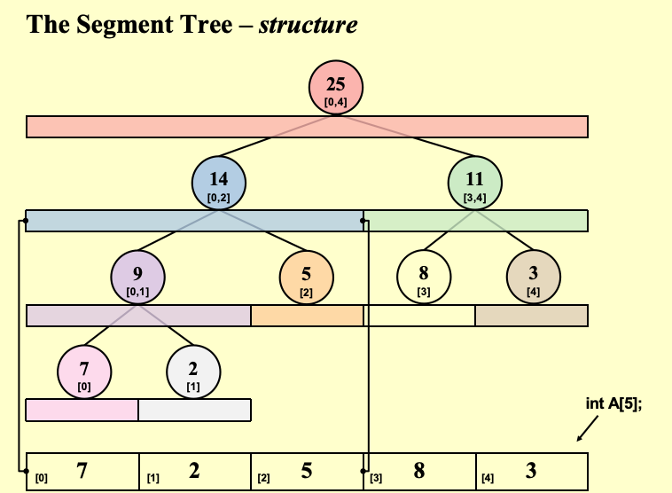

# Chapter8-1 The Segement Tree

## 核心问题

给顶一个长度很大的数组 `A[1000000]`, 需要平凡的求任意区间 `[L,R]` 的和。

最朴素的做法如下：

```cpp
ElemntType Query(A[], L, R){
    sum==0;
    for(int i=L;i<=R;i++) sum+=A[i];
    return sum;
}
```

上面这个方法的时间复杂度是 `O(n)`, 实在是太慢了

## 线段树的结构



如图所示，这是数组 `[7,2,5,8,3]` 的线段树结构表示
- 线段树的本质是一个完全二叉树
- 每个节点存了：他所代表区间的某种聚合值（这里是区间和）
- 非叶子节点的值=左孩子值+右孩子值

从上面的性质以及线段树的结构不难看出，线段树本质上就是把数组不断二分，每个节点管理一段区间的聚合值，叶子节点就是原数组。

## 线段树的构造

```cpp
void Build(int node, int start, int end){
    //Base Case: Leaf Node
    if (start==end){
        tree[node]=A[start];
        return;
    }
    //Recursive Step: Split and Build Children
    int mid(start+end)/2;
    Build(2*node,start,mid); //Build Left Child
    Build(2*node+1,mid+1,end); //Build Right Child
    //Merge Step: Compute Current Node Value
    tree[node]=tree[2*node]+tree[2*node+1];
}
```

这个建树过程的时间复杂度为 `O(n)`, 因为每个节点只被访问一次, 但是因为只建一次树。

## 线段树的查询

三种覆盖关系：
- No Overlap: 节点区间完全在查询区间之外，返回0
- Total Overlap: 节点区间完全在查询区间之内，返回节点值
- Partial Overlap: 节点区间部分在查询区间内，需要递归查询子节点

```cpp
int Query(int node, int start, int end, int L, int R){
    //Case 1: No Overlap(Node is completely outside the query range)
    if(R<start || end<L) {
        return 0; //Return Identity Element for Sum
    }

    //Case 2: Total Overlap(Node is completely inside the query range)
    if(L<=start && end <=R){
        return tree[node];
    }

    //Case 3: Partial Overlap(We need to go deeper into both children)
    int mid=(start+end)/2;
    int left_sum=Query(2*node,start,mid,L,R);
    int right_sum=Query(2*node+1,mid+1,end,L,R);
    return left_sum+right_sum;
}
```

时间复杂度：`O(log n)`, 因为每次查询都将区间二分，最多访问 `O(log n)` 个节点。

## 线段树的更新

对于单点更新，只需要从叶子结点一路向上更改祖先节点，不需要更改无关分支

```cpp
void Update(int node, int start, int end, int idx, int val){
    // 找到叶子结点
    if(start==end){
        tree[node]=val;
        return;
    }
    int mid=(start+end)/2;
    //决定往左走还是往右走
    if(idx<=mid){
        Update(2*node,start,mid,idx,val);
    }
    else{
        Update(2*node+1,mid+1,end,idx,val);
    }
    tree[node]=tree[2*node]+tree[2*node+1];
}
```

时间复杂度：`O(log n)`, 因为更新路径的长度为 `O(log n)`。