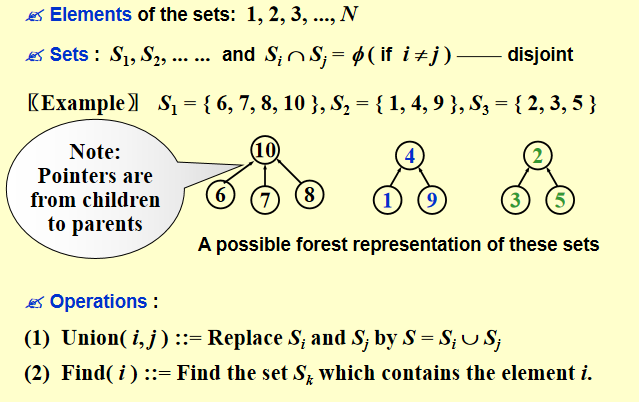

# Chapter 8 Disjoint Set ADT

## 定义

- 关系R: 在集合S上，对任意一对元素(a,b)，aRb要么为真，要么为假；真就说a与b有关系
- 等价关系：集合S上的关系~同时满足下面这三条则称为等价关系
  - **自反性 reflexive**：对于任意元素a，a~a
  - **对称性 symmetric**：对于任意元素a,b，如果a~b，则b~a
  - **传递性 transitive**：对于任意元素a,b,c，如果a~b且b~c，则a~c
- 等价类：对于集合S上的等价关系~ ，a与b属于同一等价类，等同于a~b

## 动态等价问题

问题：给定等价关系~，以及集合S上的元素a,b，判断a与b是否属于同一等价类

例子：

```
S={1,2,3,4,5,6,7,8,9,11,12}
在上述这个集合中有下面的等价关系：
12~4,3~1,6~10,8~9,7~4,6~8,3~5,2~11,11~12

则有下面三个等价类
- {1,3,5}
- {2,11,12,4,7}
- {6,8,9,10}
```

**算法(union-find算法)：**
- 初始化：N个元素各自构成一个集合
- 对于等价关系 a~b，执行Union(a,b)，将a与b所在的集合合并成一个集合
  - 找到a的根Find(a)，找到b的根Find(b)，如果两者相同，则a与b属于同一集合
  - 根如果不同就合并
- 查询：对于a与b，执行Find(a)和Find(b)，如果两者相同，则a与b属于同一集合

操作：
- `Find(x)`：返回元素x所在集合的代表元素（根节点），时间复杂度为 O(log n)。
- `Union(x,y)`：将元素x和y所在的集合合并成一个



## Union实现思路

把一颗树挂到另一颗树下面，树的根节点作为集合的代表元素

比如 $S_1 \cup S_2$
- 让 $S_1$ 的根节点指向 $S_2$ 的根节点
- 或者反过来

数组表示的思路：
- 用一个数组 `parent[]` 来存储每个元素的父节点
- 初始化时，每个元素的父节点指向自己，即 `parent[i] = i`
- `Find(x)`：通过不断访问 `parent[]` 数组，直到找到一个元素的父节点是它自己，这个元素就是集合的代表元素
- `Union(x,y)`：首先找到x和y的根节点，如果它们不同，则将其中一个根节点的父节点指向另一个根节点，实现集合的合并

在时间复杂度方面，最坏情况就是树会退化成链表，每次`Find`操作的时间复杂度为 $O(n^2)$，因此需要优化策略来避免这种情况发生。


## Smart Union策略

1. Union by size（按大小合并）：
   - S[root]=-size
   - 小的树挂载到大的树下

根据上述N次Union，M此Find的时间复杂度为 $O(N+M\log_2N)$

2. Union by height（按高度合并）：
   - S[root]=-height
   - 高度较小的树挂载到高度较大的树下

## Path Compression（路径压缩）

在执行`Find(x)`操作时，将访问路径上的所有节点直接连接到根节点上，这样可以大大减少树的高度，提高后续`Find`操作的效率。

```C
Find(X):
    if S[X] ≤ 0: return X
    else return S[X] = Find(S[X])  // 父节点直接设为根
```
或者使用迭代的方法
```C
Find(X):
    // 第一步：找根
    root = X
    while S[root] > 0: root = S[root]

    // 第二步：路径压缩：所有节点直接连root
    trail = X
    while trail != root:
        lead = S[trail]
        S[trail] = root
        trail = lead

    return root
```

