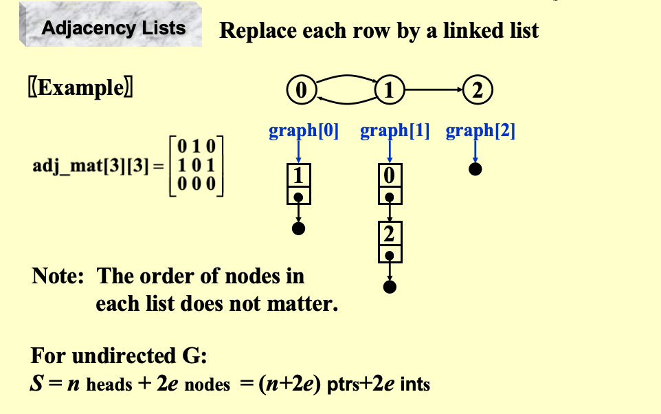
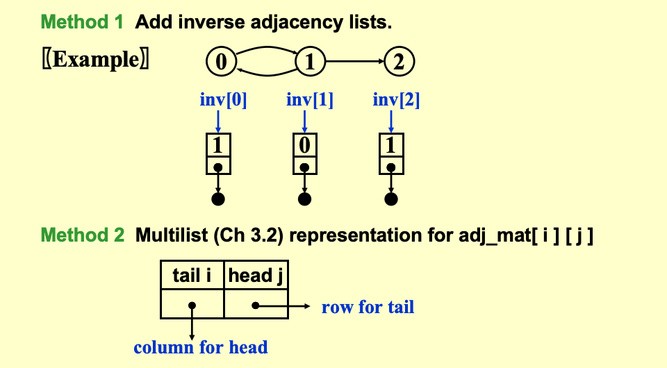
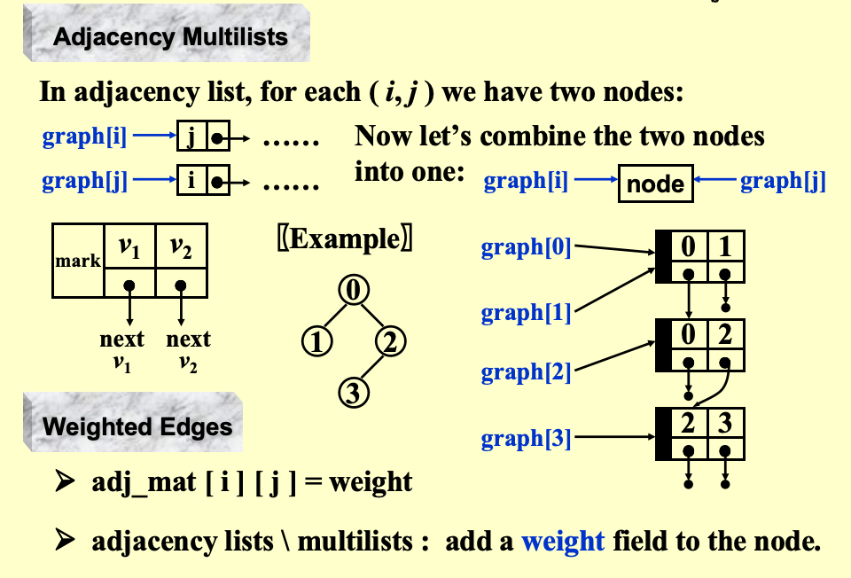

# Chapter 9 Graph Algorithms

## 概念和定义

1. 图 `G(V, E)` 的定义
- `V` 表示顶点集合
- `E` 表示边集合
- `G` 图

2. 无向图 (undirected graph)
- 边没有方向，连接两个顶点
- `(vi,vj)` = `(vj,vi)`

3. 有向图 (directed graph)
- 边：`<vi,vj>` 表示从顶点 `vi` 指向顶点 `vj` 的边
- 尾顶点 (tail) ：起点 `vi`
- 头顶点 (head) ：终点 `vj`

4. 限制
- 无自环：定点不能连接自己
- 无重边：两点间最多一条边

5. 完全图 (complete graph)
- 边数达到最大的图
- 无向完全图n个顶点： `|E| = n(n-1)/2`
- 有向完全图n个顶点： `|E| = n(n-1)`

6. 邻接 (Adjacency)
- 无向图：如果存在边 `(vi,vj)`，则称 `vi` 和 `vj` 互为邻接
- 有向图：如果存在边 `<vi,vj>`，则称 `vi` is adjacent to `vj`，`vj` is adjacent from `vi`

7. 子图 (subgraph)
- $G'\subset G$
- $V' \subseteq V$
- $E' \subseteq E$
- 子图的顶点和边都不超过原图

8. 路径 (path)
- 从 $v_p$ 到 $v_q$ 的路径：$v_p \to v_{i1} \to v_{i2} \to ... \to v_q$，相邻顶点之间有边
- 路径长度：边的数量
- 简单路径：中间顶点互不重复
- 环 (cycle)：起点和终点相同的简单路径，且路径长度至少为1

9. 连通 (connected)
- 无向图：如果任意两个顶点之间存在路径，则称图是连通的
- 有向图：如果任意两个顶点之间存在路径，则称图是强连通的；忽略方向后连通的有向图称为弱连通

10. 连通分量 (connected component)
- 无向图的极大连通子图（不能再扩大）
- 强连通分量：有向图的极大强连通子图

11. 树 (tree)
- 连通+无环的无向图
- n个顶点的树有n-1条边

12. DAG (Directed Acyclic Graph)
- 有向无环图
- DAG的顶点可以进行拓扑排序

13. 度 (degree)
- 无向图：顶点的度是与该顶点相连的边的数量
- 有向图：顶点的入度是指向该顶点的边的数量，出度是从该顶点出发的边的数量，度=入度+出度

## 图的表示-邻接矩阵 (Adjacency Matrix)

邻接矩阵(Adjacency Matrix)：
- 定义：n个顶点的图，用一个n×n的矩阵A来表示，其中A[i][j]表示顶点i和顶点j之间的关系
- 无向图：A[i][j] = A[j][i] = 1表示存在边，A[i][j] = A[j][i] = 0表示不存在边
- 有向图：A[i][j] = 1表示存在从顶点i到顶点j的边，A[i][j] = 0表示不存在这样的边
- 优点：查询边的存在性非常快，时间复杂度为O(1)
- 缺点：空间复杂度为O(n^2)，对于稀疏图来说非常浪费空间，查询连通性非常的慢

压缩邻接矩阵（无向图）：
- 只存储上三角或下三角部分，节省空间，`adj_mat[n(n-1)/2]`
- 访问元素：`adj_mat[i*(i-1)/2 + j]`
- 空间复杂度为O(n(n-1)/2)

## 图的表示-邻接表 (Adjacency List)

邻接表(Adjacency List)：
- 每一行转换成链表，顶点数组+链表
- 无向图空间：n个头指针+2e个节点（e表示边的数量）
- 有向图空间：n个头指针+e个节点（e表示边的数量）
- 优点：对于稀疏图来说非常节省空间，查询连通性非常快
- 缺点：查询边的存在性较慢，时间复杂度为O(n+e)

## 图的表示-有向图邻接表度的处理

1. 逆邻接表
- 原图邻接表；存出边
- 逆图邻接表；存入边
2. 多重表：边双向指针

## 图的表示-邻接多重表，带权图

邻接多重表（Adjacency Multilist）：
- 解决的问题：无向图中边的存储冗余问题，我们需要将其合并为一个节点
- 结构：节点包含两个指针，分别指向两个顶点的邻接表 `v1`, `v2`, `mark` 标记边是否被访问过, `next1` ,`next2` 指向两个顶点的下一个邻接边

带权图：
- 邻接矩阵中：A[i][j] = 权重值，A[i][j] = 0表示不存在边
- 邻接表中：每个边节点包含一个权重字段，表示该边的权重值

## 拓扑排序 (Topological Sort)