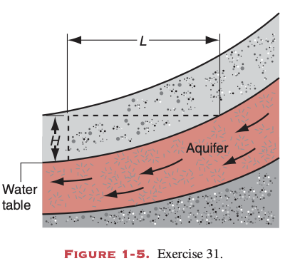
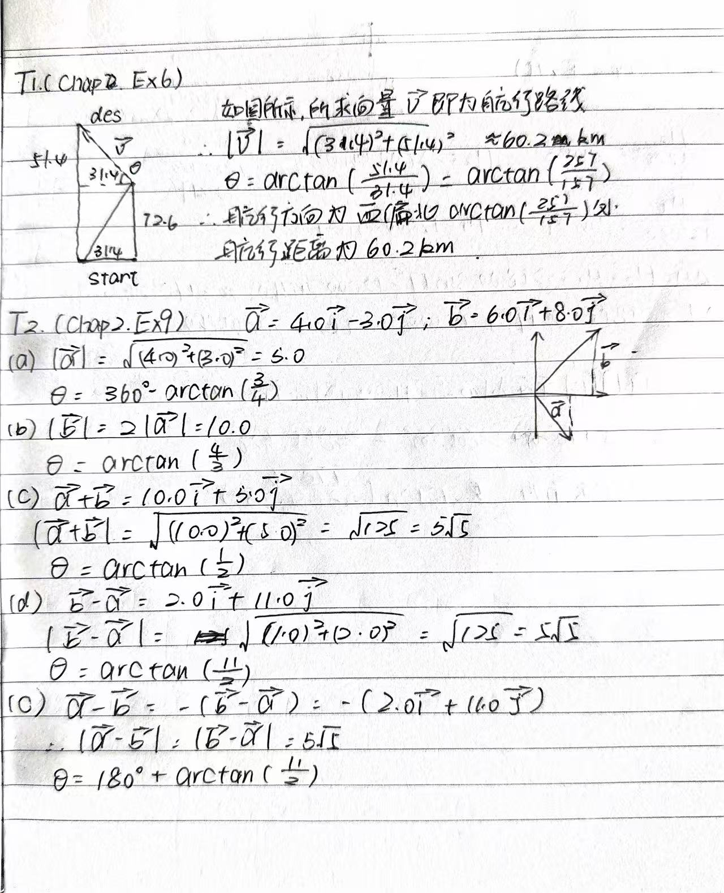
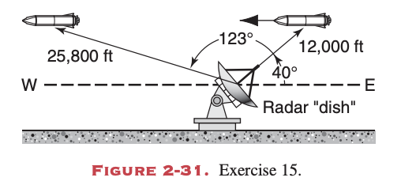
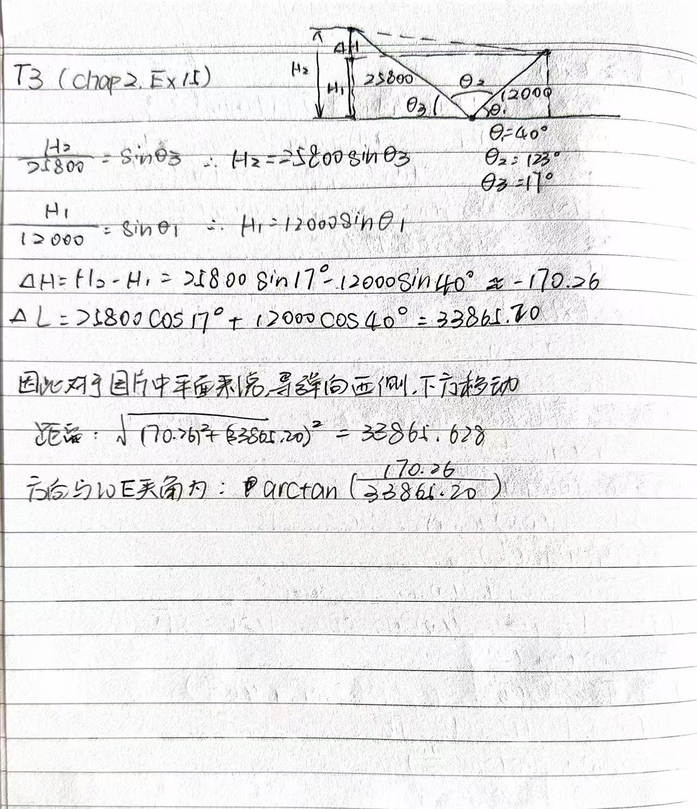
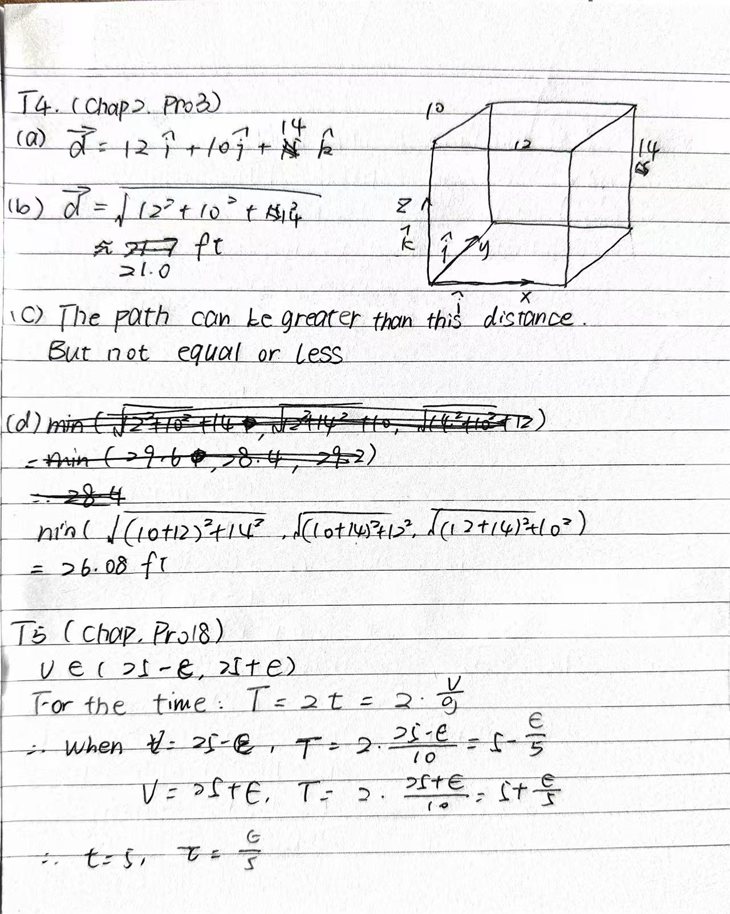

# Homework of Chapter 1

## T1 (Chapter1. Exercises:29)
For the period 1960–1983, the meter was defined to be 1,650,763.73 wavelengths of a certain orange-red light emitted by krypton atoms. Compute the distance in nanometers corresponding to one wavelength. Express your result using the proper number of significant figures.

**Answer**:

Because one meter equals to be 1,659,762.73 wavelengths, thus one wavelength equals to be $\frac{1}{1650763.73} \, \text{m}$, in nanometers, it is $\frac{1}{1650763.73} \times 10^9 \, \text{nm} = 605.78 \, \text{nm}$.

> krypton atoms: 氪原子

---
## T2 (Chapter1. Exercises:31)
Porous rock through which groundwater can move is called an aquifer. The volume $V$ of water that, in time $t$, moves through a cross section of area $A$ of the aquifer is given by 
$$V/t = KAH/L$$
where H is the vertical drop of the aquifer over the horizontal distance $L$; see Fig. 1-5. This relation is called Darcy’s law.The quantity $K$ is the hydraulic conductivity of the aquifer. What are the SI units of $K$?

**Answer**:

Since $V/t=KAH/L$, thus $K=VL/tAH$, the SI units of $K$ is $m^3\cdot m \cdot s^{-1} \cdot m^{-2} \cdot m^{-1} = m/s$.

Then we know that the SI units of $K$ is $m/s$.

> Porous rock: 多孔岩石
> aquifer: 含水层
> hydraulic conductivity: 水力传导率

---
## T3 (Chapter1. Problems:7)
The grains of fine California beach sand have an average radius of $50 \, \text{μm}$. What mass of sand grains would have a total surface area equal to the surface area of a cube exactly $1 \, \text{m}$ on an edge? Sand is made of silicon dioxide, $1 \, \text{m}^3$ of which has a mass of $2600 \, \text{kg}$.

**Answer**:
For one sand grain:
- Its surface area is $4\pi r^2$.
- Its volume is $\frac{4}{3}\pi r^3$.

Next, we have to caluculate the number of sand grains:
$$N = \frac{6L^2}{4\pi r^2}$$

Then we can calculate the total volume of sand grains:
$$V =N\cdot \frac{4}{3}\pi r^3 = \frac{6L^2}{4\pi r^2} \cdot \frac{4}{3}\pi r^3 = 2L^2 r$$

Finally, we can calculate the mass of sand grains:
$$m = \rho V = 2L^2 r \cdot 2600 \, \text{kg} = 2\cdot 1^2\cdot 50\cdot 10^{-6} \cdot 2600 \, \text{kg} = 0.26 \, \text{kg}$$

> radius: 半径
> grains: 颗粒
> silicon dioxide: 二氧化硅

## T4 (Chapter1. Problems:9)
The distance between neighboring atoms, or molecules, in a solid substance can be estimated by calculating twice the radius of a sphere with volume equal to the volume per atom of the material. Calculate the distance between neighboring atoms in (a) iron and (b) sodium. The densities of iron and sodium are $7870 \, \text{kg/m}^3$ and $1013 \, \text{kg/m}^3$, respectively; the mass of an iron atom is $9.27 \times 10^{-26} \, \text{kg}$, and the mass of a sodium atom is $3.82 \times 10^{-26} \, \text{kg}$.

**Answer**:
Our Goal is to calculate the distance between neighboring atoms, and the provided informations indicate that we can calculate the answer by calculating twice the radius of a sphere with volume equal to the volume per atom of the material.

Thus we have to calculate the volume of certain atom: 
$$ \rho = \frac{M}{V}$$
$$ V = \frac{M}{\rho}$$
$$ \frac{4}{3}\pi r^3 = \frac{M}{\rho}$$
$$ r = \sqrt[3]{\frac{3M}{4\pi \rho}}$$

For (a) : 
$$r = \sqrt[3]{\frac{3\cdot 9.27 \times 10^{-26} \, \text{kg}}{4\cdot \pi \cdot 7870 \, \text{kg/m}^3}}$$
$$r = 1.41*10^{-10}$$
$$d = 2r = 2.82*10^{-10} \, \text{m}$$

For (b):
$$r = \sqrt[3]{\frac{3\cdot 3.82 \times 10^{-26} \, \text{kg}}{4\cdot \pi \cdot 1013 \, \text{kg/m}^3}}$$
$$r =2.08*10^{-10}$$
$$d = 2r = 4.16*10^{-10} \, \text{m}$$

> sphere: 球体

# Homework of Chapter 2
## T1 (Chapter2. Exercises:6)
A ship sets out to sail to a point 124 km due north. An unexpected storm blows the ship to a point 72.6 km to the north and 31.4 km to the east of its starting point. How far, and in what direction, must it now sail to reach its original destination?

> sail: 航行
---
## T2 (Chapter2. Exercises:9)
Given Two Vectors $\vec a = 4.0\hat i - 3.0\hat j$ and $\vec b = 6.0\hat i + 8.0\hat j$, find the magnitudes and directions (with the x axis) of 
(a) $\vec a$
(b) $\vec b$
(c) $\vec a + \vec b$
(d) $\vec b - \vec a$
(e) $\vec a - \vec b$

  

---
## T3 (Chapter2. Exercises:15)
A radar station detects a missile approaching from the east. At first contact, the range to the missile is 12,000 ft at 40.0° above the horizon. The missile is tracked for another 123° in the east-west plane, the range at final contact being 25,800 ft; see Fig. 2-31. Find the displacement of the missile during the period of radar contact.

> missile: 导弹
> displacement: 位移

---
## T4 (Chapter2. Problems:3)
A room has the dimensions $10 ft \times 12 ft \times 14 ft$. A fly starting at one corner ends up at a diametrically opposite corner.
(a) Find the displacement vector in a frame with coordinate axes parallel to the edges of the room. 
(b) What is the magnitude of the displacement? 
(c) Could the length of the path traveled by the fly be less than this distance? Greater than this distance? Equal to this distance? 
(d) If the fly walks rather than flies, what is the length of the shortest path it can take?

> diametrically opposite corner: 对角线的相对角落
---
## T5 (Chapter2. Problems:18)
A ball is tossed vertically into the air with an initial speed somewhere between $(25 - \epsilon) \, \text{m/s}$ and $(25 + \epsilon) \, \text{m/s}$, where $\epsilon$ is a small number compared to 25. The total time of flight for the ball to return to the ground will be somewhere between $t-\tau$ and $t+\tau$, find $t$ and $\tau$.

