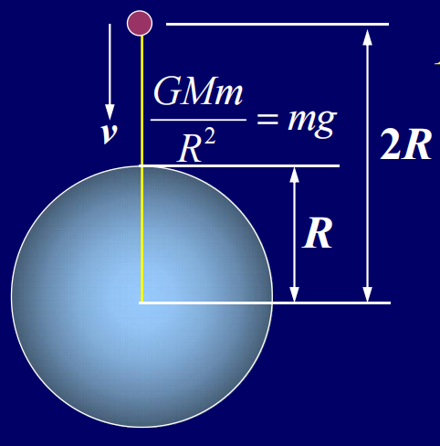
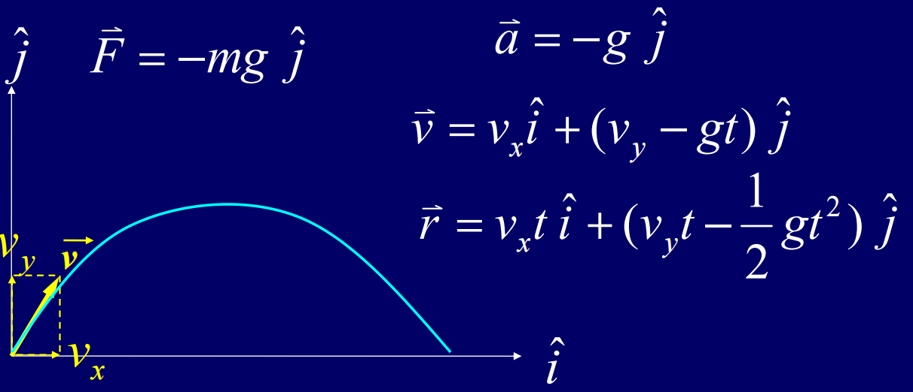
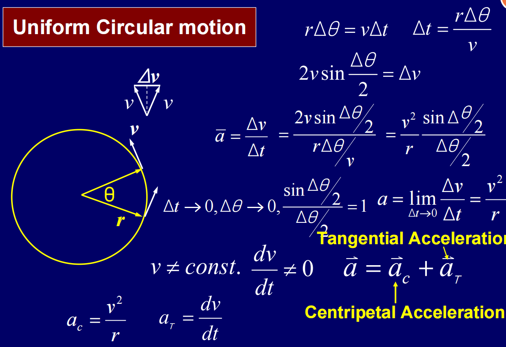
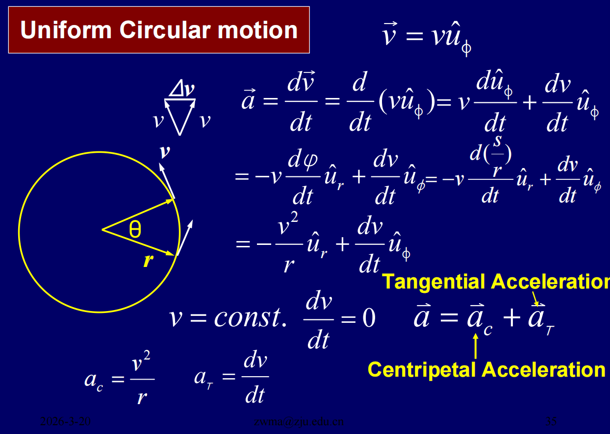
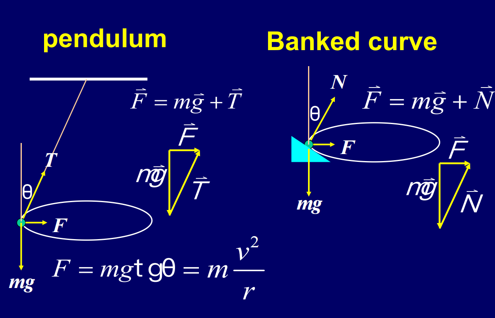
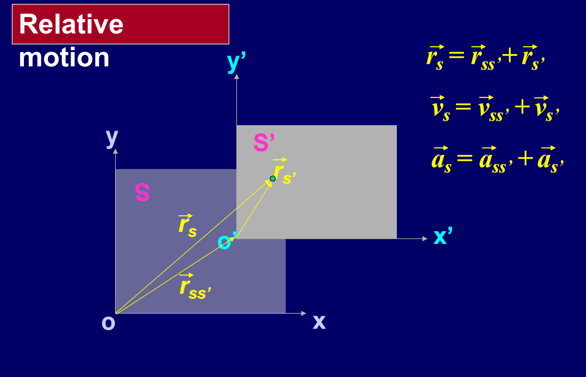

# Chapter 3 Force and Newton's Law

## Force and Motion

**牛顿第一定律**：不受合外力的物体，将保持静止或匀速直线运动状态
- *惯性系*：牛顿第一定律成立的参考系（如地面、匀速运动的车厢）；
- *非惯性系*：有加速度的参考系（如加速的电梯、旋转的圆盘），此参考系中第一定律不成立。

**牛顿第二定律**：物体的加速度与作用在它上的合外力成正比，与它的质量成反比
$$\sum \vec F = m \vec a$$
分量形式：
$$\sum F_x = m a_x$$
$$\sum F_y = m a_y$$
$$\sum F_z = m a_z$$

**牛顿第三定律**：作用力与反作用力大小相等，方向相反
$$\vec F_{12} = -\vec F_{21}$$

**外力与内力**

外力（$F_{ext}$​）：系统外的物体对系统内物体的作用力；

内力（$F_{int}$​）：系统内物体之间的相互作用力；(内力满足牛顿第三定律，系统内所有内力的合外力为零，只有外力能改变整个系统的运动状态)

**Unit of Force**

*国际单位*：牛顿（N），定义：$1N=1kg \cdot m/s^2$

量纲：$[F]=ML/T2$（M = 质量，L = 长度，T = 时间），用于验证力学公式的量纲一致性。

---
## 弹性力 (Elastic Force)

弹性力是物体发生弹性形变时产生的恢复力，属于被动力

**弹力 (Spring Force)**：弹簧发生弹性形变所产生的力
$$\vec F = -k \vec x $$
（其中 $k$ 是弹簧常数，$\vec x$ 是弹簧的形变量）

**张力 (Tension Force)**：对于一个理想的轻绳或轻杆，张力是沿绳子或杆方向的拉力，大小相等，作用在绳子或杆两端的物体上

对于悬挂的物体，如果物体处于静止或匀速运动状态，张力与物体的重力等大反向：
$$\vec T = -\vec W (W = mg)$$

**支持力 (Normal Force)**：接触面对物体的弹力，始终垂直于接触面（核心特点）

$$ \vec N = mg \cos \theta $$
（其中 $\theta$ 是斜面与水平面的夹角）

---
## 万有引力 (Gravitaional Force)

- *大小*：$F = G \frac{m_1 m_2}{r^2}$（其中 $G$ 是万有引力常数，$m_1$ 和 $m_2$ 是两个物体的质量，$r$ 是它们之间的距离）
- *矢量形式*：$\vec F = -G \frac{m_1 m_2}{r^2} \hat r$（其中 $\hat r$ 是从一个物体指向另一个物体的单位矢量）
- *重力与万有引力的关系*：在地球表面，重力近似等于万有引力，即 $mg = G \frac{M m}{R^2}$

---
## 摩擦力 (Frictional Force)

- 静摩擦力 (Static Friction)：$$F_s=-\sum F_{ext}\leq \mu_s N$$ （当物体处于静止状态时，静摩擦力的大小等于外力的合力，但方向相反，且不超过最大静摩擦力 $F_{s,max} = μ_s N$）
- 动摩擦力 (Kinetic Friction)：$$F_k= μ_k N$$ （当物体处于运动状态时，动摩擦力的大小等于动摩擦系数 $μ_k$ 与支持力 $N$ 的乘积，且方向与运动方向相反）

---
## Examples

**T1.** 
An object, located at 2R away from the center of the earth, is falling from rest vertically. R is the radius of the earth. Find the speed when it arrives at the earth’s surface. The drag force on the object by the air and the spin of the earth are ignorable.

**Answer**

---
**T2** 
A car moves with the velocity $v_0$ alone the x axis. If $a(t)= - ct$, how much time it passes and how far it travels when it stops?

---
**T3**
A uniform rod with the mass m and the length L is perpendicularly fixed on the rotating axis. When it rotates with a angular speed $\omega$, find the tension force of the rod at every point if the gravitation force is ignorable.

# Chapter 4: Motion in 2-and 3-Dimensions

## 抛体运动 (Projectile Motion)

> 对于上述这样一个抛体模型，假设初始速度的水平分量为 $v_{x}$，竖直分量为 $v_{y}$，则在时间 $t$ 时刻，
> - 加速度: $\vec{a} =  -g$
> - 速度: $\vec{v_t}=v_x\vec{i}+(v_y-gt)\vec{j}$
> - 位移: $\vec{r}=(v_x t)\vec{i}+(v_y t - \frac{1}{2} g t^2)\vec{j}$

根据上述的计算，我们还可以求得这个运动的轨迹方程和水平射程

**轨迹方程**
假设$\theta$ 是初始速度与水平面的夹角，则 $v_x = v_0 \cos \theta$，$v_y = v_0 \sin \theta$。轨迹方程的求解思路是利用 $x$ 和 $y$ 的表达式里面都有 $t$ 这一特点，消去 $t$ 以得到 $x$ 和 $y$ 之间的关系：
$$\begin{aligned}
x &= v_x t = v_0 \cos \theta t \\
y &= v_y t - \frac{1}{2} g t^2 = v_0 \sin \theta t - \frac{1}{2} g t^2
\end{aligned}$$
解出 $t$ 的表达式为 $t = \frac{x}{v_0 \cos \theta}$，将其代入 $y$ 的表达式中，我们就得到了轨迹方程：
$$y = x \tan \theta - \frac{g x^2}{2 v_0^2 \cos^2 \theta}$$

**水平射程**
水平射程比较容易求解，因为在x方向上是匀速运动，我们只需要求出物体在空中的总时间 $T$，然后用 $v_x$ 乘以 $T$ 就可以得到水平射程 $R$。
$$
\begin{aligned}
T &= \frac{2 v_0 \sin \theta}{g} \\
R &= v_x T = v_0 \cos \theta \cdot \frac{2 v_0 \sin \theta}{g} = \frac{v_0^2 \sin 2\theta}{g}
\end{aligned}$$
从上面这个式子我们也很容易看出来，当 $\theta = 45^\circ$ 时，水平射程 $R$ 达到最大值 $\frac{v_0^2}{g}$。

## 匀速圆周运动 （Uniform Circular Motion）

> 已知匀速圆周运动的特点如下：
> - $\vec v$的大小保持不变，但是方向不断改变
> - 圆周半径 $r$ 恒定，角速度 $\omega = \frac{d\theta}{dt}$ 恒定 
> - 弧长与角度关系：$s=r\theta$，因此 $v=\frac{ds}{dt}=r\frac{d\theta}{dt}=r\omega$

根据上述的已知条件，我们可以得到匀速圆周运动中的一些量的关系

**时间和角度的关系**
不难看出，匀速圆周运动的过程中，$\Delta t$ 时间内物体移动的距离就是弧长 $s$
即 
$$\Delta t v = r\Delta \theta$$
即
$$\Delta t = \frac{r\Delta \theta}{v}$$

**速度变化量**
两个大小为 $v$、夹角为 $\Delta \theta$ 的速度矢量，首尾相接构成等腰三角形，用正弦定理可直接得到速度变化量的大小。
$$\Delta v = 2v \sin \frac{\Delta \theta}{2}$$
> 同时在 $\Delta \theta \to 0$ 的极限下，$\sin \frac{\Delta \theta}{2} \approx \frac{\Delta \theta}{2}$，因此 $\Delta v \approx v \Delta \theta$。此时速度变化的方向垂直于速度矢量的方向，指向圆心。

**平均加速度的计算**
根据上面两个条件，可以直接代入求解平均加速度：
$$\begin{aligned}
a_{avg} &= \frac{\Delta v}{\Delta t} \\
&= \frac{2v \sin \frac{\Delta \theta}{2}}{\frac{r\Delta \theta}{v}} \\
&= \frac{2v^2 \sin \frac{\Delta \theta}{2}}{r\Delta \theta}
\end{aligned}$$
> 同样在 $\Delta \theta \to 0$ 的极限下，$a_{c} \approx \frac{v^2}{r}$
> 根据前面所提到的特点，在$\Delta \theta \to 0$ 的极限下，速度变化的方向指向圆心，所以我们可以定义向心加速度 (Centripetal Acceleration) 为 $a_c = \frac{v^2}{r}$，其方向指向圆心。

**切向加速度**
在匀速圆周运动中，切向加速度为零，因为速度的大小保持不变。但是在非匀速的圆周运动中，我们需要定义切向加速度
$$a_t = \frac{dv}{dt}$$
切向加速度的方向与速度矢量的方向相同。
同时，非匀速的圆周运动中总加速度为
$$\vec{a} = \vec{a_c} + \vec{a_t}$$

**极坐标分析方法**

在极坐标系下，我们定义
- $\hat{u}_r$​：径向单位矢量，沿半径向外
- $\hat{u}_\phi$​：切向单位矢量，沿圆周切线方向（逆时针为正）

对于圆周运动，速度矢量可以表示为：
$$\vec{v} = v\hat{u}_\phi$$

对其求对时间的导数，得到加速度矢量：
$$\begin{aligned}
\vec{a} &= \frac{d\vec{v}}{dt} = \frac{d}{dt}(v\hat{u}_\phi) \\
&= v\frac{d\hat{u}_\phi}{dt} + \frac{dv}{dt}\hat{u}_\phi
\end{aligned}$$

由于 $\frac{d\hat{u}_\phi}{dt} = -\frac{d\phi}{dt}\hat{u}_r$ ，结合角速度 $\omega = \frac{d\phi}{dt} = \frac{d(s/r)}{dt} = \frac{v}{r}$，将其代入上式可得：
$$\begin{aligned}
\vec{a} &= -v\left(\frac{v}{r}\right)\hat{u}_r + \frac{dv}{dt}\hat{u}_\phi \\
&= -\frac{v^2}{r}\hat{u}_r + \frac{dv}{dt}\hat{u}_\phi
\end{aligned}$$

在此公式中，我们可以清晰地看出总加速度 $\vec{a}$ 由两部分相加组成，即 $\vec{a} = \vec{a}_c + \vec{a}_T$：
- **向心加速度 (Centripetal Acceleration)**: $\vec{a}_c = -\frac{v^2}{r}\hat{u}_r$，大小为 $a_c = \frac{v^2}{r}$，方向指向圆心。
- **切向加速度 (Tangential Acceleration)**: $\vec{a}_T = \frac{dv}{dt}\hat{u}_\phi$，大小为 $a_T = \frac{dv}{dt}$，方向沿切线方向。

对于匀速圆周运动，速度大小保持常数 ($v = \text{const.}$)，因此 $\frac{dv}{dt} = 0$。此时切向加速度为零，只剩下向心加速度。

---
## 两个水平面圆周运动模型

**圆锥摆 (Pendulum)**
- 受力分析：
  - 重力 $mg$ 向下
  - 绳子张力 $T$ 沿绳子方向向上

⚠️：两者合力的方向水平指向圆心，因此满足匀速圆周运动的条件。
- 力的计算
    - $T \cos \theta = mg$，因此 $T = \frac{mg}{\cos \theta}$
    - $T \sin \theta = F = m \frac{v^2}{r}$，$F$ 是向心力

根据上述两个关系，我们可以得到
$$ F = mg \tan\theta =m\frac{v^2}{r} $$
$$ v = \sqrt{rg\tan\theta} $$
$$ T = \frac{2\pi r}{\sqrt{rg\tan\theta}} = 2\pi \sqrt{\frac{r}{g\tan\theta}} $$

**斜面转弯 (Banked Curve)**

- 受力分析：
  - 重力 $mg$ 向下
  - 法向力 $N$ 沿斜面垂直向上
⚠️：两者合力的方向水平指向圆心，因此满足匀速圆周运动的条件。
- 力的计算
    - $N \cos \theta = mg$，因此 $N = \frac{mg}{\cos \theta}$
    - $N \sin \theta = F = m \frac{v^2}{r}$，$F$ 是向心力

根据上述两个关系，我们可以得到
$$ F = mg \tan\theta =m\frac{v^2}{r} $$
$$ v = \sqrt{rg\tan\theta} $$ 

---
## 相对参考系

参考系定义
- S 系：静止参考系（地面）。
- S' 系：运动参考系（如车厢、流动的河水）。
- $r_{SS'}$​：S' 系原点相对于 S 系原点的位矢。

2. 核心变换公式
- 位矢变换：$r_s = r_{SS'} + r_{s'}$ (牵连位矢 + 相对位矢)
- 速度变换：$v_s = v_{SS'} + v_{s'}$ (牵连速度 + 相对速度)
- 加速度变换：$a_s = a_{SS'} + a_{s'}$ (牵连加速度 + 相对加速度)

---
## Example

**Example 1:** The position vector of a particle is $ \vec{r} = (2t^2-5)\hat{i} + (t^2+3t)\hat{j}$. What is the tangential and centripetal acceleration, at $t =0$?

**Example 2:** The flow speed in a river with the width l is linearly dependent on the distance away from the bank of the river. The maximum flow speed is $v_0$. A boat with the speed v departs from a bank. When the boat arrives at the position that is $l/4$ away from the bank, there is no enough fuel to reach another bank for the boat. Then, the boat return back the original bank with the speed $v/2$ and the direction perpendicular to the flow velocity. Find how far away from the departed position when the boat arrives the bank.