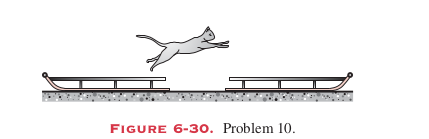
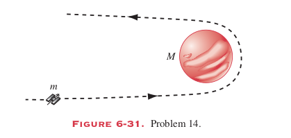
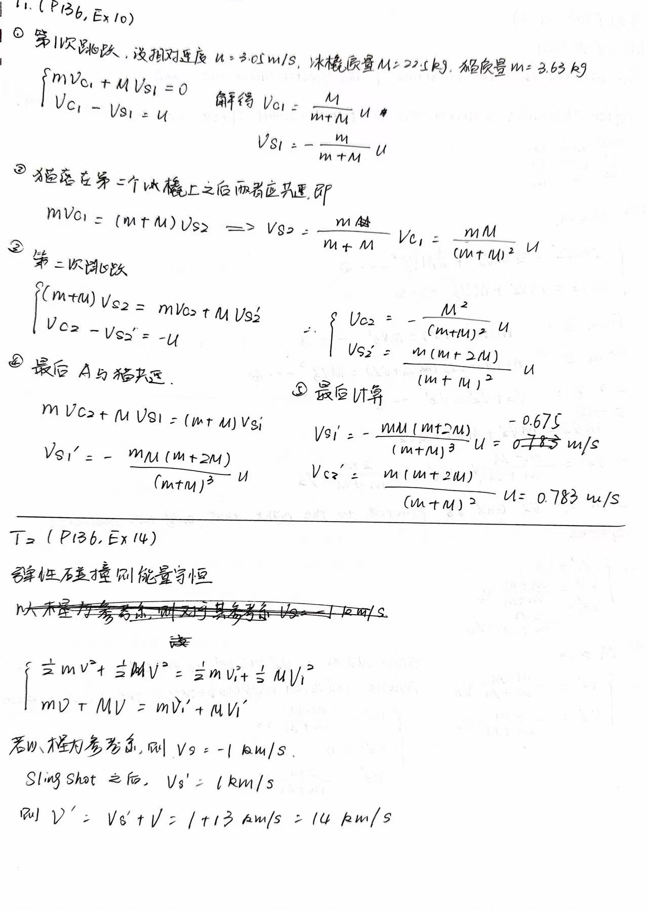
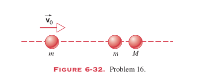
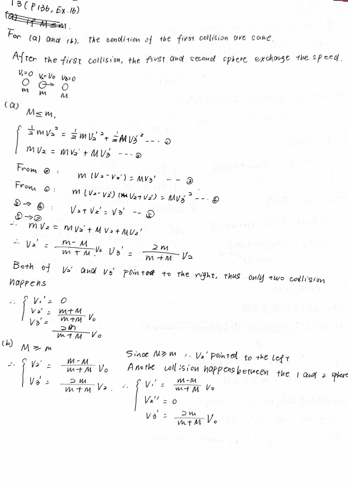
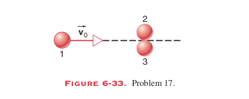
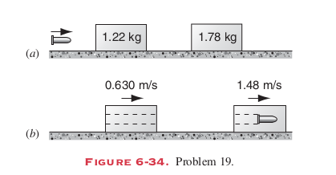
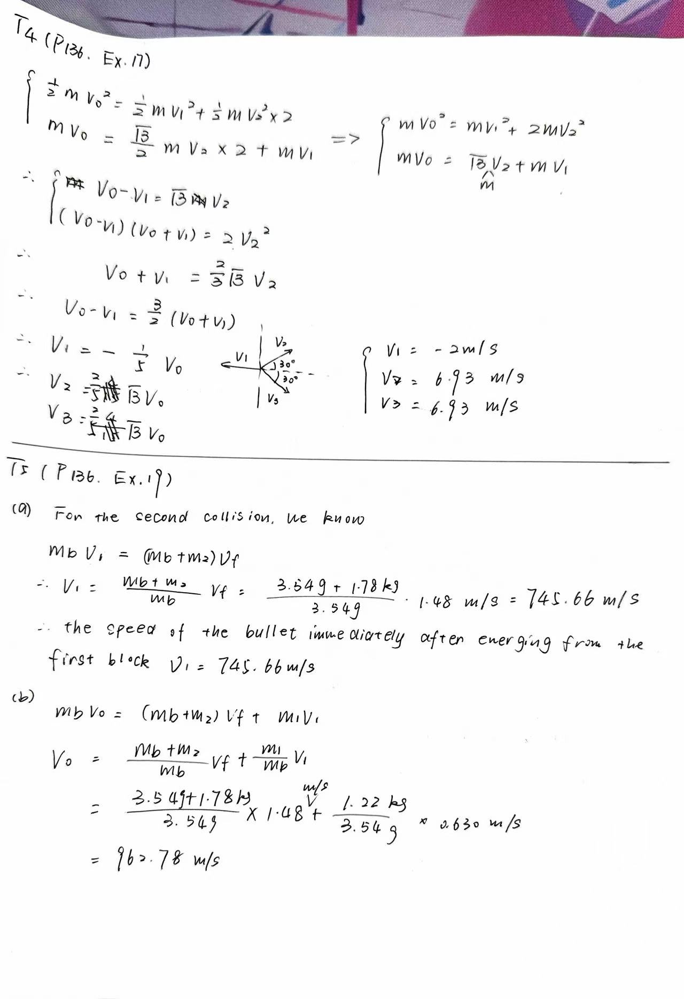

# Homework of Chapter 6

## T1 (P136 Ex.10)

Two 22.7-kg ice sleds are placed a short distance apart, one direcetly behind the other, as shown in Fig. 6-30. A 3.63-kg cat, standing on one sled, jump across to the other and immdediately back to the first. Both jumps are made at the speed of 3.05 m/s relative to the sled the cat is standing on when the jump is made Find the final speeds of the two sleds.

---
## T2 (P136 Ex.14)

Spacecraft Voyager 2 (mass m and speed v relative to the Sun) approaches the planet Jupiter (mass M and speed V relative to the Sun) as shown in Fig. 6-31. The spacecraft rounds the planet and departs in the opposite direction. What is its speed, relative to the Sun, after this "slingshot" encounter? Assume that v=12 km/s and V=13 km/s (the orbital speed of Jupiter), and that this is an elastic collision. The mass of Jupiter is very much greater than the mass of the spcaecraft, M>>m.

---
## T3 (P136 Ex.16)

The two spheres on the right of Fig 6-32 are slightly separated and initially at rest.; the left sphere is incident with speed $v_0$. Assuming head-on elastic collisions
(a) if $M\leq m$, show that there are two collisions and find all final velocities.
(b) if $M > m$, show that there are three collisions and find all final velocities.

---
## T4 (P136 Ex.17)

A ball with an initial speed of 10.0 m/s collides elastically with two identical balls whose centers are on a line perpendicular to the initial velocity and that are initially in contact with each other (Fig. 6-33). The first ball is aimed directly at the contact point and all the balls are frictionless. Find the velocities of all three balls after the collision. (Hint: With friction absent, each impulse is directed along the line of centers of the balls, normal to thecolliding surfaces.)

---
## T5 (P136 Ex.19)

A 3.54-g bullet is fired horizontally at two blocks resting on a frictionless tabletop, as shown in Fig. 6-34a. The bullet passes through the first block, with mass 1.22 kg, and embeds itself in the second block, with mass 1.78 kg. Speeds of 0.639 m/s and 1.48 m/s, respectively, are thereby imparted to the blocks, as shown in Fig. 6-34b. Neglecting the mass removed from the first block by the bullet, find 
(a) the speed of the bullet immediately after emerging from the first block
(b) the original speed of the bullet.

